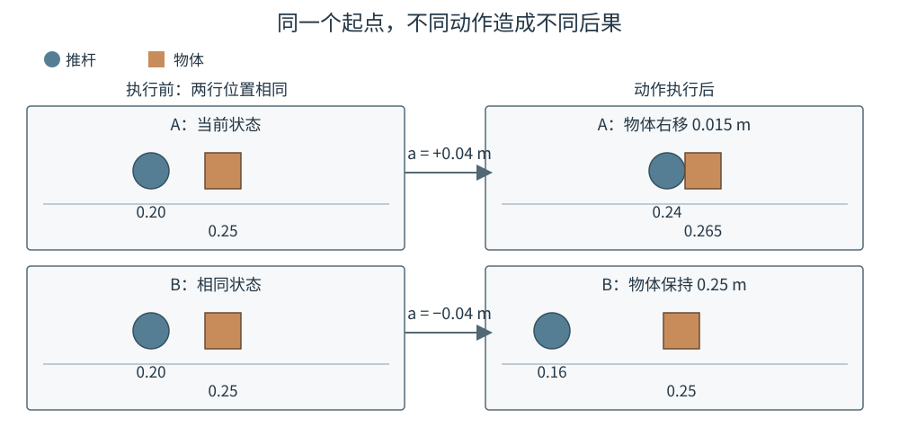
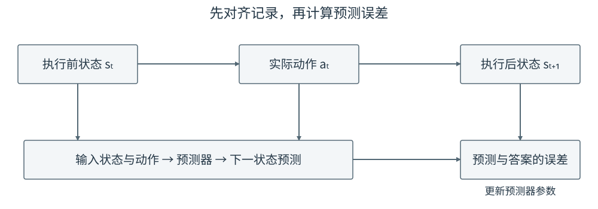
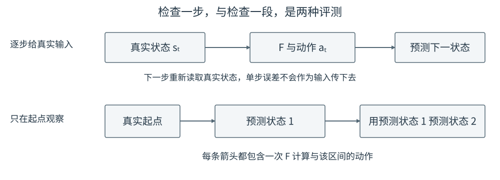

# 14 从交互数据训练动作条件世界模型

第 13 章已经把观测、Context、动作专家和执行环节连接起来。机器人能够给出几段动作，却仍然缺少一个判断依据：这些动作会把物体带到哪里？动作幅度合法并不意味着任务会成功，生成概率较高也不等于执行后果较好。高级篇从这里继续，学习一个接收动作、预测环境变化的模型。

本单元沿用桌面操作的直觉，并用更容易观察的平面推物任务贯穿实践：推杆接触一个物体，使它移动到指定位置与方向。它保留接触、运动和目标选择这些关键问题，但不包含机械臂全部关节动力学。理解这种简化的范围，和理解模型本身同样重要。

## 1. 给定动作以后，预测什么

动作模型与世界模型接收的数据可能相似，输出的含义却不同。动作模型回答“接下来怎样做”，动作条件世界模型（action-conditioned world model）回答“如果这样做，接下来会怎样”。这里的“条件”不是标签，而是预测时必须明确提供的动作。

假设当前推杆在物体左侧。向右移动可能接触并推动物体，向左移动则可能远离物体。同一张当前图像并没有唯一的下一张图像；不提供动作，模型只能猜测记录者最可能采取什么行为。若训练数据几乎总向右推，一个忽略动作的模型也可能得到很小的平均误差。因此，检查模型是否真的使用了动作，不能只看一条预测曲线。

<figure markdown="span">
{ width="1000" loading=lazy }
<figcaption>图 14-1　当前状态相同，给定动作不同，待预测的后果也不同。动作位于模型输入端，而不是预测答案的位置。（本教程绘制）</figcaption>
</figure>

为了先把训练过程看清楚，本章暂时假设能读到推杆位置、物体位置和物体朝向，合称状态 $s_t$。例如

$$
s_t=(p^x_t,p^y_t,b^x_t,b^y_t,\sin\theta_t,\cos\theta_t).
$$

$p$ 是推杆位置，$b$ 是物体中心，$\theta$ 是物体朝向。用正弦和余弦表示角度，是为了避免把接近 $-\pi$ 和 $\pi$ 的两个相近朝向误当成相距很远。这个例子假设运动较慢、惯性可以忽略；若相同位置下不同速度会产生不同后果，就必须增加速度或一段历史。不能因为把输入命名为“状态”，就认为它已经包含一切必要信息。

动作记为 $a_t$，表示从时刻 $t$ 到 $t+1$ 之间实际施加的控制。世界模型写为

$$
\hat s_{t+1}=F_\phi(s_t,a_t).
$$

带帽的 $\hat s_{t+1}$ 是预测，未带帽的 $s_{t+1}$ 是执行之后记录的答案，$\phi$ 是需要训练的网络参数。任务目标暂时不必输入这个物理预测器：在状态与实际动作都相同的情况下，仅仅改变“想把物体推到哪里”，不应该改变预测的运动结果。

## 2. 一条真实记录怎样变成训练样本

记录顺序必须是“观察—执行—再次观察”。若控制周期为 0.1 秒，时刻 2.0 秒取得状态，随后执行动作，到 2.1 秒取得下一状态，那么样本就是这三个量，而不是把同一行日志中名称相近的字段任意拼起来。

| 记录项 | 一维推物的示意数值 | 在训练中的作用 |
|---|---|---|
| 执行前状态 | 推杆 0.20 m，物体 0.25 m | 模型输入 |
| 本周期实际执行动作 | 推杆向右位移 0.01 m | 模型输入 |
| 执行后状态 | 推杆 0.21 m，物体仍在 0.25 m | 监督答案 |

这组数字用于解释样本含义，不是项目运行结果。物体没有移动可能只是因为推杆尚未接触到它，而不是动作无效。后面连续几次靠近之后，相同的位移命令才可能推动物体。

<figure markdown="span">
{ width="1000" loading=lazy }
<figcaption>图 14-2　动作属于两次观测之间的区间。下一状态参与计算误差，不应偷偷进入预测器输入。（本教程绘制）</figcaption>
</figure>

第 13 章讨论过动作裁剪和执行缓冲。如果策略建议向右移动 5 cm，执行器只允许并实际采用 1 cm，那么预测器应该学习这 1 cm 对应的后果。还需区分“已送给控制器的目标命令”和“传感器测到的运动”：若模型接口定义为目标命令，就记录被实际采用的目标，而不是用执行后才知道的真实位移替换它。否则训练时使用了预测时拿不到的信息。

训练集和测试集应按完整轨迹划分。相邻两帧非常相似，把同一段轨迹切出的相邻窗口随机分到两边，容易让测试结果看起来过于乐观。先划分轨迹，再在各自内部切窗口；归一化所用的均值和尺度也只从训练部分估计。对于含 $H$ 个动作的片段，需要保存 $H+1$ 个状态，最后一个状态是最后一步动作的答案。

## 3. 第一个预测网络怎样训练

先使用第 02 章已经认识的多层感知机。上面的状态有 6 个数，动作若为平面二维位移，就有 2 个数。将归一化后的状态和动作拼成 8 维输入，依次通过两个隐藏层，例如每层 64 个单元，最后用线性层输出 6 个数。隐藏层之间使用 ReLU；输出层不使用 ReLU，因为状态变化可以为负。

模型既可以直接预测下一状态，也可以预测变化量。本章采用后者：

$$
\Delta\hat s_t=f_\phi(s_t,a_t),\qquad
\hat s_{t+1}=s_t+\Delta\hat s_t.
$$

这里为简洁省略了归一化符号。实现中所有相加的量必须处在同一尺度，展示位置误差时再恢复为米。预测角度的两个分量时，还应检查恢复后的方向是否合理，不能把两个任意实数永远当作合法的单位方向。

设一个批次有 $B$ 条样本，状态有 $D_s$ 个分量，训练目标为

$$
\mathcal L_{\mathrm{pred}}=
\frac{1}{B D_s}\sum_{i=1}^{B}\sum_{j=1}^{D_s}
\left(\hat s_{i,t+1,j}-s_{i,t+1,j}\right)^2.
$$

分母只是把全部样本、全部分量的误差取平均，便于不同批次之间比较；它不是额外需要学习的参数。一次训练时，先取真实状态与动作得到预测，再与真实下一状态比较，通过反向传播更新 $\phi$。本章改变的是模型要学的对应关系，没有改变第 02 章的训练原理。

例如，真实物体从 0.25 m 移到 0.26 m，网络却预测停在 0.25 m。这个误差会推动网络调整参数，使类似接触状态和向右动作更容易产生正向位移。但网络不能凭这一条样本就总结出完整接触规律；它还需要看到未接触、不同接触位置和不同运动方向。数据中缺少的交互，不会因为网络更深就自动得到可靠补全。

配套 Notebook 将状态缩减为一维推杆和物体位置，用小型神经网络学习变化量。这样读者能够在一张位置曲线上看清“靠近而未接触”和“接触后推动”的区别。这是教学接触规则生成的数据，不是 rigid-body 物理仿真，也不是 PushT 训练成绩。

## 4. 预测一步准确，为什么仍可能推错一整段

训练时，我们通常把真实 $s_t$ 交给网络。预测多步时，未来真实状态不可得，只能把前一步预测继续送入网络：

$$
\hat s_{t+1}=F_\phi(s_t,a_t),\qquad
\hat s_{t+2}=F_\phi(\hat s_{t+1},a_{t+1}).
$$

第二个式子中的输入是 $\hat s_{t+1}$，不是 $s_{t+1}$。假如第一步把物体位置预测得偏右，第二步就可能错误地判断“还没有接触”，进而少预测一次推动。这种误差不一定匀速增大；在接触发生或解除时，小的位置偏差就可能改变后面的运动模式。

<figure markdown="span">
{ width="1000" loading=lazy }
<figcaption>图 14-3　上排每一步都有真实状态纠正输入，下排只有起点是真实观测。两者必须分别评测，不能用上排误差代表下排能力。（本教程绘制）</figcaption>
</figure>

因此至少检查三件事：单步误差是否优于“物体一直不动”的简单基线；同一输入换一个动作后，预测是否随之合理改变；从同一个起点连续预测若干步时，接触发生的时间和物体最终位置是否正确。按预测距离分别报告误差，比把所有步数平均成一个数字更有解释力。

多步训练可以缓解问题：把预测连续展开几步，将每一步与真实记录比较，再共同更新网络。但它不能替代真实观测，也不能保证陌生动作下仍然准确。第 16 章会利用重新观察限制这种偏差，而不是要求模型一次预测到任务结束。

## 5. 从教学数据走向 stable-worldmodel

[stable-worldmodel](https://github.com/galilai-group/stable-worldmodel)提供统一的数据采集、模型训练与规划评测基础设施。本单元用它作为后续真实项目阅读入口，而不把库名当作某一种神经网络。官方的 PushT 环境控制推杆完成平面推物，与本章场景相近，但其动作定义、碰撞和旋转机制必须以具体环境实现为准。

阅读项目时，先找到一条 episode，即从开始到结束的一段完整交互，核对观测、动作、终止标记和帧顺序。再确认动作是位置目标、位移还是速度，不能直接套用教学 Notebook 的“每步位移”。正式训练前还要固定项目版本、数据来源和训练/测试划分；模型比较必须使用相同的测试任务。

本版先提供无需下载权重的原理实践，官方数据与训练脚本作为阅读路径，不宣称已经在 Colab 完成 PushT 复现。第 15 章继续阅读项目中的视觉预测模型，第 16 章再把模型交给规划器。

## 配套实践：看见接触前后发生的变化

- **14-01　从状态转移训练到多步预测**

    在 CPU 上生成简化的一维接触记录，训练小型网络，再比较单步预测、连续预测和不动基线。先看物体什么时候开始移动，再看误差，而不是只盯着训练损失。

    

## 本章小结与下一章

世界模型用真实交互学习“状态和动作怎样对应下一状态”。动作的时间区间与物理含义必须一致，多步预测则必须承认模型会开始使用自己不完美的输出。我们目前能读到物体位置；当输入换成相机图像，怎样构造同样清楚的预测任务？下一章讨论[视觉世界模型](15-visual-world-models.md)。
