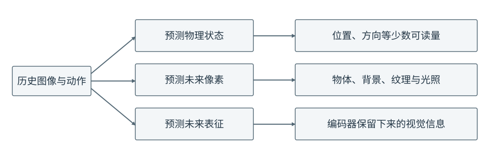
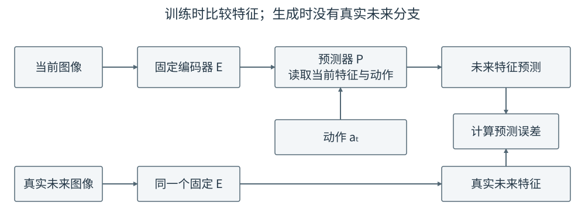
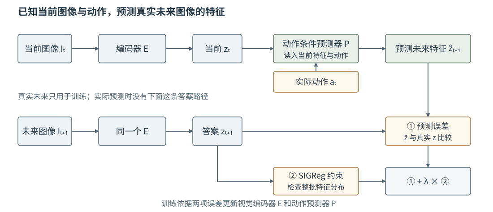

# 15 视觉世界模型：预测图像，还是预测表征？

第 14 章的世界模型读取物体位置、推杆位置和实际动作，学习预测下一刻的位置。真实机器人通常先得到相机图像，而不会自动得到准确的物体坐标。本章要解决的是同一个预测问题在视觉输入下如何成立：图像怎样变成网络能处理的数，未来的“正确答案”又是什么。

全章沿用推动 T 形物体的例子。先比较三种预测结果，再沿着“当前图像与动作 → 预测未来 → 和真实未来比较”的数据流认识联合嵌入预测架构 JEPA（Joint-Embedding Predictive Architecture）；随后分别学习固定视觉编码器与共同训练编码器的做法。最后检查预测出的视觉信息能否用于下一章的动作选择。

## 1. 同一次推动，可以预测哪些结果

设相机在推动前拍到图像 $I_t$，机器人在两次拍摄之间实际执行动作 $a_t$，随后拍到 $I_{t+1}$。动作和图像必须按这个时间顺序对应，否则网络可能把没有发生的移动归因于错误动作。根据希望模型交出什么结果，有三种常见的训练目标。

如果结果是物体中心与朝向，下一刻的答案就是几个可以直接解释的数。这延续了第 14 章，但需要数据中已有人或视觉算法提供这些坐标。如果结果是整张下一帧图像，答案就是 $I_{t+1}$ 的像素；模型除了物体运动，还要处理背景、遮挡和光照。如果结果是下一帧的视觉表征，先用编码器 $E$ 把图像变为一组数 $z_{t+1}=E(I_{t+1})$，再让预测器给出这组数。表征是编码器对图像的数字表示，也常称为**潜空间特征**；它可以是一个向量，也可以是保留空间位置的多组图像块特征。

<figure markdown="span">
{ width="1000" loading=lazy }
<figcaption>图 15-1　同一段推动记录可以提供三种不同的预测答案。图中的“未来表征”来自真实未来图像经过编码器计算，不是人工标出的物体坐标。（本教程绘制）</figcaption>
</figure>

表征并不等于 JEPA 独有的特征：任何视觉编码器都能输出表征。JEPA 特别强调**在表征空间中预测缺失或未来的内容，并与真实内容的编码结果比较**。本章讨论的机器人世界模型把动作也交给预测器，因此预测的是“执行这个动作之后”的未来特征，而不是仅凭一张图猜测下一张图。

选择表征仍要检查它保留了什么。只记住“这是一个 T 形物体”却忘记推杆与物体之间的距离，就无法判断下一步是否会接触；只看整图平均像素误差，大片不变背景又可能盖过很小却关键的物体位移。配套 Notebook 用移动小方块和背景变化把这两个问题具体显示出来；其中的特征是手工计算的示意量，**不是训练出的 JEPA 模型**。

## 2. JEPA 的数据流：谁产生预测，谁提供答案

先看最简的一步。当前图像 $I_t$ 经编码器得到 $z_t$；预测器读取 $z_t$ 和动作 $a_t$，输出对下一刻的估计 $\hat z_{t+1}$。真实下一帧 $I_{t+1}$ 也经编码器得到 $z_{t+1}$，用来核对估计是否接近：

$$
z_t=E_\psi(I_t),\qquad
\hat z_{t+1}=P_\phi(z_t,a_t),\qquad
z_{t+1}=E_\psi(I_{t+1}).
$$

例如推杆向右移动后，真实下一帧显示 T 形物体顺时针转了一点。训练时预测器看得到当前图像的编码和向右移动这个动作，看不到那张未来图像；未来图像只在计算训练误差时出现。使用模型预测一个尚未执行的动作时，真实未来图像根本不存在，也就只运行左侧的编码与预测路径。这与第 14 章“输入是当前状态和动作、答案是下一状态”是同一件事，只是状态由可读坐标换成了图像特征。

上述编码器、动作预测器和用于核对的未来特征，构成了本章所说的**动作条件 JEPA 式世界模型**的基本结构。式中的 $\psi$ 是编码器参数，$\phi$ 是预测器参数；两者是否一起训练，要由具体方法决定，不能从这条公式直接推断。为了看清一步预测，本节只写 $z_t$；实际模型也可以把多帧图像特征和对应动作一起输入，以区分“正向移动中”与“刚刚停下”等单帧看不出的情况。

若每帧得到 16 个图像块特征、每块 64 个数，预测器可以一次输出下一帧的 $16\times64$ 个数。Transformer 是实现预测器的一种方式：它读取各图像块、历史时刻和动作的数值表示，让这些信息交互，再由输出层逐位置给出未来特征。这里的输出是**未来视觉特征的预测**，不是第 12 章中动作生成网络预测的噪声或速度。

## 3. 固定编码器：只学习动作怎样改变已有特征

第一种训练方式是先准备一个视觉编码器，然后把它固定住。当前图像和真实未来图像都经过同一个固定编码器；预测器的输出与真实未来特征比较。训练误差可以写为

$$
\mathcal L_{\mathrm{pred}}
=\frac{1}{ND}\sum_{n=1}^{N}\sum_{j=1}^{D}
\bigl(\hat z_{t+1,n,j}-z_{t+1,n,j}\bigr)^2.
$$

这里 $N$ 是图像块数，$D$ 是每块的特征维度，$n,j$ 指明比较的是哪个位置、哪个特征数值。若只有一个整体向量，就把式子理解为对各分量求平均平方误差。一次训练更新会调整预测器以及动作进入预测器所用的投影层，不改变固定编码器。

<figure markdown="span">
{ width="1000" loading=lazy }
<figcaption>图 15-2　从上方读取当前图像和动作，得到预测；从下方编码真实未来图像，得到训练答案。两处 E 是同一个固定编码器，预测时没有下方的真实未来分支。（本教程绘制）</figcaption>
</figure>

[DINO-WM](https://arxiv.org/abs/2411.04983)就是具体例子：它使用预训练并固定的 DINOv2 视觉编码器，保留图像块特征，训练动作条件预测器估计下一帧特征。其可选图像解码器主要用于查看预测画面，不是训练动力学预测器的必要部分。固定编码器让目标特征稳定，但也有明确边界：若原有特征没有记录细小间隙或接触变化，预测器无法通过自身训练让编码器补回这些信息。

## 4. 共同训练编码器：LeWM 怎样避免所有图像被编码成一样

第二种方式从图像数据中同时训练编码器和预测器。这样编码器有机会学习保留推动任务中重要的变化，但会出现一个很容易忽略的错误解：如果每张图像都被编码成同一个零向量，预测器也总输出零，上一节的预测误差就是零，模型却完全分不清物体是否移动。这叫**表征坍缩**。只看到预测误差下降，不能断定模型学会了物体运动。

[LeWorldModel（LeWM）原论文](https://arxiv.org/abs/2603.19312)提供了一种具体做法。它让编码器产生较紧凑的图像特征，让动作条件预测器估计下一刻特征；同时检查一批不同图像得到的特征是否仍有充分变化。后一项在论文中称为 SIGReg（Sketched Isotropic Gaussian Regularizer，可理解为用随机投影检查特征分布的约束），它作用于**整批特征分布**，不是拿单张图像与某个坐标答案比较。论文用随机方向上的分布检查，使这些特征整体接近规定的高斯分布；这里不把它简化成“每一维方差不为零”这样不完整的实现。

<figure markdown="span">
{ width="1100" loading=lazy }
<figcaption>图 15-3　LeWM 的训练数据流示意。上方用当前特征和动作预测未来特征；下方用真实未来图像形成比较答案；右下方检查一批图像特征是否坍缩。两种误差共同更新编码器与预测器。（依据 LeWM 论文，本教程绘制）</figcaption>
</figure>

顺着图 15-3 读公式，就能区分两种误差：

$$
\mathcal L_{\mathrm{pred}}=\frac{1}{d}\sum_{j=1}^{d}(\hat z_{t+1,j}-z_{t+1,j})^2,
\qquad
\mathcal L_{\mathrm{total}}
=\mathcal L_{\mathrm{pred}}+\lambda\,\mathcal L_{\mathrm{SIGReg}}.
$$

第一项逐条比较“预测的未来特征”和“真实未来图像编码出的特征”；$d$ 是每条特征包含的数值个数。例如两维的真实答案为 $(0.2,0.7)$，预测为 $(0.3,0.6)$，两维各错 $0.1$；按式中两维平均平方误差计算，结果为 $0.01$。第二项不是再预测一次未来，而是在一批不同图像上检查编码器是否把它们都压成相同的数。假设当前这批的预测误差为 $0.04$，分布约束为 $0.6$，人为设定权重 $\lambda=0.1$，总误差就是 $0.04+0.1\times0.6=0.10$。这些数字只演示如何合并两项，不是论文的实验结果。训练根据总误差调整编码器参数 $\psi$ 和预测器参数 $\phi$；$\lambda$ 控制两项对更新的相对影响，不是动作大小。

这里的图 15-3 解释的是 **LeWM 这一种共同训练方式**，不是说所有 JEPA 的网络和防坍缩方法都相同。前一节的 DINO-WM 固定编码器，不需要用同一种方法阻止编码器在此阶段坍缩。[V-JEPA 2](https://arxiv.org/abs/2506.09985)又是另一条具体路线：先通过遮住部分视频内容、预测其特征来预训练视频编码器，再固定该编码器，利用机器人视频和动作训练动作条件预测器 V-JEPA 2-AC。视频预训练与机器人动作预测是两个阶段，不能把没有动作的预训练任务当成已经学会了推动后的物理变化。

## 5. 预测的特征能帮助选动作吗

学会输出 $\hat z_{t+1}$ 之后，还不能只凭训练误差说模型会控制机器人。回到推动 T 形物体的目的：如果左推与右推产生不同后果，模型在相同当前图像下输入这两个动作，预测特征也应合理地区分这两种后果；在尚未接触和已经接触的画面中，特征应保留判断接触所需的差别。否则第 16 章拿预测结果比较候选动作，就没有可靠依据。

一个直接的检查是把模型未见过的完整推动轨迹留作测试。先用真实当前图像和真实动作预测下一帧特征，与真实下一帧编码的特征比较；再从预测结果继续向前预测，观察物体接触前后错误是否增大。还要把**同一当前画面**分别配上不同候选动作，看预测如何改变。仅比较两张画面的整体像素差可能给出误导：配套 Notebook 中“物体到位但背景变亮”和“背景不变但物体没到位”两种结果，正是让读者看清评分依据可能背离任务。

真正选动作时，可以把目标画面也编码成目标特征 $z_g=E(I_g)$，再比较不同候选动作预测的未来特征与 $z_g$。这一步需要特征对位置、朝向和接触等任务相关变化敏感；不能因为两个高维向量距离小，就直接宣布推动成功。第 16 章将用可读的物体位置先把“预测、比较、执行、重新观察”的过程走通，再说明把位置换成视觉特征时哪些判断必须重新验证。

视觉表征预测与**生成未来视频**也不是同一个要求。前者只需交出供预测或选动作使用的数字特征；若要直接展示未来画面，就需要额外训练从特征恢复图像的解码器，或使用以未来画面为生成目标的模型。图像解码得模糊，也可能是解码器没有保留足够细节，不能立即断定动作条件预测错了。第 17 章的 Dreamer 4 会介绍另一种更强调生成未来视觉内容、并利用预测训练策略的路线；它不是本章两种 JEPA 训练方式的必然下一步。

## 配套实践：从像素比较到动作条件表征预测

- **15-01　像素、表征与动作条件预测**

    先对比像素误差与位置特征给出的候选排序，再用固定的位置编码器训练一个最小动作条件预测器，最后检查丢失位置信息的表征为什么即使容易预测也无法用于控制。

    

## 本章小结与下一章

第 14 章预测可读的状态，本章把未来答案换成图像编码后的特征。JEPA 式预测的共同问题是“已知当前内容与动作，未来特征是什么”；固定编码器和共同训练编码器给出不同的学习安排，也各有信息丢失或表征坍缩的风险。只有当特征能区分影响任务结果的变化，下一章的[动作比较与重新规划](16-world-model-planning.md)才有意义。
