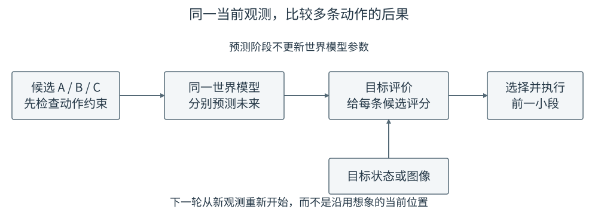
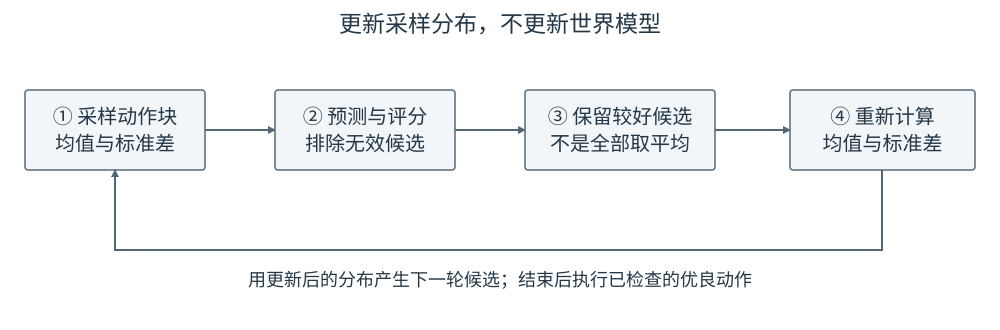
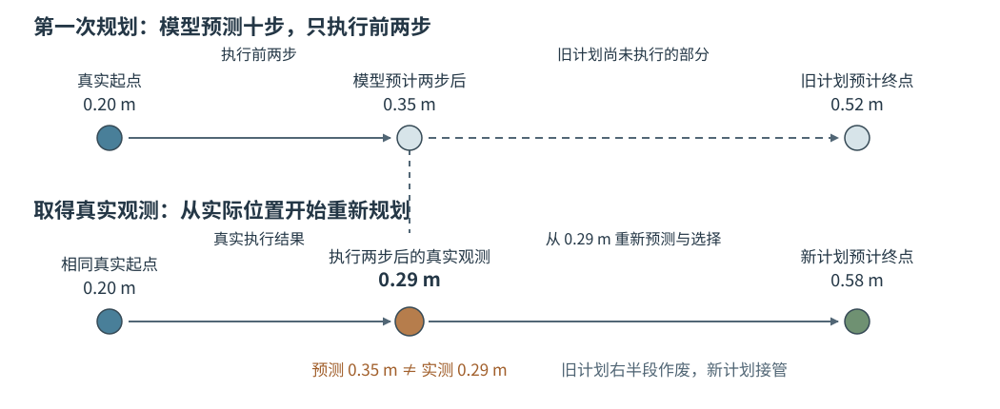

# 16 用世界模型选择动作：先看后果，再决定怎样做

第 14 章学会根据当前状态和动作预测下一状态；第 15 章说明了相机图像怎样变成可预测的视觉特征。预测本身还不能替机器人决定动作：向左推和向右推各有后果，但究竟哪一个更好，取决于物体要去哪里。本章把已经学到的预测器用于**执行前比较动作**。

先从现成的几条动作中选一条；如果现成动作都不好，再学习一种继续寻找候选的方法；执行一小段后，根据真实的新观测重新比较。这里讲的是世界模型的一种用法——**在当前决策时预测后果并挑选动作**。并不是所有世界模型都必须采用本章的搜索方法；第 17 章将讨论把预测用于训练策略的另一条路线。

## 1. 目标从哪里来，怎样判断预测结果是否接近目标

仍以推动 T 形物体为例。相机和任务设置告诉机器人：现在物体中心在桌面横向位置 $0.20$ m，希望它最后到达 $0.60$ m。第 14 章的状态模型可以直接预测物体位置；使用第 15 章的视觉模型时，则可能先预测图像特征，再与目标图像的特征比较。为了先弄清动作怎样选择，本节从可以读懂的横向位置开始，暂时假设物体朝向正确、没有障碍。

某条候选动作 $A$ 预测结束后，模型给出的物体位置记为 $\hat b_{\mathrm{end}}(A)$。本例只看离目标还有多远，所以把候选分数定义为

$$
J(A)=\left|\hat b_{\mathrm{end}}(A)-0.60\right|\quad\text{米}.
$$

分数越小，表示**模型预测的**终点越接近目标。例如预测到 $0.52$ m，分数是 $0.08$ m；预测到 $0.39$ m，分数是 $0.21$ m。这不是世界模型训练时的误差，也不是真实任务成功率，而是这一次选择动作时人为规定的比较规则。若任务还要求 T 形物体旋转到指定朝向，就必须再检查角度；若存在桌边和障碍，还必须先排除不安全的动作。仅用位置距离，不能替代这些条件。

这里还要分清两种看似相同的“未来”。**训练预测器**时，真实的下一张图或下一状态来自已发生的记录，作为预测误差的答案。**选择动作**时，几条候选都尚未执行，不存在它们各自的真实未来；$0.60$ m 是任务希望达到的目标，不是某条候选的真实答案。模型先给出各候选的预测未来，目标再用于比较预测结果。若换成目标图像，也应先通过编码器得到目标特征，再检查这种特征距离是否能反映物体位置和朝向，不能直接把“特征接近”叫作成功。

## 2. 从三条已有动作中选一条

假设第 13 章的动作模型交出三条准备执行的动作块，记为 A、B、C。把**同一份当前观测**分别与这三条动作送入已训练的世界模型，可以得到三种预测后果。本章不会在比较候选时重新训练世界模型；改变的是动作输入。

| 动作块 | 世界模型预测的物体终点 | 到 $0.60$ m 的距离 | 选择时的处理 |
|---|---:|---:|---|
| A | $0.52$ m | $0.08$ m | 动作合法，可以选择 |
| B | $0.39$ m | $0.21$ m | 动作合法，但预测效果较差 |
| C | $0.58$ m | $0.02$ m | 中途越过机械臂允许范围，先排除 |

这些数是为了解释选择过程而设的示意预测，不是实验结果。若只按终点距离排序，C 看起来最好；但它不能安全执行，必须先排除。在剩下的 A 和 B 中，A 的预测终点更接近目标，因此本轮选 A。若三条都不满足约束，就应该重新产生候选或保持安全状态，不能因为“总要选一条”而执行越界动作。

<figure markdown="span">
{ width="1000" loading=lazy }
<figcaption>图 16-1　从左到右读：先检查候选动作本身能否执行，再用同一个世界模型分别预测后果，最后按目标比较可执行的候选。图下方的目标只进入比较环节，不会把“希望到达的位置”当作实际发生的后果。（本教程绘制）</figcaption>
</figure>

图 16-1 比第 13 章多出的关键环节是**对不同动作的未来后果进行预测和比较**。第 13 章已经讲过执行一小段后再观察、再生成动作；那能让机器人根据新输入调整动作，但不会自动告诉它 A 与 B 哪条更可能推动物体到目标。本章用世界模型补上这个选择依据。前提是预测器确实学过这些动作附近的变化；模型若把碰撞误判为顺利通过，再精确地挑最小分数也会选错。

## 3. 三条都不理想时，怎样继续找动作

如果动作模型给出的候选都没有让物体接近目标，可以在允许的动作范围内多试几条。这里的“试”先发生在**世界模型的预测中**，不是让真机把所有候选逐条执行。最直接的方法是随机提出许多动作块，预测并评分，留下最好的可执行动作块。动作维度和时间步数增多时，完全随机碰到好方案会越来越困难。

交叉熵方法 CEM（Cross-Entropy Method）是一种逐轮改进候选的搜索办法。名称中有“交叉熵”，但此处没有训练分类器，也没有更新世界模型。先为未来每一步动作设定采样范围，取出一批完整动作块；世界模型预测每块的后果，按上一节的规则排除无效动作并评分；再用得分较好的若干块确定下一轮更值得搜索的范围。重复数轮之后，从**实际评估过且通过约束检查**的候选里选一块执行。

用一个动作分量说明“更新范围”是什么意思。假设较好候选在某一步的位移分别是 $0.01$、$0.02$、$0.03$ m，它们的平均值是 $0.02$ m。下一轮可以更集中地在 $0.02$ m 附近采样，而不是仍把大量计算花在明显不好的区域。通常还会根据这几个数的离散程度调整采样宽度，并保留一个最小宽度，以免太早只搜索一个点。完整动作块有多个时间步、多个动作分量，每一处都按同样的思路更新。

<figure markdown="span">
{ width="1000" loading=lazy }
<figcaption>图 16-2　每一轮重复“提出候选 → 预测后果 → 挑出较好候选 → 调整下一轮采样范围”。图中改变的是候选从哪里取，世界模型的参数在这个决策过程中保持不变。（本教程绘制）</figcaption>
</figure>

CEM 只是**现成候选不足时的一种搜索工具**，不是世界模型必须配备的部件。也可以直接比较动作专家生成的有限候选，或采用其他搜索器。若左绕和右绕都可行，却把两组动作逐项平均，平均结果可能正好撞上障碍；因此不能无条件把采样分布的均值当作最终命令，仍要选一条已经预测、评分和检查过的具体动作。

配套 Notebook 在二维平面中用一个明确写出的“当前位置加上动作位移”规则充当预测器，再演示 CEM。这样可以单独观察候选怎样产生、预测和筛选。它不训练第 15 章的视觉世界模型，也不把简化的位置更新规则当作真实接触动力学。

## 4. 为什么选好一整段，还要重新观察

假设搜索得到未来十步的动作块。机器人若一次执行完十步，途中物体可能滑动、推杆可能失去接触，下一步的真实起点便与模型当初预计的起点不同。第 14 章已经说明：把一次预测当作下一次输入，误差可能连续积累。这里的办法不是要求模型永远预测正确，而是**只执行已选动作的前面一小段**，然后用新观测重新开始比较。

例如模型原先预测：执行前两步后物体到达 $0.35$ m，接下来继续向右推会到 $0.52$ m。实际执行前两步后，图像却显示物体只到 $0.29$ m。下一轮必须从真实观察到的 $0.29$ m 出发，重新提出或搜索候选，不能把旧计划中想象的 $0.35$ m 当成真实起点。这样做既不否定前一次选择，也不保证下一次一定成功；它只是让新决策及时使用了真实反馈。

<figure markdown="span">
{ width="1050" loading=lazy }
<figcaption>图 16-3　上方是第一次规划时想象的十步结果；机器人只执行前两步。下方的新观测显示物体实际位于 0.29 m，而不是预测的 0.35 m，于是旧计划尚未执行的部分作废，新一轮从 0.29 m 重新预测和选择。（本教程绘制）</figcaption>
</figure>

读图时先看竖向虚线：它表示前两步执行结束、相机取得新观测的时刻。虚线左侧已经真实发生，不能重新选择；虚线右侧仍是尚未执行的计划，可以根据新观测改写。重新规划不是把旧计划的终点简单平移，而是用真实状态重新计算各候选动作的后果。

这与第 13 章第 5 节的“预测一段、执行一小段、重新观察”在**执行节奏**上相通。区别在于第 13 章重点处理动作块生成、检查和衔接；本章在每次执行前加入“用世界模型预测多个候选的后果并挑选”。当这套选择和重新观察循环持续运行时，通常称为**模型预测控制**（Model Predictive Control，MPC）：模型负责预测，控制器据此选动作，实际执行后再从真实状态出发重算。这个名称描述的是本章的决策方式，不能把所有“生成一块、只执行几步”的策略都自动称为用了世界模型的 MPC。

预测十步、执行两步时，“十步”决定本轮向前比较多远，“两步”决定多久会取得新观测。预测得太远，误差可能使排序失真；执行得太久，纠错又会变慢。重新观察只能修正下一轮决策，不能撤销已经执行的动作；因此执行前仍要检查动作边界、碰撞和控制周期，不能把“稍后还能重规划”当成省略安全检查的理由。

## 5. 怎样确认世界模型确实帮助了动作选择

配套 Notebook 把“执行完计划才看一次”和“每执行两步就重新观察、重新搜索”放在同一起点与目标下，并在执行途中施加同一次外部位移。看图时先找到扰动发生的位置，再看两条实际轨迹之后怎样走向目标。若重新观察的一条更接近目标，可以说明**在这个简化环境中**，新观测帮助修正了旧计划；不能据此推断真实推物、接触或视觉预测都已解决。Notebook 的动力学是人为给定的准确规则，没有训练误差，也没有碰撞。

真正评估学习得到的世界模型时，需要同时核对两件事。第一，它对候选的预测是否足以作出正确排序：比如模型说 A 比 B 更接近目标，实际分别执行时是否如此。第二，选出的动作在闭环中是否真的提高成功次数，而不是仅让**模型自己的分数**变小。若搜索不断找到模型没见过的极端动作，模型可能错误预测高分；此时增加采样数量反而会放大错误。动作范围、实际碰撞与完成情况仍要单独检查。

反复搜索也有计算成本。Notebook 中每次重新搜索都要评估许多候选，因此“重规划比一次执行更接近目标”的图，不能单独证明它在相同计算时间下更优。比较方法时应同时记录任务成功次数、约束违规以及从观测到选出动作花了多久。这些检查回答的是本章方法是否值得在当前任务里使用，而不是世界模型好坏的唯一标准。

本章把预测用于**当前这一次**动作选择；每遇到新观测，都可能再次搜索。第 17 章的问题不同：可否在训练阶段让策略反复经历世界模型生成的后果，从中改进参数，使用时直接给出动作，而不必每次都做一轮候选搜索？两章是使用世界模型的两条路线，不是要求同一系统必须依次装上 CEM、MPC 和 Dreamer 4。

## 配套实践：从候选比较到重新规划

- **16-01　候选比较、CEM 与重新规划**

    先比较三条已有候选，观察为什么预测终点最好但动作越界的候选必须被排除；随后用 CEM 搜索新候选，并在同一外部扰动下比较完整执行旧计划与每两步重新观察。

    

## 本章小结与下一章

第 14—15 章回答“动作之后可能发生什么”；本章增加目标与约束，使机器人能在执行前比较候选，必要时搜索新的候选，执行后再用真实观测修正下一轮选择。这是预测服务行动的一种具体方式。下一章的 [Dreamer 4](17-dreamer4-imagination-training.md) 将把预测更多地用在策略训练阶段，形成另一种从世界模型走向行动的方法。
