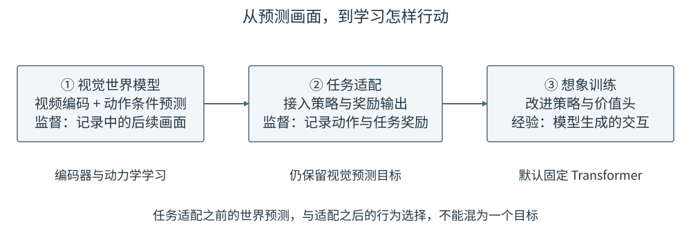
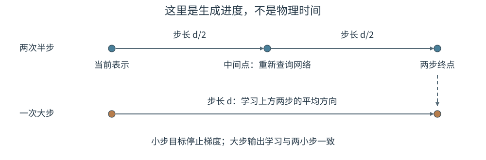
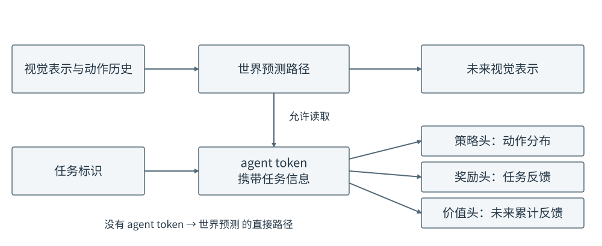

# 17 Dreamer 4：在生成的世界中学习策略

第 16 章让机器人在行动前搜索：提出候选，预测后果，再选出一段执行。另一种用法是把预测搬到训练阶段，让策略在模型生成的交互中练习，使用时直接从观测给出动作。本章以 **Dreamer 4** 为主线解释这种区别，不沿用早期 Dreamer 的 RSSM 结构来描述它。

本章依据《Training Agents Inside of Scalable World Models》及作者项目页。原论文主要在 Minecraft 中验证，不能把其游戏结果直接当作机械臂实验结论。下面的推物数字用于帮助理解数据流，配套 Notebook 是原理演示，不是 Dreamer 4 完整复现。[原论文](https://arxiv.org/abs/2509.24527)、[作者项目页](https://danijar.com/project/dreamer4/)

## 1. 先分清三个要学习的对象

世界模型学习“给定动作会发生什么”，策略学习“在当前任务下选什么动作”，奖励模型学习“发生的结果对任务有多好”。它们可以共享部分网络计算，但监督答案和用途仍然不同。

继续用推物理解：世界模型预测物体接下来移动的位置；策略决定向哪个方向推；奖励模型判断这次变化是否接近目标。若目标从左侧改为右侧，策略与奖励判断可能变化，但同一状态下同一推动动作造成的物理变化不应随目标任意改变。

Dreamer 4 的整体训练分为世界模型预训练、任务行为与奖励适配、想象中的策略改进。它使用因果视频编码器和 Transformer 动力学模型；任务相关输出通过额外 agent token 与输出头接入。最后的想象训练默认固定 Transformer，主要更新策略与价值输出头。[论文第 3 节](https://arxiv.org/html/2509.24527v1#S3)

<figure markdown="span">
{ width="1000" loading=lazy }
<figcaption>图 17-1　阶段之间传递已学到的网络，但每阶段的监督来源不同。最后阶段的经验来自模型预测，不能把它叫作新增的真实交互。（依据论文结构，本教程绘制）</figcaption>
</figure>

图中第一阶段没有“成功动作标签也能改进策略”的捷径。没有动作标注的视频可以帮助学习视觉变化，但要学会控制，仍需要把动作与后果联系起来；任务奖励也需要明确来源，而不是世界模型自动知道什么叫成功。

## 2. 因果视频编码器：先把画面变成可预测的表示

直接在每个像素上反复生成代价很高，因此先压缩图像。Dreamer 4 的 tokenizer 在这里指视频编码与解码模块，不是把文字切成单词的分词器，也不意味着一定把图像变成离散词表编号。其输出是连续的潜在表示。

可以把编码过程理解为：图像被分成小块，图像块特征与一组可学习的潜在 token 一起进入 Transformer，潜在 token 读取图像信息，再经过低维投影形成紧凑表示。解码器学习从表示恢复画面。训练会遮住部分图像块，让编码器不能只依赖逐像素照抄；时间上遵守因果关系，当前表示不能依赖尚未出现的真实未来帧。

为什么“因果”不能省略？假设训练编码器时允许它看到物体下一刻已经移动到哪里，当前表示就可能包含未来答案。但真实交互时这张未来图像尚不存在，动力学模型所依赖的信息就消失了。编码器使用过去帧是允许的，偷看未来帧则改变了问题。

为便于后面的教学推导，把时刻 $t$ 的干净表示记为 $z_t$。它不是第 14 章的物体位置向量；每个特征的含义由训练形成。第一阶段先让编码器能够保留并恢复足够的视觉信息，随后动力学模型学习如何在动作条件下生成这些表示。两种训练不能混成“预测下一帧”的同一个损失。

## 3. Transformer 怎样生成给定动作之后的下一帧

第 12 章的 Flow Matching 生成的是动作，本章生成的是未来视觉表示。动作不再是要从噪声恢复的答案，而是指导未来变化的输入条件。

用简化的一步表示写出训练样本：已有历史表示 $z_{\leq t}$，区间动作 $a_t$，以及从下一张真实图像编码得到的答案 $z_{t+1}$。随机抽取噪声 $\epsilon$ 和生成进度 $\tau$，构造

$$
\tilde z_{t+1}^{(\tau)}=(1-\tau)\epsilon+\tau z_{t+1},
\qquad \epsilon\sim\mathcal N(0,I).
$$

$\tau=0$ 表示完全从噪声开始，$\tau=1$ 表示干净数据端。这里特意不用环境时间 $t$ 作为进度，避免把“预测下一帧”和“修正同一帧的噪声”混在一起。网络还接收生成步长 $d$，表示这次更新计划跨过多大一段生成进度，和机器人控制周期不是一回事。

| 符号 | 回答的问题 | 教学例子 |
|---|---|---|
| $t$ | 交互进行到了哪一帧？ | 第 20 帧到第 21 帧 |
| $\tau$ | 当前这帧的生成到了什么进度？ | 从纯噪声的 0 走到干净端的 1 |
| $d$ | 本次生成更新跨多大步？ | 从 0.25 更新到 0.50 时，步长为 0.25 |
| $a_t$ | 这两帧之间执行了什么控制？ | 向右推动，而不是生成过程中的“速度” |

Dreamer 4 动力学输出采用干净表示预测，即通常所说的 x-prediction，而不是直接把输出叫作噪声估计。为突出条件，下面写成一步教学形式：

$$
\hat z_{t+1}=F_\phi
\left(z_{\leq t},a_t,\tilde z_{t+1}^{(\tau)},\tau,d\right).
$$

实现中，历史、动作、带噪表示及生成条件组织成 token 序列，经过因果 Transformer；线性输出头把对应隐藏特征还原到视觉表示的维度。因此“预测干净表示”仍然是第 02 章的监督学习：网络输出一组数，损失拿它与训练目标比较。未来答案不作为额外的干净输入偷偷交给网络。

如果需要据此更新带噪表示，可以在 $\tau<1$ 时换算一个方向：

$$
\hat v_\tau=
\frac{\hat z_{t+1}-\tilde z_{t+1}^{(\tau)}}{1-\tau},
\qquad
\tilde z^{(\tau+d)}=
\tilde z^{(\tau)}+d\hat v_\tau.
$$

这是潜在表示在生成进度上的变化方向，不是物体在桌面上的运动速度。到达 $\tau=1$ 后停止，不再代入分母为零的表达式。生成完第 $t+1$ 帧后，它才作为历史的一部分，继续生成第 $t+2$ 帧。时间轴的自回归与单帧内部的多步生成同时存在，并不矛盾。

## 4. Shortcut forcing 为什么能减少生成调用

如果每帧需要很多次网络调用，世界模型生成训练经验就会很慢。Shortcut 的核心想法可以用“同一路程走两小步，教会模型怎样走一大步”理解。这里的捷径发生在生成进度上，不是让物体跳过真实接触过程。

先在进度 $\tau$ 预测一个小步方向，走 $d/2$；再在新的中间点预测下一个小步方向，再走 $d/2$。这两个方向的平均值构成大步预测的监督依据。小步不能只在原点重复算两次，因为第二步所处的位置已经变化。构造的监督目标停止梯度，避免网络通过同时移动答案来降低误差。

<figure markdown="span">
{ width="1000" loading=lazy }
<figcaption>图 17-2　上方两小步生成监督，下方大步学习相同区间的变化。横向表示生成进度，不是机器人从起点到目标的物理路径。（依据 shortcut 思路，本教程绘制）</figcaption>
</figure>

举一个纯教学数值例子：当前某个带噪分量是 0.2，总步长为 0.5。第一小步的方向为 0.8，走 0.25 后到 0.4；第二小步方向为 0.4，再走 0.25 后到 0.5。两小步平均方向为 0.6，一大步就应学习把 0.2 更新为 $0.2+0.5\times0.6=0.5$。不是把两个方向相加后直接走完整步长。

最小步长的学习仍由真实数据端监督，更大的步长采用这种自举目标；不能只有模型相互模仿而完全脱离真实数据。Dreamer 4 将这种多步长学习与序列中不同帧的不同噪声等级结合，称为 shortcut forcing。对历史也采用变化的噪声条件，使模型训练时不总依赖完美历史。它缓解连续生成的误差问题，但不构成“永远不会积累误差”的保证。

本章 Notebook 只验证两小步与一大步的数值关系，不包含学习到的视频生成器。因此它不能被用于报告 Dreamer 4 的生成速度或画面质量。

## 5. 任务怎样进入模型，又不篡改物理预测

若直接把“推到左边”的任务信息放进所有视觉预测路径，网络可能把想要的结果当作将要发生的结果。Dreamer 4 使用携带任务信息的 agent token，供动作、奖励和价值输出读取，并采用不对称注意力：agent token 可以读取视觉与动作相关信息，世界预测侧不能反过来读取 agent token。[论文的任务适配说明](https://arxiv.org/html/2509.24527v1#S3.SS3)

<figure markdown="span">
{ width="1000" loading=lazy }
<figcaption>图 17-3　实线是允许的信息流；任务通过策略选出的动作间接影响未来，不直接作为视觉动力学的答案。输出头中的动作、奖励与价值各有不同的监督目标。（依据论文结构，本教程绘制）</figcaption>
</figure>

沿图 17-3 从左到右阅读：世界特征提供当前发生了什么；任务 token 表示当前要做什么；策略头输出动作分布，奖励头估计任务反馈，价值头估计未来还能得到多少累计反馈。这里的“头”就是从共享隐藏特征产生某类输出的小网络，并不是第 09 章多头注意力里的注意力头。

任务适配先利用记录的动作训练策略，利用已有任务奖励训练奖励头，同时保留视觉预测学习。这一步仍然是监督学习：动作答案来自记录者，奖励答案来自任务标注或环境规则。记录者示范得不好，单纯模仿也不会自动变得更好；这就是下一步想象训练要解决的问题。

## 6. 一段想象怎样变成策略的学习信号

从数据中的一段真实历史开始，策略先抽取一个动作，世界模型据此生成后续表示，奖励头给这次变化评分。策略接着从新的表示中选择动作，如此展开一小段。训练记录中的起点是真实的，展开后的状态与奖励则是模型产生的预测。

假设某次推物想象得到两步奖励 0.2 和 0.4，折扣系数 $\gamma=0.9$，最后状态的价值估计为 0.5。那么一个简化的两步目标回报为

$$
G=0.2+0.9\times0.4+0.9^2\times0.5=0.965.
$$

价值表示“从这里继续行动，预计还能获得多少反馈”。尾部的 0.5 用于估计没有继续生成的更远未来，不是又执行了一次真实动作。如果起点的价值原先估计为 0.7，这次轨迹的优势就是 $G-0.7=0.265$，说明它比当前预期更好。若另一条轨迹回报只有 0.3，优势就是负的。这里都是示意数字，不是论文结果。

Dreamer 4 实际使用结合多步信息的 $\lambda$ 回报训练价值头：将不同展开长度的回报估计混合，$\lambda$ 控制更多依赖短期价值估计还是更长的预测奖励。策略采用基于正负反馈的偏好优化方法 PMPO。教学上可先理解它的方向：提高正优势样本中动作的概率，降低负优势样本中动作的概率，再通过与冻结行为先验之间的 KL 散度约束限制偏离；KL 散度衡量两个动作分布的差别。行为先验是进入想象强化学习前保留的策略副本，不是高斯动作噪声。这个目标的详细推导可参见[正负反馈策略学习论文](https://arxiv.org/abs/2410.04166)。

为什么需要这个限制？世界模型没有见过的极端动作可能被错误预测为高奖励。若策略只追逐这种分数，就会学会利用预测漏洞。限制偏离可以帮助保留合理行为，却不能证明预测奖励一定真实；最终仍须回到真实环境或可信仿真评测。

默认想象训练阶段固定世界模型主干和奖励相关能力，更新策略与价值头。不要把这一阶段写成旧版 Dreamer 的“通过 RSSM 动力学一路反传训练策略”，也不要把它描述成每个控制时刻都用 CEM 搜索。MPC 把计算用于当前动作的搜索，Dreamer 4 把大量预测用于改进策略参数，这是两种不同的利用方式。

## 7. 放回机器人任务时，还需要什么

本章方法对机器人的启发是用已有视频与交互记录建立可训练的预测环境，但至少有三项差距需要另外验证。第一，机器人动作往往是连续控制量，不能直接照搬 Minecraft 的鼠标键盘输出头。第二，细小接触、力与不可见状态可能决定成败，仅生成相似视频并不够。第三，奖励模型预测成功不等于实际完成抓取或没有碰撞，必须设置独立评测与执行保护。

stable-worldmodel 在本单元承担数据、预测模型与规划接口的项目阅读任务，不把它说成 Dreamer 4 官方实现。网络上也存在第三方 Dreamer 4 实现；使用前应分别核对世界模型、奖励适配和想象策略训练是否齐全，不能把能生成视频的演示当成完整智能体复现。

## 配套实践：分清生成步骤与策略改进

- **17-01　捷径步长与想象回报的原理演示**

    第一部分逐步算出两小步构造的大步目标；第二部分用固定的教学奖励比较轨迹回报与优势，并展示一次简化的策略概率更新。所有简化都会明确标注，不冒充 Dreamer 4 的训练结果。

    

## 单元小结：预测不是目的，怎样使用预测才是

第 14 章从交互记录学习状态变化，第 15 章把预测目标扩展到视觉表征，第 16 章在执行前搜索动作，本章则把预测用于训练策略。这两种决策路线都依赖可靠的动作条件预测，也都不能把模型中的成功直接等同于真实成功。

目前任务通常由目标状态、图像或既定任务标识给出。若用户说“把红色杯子放进盒子里”，语言怎样确定目标并连接动作与世界预测？这是[高级篇单元二](index.md#unit-two)要继续解决的问题。本版到此完成单元一，不提前填充尚未实现的后续章节。
