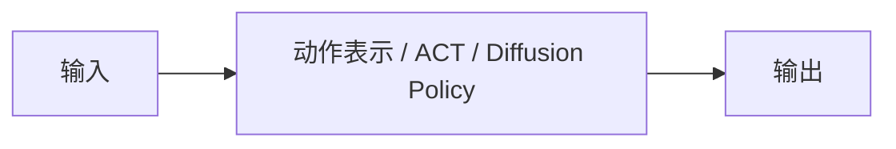

# 动作表示

## 本章解决什么问题

同样叫“输出动作”，接口可能完全不同。本章整理连续动作、动作 token、action chunk、ACT 与 Diffusion Policy 在表示层的差别。

## 学习目标

完成本章后，读者应该能够：

- [ ] 比较不同动作参数化的输入输出形状
- [ ] 说明 chunk 长度如何影响闭环频率
- [ ] 指出表示选择会限制后续世界模型怎么条件化

## 前置知识

- [视觉语言动作模型](vla.md)、[Diffusion](../intermediate/diffusion.md)

## 从上一章遗留的问题开始

上一章：[视觉语言动作模型](vla.md)。

VLA 已经定义为动作生成器，但“动作”仍是一个含糊的词。

## 直观理解

先决定动作是一个点、一段序列、一组 token 还是一个去噪目标，再谈网络结构。

## 数学形式

对比 \(a_t\)、\(a_{t:t+H}\) 与离散 token 序列 \(u_{1:N}\) 的符号。

<!-- TODO：解释符号、公式和假设。不要在未核对前写入具体定理式结论。 -->

## 输入、输出与张量形状

| 名称 | 符号 | 示例形状 | 含义 |
|---|---|---:|---|
| 连续动作 | a_t | [B, A] | 单步控制量 |
| 动作分块 | a_{t:t+H} | [B, H, A] | 短时开环序列 |
| 动作 token | u | [B, N] | 离散化后的动作 |

## 模块结构

## 配套实践

配套 Notebook 将在本章正文完成时一并接入。

!!! example "代码实践"
    本章网页只保留原理、公式、输入输出和图表。可执行实现将在对应章节的 Colab Notebook 中提供。

## 可视化与实验

  
可视化占位：后续可在此展示 动作表示 的输入输出变化。

<!-- TODO：图、动画或交互演示。实验记录请使用附录模板。 -->

## 常见误区

- chunk 越长越平滑，因而一定更适合真机
- 离散 token 化的量化误差可以在下游被自动忽略

## 它在机器人世界模型中的位置

世界模型必须以同一套动作表示作为条件。否则“生成的动作”和“预测用的动作”不在一个空间。

## 本章小结

<!-- TODO：用三到五句收回本章缺口，不要复述未经验证的效果。 -->

本章把 **动作表示** 放进教程闭环中的对应位置，并留下一个旧方法无法覆盖的问题。

## 下一章

动作可以生成了。怎样系统化地预测这些动作对世界的后果？下一章正式进入世界模型。

下一章：[世界模型](world-model.md)。
