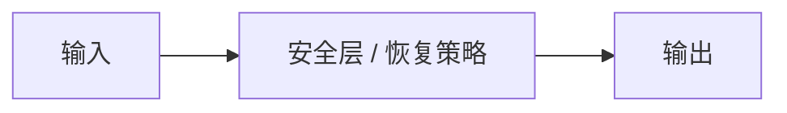

# 安全与失败恢复

## 本章解决什么问题

闭环最后一段不是成功演示，而是失败时如何约束动作、恢复或请求停机。本章把安全控制接到规划与真机部署。

## 学习目标

完成本章后，读者应该能够：

- [ ] 区分约束、监测、急停和任务级恢复
- [ ] 写出安全层在动作发出前截获的接口
- [ ] 说明恢复策略如何重新进入编码-规划循环

## 前置知识

- [Sim-to-Real](sim-to-real.md)、[规划与策略](planning-and-policy.md)

## 从上一章遗留的问题开始

上一章：[Sim-to-Real](sim-to-real.md)。

前面章节默认动作可以被执行。真机上这并不成立：碰撞、失握、人靠近或模型自知不确定时，必须另有一层决策。

## 直观理解

先保证动作可拒绝，再谈优雅恢复。恢复本身也是一次新的语言或目标条件规划。

## 数学形式

引入约束集合 \(\mathcal{A}_{safe}\) 与监测变量的符号位置。

<!-- TODO：解释符号、公式和假设。不要在未核对前写入具体定理式结论。 -->

## 输入、输出与张量形状

| 名称 | 符号 | 示例形状 | 含义 |
|---|---|---:|---|
| 候选动作 | a | [A] 或 [H, A] | 策略或规划输出 |
| 监测信号 | m | [M] | 力、碰撞、不确定度等 |
| 可执行动作 | a' | [A] | 经过安全层后的命令 |

## 模块结构



## 最小实现

对应代码目录或接口待接入。当前仅保留可编译的函数签名。

```python
# TODO：最小可运行示例
# 本章模块：安全层 / 恢复策略


def forward(*inputs):
    """返回本章定义的输出张量。"""
    raise NotImplementedError("《安全与失败恢复》示例待补充")
```

## 可视化与实验

<div class="viz-slot" data-viz="placeholder" data-viz-config='{"title":"安全与失败恢复","note":"本章动画或交互演示待接入。阅读不依赖这段可视化。"}'>
  <p data-viz-fallback>可视化占位：后续可在此展示 安全与失败恢复 的输入输出变化。</p>
</div>

<!-- TODO：图、动画或交互演示。实验记录请使用附录模板。 -->

## 常见误区

- 把演示脚本里的人工急停当成模型具备恢复能力
- 在不确定度未校准的情况下用它做唯一安全开关

## 它在机器人世界模型中的位置

它关闭教程开头的闭环：新观测不仅用于继续任务，也用于判断是否该停、该退、该重规划。

## 本章小结

<!-- TODO：用三到五句收回本章缺口，不要复述未经验证的效果。 -->

本章把 **安全与失败恢复** 放进教程闭环中的对应位置，并留下一个旧方法无法覆盖的问题。

## 下一章

概念闭环已经齐了。下一步应进入实践项目，把这些接口接成最小可运行系统。

下一章：[实践项目总览](../projects/index.md)。
