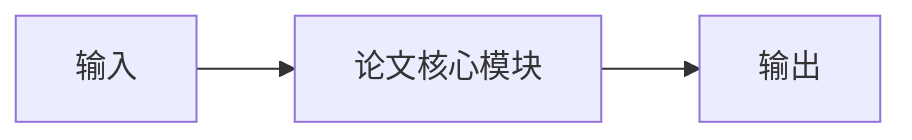

# 论文阅读模板

把论文读进本教程时，使用这张表，避免最后只留下“方法很强”这类无法迁移的句子。

## 论文信息

| 字段 | 填写 |
|---|---|
| 标题 | TODO |
| 作者与年份 | TODO |
| 链接 | TODO |
| 对应教程章节 | TODO |

## 它想解决什么问题

<!-- TODO：用教程中已经出现的缺口来描述，而不是重复摘要。 -->

## 输入、输出与假设

| 名称 | 内容 |
|---|---|
| 输入 | TODO |
| 输出 | TODO |
| 关键假设 | TODO |
| 不处理的问题 | TODO |

## 方法结构

## 和上一章方法的差别

<!-- TODO：旧方法卡在哪里，这篇论文换掉了哪一块。 -->

## 结果里真正有信息的部分

<!-- TODO：只记录与本章问题相关的证据，不抄全表。若尚未核对，保持空白。 -->

## 可以做成的最小实验

- [ ] TODO：数据
- [ ] TODO：成功标准
- [ ] TODO：失败时最可能的原因

## 它在世界模型闭环中的位置

<!-- TODO：编码 / 预测 / 动作生成 / 规划 / 纠错。 -->

## 还没回答的问题

<!-- TODO：这将成为某一章的“下一章”。 -->
