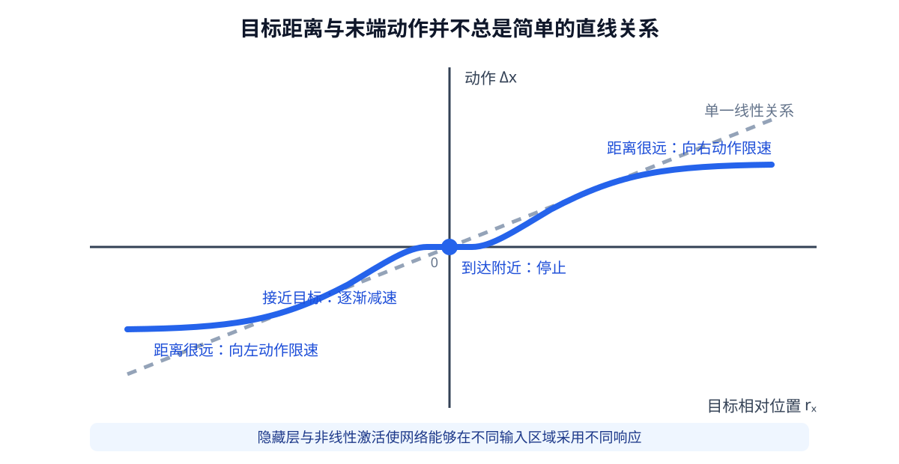
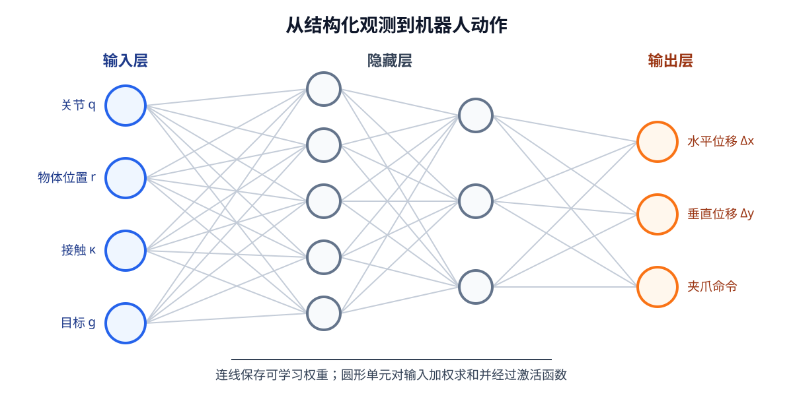
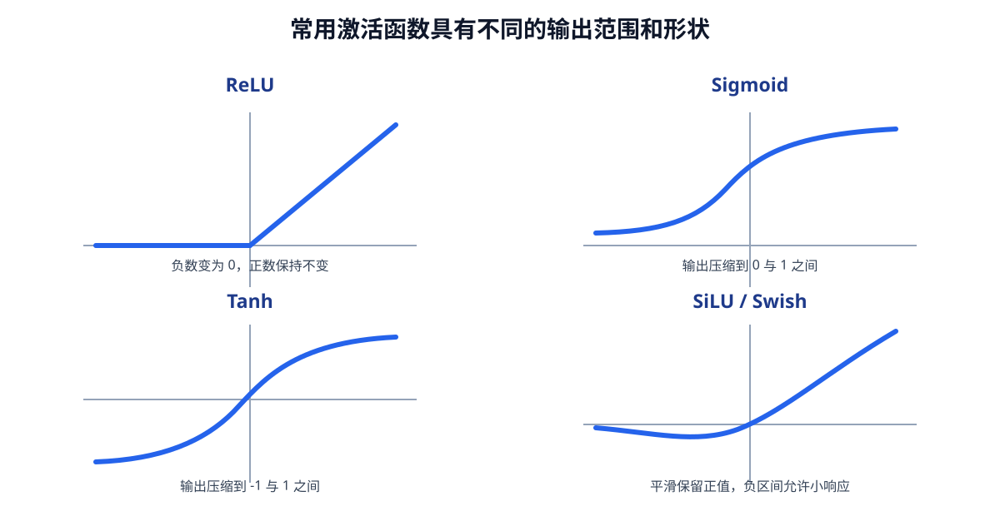
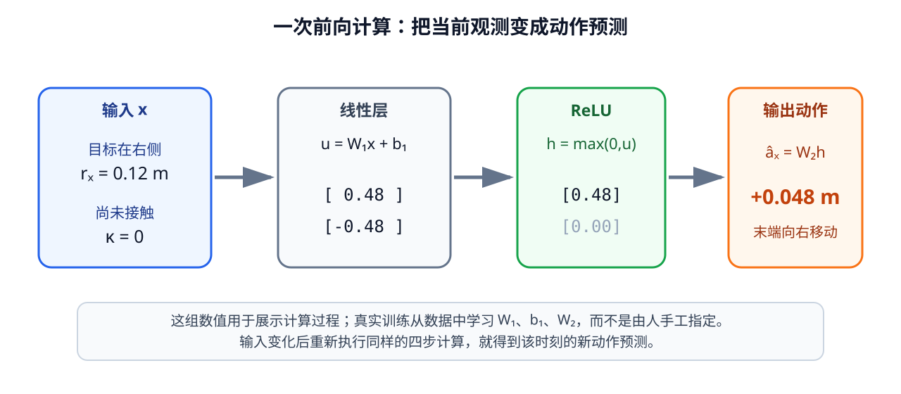
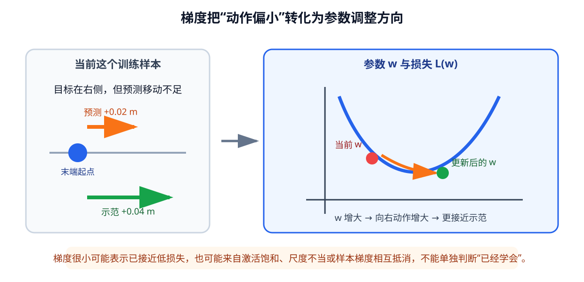
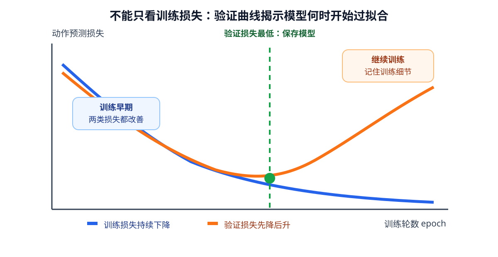

# 02 神经网络如何学习

上一章把现实中的机器人交互整理成了可以学习的数据。机器人在时刻 $t$ 获得观测 $o_t$，结合任务目标 $g$ 作出动作 $a_t$，动作执行后又得到新的观测 $o_{t+1}$。这些观测和动作按照时间顺序排列，形成一条轨迹：

$$
\tau=(o_0,a_0,o_1,a_1,\ldots,a_{T-1},o_T).
$$

有了轨迹，并不意味着机器人已经学会任务。数据只是记录“当时发生了什么”，神经网络还要从许多记录中找到输入与输出之间较稳定的关系。例如，机械臂看见杯子位于右前方、夹爪处于张开状态时，示范者通常会让末端向杯子靠近。模型需要把大量这样的经验转化为一组参数，使自己面对相似情况时也能给出合适的预测。

本章讨论这个学习过程。核心问题是：为什么调整一组参数，就能让模型从不会预测逐渐变得会预测？我们将从第 01 章的轨迹出发，依次说明学习任务怎样定义、神经网络怎样产生预测、预测误差怎样转化为参数更新，以及训练误差下降为什么不一定代表机器人真正学会了任务。

为了让主线保持清楚，本章暂时使用已经整理成数值的结构化观测，不直接处理原始图像和语言。这不是认为机器人只需要关节状态，而是把“怎样训练”与“怎样编码不同观测”分开讨论。第 03 章将回到完整观测，解决图像、语言和机器人本体信息怎样分别编码并共同进入模型的问题。

学完本章后，你应当能够解释一次完整训练过程，说明参数、前向计算、损失、梯度、反向传播、优化器、batch 和 epoch 之间的关系，并能判断一个较低的训练损失为什么不足以证明机器人已经掌握真实任务。

## 1. 从机器人轨迹到学习任务

### 同一条轨迹可以提出不同问题

第 01 章中的观测不是单一数字，而是多种传感器信息的集合：

$$
o_t=\left(I_t,d_t,q_t,f_t,\kappa_t,\ldots\right).
$$

$I_t$ 是 RGB 图像，$d_t$ 是深度信息，$q_t$ 是关节和夹爪等本体状态，$f_t$ 是力或触觉读数，$\kappa_t$ 是接触或碰撞等离散信号。任务目标 $g$ 还可能包含语言指令、目标图像或目标坐标。它们共同描述了机器人作出决定时能够利用的信息。

一条轨迹本身并没有规定模型必须学习什么。根据输入和目标输出的不同，同一批数据可以构造不同任务。如果希望模型模仿示范者的动作，可以使用

$$
(o_t,g)\longrightarrow a_t.
$$

如果希望模型预测动作执行后的变化，可以使用

$$
(o_t,a_t)\longrightarrow o_{t+1}.
$$

如果希望模型判断一次操作能否成功，还可以使用一段历史观测和动作预测成功标记。三个任务都来自同一条轨迹，却要求模型保留不同信息。动作预测需要知道任务目标和当前环境，未来预测需要理解动作怎样改变环境，成功判断则可能更关注接触、稳定性和长期结果。

本章选择“根据当前观测和目标预测示范动作”作为贯穿始终的例子：

$$
\hat a_t=f_\theta(o_t,g).
$$

$\hat a_t$ 是模型给出的动作预测，$f_\theta$ 是带参数的神经网络，$\theta$ 表示网络内部所有可调整参数。之所以先选择动作预测，是因为示范轨迹已经为每个时间步提供了明确的目标动作，便于观察完整训练过程。这里训练的是一个简单动作模型，而不是完整世界模型；以后把输出换成下一时刻观测或内部状态时，前向计算、损失、反向传播和验证等训练基础仍然适用。

### 为什么不能只输入机器人本体状态

如果把任务直接简化成

$$
\hat a_t=f_\theta(q_t),
$$

模型只知道机械臂当前的关节和夹爪状态，却不知道物体在哪里，也不知道用户想完成什么目标。这在许多任务中不足以决定动作。

设想机械臂保持完全相同的姿态。第一次示范中，目标杯子位于末端左侧，正确动作应向左；第二次示范中，杯子位于末端右侧，正确动作应向右。如果输入只有相同的 $q_t$，网络看到的是两个完全相同的输入和两个相反的目标动作。无论怎样调整参数，它都无法仅凭 $q_t$ 判断当前属于哪一种情况。

同样，即使桌面场景完全相同，“把红色杯子放进盒子”和“把蓝色杯子移到桌角”也要求不同动作。缺少任务目标时，模型不知道应该服务于哪个意图。模型能否学会一个任务，不只取决于网络是否足够大，也取决于输入中是否包含完成任务所需要的信息。

因此，概念上的完整动作模型应始终写成

$$
\hat a_t=f_\theta(o_t,g),
$$

而不是默认所有任务都能由 $q_t$ 唯一决定。

### 用结构化观测隔离训练问题

真实观测中的图像、深度、语言和触觉具有不同结构，不能未经处理就当作一列普通数字交给同一个小型网络。为了先把训练机制讲清楚，本章使用一个桌面到达任务：数据集直接提供机械臂本体状态、物体相对位置、目标相对位置、夹爪状态和接触信号。这些量来自模拟器标注或已经完成的感知预处理，被组成结构化输入

$$
x_t=
\left[
q_t,
r_t^{\mathrm{object}},
r_t^{\mathrm{goal}},
f_t,
\kappa_t
\right].
$$

其中，$r_t^{\mathrm{object}}$ 表示物体相对机器人末端的位置，$r_t^{\mathrm{goal}}$ 表示目标位置或任务目标的数值描述。于是，本章实际分析的模型写成

$$
\hat a_t=f_\theta(x_t).
$$

$x_t$ 是从完整观测和任务目标中选出的结构化表示，不是对 $o_t$ 的重新定义。暂时省略原始图像和语言，是为了单独回答“参数怎样学习”，而不是断言这些信息不重要。第 03 章要解决的正是如何从 $I_t$ 和语言目标中得到适合模型使用的表示，从而不再依赖数据集直接给出的物体和目标位置。

把多条示范轨迹中的有效时间步收集起来，可以得到一组训练样本：

$$
\mathcal D=\left\{(x^{(i)},a^{(i)})\right\}_{i=1}^{N}.
$$

$N$ 是样本数量，上标 $(i)$ 表示第 $i$ 个样本，不再表示时间。每个样本的输入 $x^{(i)}$ 来自某条轨迹的某个有效时间步，目标 $a^{(i)}$ 是该时刻示范者实际执行的动作。补齐位置不能成为训练样本，动作与观测也必须保持第 01 章规定的时间对应关系。

这里出现了一个贯穿本章的原则：训练任务由输入、目标输出和样本对应关系共同定义。神经网络不会自行判断哪一列是目标，也不会自动发现某个输入来自错误时间。数据一旦在这里定义错误，后面即使损失顺利下降，模型学到的也仍然是错误任务。

## 2. 神经网络怎样从输入产生预测

### 参数把固定计算变成可学习关系

普通函数按照预先写好的规则计算输出。例如，将米换算成毫米时，程序员明确规定输出等于输入乘以 1000。学习模型的不同之处在于：程序员规定计算结构，却不直接写出其中每个参数的最终数值。参数先从一个初始值开始，再根据训练数据逐渐调整。

最简单的可学习模型是线性层：

$$
\hat a=Wx+b.
$$

假设输入 $x$ 有 $D_{\mathrm{in}}$ 个分量，动作 $a$ 有 $D_{\mathrm{out}}$ 个分量，那么权重矩阵 $W$ 的形状是

$$
[D_{\mathrm{out}},D_{\mathrm{in}}],
$$

偏置 $b$ 的形状是 $[D_{\mathrm{out}}]$。权重决定每个输入分量怎样影响每个输出分量，偏置则允许模型在输入为零时仍给出非零输出。$W$ 和 $b$ 都属于参数 $\theta$。

以向右运动这一维动作为例，训练后某些权重可能使“目标位于右侧”增加向右动作，使“目标位于左侧”减少向右动作。我们可以这样解释参数的作用，但不能把单个权重简单等同于一个完整概念。真实网络中的行为通常由许多参数共同形成。

线性层已经能够学习输入与动作之间的加权关系。例如，在运动范围较小、没有障碍物的情况下，目标相对位置与末端位移可能近似成比例。然而，真实任务经常包含条件变化：距离较远时应快速接近，靠近物体后应减速；只有末端接近物体并且夹爪方向正确时才适合闭合。一个固定的线性关系难以同时描述这些情况。

把这个过程落实到一条样本上，可以先只观察水平方向。设 $r_x$ 表示目标相对末端的水平距离，约定向右为正、向左为负；$\kappa$ 表示是否已经接触目标。于是一个教学用输入可以写成

$$
x=
\begin{bmatrix}
r_x\\
\kappa
\end{bmatrix}.
$$

如果当前目标在右侧 0.12 米并且尚未接触，那么 $x=[0.12,0]^{\mathsf T}$。模型需要输出水平方向动作 $\hat a_x$。这只是完整输入 $x_t$ 中的两个分量，却足以让我们具体跟踪一个数字怎样经过网络变成动作。实际模型会以相同方式同时处理关节状态、三维相对位置、夹爪状态等更多分量。

### 多层网络表达非线性关系

把多个线性层直接连接并不能解决这个问题。若两层之间没有其他变化，

$$
W_2(W_1x+b_1)+b_2
$$

仍然可以整理成一个新的线性变换。层数增加了，模型能够表达的关系却没有发生本质变化。

神经网络会在线性层之间加入激活函数。一个具有隐藏层的简单网络可以写成

$$
h=\sigma(W_1x+b_1),
$$

$$
\hat a=W_2h+b_2.
$$

$h$ 是隐藏层形成的中间表示，$\sigma$ 是非线性激活函数。常见的 ReLU 会保留正值并把负值变为零。它看似只是简单的数值变化，却会使网络能够在不同输入区域采用不同的响应方式。多层网络通过反复进行线性变换和非线性变化，可以逐渐表达比单一直线关系更复杂的输入—输出映射。

输入层、隐藏层和输出层描述的是数据在网络中的位置，而不是三种完全不同的计算。输入层接收结构化观测 $x_t$，隐藏层把输入转化为内部特征，输出层产生与动作维度相同的 $\hat a_t$。若动作是七维末端控制，输出就必须能够明确对应这七个动作分量。

仍以水平方向到达为例，一个合理动作通常包含三种工作区域。目标距离较远时，动作不能随距离无限增大，否则可能超过控制器允许的速度；接近目标时，动作应随距离减小，以免来回越过目标；进入允许误差范围后，末端应停止。这个关系带有限速、减速和停止区域，不可能由一条无限延伸的直线完整表示。

| 目标相对位置 $r_x$ | 希望得到的动作 $a_x$ | 控制含义 |
|---:|---:|---|
| $-0.30$ m | $-0.05$ m | 目标很远，向左运动但不超过限速 |
| $-0.03$ m | $-0.015$ m | 接近目标，减小向左动作 |
| $0.00$ m | $0.00$ m | 已经到达，保持停止 |
| $0.03$ m | $0.015$ m | 接近目标，小幅向右运动 |
| $0.30$ m | $0.05$ m | 目标很远，向右运动但不超过限速 |

<figure markdown="span">
  { width="1000" loading=lazy }
  <figcaption>图 02-1　同一套控制关系需要同时表达远距离限速、近距离减速和到达后停止。（本教程绘制）</figcaption>
</figure>

从网络结构看，输入层并不是一组负责复杂推理的神经元，而是结构化观测进入模型的位置。每个输入节点对应一个有明确含义的数值。隐藏层中的节点接收上一层的加权结果，并经过激活函数产生新的响应；输出层再把隐藏响应组合成动作向量。层与层之间的连线各自保存一个可学习权重，训练改变的正是这些权重和每层偏置。

<figure markdown="span">
  { width="1000" loading=lazy }
  <figcaption>图 02-2　结构化观测经过隐藏层重新组合，输出层的每个节点对应动作数据契约中的一个字段。（本教程绘制）</figcaption>
</figure>

ReLU 是这一过程中最常见的激活函数之一。它的全称是 Rectified Linear Unit，中文通常称为修正线性单元，定义为

$$
\operatorname{ReLU}(u)=\max(0,u)
=
\begin{cases}
u,&u>0,\\
0,&u\leq0.
\end{cases}
$$

它接收线性层给出的数值 $u$：当 $u$ 为正时原样保留，当 $u$ 为负时输出 0。例如，输入 $[-1,-0.2,0,0.3,1]$ 经过 ReLU 后会变成 $[0,0,0,0.3,1]$。这种形式可以理解为一个简单开关：当前输入满足某种由权重定义的条件时，单元产生正响应；条件不满足时，该通路暂时不响应。

ReLU 的作用不只是删除负数。若网络中没有激活函数，多层线性计算最终仍等价于一层线性变换；加入 ReLU 后，不同单元可以在输入空间的不同区域开启或关闭，使网络能够组合出折线、分段边界和更复杂的非线性关系。它的正区间梯度为 1，计算简单，也不容易像某些饱和函数那样在较大的正输入处产生接近零的梯度。

ReLU 也有局限。如果一个单元对训练数据始终得到负输入，它的输出和局部梯度都会长期为零，这条通路就可能无法继续学习。因此，激活函数需要与参数初始化、学习率和网络结构一起考虑，而不是越多越好。

神经网络还会使用其他激活函数：

| 激活函数 | 输出形式 | 常见用途与特点 |
|---|---|---|
| ReLU | $\max(0,u)$ | 简单高效，常用于多层感知机和视觉网络的隐藏层 |
| Sigmoid | $1/(1+e^{-u})$ | 输出位于 0 和 1 之间，适合二分类概率或门控值 |
| Tanh | $\tanh(u)$ | 输出位于 $-1$ 和 1 之间，适合需要正负有界响应的场景 |
| GELU | $u\,\Phi(u)$ | 平滑地保留较大输入，常用于 Transformer |
| SiLU / Swish | $u\,\operatorname{Sigmoid}(u)$ | 平滑且允许小的负响应，常见于现代视觉网络和生成模型 |

GELU 公式中的 $\Phi(u)$ 表示标准正态分布在 $u$ 之前的累计比例。此处不要求计算它，只需先理解 GELU 和 SiLU 都不像 ReLU 那样在零点突然折转，而是用平滑方式决定保留多少输入。

<figure markdown="span">
  { width="1000" loading=lazy }
  <figcaption>图 02-3　激活函数的形状决定一个单元怎样保留、压缩或抑制线性层的输出。（本教程绘制）</figcaption>
</figure>

隐藏层使用什么激活函数，与输出层怎样表示任务目标是两个问题。连续动作回归可以让输出层保持线性，也可以使用 Tanh 把归一化动作限制在 $[-1,1]$；二分类输出常使用 Sigmoid；多个互斥类别通常使用 Softmax 把一组数值转换为总和为 1 的类别概率。不能因为隐藏层使用 ReLU，就默认输出动作也必须经过 ReLU，否则机器人将无法产生负方向动作。

多个 ReLU 单元可以把输入空间分成若干区域，再由后续线性层组合各区域的响应，从而逐步逼近这种分段关系。隐藏层越宽、层数越多，通常可以表示越复杂的边界，但参数也会增加，训练数据不足时更容易记住偶然细节。因此，“网络更深”并不自动意味着任务完成得更好。

### 前向计算只负责给出当前预测

数据从输入经过各层到达输出的过程称为前向计算。下面用一组人为选择的参数把一次计算完整走完。取

$$
W_1=
\begin{bmatrix}
4 & -1\\
-4 & -1
\end{bmatrix},
\qquad
b_1=
\begin{bmatrix}
0\\0
\end{bmatrix}.
$$

将尚未接触、位于右侧 0.12 米的输入 $x=[0.12,0]^{\mathsf T}$ 代入第一层，得到

$$
u=W_1x+b_1=
\begin{bmatrix}
0.48\\-0.48
\end{bmatrix}.
$$

经过 ReLU 后，负值被置为零：

$$
h=\operatorname{ReLU}(u)=
\begin{bmatrix}
0.48\\0
\end{bmatrix}.
$$

再令输出层参数为 $W_2=[0.1,-0.1]$、$b_2=0$，就得到

$$
\hat a_x=W_2h+b_2=0.048\ \text{m}.
$$

正号表示向右，0.048 米没有超过示例中的 0.05 米动作上限。第一个隐藏单元对“目标在右侧且尚未接触”产生正响应，第二个隐藏单元此时不响应。若把 $r_x$ 改为负数，两者的作用会交换，输出变为向左动作；若把接触信号 $\kappa$ 改为 1，这组参数会压低两个方向单元，使动作趋向停止。

<figure markdown="span">
  { width="1060" loading=lazy }
  <figcaption>图 02-4　输入依次经过线性层、非线性激活和输出层，最终得到一个具有物理含义的末端位移。（本教程绘制）</figcaption>
</figure>

这里的参数是为了展示过程而手工选取的。真实训练不会由人逐项填写 $W_1$ 和 $W_2$，而是先初始化参数，再通过后文介绍的损失和梯度从大量样本中学习。无论参数来自手工设置还是训练，前向计算都遵循相同顺序：整理输入、执行每一层计算、得到归一化动作，最后按照数据契约恢复物理单位并限制在机器人允许的动作范围内。

前向计算本身不会修改参数。未训练网络也能执行前向计算，只是它的参数通常来自随机初始化，预测动作没有可靠意义。训练后的网络仍执行同样的计算结构，但参数已经受到大量示范样本的调整，因此输入与输出之间形成了数据支持的关系。

这也说明“模型学习”具体改变了什么：训练通常不改变输入字段，不改变层与层的连接顺序，也不在每一步重新编写计算公式；它主要改变 $W$、$b$ 等参数的数值。模型结构规定了它可以怎样表达关系，训练数据和训练目标则推动参数在这些可能关系中找到一个较合适的结果。

在进入网络之前，不同输入分量还需要具有适当的数值尺度。关节角可能以弧度表示，位置可能以米表示，力传感器读数又可能远大于前两者。如果某类数值的范围特别大，它可能在训练初期不成比例地影响计算。常见做法是根据训练集统计量对连续输入进行标准化或缩放，并在验证和实际使用时复用同一套变换。不能分别使用验证集或测试集计算新的归一化统计量，否则会把未见数据的信息提前带入训练流程。

## 3. 预测误差怎样转化为参数更新

网络完成一次前向计算后，只得到当前参数下的预测。要让预测逐渐接近示范动作，还需要衡量预测哪里不对，并把这种差异传回网络。

### 损失函数定义模型努力减少的错误

对于连续动作预测，可以比较预测动作 $\hat a^{(i)}$ 与示范动作 $a^{(i)}$ 的差异。一个 batch 中包含 $B$ 个样本时，均方误差可以写成

$$
\mathcal L(\theta)=
\frac{1}{B}
\sum_{i=1}^{B}
\left\|
f_\theta(x^{(i)})-a^{(i)}
\right\|_2^2.
$$

它先计算每个预测动作与示范动作之差，再对差值的平方进行汇总。预测越接近示范，损失通常越小。平方会使较大的偏差受到更强惩罚，因此模型会特别努力减少大误差。

考虑机械臂在水平面内移动的一条具体样本。示范动作要求末端移动

$$
a=
\begin{bmatrix}
0.04\\0.00
\end{bmatrix}\text{m},
$$

当前模型却预测

$$
\hat a=
\begin{bmatrix}
0.02\\0.01
\end{bmatrix}\text{m}.
$$

这表示水平方向少移动了 0.02 米，另一个方向又多移动了 0.01 米。若暂时使用两个维度的平方误差之和，这条样本的损失为

$$
(0.02-0.04)^2+(0.01-0.00)^2=0.0005.
$$

这个数字本身没有“移动了多少米”的直接含义，它是两个动作偏差经过平方和汇总后的训练信号。下一条样本可能具有不同误差，一个 batch 的损失会把多条样本的结果平均起来，再用于一次参数更新。

均方误差并不是天然正确的唯一选择。动作向量可能同时包含米、弧度和夹爪命令，不同分量的范围和物理意义并不相同。如果未经归一化就直接求和，数值范围较大的维度可能主导训练。可以先统一尺度，也可以为不同动作分量设置权重。权重越大，模型越会优先减少相应错误。

如果任务输出不是连续动作，而是“抓取成功或失败”这样的类别，就需要衡量预测类别概率与真实类别之间的差异，交叉熵是常见选择。这里不展开它的完整推导，重要的是理解：输出含义改变后，损失函数也必须随之改变。

损失函数并不只是训练结束后的评分规则。参数更新直接以减少损失为目标，所以损失函数实际上规定了哪些错误值得模型付出更多调整。若损失只关心每一步动作的数值接近，却不关心碰撞和任务成功，模型就没有直接动力优先避免危险动作。一个不断下降的损失只能说明模型越来越符合当前数学目标，不能自动证明这个目标完整代表了现实任务。

### 梯度指出局部调整方向

假设模型中只有一个参数 $w$。参数变化时，损失也会变化。梯度描述的正是：在当前位置附近，参数向哪个方向微小变化会使损失增加得最快。为了减小损失，应沿相反方向更新参数：

$$
w\leftarrow w-\eta\frac{\partial\mathcal L}{\partial w}.
$$

$\eta$ 是学习率，控制一次更新走多远。如果梯度为正，减去它会让参数变小；如果梯度为负，参数则会增大。多参数网络使用同样思想，只是梯度不再是一个数字，而是与全部参数对应的一组方向信息：

$$
\theta\leftarrow\theta-\eta\nabla_\theta\mathcal L.
$$

梯度只描述当前位置附近的变化趋势，并不能保证一步就找到全局最优结果。训练需要在许多 batch 上反复进行小幅更新，让参数逐渐进入损失较低的区域。

把梯度放回机械臂例子会更容易理解。为了简化计算，假设输入和动作已经归一化，目标位于右侧时输入特征为 $x=1$，示范动作是 $a=0.4$。模型暂时只有一个参数 $w$，预测关系为

$$
\hat a=wx.
$$

若当前 $w=0.2$，模型只预测 $\hat a=0.2$，说明它知道应该向右，却移动得不够。平方损失和梯度分别为

$$
\mathcal L=(wx-a)^2=(0.2-0.4)^2=0.04,
$$

$$
\frac{\partial\mathcal L}{\partial w}=2(wx-a)x=-0.4.
$$

梯度是负数，表示在当前位置增大 $w$ 会降低损失。若学习率为 $\eta=0.1$，一次更新后

$$
w\leftarrow0.2-0.1\times(-0.4)=0.24.
$$

同一个输入再次前向计算时，预测从 0.2 增加到 0.24，向示范动作 0.4 靠近了一步。一次更新没有让模型立刻得到正确答案，但许多方向一致的训练样本会持续推动相应参数，使模型逐渐学会“目标在右侧时应产生足够大的向右动作”。

<figure markdown="span">
  { width="1030" loading=lazy }
  <figcaption>图 02-5　当前动作小于示范动作时，梯度为参数指出能够减小误差的局部方向。（本教程绘制）</figcaption>
</figure>

梯度绝对值较大，表示在当前样本和当前参数位置附近，稍微改变这个参数会明显改变损失；它通常会带来更大的更新。梯度较小则有多种可能。第一种情况是预测已经接近示范，损失曲线在附近比较平坦，不需要大幅调整；第二种情况是这个参数对当前输入几乎不起作用；第三种情况是 ReLU 等单元处于不响应区域，误差难以传到更早的参数；第四种情况是一个 batch 中不同样本要求相反调整，平均后互相抵消。

因此，“梯度越来越小”不能单独翻译成“机械臂已经学会”。只有当训练与验证损失合理、关键层仍能获得有效梯度，并且未见场景中的动作和任务表现同时改善时，小梯度才更可能意味着参数接近一个合适区域。

学习率过大时，一次更新可能越过较好的位置，使损失剧烈波动甚至不断增大；学习率过小时，更新虽然稳定，却可能需要很长时间才能取得明显进展。因此，观察损失是否下降、是否剧烈震荡以及验证结果是否改善，是判断学习率是否合适的重要依据。

### 反向传播计算每一层应承担的影响

多层网络的损失位于输出端，但需要更新的参数分布在所有层。输出误差怎样影响输出层很容易理解，更早的隐藏层却没有直接的目标动作与之比较。反向传播使用复合函数的求导关系，从损失开始沿网络反向计算，得到每个参数对最终损失的影响。

如果前向过程是

$$
x\longrightarrow h\longrightarrow\hat a\longrightarrow\mathcal L,
$$

反向传播就按照相反方向传递梯度：

$$
\mathcal L\longrightarrow\hat a\longrightarrow h\longrightarrow x.
$$

这里的“传播”不是把示范动作直接复制到每一层，也不是网络在倒着进行一次预测。它是在重复使用前向计算中保存的中间结果，按照链式关系计算每个参数稍微变化会怎样影响最终损失。现代深度学习框架能够自动完成这些求导，但自动计算并没有改变背后的逻辑。

在刚才“向右移动不足”的样本中，输出层首先得到“应增加向右动作”的信号。这个信号继续向前传递：凡是帮助形成“目标在右侧”响应的隐藏单元，其相关权重都会得到相应梯度；与本次输入无关或被 ReLU 置为零的通路，则可能得到很小甚至为零的梯度。下一批若包含目标在左侧、已经接触或需要闭合夹爪的样本，又会激活其他通路。网络正是在大量不同情形的共同约束下形成参数，而不是用单条样本给每个神经元指定固定含义。

### 优化器把梯度变成实际更新

最直接的更新方法是随机梯度下降，它按照负梯度方向修改参数。实际训练也常使用 Adam 等优化器，根据当前和历史梯度调整不同参数的更新幅度。优化器不会决定任务目标，也不会替模型补充缺失观测；它只负责在已经定义好的损失上使用梯度更新参数。

一次典型训练迭代可以整理为：

~~~mermaid
flowchart LR
    B["取出一个 batch"] --> F["前向计算"]
    F --> P["得到动作预测"]
    P --> L["计算损失"]
    L --> G["反向传播梯度"]
    G --> U["优化器更新参数"]
    U --> B
~~~

batch 是一次共同参与前向计算和参数更新的一组样本。使用 batch 可以提高计算效率，并用多个样本的平均趋势减弱单个样本带来的偶然波动。batch 太小，更新方向可能变化较大；batch 很大，计算和存储需求会增加，更新次数也可能减少。

当训练程序把训练集中的样本完整使用一遍，就完成了一个 epoch。一个 epoch 通常不足以使模型学会任务，因此需要重复多个 epoch。训练样本一般会在每个 epoch 重新打乱，但一条样本内部的字段不能被打散，时间窗口内部的顺序也必须保留。

随着训练进行，损失不一定每个 batch 都严格下降。不同 batch 的难度不同，局部波动是正常现象。更有意义的是观察一段训练过程的总体趋势，并同时检查模型在未参与参数更新的数据上的表现。

## 4. 损失下降不等于真正学会

### 未见数据检验模型能否推广

如果模型反复看过同一批训练样本，它可能非常熟悉这些具体记录。我们真正希望获得的能力，是面对没有参加参数更新的新轨迹时，仍能根据物体、目标和机器人状态给出合理动作。这种把训练中形成的规律应用到新样本的能力称为泛化。

数据通常分为三部分。训练集用于计算梯度和更新参数；验证集用于在训练过程中检查未见数据上的表现、选择模型和调整训练设置；测试集只在开发基本完成后用于最终评估。测试集如果被反复用于选择网络结构或学习率，就会逐渐失去“未见数据”的意义。

机器人数据必须特别注意划分单位。来自同一条 episode 的相邻时间步高度相似。如果先把轨迹拆成单帧，再把相邻帧随机分入训练集和验证集，验证集可能只是在重复训练集附近的画面和动作。模型获得很低的验证损失，却未必能处理新的物体布局或新的任务过程。更可靠的做法通常是按照完整 episode、场景、物体组合或采集批次进行划分。

归一化统计量、缺失值填补规则和动作尺度也只能根据训练集确定，再原样应用到验证集和测试集。如果先查看全部数据再确定这些量，就可能产生不易察觉的数据泄漏。

### 欠拟合与过拟合表现为不同现象

当训练集和验证集损失都很高时，模型可能还没有充分训练，输入信息可能不足，网络表达能力也可能无法描述任务，这种现象通常称为欠拟合。单纯增加训练轮数只对其中一部分原因有效。如果左右两个目标对应相同输入，缺少目标信息造成的矛盾不可能靠更长训练解决。

当训练损失继续下降，验证损失却停止改善甚至上升时，模型可能开始记住训练数据中的细节，而没有形成能够推广的规律，这种现象称为过拟合。例如，训练数据中的红色杯子始终位于桌面右侧，模型可能把“向右运动”与固定位置联系起来，而不是真正根据杯子当前位置决定动作。换一个物体布局后，这种捷径就会失效。

<figure markdown="span">
  { width="1000" loading=lazy }
  <figcaption>图 02-6　训练损失持续下降并不代表泛化持续改善；验证损失最低的位置通常更适合保存模型。（本教程绘制）</figcaption>
</figure>

图 02-6 中，两条曲线在训练早期共同下降，表示模型正在学习训练集和未见轨迹共享的规律。继续训练后，蓝色训练曲线仍然下降，橙色验证曲线却开始上升，说明模型越来越贴合训练记录中的特殊细节。此时选择最后一个 epoch，往往不如选择验证损失最低时保存的参数。

增加场景和物体的多样性、减少无关背景规律、适当限制模型复杂度、对输入进行合理扰动，以及根据验证结果及时停止训练，都可能改善过拟合。但这些方法不能代替正确的任务定义。若数据始终缺少决定动作的关键信息，再多正则化也无法让模型从不存在的证据中推断答案。

### 训练阶段与实际使用阶段并不完全相同

训练时，模型需要计算梯度并保存反向传播所需的中间结果；实际使用时只需要前向计算，通常不再更新参数。有些网络组件在训练阶段会主动引入随机性，或根据当前 batch 更新统计量；在验证和实际使用阶段，它们应切换到稳定行为。

因此，“训练模式”和“使用模式”的区别不仅是是否执行参数更新。验证模型时如果仍保留训练阶段的随机行为，结果可能不稳定；实际控制机器人时如果意外继续记录梯度或修改统计量，也会浪费资源，甚至使模型行为与验证阶段不一致。后续实践会在具体训练程序中对应这些步骤，本章先建立它们的语义区别。

### 动作误差低不代表任务一定成功

逐时间步的动作损失容易计算，却不等同于完整机器人任务表现。某一步很小的位置偏差，在闭环执行中可能被后续观测纠正，也可能逐步累积并导致夹爪错过物体。两个动作在数值上很接近，也可能恰好位于“接触”与“未接触”的边界两侧，从而产生完全不同的任务结果。

示范数据还可能包含多种合理动作。例如，机械臂可以从杯子左侧或右侧绕开障碍物，两条路径都能成功。如果模型简单平均两种动作，得到的中间方向反而可能撞上障碍物。此时较大的逐步误差不一定代表策略无效，较小的误差也不一定代表动作安全。

所以，评价第一个机器人动作模型至少需要两个层面。离线评价检查训练集与未见轨迹上的动作误差、不同动作分量的误差和异常预测；任务评价则把模型放回闭环，检查到达率、抓取成功率、碰撞率和任务完成时间。前者帮助诊断模型是否学会数据中的映射，后者才接近机器人是否真正完成任务。

### 把完整训练过程串起来

现在可以把本章的桌面到达任务完整串联起来。首先，从第 01 章定义的观测、目标和动作轨迹中选取有效时间步，构造 $(x_t,a_t)$ 样本。$x_t$ 保留机器人状态、物体位置、目标位置、夹爪和接触信息，确保模型拥有决定动作所需的基本条件。

接着，以完整 episode 为单位划分训练集、验证集和测试集，并只使用训练集计算输入与动作的归一化参数。结构化观测经过多层网络的前向计算，得到预测动作 $\hat a_t$。损失函数比较预测动作与示范动作，反向传播计算所有参数的梯度，优化器据此更新参数。多个 batch 构成一个 epoch，多个 epoch 让网络反复修正输入与动作之间的关系。

训练过程中，需要同时观察训练损失和验证损失。训练结束后，应使用未参与模型选择的测试轨迹进行离线评价，并在安全、可控的环境中检查闭环任务结果。如果模型只在训练场景中有效，就不能仅凭较低训练损失宣称它已经学会任务。

这一过程可以概括为：

~~~mermaid
flowchart LR
    T["观测与动作轨迹"] --> S["构造学习样本"]
    S --> D["按 episode 划分数据"]
    D --> M["神经网络前向预测"]
    M --> L["计算训练损失"]
    L --> U["反向传播并更新参数"]
    U --> V["未见轨迹验证"]
    V --> R["闭环任务评价"]
~~~

这条链路中的任何一环都不能被低损失替代。输入缺少任务信息、观测与动作错位、数据划分泄漏、损失与真实目标不一致，都会让训练在形式上成功、在机器人任务中失败。

## 5. 配套实践

下面两个练习继续使用本章的桌面到达任务。第一份练习建立前向计算和激活函数的直观认识，第二份练习再让同一个网络通过损失与梯度学习参数。它们都在 Google Colab 中运行，不需要 GPU。点击按钮后，Colab 会在新标签页中打开，当前课程页面会继续保留。

实践 02-01

### 从机器人观测到动作预测

比较线性模型与非线性动作关系，观察 ReLU 和常用激活函数的形状，并手工完成一条结构化观测在两层网络中的前向计算。

预计时间：15～20 分钟

实践 02-02

### 让网络从误差中学会动作

从多条示范轨迹构造训练数据，手工实现两层网络的损失、反向传播和参数更新，再检查验证曲线、未见位置预测与闭环执行。

预计时间：20～25 分钟

## 6. 本章小结

神经网络学习的起点不是网络结构，而是从机器人轨迹中定义清楚的学习任务。同一条轨迹可以用来学习动作、预测未来或判断成功，但不同任务具有不同的输入、目标输出和损失。对于动作预测，完整关系应写成 $\hat a_t=f_\theta(o_t,g)$；只输入本体状态通常不足以决定动作。

为了单独讲清训练机制，本章从完整观测中选取了机器人状态、物体和目标相对位置、夹爪与接触信息，组成结构化输入 $x_t$。多层神经网络通过线性层和非线性激活完成前向计算，参数决定当前输入怎样转化为动作预测。损失函数衡量预测与训练目标的差异，反向传播计算参数对损失的影响，优化器再根据梯度和学习率更新参数。batch 决定一次更新使用哪些样本，epoch 描述训练数据被完整使用了多少遍。

训练损失下降只说明模型越来越符合当前数据和损失函数。要判断它是否真正学会，还必须使用按 episode 隔离的未见数据检查泛化，排除时间和统计信息泄漏，并把离线动作误差与闭环任务结果结合起来。模型结构、输入信息、训练目标和数据分布共同决定最终能力，任何一项存在问题，都不能依靠延长训练自动弥补。

本章暂时使用数据集直接提供的结构化物体和目标信息，尚未回答这些信息怎样从相机图像和语言指令中获得。下一章将继续解决这个问题：图像、语言和机器人本体状态具有完全不同的数据结构，应该怎样分别编码，并转化为可以共同参与学习的表示？

下一章：[03 视觉编码：从像素到视觉特征](03-vision-encoding.md)。
