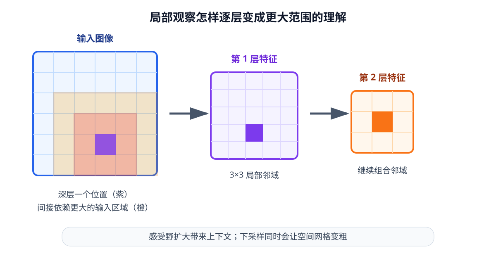
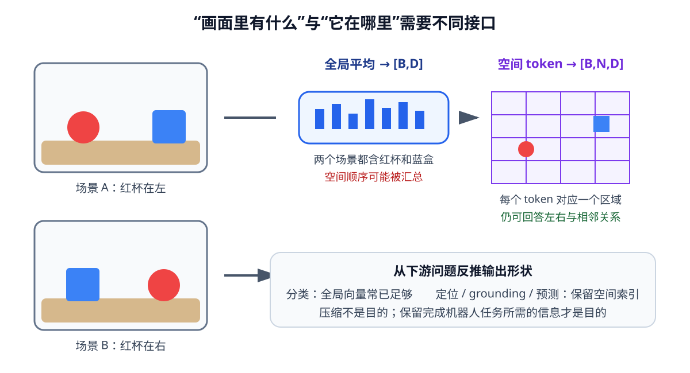

# 03 视觉编码

第 02 章使用了数据集直接提供的“杯子相对末端位置”。这让我们能够专心理解神经网络怎样训练，却绕过了一个真正困难的问题：真实机器人不会天然收到“红色杯子位于右前方 12 厘米”这样的答案，相机只会给出一张由数字组成的图像。

本章从相机图像开始，建立第一条视觉处理链路。我们会先理解像素怎样组成张量，再用卷积提取局部模式，用多层网络把边缘逐步组合成物体特征，最后比较全局向量、空间特征图和视觉 token 分别保留了什么信息。配套实验会让一个小型卷积神经网络从人工桌面图像中预测红色杯子的二维位置。

这里的目标不是记住某个视觉模型的名称，而是能回答三个更基础的问题：视觉编码器的输入和输出是什么；空间尺寸为什么会在网络中变化；一个适合图片分类的特征，为什么未必适合机器人抓取。

学完本章后，你应当能够：

- 把 RGB 图像正确整理成 $[B,C,H,W]$ 张量，并说明缩放、裁剪、归一化和数据增强会改变什么；
- 根据卷积核、步幅和填充计算输出尺寸，并解释感受野怎样随网络加深而扩大；
- 区分全局向量、空间特征图和 patch token，判断下游任务需要哪一种表示；
- 说明从头训练、冻结预训练编码器和微调编码器的差异；
- 写出一个最小 CNN，并检查它是否真的保留了物体位置。

## 1. 相机给模型的只是像素

### 一张彩色图像是三层数值网格

RGB 图像由红、绿、蓝三个通道组成。若图像高为 $H$、宽为 $W$，单张图像常以 $[H,W,3]$ 保存；进入 PyTorch 模型前通常重排为

$$
I_t\in\mathbb R^{3\times H\times W}.
$$

一个 batch 中有 $B$ 张图像时，输入形状为 $[B,3,H,W]$。这四个维度依次表示样本、通道、垂直位置和水平位置。不能只看数组包含多少个数字，还要确认每一维的语义。

相机常把通道值保存为 $0$ 到 $255$ 的整数。神经网络通常先把它变成浮点数，并缩放到 $[0,1]$：

$$
I'=\frac{I}{255}.
$$

若使用预训练编码器，还常按通道减去训练时的均值 $\mu_c$、除以标准差 $\sigma_c$：

$$
\tilde I_{c,h,w}=\frac{I'_{c,h,w}-\mu_c}{\sigma_c}.
$$

这里的均值和标准差不是随意装饰。预训练模型是在特定输入分布上学到参数的，推理时必须复用相同预处理。RGB 与 BGR 顺序颠倒、忘记除以 255、重复归一化，都会让形状正确的张量具有错误含义。

| 阶段 | 常见形状 | 数值范围示例 | 需要记录的约定 |
|---|---:|---:|---|
| 相机或图片文件 | $[H,W,3]$ | 整数 $[0,255]$ | RGB/BGR、颜色空间 |
| 转为模型张量 | $[3,H,W]$ | 浮点数 $[0,1]$ | 通道顺序、数据类型 |
| 组成 batch | $[B,3,H,W]$ | 归一化后可含负数 | 均值、标准差、目标分辨率 |

### 改变图像尺寸不是无损操作

编码器通常要求固定输入尺寸，因此需要缩放（resize）、裁剪（crop）或填充（padding）。三者对机器人任务的影响不同：

- 直接缩放到固定宽高可能改变物体长宽比例；
- 中心裁剪可能把机械臂末端或桌边目标裁掉；
- 保持比例再填充会保留完整视野，但新增区域不属于真实画面；
- 随机裁剪适合增加训练变化，却必须同步更新关键点、边界框等位置标签。

分类任务只需判断“图中有没有杯子”，偶尔裁掉一部分背景可能无妨。抓取任务却需要知道杯子在哪里；任何几何变换都必须同时作用于图像和位置标注。视觉预处理不是独立于任务的清洁步骤，它定义了模型实际看到的坐标系。

数据增强（data augmentation）是在训练时主动制造合理变化。例如亮度扰动帮助模型减少对固定光照的依赖，轻微平移帮助模型看到不同位置的杯子。但“合理”取决于任务。水平翻转后，图像中的左和右互换，目标坐标与动作也必须一同翻转；若只翻转图像，训练样本就自相矛盾。

## 2. 卷积从局部邻域提取模式

### 同一个小型滤波器在整张图上滑动

全连接层若直接处理一张 $224\times224$ 的 RGB 图像，仅输入就有 150528 个数，还会忽略像素之间的二维邻近关系。卷积（convolution）利用了图像的局部结构：一个小卷积核在所有位置重复使用同一组权重，观察相邻像素怎样组合。

忽略边界和 batch 后，二维卷积可以写成

$$
Y_{c_o,h,w}=b_{c_o}+
\sum_{c_i=1}^{C_{\mathrm{in}}}
\sum_{u=0}^{K_h-1}\sum_{v=0}^{K_w-1}
K_{c_o,c_i,u,v}\,
X_{c_i,hS_h+u-P_h,wS_w+v-P_w}.
$$

$X$ 是输入，$K$ 是可学习卷积核，$Y$ 是输出特征图；$c_i$ 和 $c_o$ 分别索引输入、输出通道；$S$ 是步幅（stride），$P$ 是填充（padding）。公式看起来较长，实际只做两件事：取当前位置附近的一小块数值，与卷积核逐项相乘并求和；随后把卷积核移动到下一个位置。

~~~mermaid
flowchart LR
    I["RGB 图像 B×3×H×W"] --> C1["3×3 卷积 局部颜色与边缘"]
    C1 --> C2["卷积块 纹理与轮廓"]
    C2 --> C3["更深层特征 物体部件与场景结构"]
    C3 --> Z["视觉表示 B×N×D 或 B×D"]
~~~

一个输出通道对应一组卷积核。浅层卷积核可能对水平边缘、垂直边缘或颜色变化敏感；更深层会组合前一层的结果，形成更复杂的模式。我们可以观察某个通道在哪些位置响应较强，但不应把每个通道机械地命名为唯一概念。

### 输出尺寸由卷积参数共同决定

单个空间维度的输出大小为

$$
H_{\mathrm{out}}
=\left\lfloor
\frac{H_{\mathrm{in}}+2P-D_k(K-1)-1}{S}+1
\right\rfloor,
$$

其中 $D_k$ 是膨胀率（dilation），本章默认 $D_k=1$。例如，$32\times32$ 图像经过 $3\times3$ 卷积，步幅为 1、填充为 1，输出仍是 $32\times32$；若步幅改成 2，输出约为 $16\times16$。

下采样会减少计算并扩大单个特征对应的图像范围，却同时降低位置精度。对“这是什么”而言，较低分辨率可能足够；对“杯沿具体在哪个像素”而言，过早下采样可能丢失关键细节。

### 感受野说明一个特征看见多大区域

某个特征值能够受到输入图像多大范围的影响，这个范围称为感受野（receptive field）。一层 $3\times3$、步幅 1 的卷积只直接查看 $3\times3$ 邻域；连续堆叠两层后，第二层一个位置会间接依赖输入的 $5\times5$ 区域。网络越深，特征通常能够整合越大范围的上下文。

<figure markdown="span">
  { width="1000" loading=lazy }
  <figcaption>图 03-1　局部卷积逐层组合：浅层观察邻近像素，深层特征能够利用更大范围判断当前局部属于哪个物体。（本教程绘制）</figcaption>
</figure>

池化（pooling）也会汇总邻域并降低分辨率。最大池化保留窗口中的最大响应，平均池化保留平均响应。现代 CNN 也常直接使用带步幅卷积完成下采样。无论采用哪种方法，都要意识到：尺寸变小不是单纯压缩文件，而是在计算量、上下文范围和空间精度之间做取舍。

## 3. 多层 CNN 怎样形成视觉表示

### 从边缘到任务相关特征

卷积神经网络（Convolutional Neural Network，CNN）通常重复“卷积—非线性—下采样”的过程。设第 $l$ 层输入为 $X^{(l)}$，一个简化卷积块写成

$$
X^{(l+1)}=\sigma\!\left(\operatorname{Conv}(X^{(l)};K^{(l)})+b^{(l)}\right).
$$

卷积参数不是人工写死的边缘算子，而是通过第 02 章介绍的损失、反向传播和优化器学习出来。若训练目标是预测红色杯子中心，网络会逐渐保留有助于定位红色区域及其轮廓的信息；若目标改成判断场景类别，它可能更愿意丢弃精确位置。

深层网络并非只需不断增加卷积层。层数很多时，模型优化会更困难。残差块（residual block）让新层学习对原表示的修正：

$$
Y=X+F(X).
$$

旁路把 $X$ 直接送到输出，$F(X)$ 只需学习还应补充什么。当尺寸或通道不一致时，旁路还需要投影后才能相加。残差连接不会自动保证网络有效，但它为训练更深的编码器提供了更顺畅的信息和梯度路径。

### 一个尺度通常不能同时服务识别与定位

随着网络下采样，深层特征语义更集中、空间网格更粗；浅层特征位置更精细，却更接近颜色和边缘。特征金字塔（feature pyramid）的思路是同时保留多个尺度，让下游模块按需使用。例如：

| 特征层 | 示例形状 | 更容易保留 | 可能缺少 |
|---|---:|---|---|
| 浅层 | $[B,64,H/2,W/2]$ | 边缘、小物体、精确位置 | 大范围语义 |
| 中层 | $[B,128,H/4,W/4]$ | 轮廓与局部部件 | 完整场景关系 |
| 深层 | $[B,256,H/8,W/8]$ | 物体和场景级信息 | 像素级细节 |

“更深”不等于在所有任务上“更好”。机器人视觉常同时需要物体身份和空间位置，因此编码器接口应允许下游读取空间特征或多个尺度，而不是只暴露最终分类向量。

## 4. 全局向量、特征图与视觉 token

### 同一张图可以被压成不同形状

视觉编码器统一写成

$$
z_t^{\mathrm{vis}}=E_{\mathrm{vis}}(I_t),
$$

但 $z_t^{\mathrm{vis}}$ 的形状决定它保留什么结构。

若 CNN 输出特征图 $F\in\mathbb R^{B\times D\times H'\times W'}$，对空间位置求平均可以得到全局向量：

$$
z_{b,d}^{\mathrm{global}}
=\frac{1}{H'W'}\sum_{h=1}^{H'}\sum_{w=1}^{W'}F_{b,d,h,w}.
$$

结果形状为 $[B,D]$，适合回答整张图的类别或整体属性。代价是原来的二维位置被汇总了。若两个场景包含同样的红杯和蓝杯，只是左右位置互换，全局平均后的表示可能非常接近。

保留 $F$，或将它展平为 $N=H'W'$ 个空间 token，则输出为 $[B,N,D]$。每个 token 对应输入中的一个区域，仍可与空间位置关联。后续 Attention 可以在这些 token 之间读取关系。

<figure markdown="span">
  { width="1040" loading=lazy }
  <figcaption>图 03-2　全局汇总适合表达“画面里有什么”，空间 token 更适合继续回答“它在哪里、与谁相邻”。（本教程绘制）</figcaption>
</figure>

### 图像块也可以直接变成 token

另一条常见路线是把图像切成不重叠的 $P\times P$ 小块（patch）。当 $H$ 和 $W$ 都能被 $P$ 整除时，patch 数量为

$$
N=\frac{H}{P}\frac{W}{P}.
$$

每个 patch 展平为 $3P^2$ 维向量，再经过线性投影得到 $D$ 维 token：

$$
z_i=x_iE+b,\qquad
E\in\mathbb R^{3P^2\times D}.
$$

于是整张图变成 $[B,N,D]$。patch embedding 可以理解为“按固定步幅取图像块，再把每块映射到特征空间”；它也可以由核大小和步幅都为 $P$ 的卷积实现。token 的顺序本身只是一串编号，因此模型通常还需要位置编码说明每块来自哪里。第 09 章会再解释 Transformer 怎样处理这些 token，本章只建立它与图像空间的接口。

| 下游问题 | 更合适的输出 | 原因 |
|---|---|---|
| 场景里是否有杯子 | 全局向量 $[B,D]$ | 只需整图结论 |
| 杯子位于哪里 | 特征图或 token $[B,N,D]$ | 需要保留空间索引 |
| 杯子边界覆盖哪些像素 | 高分辨率特征图 | 需要密集输出 |
| 图像与语言共同推理 | 带位置的视觉 token | 语言可读取不同区域 |

## 5. 用位置预测检验编码器是否保留空间信息

### 训练目标决定表示偏向

为了检验视觉编码器，我们构造人工桌面图像：红色圆形表示目标杯子，蓝色方块和灰色区域表示干扰物。标签不是物体类别，而是红色杯子中心的归一化坐标

$$
y=\left(\frac{u}{W-1},\frac{v}{H-1}\right)\in[0,1]^2.
$$

小型 CNN 接收 $I\in\mathbb R^{B\times3\times H\times W}$，输出预测 $\hat y\in\mathbb R^{B\times2}$，使用均方误差训练：

$$
\mathcal L_{\mathrm{loc}}
=\frac{1}{B}\sum_{i=1}^{B}
\left\|\hat y^{(i)}-y^{(i)}\right\|_2^2.
$$

这个任务刻意简单，却能暴露重要问题。如果网络在训练位置上误差很低、换一个背景就失败，它可能依赖了背景捷径；如果连续下采样后只能给出粗略位置，说明表示的空间分辨率不足；如果全局池化方式让不同位置难以区分，就需要保留空间特征或为读出头提供位置信息。

~~~mermaid
flowchart LR
    I["人工桌面图像 B×3×64×64"] --> E["小型 CNN 编码器"]
    E --> F["空间特征 B×32×16×16"]
    F --> H["位置读出头"]
    H --> P["预测坐标 B×2"]
    P --> L["与真实杯子中心 计算定位损失"]
    L -.反向传播.-> E
~~~

### 编码器与读出头的接口

配套实验使用一个教学用小模型验证形状接口：输入为 $[B,3,64,64]$，编码器输出 $[B,32,16,16]$ 空间特征图，位置读出头输出 $[B,2]$ 归一化坐标。这个接口用于解释视觉表示怎样服务定位，不代表可以直接部署到真实机器人。

!!! example "实现放在 Notebook 中"
    小型 CNN 的模型定义、训练循环、张量形状断言和未见背景验证都放在 [实践 03-02](https://colab.research.google.com/github/qi-robotics/robot-world-model-tutorial/blob/main/colab/basics/03/03-02-train-cnn-for-object-position.ipynb)。正文只保留接口和原理，避免阅读主线被实现细节打断。

`Sigmoid` 只因为标签被定义在 $[0,1]^2$ 中；如果输出米制坐标或允许画面外位置，输出层设计应随数据契约改变。网络返回位置预测和空间特征图，是为了明确区分“编码结果”和“任务读出结果”。

### 从头训练、冻结和微调

真实项目很少只有一种训练策略：

| 方式 | 更新哪些参数 | 适合的起点 | 主要风险 |
|---|---|---|---|
| 从头训练 | 编码器与任务头全部更新 | 数据充足、图像域特殊 | 小数据容易过拟合 |
| 冻结编码器 | 只训练新任务头 | 数据较少、先快速验证 | 旧特征可能丢失机器人所需位置 |
| 部分微调 | 更新高层或适配模块 | 需要适应新场景 | 需选择解冻范围与学习率 |
| 全量微调 | 全部参数继续训练 | 数据与算力较充分 | 可能破坏已有通用能力 |

预训练表示不是自动适配所有机器人任务。若预训练目标只强调分类不变性，它可能主动忽略物体的精确平移；若机器人相机视角、光照和材质与预训练数据差异很大，冻结编码器也可能把域偏移保留下来。选择训练方式前，应先用简单任务检查需要的信息能否从表示中读出。

## 6. 可视化与配套实践

下面的轻量动画展示卷积核怎样在输入网格中读取局部窗口，并在对应位置产生特征响应。可以随时暂停；关闭 JavaScript 时，后面的静态说明仍然完整。

  
静态说明：高亮一个输入局部窗口，逐项乘以卷积核并求和，得到输出特征图中的一个位置；窗口随后按步幅移动。

两份 Notebook 都使用人工数据，不下载外部数据集。第一份使用 NumPy，第二份使用 PyTorch；Google Colab 和本地 `.venv-colab` 均可在 CPU 上运行。

实践 03-01

### 手工完成一次二维卷积

用 NumPy 生成简单桌面图像，手工滑动卷积核，观察边缘特征、步幅、填充和输出尺寸之间的关系。

预计时间：15～20 分钟

实践 03-02

### 训练 CNN 定位红色杯子

生成带干扰物的人工桌面图像，训练小型 CNN 预测杯子中心，并用未见背景与位置检查表示是否真正保留空间信息。

预计时间：20～30 分钟

## 7. 常见误区与失败边界

### 把高维特征当成已经理解世界

编码器输出一千维向量，不代表每个维度都有清晰语义，更不代表遮挡物体、接触关系和三维位置已经自动恢复。特征只是根据训练目标形成的中间表示，是否有用必须由具体下游任务检验。

### 认为数据增强越强越好

增强必须保持任务标签一致。颜色是目标身份线索时，过强颜色扰动会改变任务；预测左右位置时，翻转图像却不翻转标签会直接制造错误样本；裁剪掉目标后仍保留原坐标同样不成立。

### 只看分类准确率选择机器人编码器

分类准确率检验“是什么”，无法单独证明表示保留了“在哪里”。机器人还关心小物体、手眼遮挡、精确边界和视角变化。应增加定位、关键点或控制相关的探针任务，并在真实相机分布上检查。

### 把特征图索引直接当成原图像素

下采样、填充和裁剪都会改变特征位置与原图坐标的对应关系。若要从特征图恢复像素位置，必须记录完整预处理和网络步幅，不能简单把索引乘一个固定数字后就默认准确。

### 视觉本身不能消除不可观测性

单张 RGB 图像无法可靠给出所有三维距离，也看不见被遮挡区域。更大的模型可以利用统计规律猜测，却不能把猜测等同于测量。历史、多视角、深度和触觉会在后续章节补充这些信息。

## 8. 它在机器人世界模型中的位置

视觉编码器位于原始相机观测和后续多模态模型之间：

$$
I_t\xrightarrow{E_{\mathrm{vis}}}z_t^{\mathrm{vis}}.
$$

第 04 章将继续讨论监督、重建、对比和预测等学习目标怎样塑造 $z_t^{\mathrm{vis}}$。世界模型不会绕过编码器直接理解现实；它预测的潜状态是否包含物体、位置和变化线索，很大程度上受视觉接口影响。

选择输出形状时，应从下游问题反推。如果只需快速判断场景类别，全局向量简单高效；若要把语言中的“红色杯子”落到某个区域，或预测动作后每个物体怎样移动，就应保留空间 token 或特征图。编码器不是越压缩越好，而是要在压缩中保留完成任务所需的信息。

## 9. 本章小结

图像进入模型前首先是一组带有通道、空间位置和数值约定的张量。归一化、缩放、裁剪和增强都会改变输入分布，其中涉及位置的变换必须与标签同步。卷积使用共享的小型滤波器提取局部模式，多层 CNN 逐步扩大感受野并形成层级特征；步幅和池化降低计算量，也会损失空间精度。

视觉编码器可以输出全局向量、空间特征图或 patch token。全局向量适合整图结论，空间表示更适合定位、语言 grounding 和未来预测。训练目标会塑造编码器保留什么，因此预训练分类特征不能未经检验就当成机器人状态。通过人工杯子定位任务，我们得到了一条可运行的最小链路：图像 → CNN 特征图 → 二维位置。

然而，得到视觉特征不等于得到了适合机器人任务的表征。同一套网络在分类、重建、对比或预测目标下会保留不同信息。下一章将从训练目标出发，讨论编码器怎样学到更有用的视觉特征。

## 下一章

[04 视觉表征学习：编码器怎样学到有用特征](04-visual-representation-learning.md)
