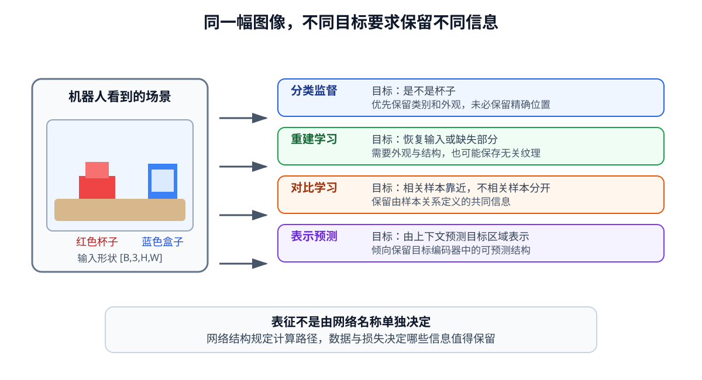
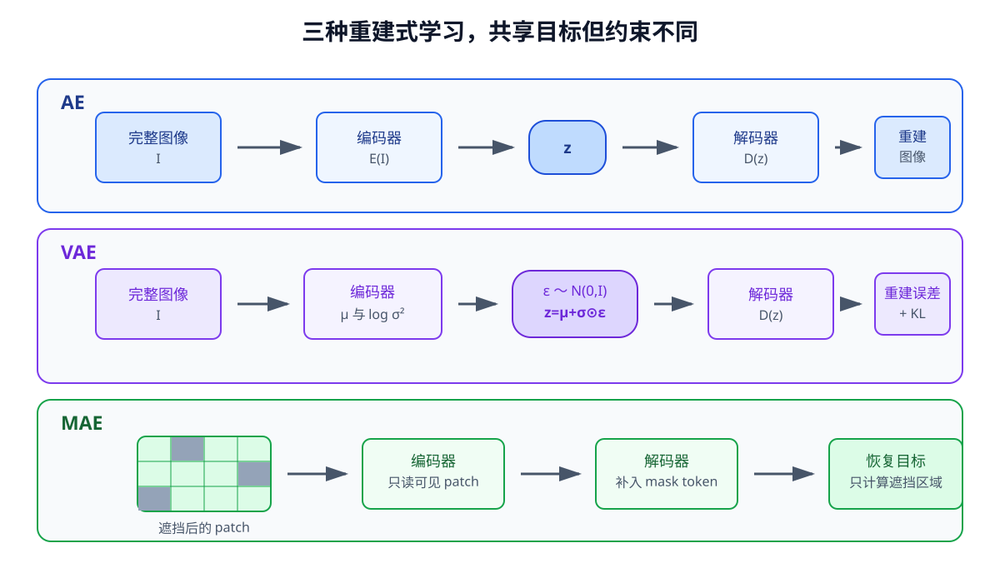
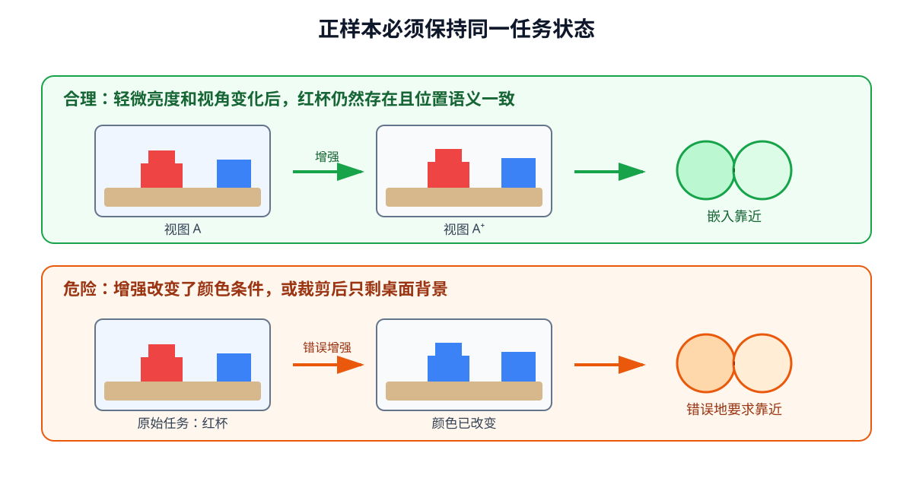
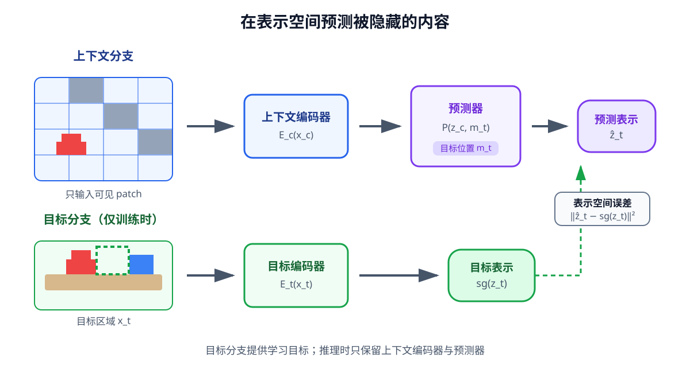

# 04 视觉表征学习

第 03 章说明了图像怎样经过卷积网络变成全局向量、空间特征图或视觉 token。在杯子定位实验中，编码器之所以逐渐保留物体位置，是因为训练目标不断要求它减小位置预测误差。若把同一套网络改成背景分类器，它也许会学会区分桌布颜色，却不再关心杯子位于左侧还是右侧。

这说明“能够编码图像”和“得到适合机器人任务的视觉特征”不是同一件事。表征（representation）是模型对输入形成的内部数值描述；网络结构规定信息怎样流动，数据和训练目标则共同决定哪些信息被保留、哪些变化被忽略。本章继续使用桌面操作任务，比较监督、重建、对比和预测四类学习目标，并讨论怎样检查一种视觉表征是否真正保留了对象语义、空间位置和后续预测需要的线索。

学完本章后，你应当能够：

- 解释为什么同一个视觉编码器在不同训练目标下会形成不同表征；
- 说明 AE、VAE 与 MAE 的输入、潜在表示、重建目标和主要差异；
- 解释 VAE 为什么输出分布参数，以及重参数化在训练中的作用；
- 说明对比学习中的正样本、负样本、相似度和数据增强分别影响什么；
- 区分像素重建与 JEPA 式表示预测；
- 通过简单任务、分布变化和嵌入统计判断表征是否保留了机器人需要的信息。

## 1. 训练目标决定编码器努力保留什么

### 特征维度相同，不代表含义相同

设视觉编码器把图像 $I$ 转换为 $D$ 维向量：

$$
z^{\mathrm{vis}}=E_\theta(I),
\qquad z^{\mathrm{vis}}\in\mathbb R^D.
$$

只看 $z^{\mathrm{vis}}$ 的形状，无法知道它是否记录了杯子的颜色、类别、位置、朝向或背景纹理。真正改变参数的是训练损失。若编码器后面连接分类头，损失只要求网络分清类别；若连接位置预测头，损失就要求表示保留空间线索；若要求恢复整张图像，表示还要支持纹理、光照和背景的重建。

<figure markdown>
  { width="1120" loading=lazy }
  <figcaption>图 04-1　网络看到相同图像时，分类、重建、对比和预测目标提出的要求不同，得到的视觉表征也不会自动等价。（本教程绘制）</figcaption>
</figure>

以“把红色杯子放进盒子”为例，下面几种训练目标关注的内容并不相同：

| 训练目标 | 模型必须保留 | 可能忽略 |
|---|---|---|
| 判断是否出现杯子 | 类别或外观线索 | 精确位置、朝向 |
| 预测杯子中心 | 对象与空间位置 | 无关背景细节 |
| 恢复整张图像 | 足以重建输入的内容 | 哪些内容与任务更相关 |
| 区分相关和不相关观测 | 样本之间的相似关系 | 被数据增强视为无关的变化 |
| 预测被遮挡区域的表示 | 上下文中可预测的结构 | 难以预测或目标编码器未保留的细节 |

因此，不存在脱离任务的“最好表征”。机器人视觉通常同时需要语义和几何：它既要知道哪个对象是杯子，也要保留杯子在哪里、是否被遮挡，以及哪些变化可能由动作引起。判断一种表征是否有用，必须回到这些实际问题，而不能只看编码向量的维度或训练损失。

### 监督目标提供明确方向，也可能诱导捷径

最直接的做法是用人工标签训练编码器。类别标签、二维位置、分割掩码和姿态标签都能明确告诉网络什么是正确答案。例如，杯子位置预测可以写成

$$
\hat p=H_\phi(E_\theta(I)),
\qquad
\mathcal L_{\mathrm{pos}}=\|\hat p-p\|_2^2,
$$

其中 $E_\theta$ 是编码器，$H_\phi$ 是把视觉特征转换为二维位置的读出头。损失通过读出头继续传回编码器，使视觉特征逐渐包含位置相关信息。

监督学习的问题不只在于标注成本。若训练集中红杯总出现在深色桌面、蓝杯总出现在浅色桌面，网络可能利用背景完成分类。此时训练准确率很高，但更换桌布后就会失败。模型并不知道“杯子”比“桌布”更值得关注，它只会寻找能够降低当前损失的规律。

检查这种捷径，不能只随机抽取相邻图片作为验证集。更有效的做法是专门改变背景、光照、物体位置和相机角度，观察编码器是否仍然支持同一个任务。这也是后面评价自监督表征时应当保持的原则。

## 2. 通过重建输入学习表征

机器人会积累大量没有类别、位置或抓取标签的图像。重建式学习不要求人工逐帧标注，而是从输入本身构造目标：编码器先把图像变成潜在表示，解码器再尝试恢复原输入或其中缺失的部分。

### 自编码器把信息压进瓶颈

自编码器（Autoencoder，AE）由编码器和解码器组成：

$$
z=E_\theta(I),
\qquad
\hat I=D_\phi(z).
$$

若输入图像形状是 $[B,3,H,W]$，编码器可以输出 $[B,D]$ 的全局潜在向量，也可以输出较低分辨率的空间特征 $[B,C',H',W']$。解码器再把潜在表示恢复成与输入相同形状的图像。最简单的训练目标是像素均方误差：

$$
\mathcal L_{\mathrm{AE}}
=\frac{1}{BCHW}\sum_{b,c,h,w}
\left(\hat I_{b,c,h,w}-I_{b,c,h,w}\right)^2.
$$

当潜在表示比输入紧凑时，模型不能逐像素直接复制，只能寻找有助于恢复图像的结构。但“瓶颈较窄”并不保证潜在向量会自动对应对象、位置或物理状态。只要解码器能够降低重建误差，编码器就可能把背景纹理、光照变化和传感器噪声也写入 $z$。

解码器能力同样会影响结果。解码器过弱时，即使编码器保存了信息，也可能无法还原；解码器过强时，又可能依赖自身结构完成局部补全，使潜在表示不必承担预期的信息。重建结果模糊或清晰，都不能单独证明 $z$ 是否适合控制。

### VAE 把单个潜在点改成条件分布

普通 AE 为一张图像输出一个确定的潜在向量。变分自编码器（Variational Autoencoder，VAE）则输出潜在分布的参数。常见设定是对角高斯分布：

$$
q_\theta(z\mid I)
=\mathcal N\!\left(
\mu_\theta(I),
\operatorname{diag}\bigl(\sigma_\theta^2(I)\bigr)
\right).
$$

编码器实际输出均值 $\mu$ 和对数方差 $\log\sigma^2$，二者形状通常都是 $[B,D]$。直接从这个分布采样会把随机操作夹在计算图中，不便于把重建误差传回编码器。重参数化把采样写成

$$
\epsilon\sim\mathcal N(0,I),
\qquad
z=\mu+\sigma\odot\epsilon.
$$

随机性集中在与参数无关的 $\epsilon$ 中，$\mu$ 和 $\sigma$ 仍然参与普通的可微计算。解码器接收采样后的 $z$ 并恢复图像。

VAE 的损失同时包含重建项和分布正则：

$$
\mathcal L_{\mathrm{VAE}}
=\mathcal L_{\mathrm{recon}}
+\beta D_{\mathrm{KL}}
\left(q_\theta(z\mid I)\,\|\,p(z)\right).
$$

重建项要求 $z$ 保留输入信息，KL 项则让不同样本的后验分布不要任意散落，通常把它们约束到标准高斯先验 $p(z)=\mathcal N(0,I)$ 附近。这样得到的潜空间更便于采样和插值，也为后续随机潜状态模型提供了概率接口。

两项之间存在真实的取舍。$\beta$ 太小，VAE 可能接近普通 AE，潜空间缺少连续约束；$\beta$ 太大，编码器可能让 $q(z\mid I)$ 过度接近先验，导致不同输入得到相似潜变量，解码器很少利用 $z$。这种现象常被称为后验坍缩。它不能只靠观察总损失判断，还要分别检查重建项、KL 项以及潜在维度是否随输入变化。

VAE 输出分布也不代表它已经正确描述现实世界中的全部不确定性。后验形式、训练数据和损失假设共同限制了这个分布能够表达什么；在机器人系统中仍需检查潜变量是否保留位置、接触和任务进展等控制相关信息。

### MAE 只恢复被遮挡的图像块

掩码自编码器（Masked Autoencoder，MAE）先把图像切分为 patch，再随机遮挡其中一部分。编码器只处理可见 patch，解码器接收可见表示和掩码位置，预测被遮挡的内容。

设图像被划分为 $N$ 个 patch，掩码集合为 $\mathcal M$，则一种简化的重建目标为

$$
\mathcal L_{\mathrm{MAE}}
=\frac{1}{|\mathcal M|}
\sum_{i\in\mathcal M}
\|\hat x_i-x_i\|_2^2.
$$

因为编码器看不到目标 patch，它必须利用周围区域推断缺失内容。对于桌面场景，这可能要求模型利用物体边界、桌面结构和上下文关系，而不是逐像素复制。不过，恢复像素依然会奖励颜色、纹理等可见细节；模型学到的结构是否适合定位和控制，仍然需要单独验证。

<figure markdown>
  { width="1160" loading=lazy }
  <figcaption>图 04-2　AE 压缩完整输入，VAE 在潜空间中引入分布和采样，MAE 则从可见 patch 恢复被遮挡部分。三者都使用重建信号，但潜在表示和训练约束不同。（本教程绘制）</figcaption>
</figure>

三种方法可以用同一组问题区分：

| 方法 | 编码器看到什么 | 潜在变量 | 解码目标 | 主要检查项 |
|---|---|---|---|---|
| AE | 完整输入 | 确定向量或特征图 | 完整输入 | 瓶颈是否保留任务信息 |
| VAE | 完整输入 | 条件分布中的样本 | 完整输入 | 重建、KL 与潜变量使用情况 |
| MAE | 可见 patch | 可见区域的表示 | 被遮挡 patch | 遮挡比例和空间结构是否合理 |

## 3. 通过样本关系学习表征

重建要求模型解释输入中的大量细节，但机器人往往更关心“两个观测是否表达相同对象或相近状态”。对比学习直接利用样本之间的关系塑造嵌入空间：相关观测靠近，不相关观测分开。

### 正样本定义了应该忽略哪些变化

对一张图像进行两次随机增强，可以得到 $I_i$ 和 $I_i^+$。它们经过同一个编码器和投影头，得到归一化嵌入 $z_i$ 与 $z_i^+$。同一原始图像的两个视图通常被当作正样本，batch 中其他图像则可以作为对比项。常用余弦相似度为

$$
\operatorname{sim}(z_i,z_j)
=\frac{z_i^{\mathsf T}z_j}{\|z_i\|_2\|z_j\|_2}.
$$

一类对比损失可以写成

$$
\mathcal L_i
=-\log
\frac{
\exp\bigl(\operatorname{sim}(z_i,z_i^+)/\tau\bigr)
}{
\sum_j\exp\bigl(\operatorname{sim}(z_i,z_j)/\tau\bigr)
},
$$

其中温度 $\tau$ 控制相似度差异在 Softmax 中被放大的程度。分母中的其他样本并不天然等于语义上的“负类别”：两个不同时间拍到的红杯可能被放进分母，但它们仍可能共享大量语义。batch 的构成会直接影响模型学到的边界。

更关键的是，正样本定义了哪些变化应当被忽略。若两次裁剪仍包含同一杯子，模型会学习对裁剪和轻微视角变化保持稳定；若颜色增强把红杯改成蓝色，而任务指令依赖颜色，模型可能把本来重要的颜色当成无关因素；若裁剪删掉杯子只保留桌面，两个视图甚至不再表达相同对象。

<figure markdown>
  { width="1120" loading=lazy }
  <figcaption>图 04-3　正样本不是由增强名称决定，而是由增强后的两个视图是否仍表达同一任务状态决定。颜色、裁剪和时间间隔都要结合机器人任务检查。（本教程绘制）</figcaption>
</figure>

### 拉近和推远不是最终任务

对比损失能够建立可比较的嵌入空间，却不保证其中自动保留三维位置、速度或接触状态。若训练只区分对象类别，同一个杯子位于桌面左侧和右侧的图像可能非常接近；这对图像检索有利，却可能不足以决定机械臂移动方向。

还要警惕表征坍缩：若所有输入都映射到相同向量，模型就失去了区分能力。使用负样本、停止梯度、目标编码器或显式维度方差约束，都是阻止坍缩的不同思路。检查时应直接观察不同样本的嵌入方差和两两相似度，而不是因为训练过程没有报错就默认表示有效。

第 05 章会把这种“相关样本靠近”的思想用于图像—语言对齐。本章先保留视觉内部的重点：对比学习得到的是由样本关系定义的视觉空间，不是完整的场景状态。

## 4. 在表示空间预测缺失内容

像素重建要求模型恢复目标区域的颜色和纹理。联合嵌入预测架构（Joint-Embedding Predictive Architecture，JEPA）采用另一种目标：不预测目标像素，而是根据上下文表示预测目标区域的表示。

### 预测目标表示而不是目标像素

设 $x_c$ 是图像中的可见上下文，$x_t$ 是被选作预测目标的区域。上下文编码器产生 $z_c$，目标编码器产生 $z_t$，预测器根据上下文和目标位置得到 $\hat z_t$：

$$
z_c=E_c(x_c),
\qquad
z_t=E_t(x_t),
\qquad
\hat z_t=P_\theta(z_c,m_t).
$$

$m_t$ 描述目标区域的位置或掩码。训练时让预测表示接近目标表示：

$$
\mathcal L_{\mathrm{JEPA}}
=\|\hat z_t-\operatorname{sg}(z_t)\|_2^2.
$$

$\operatorname{sg}$ 表示停止梯度：目标分支提供学习目标，但当前损失不直接通过目标表示反向修改该分支。实际系统还可以缓慢更新目标编码器，使目标不会和预测器同时快速移动。这里的关键不是某一种更新规则，而是目标表示必须提供相对稳定、又不坍缩的学习信号。

<figure markdown>
  { width="1120" loading=lazy }
  <figcaption>图 04-4　上下文编码器读取可见区域，预测器结合目标位置产生预测表示；目标编码器只在训练时提供目标表示。模型比较的是表示，而不是逐像素恢复图像。（本教程绘制）</figcaption>
</figure>

若目标编码器忽略了微小纹理，预测器也不必恢复这些纹理；这使学习目标有机会集中在更稳定、可预测的结构上。但“预测表示”不必然优于“重建像素”。目标编码器保留什么、上下文和目标怎样选取、如何避免全部表示相同，都会决定最终结果。

### JEPA 还不是完整的机器人世界模型

图像级 JEPA 说明上下文表示可以预测目标表示，但它通常没有同时回答：机器人执行某个动作后，物体会怎样移动？要成为动作条件世界模型，预测还需要显式接收动作，处理时间，并在多步展开时保持一致：

$$
\hat z_{t+1}=F_\phi(z_t,a_t).
$$

因此，本章中的 JEPA 是预测式表征学习的入口。后续课程会把“根据可见区域预测隐藏表示”扩展为“根据历史和候选动作预测未来表示”。

## 5. 怎样判断表征是否真的有用

不同方法的训练损失不能直接横向比较。AE 的像素误差、VAE 的 KL 项、对比损失和 JEPA 的表示误差衡量的是不同问题。即使某个损失继续下降，也不能推出抓取成功率一定提高。

### 用简单任务读取表征中的信息

一种直接检查方法是先冻结编码器，只训练一个结构简单的读出头。例如：

- 根据 $z$ 判断目标是不是红色杯子；
- 根据空间特征预测杯子的二维中心；
- 根据相邻两帧的表示判断物体向左还是向右移动；
- 根据表示判断夹爪前方是否被物体遮挡。

若简单读出头就能完成任务，说明相应信息较容易从表征中读取；若必须使用很深的网络才能恢复，信息可能没有以稳定方式保留。这个检查仍然不是最终结论，因为读出任务本身也可能过于简单或存在数据捷径，但它比只看预训练损失更接近机器人需求。

### 在有控制的变化下检查稳定性

表征既不能对所有变化都敏感，也不能对所有变化都不变。评价时应分别改变：

| 变化 | 期望表现 |
|---|---|
| 轻微亮度或传感器噪声 | 表征基本稳定 |
| 背景和桌面纹理 | 不应主导对象判断 |
| 杯子颜色 | 当语言依赖颜色时必须保留 |
| 杯子位置和朝向 | 操作任务通常需要保留 |
| 遮挡范围 | 应反映可见证据减少，而不是给出虚假确定性 |
| 连续时间中的运动 | 应支持读取方向或变化趋势 |

还应检查训练数据之外的组合，例如训练时未出现的颜色—位置组合。如果编码器只记住“红杯总在左侧”，它在普通随机验证中可能表现良好，却无法支持新的任务组合。

### 检查坍缩和无效维度

对一个 batch 的嵌入 $Z\in\mathbb R^{B\times D}$，可以观察每个维度的标准差、样本之间的相似度分布以及有效变化方向。若所有样本几乎相同，或只有极少数维度发生变化，表征可能已经坍缩或严重退化。

这些统计量只能发现症状，不能独自说明语义。一个稳定但只编码背景的表示仍然没有用途，因此数值检查必须和位置预测、对象识别、遮挡判断等具体任务结合。

## 6. 把视觉表征接入后续模型

经过预训练后，视觉编码器通常有三种使用方式：保持参数冻结，只训练后续模块；只调整部分层或轻量适配参数；与后续模型一起端到端训练。第 03 章已经说明了三者的基本取舍，本章进一步强调：选择方式必须与数据规模和任务差异相匹配。

无论采用哪种方式，都需要把视觉接口写清楚：

| 接口项 | 示例 | 为什么必须记录 |
|---|---|---|
| 输入尺寸与归一化 | $[B,3,H,W]$ | 与预训练分布保持一致 |
| 输出形式 | $[B,D]$ 或 $[B,N,D]$ | 决定是否保留空间索引 |
| patch 或特征图分辨率 | $N$ 或 $H'\times W'$ | 决定定位精度和计算量 |
| 编码器是否冻结 | 冻结、部分调整、端到端 | 决定训练成本和分布漂移 |
| 训练目标 | 分类、重建、对比、预测 | 说明表征偏向的信息 |
| 缺失和遮挡处理 | mask、无效区域 | 避免模型把填充值当真实观测 |

在后续系统中，全局视觉向量可以提供场景概括，空间 token 则更适合与语言中的对象词对齐、保留目标位置，并参与未来预测。模型不必只保留一种输出，但每种输出都应有明确用途，不能因为维度更高就默认信息更完整。

## 7. 配套实践

下面两份 Notebook 都使用程序生成的轻量图像，不下载外部数据集。第一份比较三类重建目标，第二份比较样本关系与表示预测；Google Colab 和本地 `.venv-colab` 均可在 CPU 上运行。

实践 04-01

### 比较 AE、VAE 与 MAE 的视觉表征

在同一组人工桌面图像上训练三种模型，比较训练目标、单张重建和冻结表示的位置读取误差。

预计时间：20～30 分钟

实践 04-02

### 比较对比式与预测式视觉表征

让同一场景在不同背景下形成成对视图，检查跨背景相似度、位置读取误差，以及表示是否出现坍缩迹象。

预计时间：20～30 分钟

## 8. 常见误区与失败边界

### 重建清晰就代表表征适合控制

像素重建会奖励所有能够降低图像误差的细节，背景和纹理可能比小型操作目标贡献更多像素。必须通过位置、接触、变化趋势等任务检查控制相关信息。

### VAE 的方差就是现实世界的不确定性

VAE 的后验方差受到模型假设、先验和损失权重影响。它是模型内部的概率参数，不会自动等同于传感器误差或未来结果的不确定性。

### 数据增强越强越好

增强定义了模型应忽略的变化。对颜色条件任务使用强烈颜色变化，或裁剪掉被操作对象，都会破坏正样本的任务语义。

### 嵌入聚类明显就说明模型理解了场景

聚类可能来自背景、相机或采集批次。只有在有控制的数据划分和实际任务读取中，才能判断聚类是否对应对象、位置或动作相关因素。

### JEPA 已经等于世界模型

预测隐藏区域的表示只建立了预测式学习接口。世界模型还需要时间、动作条件、多步展开以及对不同未来的表达。

## 9. 本章小结

视觉编码器的输出形状只说明数据接口，训练目标才决定表征努力保留什么。监督学习提供明确任务信号，也可能利用背景捷径；AE、VAE 与 MAE 从输入本身构造重建目标，其中 VAE 用概率潜变量和 KL 正则组织潜空间，MAE 则从可见 patch 恢复缺失区域。

对比学习通过样本关系建立可比较的嵌入空间，正样本和数据增强决定模型应当忽略哪些变化。JEPA 式方法在表示空间预测目标区域，为后续预测未来表示提供入口，但它还不是动作条件世界模型。

判断表征是否有用，不能只看预训练损失、重建清晰度或嵌入图。应冻结编码器并训练简单读出头，在背景、位置、颜色和遮挡等有控制的变化下检查任务信息，同时观察表征是否坍缩。下一章将把自然语言转换成任务表示，并进一步说明图文语义怎样建立对应。

## 下一章

[05 语言编码：从自然语言到任务表示](05-language-encoding.md)
