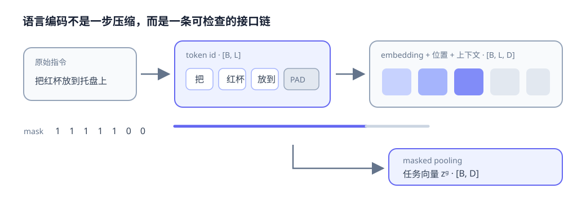
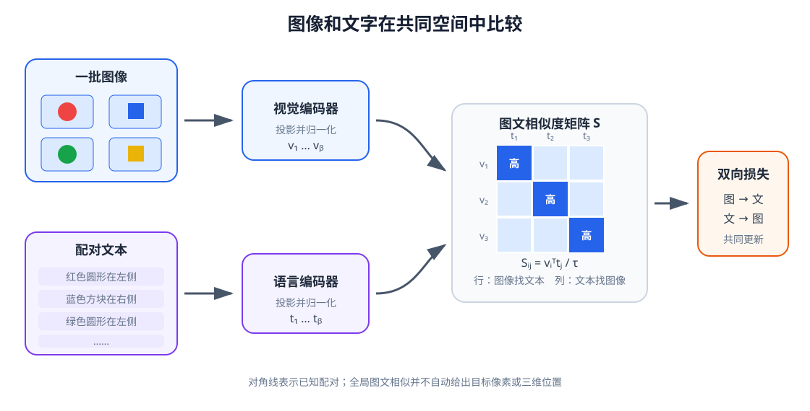

# 05 语言编码：从自然语言到任务表示

第 04 章讨论了编码器怎样从图像中学到更有用的表征，但视觉信息本身仍没有回答“应该处理哪个物体、把它放到哪里”。同一个桌面场景，听到“拿起红杯子”和“把蓝杯子推到托盘旁边”，需要产生完全不同的任务目标。语言正是把人的意图接入机器人系统的一种接口。

本章沿着一条完整但尽量简单的链路前进：先把字符串切成 token，再把离散 token 变成连续向量，随后处理长度不同的 batch，最后讨论怎样从指令中保留对象、属性、关系和动作。重点不是让机器人背诵一句话，而是把语言整理成可以和视觉、本体状态及动作连接的数据契约。

学完本章后，你应当能够：

- 区分字符、词和子词切分，说明词表与未知词问题；
- 写出 token id、embedding、位置编码、padding 和 mask 的形状；
- 区分词袋、静态词向量、上下文 token 表示和句子向量；
- 从机器人指令中识别动作、对象、属性、空间关系和目标位置；
- 解释语言目标为什么不等于可验证的任务成功条件；
- 选择冻结、轻量适配或微调预训练语言编码器的基本策略。

## 1. 模型不能直接计算一句话

### 从字符串到 token

人看到“把红色杯子放到托盘上”时，会自然地联系到动作、物体和空间关系。模型最初拿到的却只是一串字符。分词器（tokenizer）负责把字符串切成离散单元，并把每个单元映射成整数编号：

$$
\text{text}\xrightarrow{\text{tokenize}}
(w_1,w_2,\ldots,w_L),\qquad w_i\in\{0,\ldots,V-1\}.
$$

$L$ 是当前序列长度，$V$ 是词表大小。整数编号只是查表地址，不具有“编号越接近、意思越相似”的含义。常见切分粒度如下：

| 粒度 | 示例 | 优点 | 主要问题 |
|---|---|---|---|
| 字符 | 把 / 红 / 杯 / 子 | 词表小，几乎没有未登录词 | 序列长，单个字符语义弱 |
| 词 | 把 / 红色 / 杯子 | 单元直观，序列较短 | 新词、错别字和组合词难处理 |
| 子词 | 把 / 红 / 色 / 杯子 | 在词表大小与泛化之间折中 | 切分结果未必符合人的词边界 |

现代预训练模型通常使用子词切分。高频词可以保留为一个 token，少见词会被拆成可复用片段。这样遇到“深蓝色马克杯”之类训练中较少出现的组合时，模型仍可能借助已有片段表示它，而不是把整个词直接变成未知符号。

tokenizer 是模型接口的一部分。更换词表、大小写规则或特殊 token 后，即使文本看起来相同，输入编号也会改变。使用预训练编码器时必须配套使用它训练时的 tokenizer。

### 特殊 token 也有明确职责

实际序列常包含若干特殊符号：

- `[BOS]` 或 `[CLS]` 表示序列开始或承担整句汇总位置；
- `[EOS]` 或 `[SEP]` 表示序列结束或分隔两个片段；
- `[PAD]` 用于补齐 batch 中的短序列；
- `[UNK]` 表示词表无法覆盖的单元。

这些符号不是自然语言内容，却会影响注意力、池化和损失计算。尤其是 `[PAD]`，它只是为了对齐形状，不能被当成真实词参与句子含义。

## 2. token id 怎样变成连续向量

### embedding 是一张可学习的查找表

神经网络不能从 token id 的数值大小推断语义。设词嵌入矩阵

$$
W_{\mathrm{emb}}\in\mathbb R^{V\times D},
$$

第 $i$ 个 token 的向量通过查表得到：

$$
e_i=W_{\mathrm{emb}}[w_i]+p_i.
$$

$W_{\mathrm{emb}}[w_i]\in\mathbb R^D$ 是词向量，$p_i\in\mathbb R^D$ 是位置编码。一个 batch 的 token id 形状为 $[B,L]$，查表后变成 $[B,L,D]$。训练会调整嵌入矩阵，使对任务有类似作用的 token 逐渐形成可利用的几何关系。

位置编码不可随意省略。“把杯子放到盘子上”和“把盘子放到杯子上”包含相似 token，却不是同一个任务。只知道有哪些词，不知道它们出现的顺序，模型就难以区分操作对象、目标对象和空间关系。

### 位置可以用固定规律或学习得到

位置编码可以是一张可学习表，也可以使用固定正弦函数。经典正弦位置编码的一组维度写成

$$
p_{i,2k}=\sin\left(i/10000^{2k/D}\right),\qquad
p_{i,2k+1}=\cos\left(i/10000^{2k/D}\right).
$$

本章只需理解它为每个位置提供不同向量。第 09 章讨论 Transformer 时会进一步说明位置与 Attention 的关系。无论采用何种方式，模型都需要某种线索判断 token 顺序；否则输入更接近一个无序集合。

## 3. 长度不同的指令怎样组成 batch

真实指令长度不同。为了并行计算，通常把同一个 batch 补到统一长度 $L_{\max}$。例如：

| 原指令 | 补齐后的 token | mask |
|---|---|---|
| 拿起红杯 | `[拿起, 红, 杯, PAD, PAD]` | $[1,1,1,0,0]$ |
| 把蓝杯放到托盘 | `[把, 蓝, 杯, 放到, 托盘]` | $[1,1,1,1,1]$ |

令 mask 为 $m\in\{0,1\}^{B\times L}$。如果要把 token 表示 $Z^{\mathrm{lang}}\in\mathbb R^{B\times L\times D}$ 汇总成句子向量，可以使用带 mask 的平均池化：

$$
z_g=\operatorname{Pool}(Z^{\mathrm{lang}},m)
=\frac{\sum_{i=1}^{L}m_i z_i}{\sum_{i=1}^{L}m_i}.
$$

分母只统计真实 token。若直接对全部位置平均，短句会混入更多 `[PAD]` 向量；如果 padding 数量与标签偶然相关，模型甚至可能利用长度捷径，而不是理解指令。

典型形状如下：

| 名称 | 符号 | 形状 | 含义 |
|---|---|---:|---|
| token id | $w$ | $[B,L]$ | 离散词表索引 |
| 有效位 mask | $m$ | $[B,L]$ | 1 为真实 token，0 为 padding |
| token embedding | $E$ | $[B,L,D]$ | 查表并加入位置后的表示 |
| 上下文 token | $Z^{\mathrm{lang}}$ | $[B,L,D]$ | 已结合相邻或全局上下文 |
| 任务向量 | $z_g$ | $[B,D]$ | 用于条件化策略的整句表示 |

## 4. 不同语言表示保留什么

### 词袋只记录出现了什么

词袋（Bag-of-Words）用一个 $V$ 维向量记录各词是否出现或出现次数。它简单、可解释，适合建立基线，却会丢掉词序。“杯子在盘子左边”和“盘子在杯子左边”可能得到相同词袋。

静态词向量为每个词提供固定 embedding。同一个“放”在“放到桌上”和“放开夹爪”中仍使用同一初始向量。上下文编码器则让输出依赖整句：

$$
Z^{\mathrm{lang}}=E_{\mathrm{lang}}(w,m),\qquad
z_i=f(w_i,w_{1:L},m).
$$

因此同一 token 在不同上下文中可以得到不同表示。上下文编码不保证模型一定理解物理含义，但至少为消解多义和组合关系提供了条件。

### token 表示与句子向量服务不同问题

句子向量 $[B,D]$ 方便作为全局任务条件，例如告诉策略当前任务是“整理桌面”。token 级表示 $[B,L,D]$ 保留了各语言片段，后续视觉—语言模块可以让图像区域分别读取“红色”“杯子”“左边”等信息。

<figure markdown="span">
  { width="1040" loading=lazy }
  <figcaption>图 05-1　字符串先变成 token id，再经过 embedding、位置编码和上下文编码；mask 阻止 padding 污染任务表示。（本教程绘制）</figcaption>
</figure>

如果后续只保留一个全局向量，就应确认它没有过早抹去对象与关系。若任务需要把词与具体图像区域对齐，保留 token 级输出通常更合适。

## 5. 机器人指令需要表达哪些槽位

一句操作指令常包含以下成分：

- 动作：拿起、推动、打开、放置；
- 对象：杯子、抽屉、积木；
- 属性：红色、小号、最靠近机械臂；
- 空间关系：左边、里面、上方、旁边；
- 目标或参照物：托盘、架子、另一件物体；
- 约束：不要碰蓝杯、保持竖直、轻轻放下。

可以把一个简化任务表示写成

$$
g=(v,o,a,r,d,c),
$$

其中 $v$ 是动作，$o$ 是操作对象，$a$ 是属性，$r$ 是关系，$d$ 是目标对象或位置，$c$ 是约束。这种结构化槽位便于检查数据，却无法覆盖所有自然语言；连续语言表示更灵活，却更难解释。实际系统可以同时保留 token 表示、句子向量和可验证槽位。

<figure markdown="span">
  { width="1040" loading=lazy }
  <figcaption>图 05-2　视觉场景没有变化，但语言改变了目标对象和期望关系；语言编码提供任务条件，真正绑定到图像区域还需要后续 grounding。（本教程绘制）</figcaption>
</figure>

### 编码语言不等于完成 grounding

语言编码器可以让“红杯子”和“蓝杯子”得到不同表示，却不知道相机画面中哪个区域对应红杯子。把语言片段与视觉区域或三维物体关联称为 grounding。第 29 章会系统讨论它，本章只负责提供清晰的语言接口。

## 6. 同义、组合、否定与歧义

“拿起红杯”“把红色杯子抓起来”“抓取那个红色容器”可能表达近似目标。一个有用的表示应对合理改写保持一定稳定性，同时仍能区分会改变任务的关键词。

组合泛化比记住整句更重要。训练见过“拿起红杯”和“推动蓝块”，不代表模型自然会理解“推动红杯”。只有当表示与训练过程学会重组动作、属性和对象时，才可能处理未见组合。

否定尤其容易被平均池化削弱。“拿红杯”和“不要拿红杯”只差少量 token，但动作含义相反。长指令中的先后关系也不能只靠关键词集合判断，例如“先打开抽屉，再把积木放进去”。这些现象推动我们在第 12～15 章引入序列、Attention 和上下文模型。

语言还可能缺少执行所需信息：

- “把它放那里”中的“它”和“那里”依赖对话或手势；
- “拿杯子”在多个杯子存在时目标不唯一；
- “整理一下”没有直接给出唯一动作序列；
- “放好”没有定义位置误差、朝向和稳定性阈值。

当指令无法唯一决定安全动作时，系统应请求澄清或选择保守行为，而不是把高置信度文本向量当成事实。

## 7. 语言目标不等于成功条件

语言提供人的意图，但评测和控制需要可以观测的条件。例如“把红杯放到托盘上”可以进一步写成：

$$
\operatorname{inside}(p_{\mathrm{cup}},\mathcal R_{\mathrm{tray}})=1,
\qquad
\|v_{\mathrm{cup}}\|<\epsilon,
\qquad
\operatorname{gripper\_open}=1.
$$

这表示杯子位于托盘区域内、速度足够小且夹爪已经释放。具体任务还需要碰撞、安全和稳定性条件。语言编码器不负责证明这些条件成立；它只产生任务表示，感知和评测模块再根据观测判断成功。

区分二者很重要：模型能够复述指令，不代表机器人完成了任务；视频看起来接近目标，也可能存在深度、接触或稳定性问题。

## 8. 预训练编码器怎样接入机器人

大规模文本预训练让语言编码器具备丰富的统计结构，但接入机器人数据时仍需选择更新方式：

| 方式 | 更新范围 | 优点 | 风险与适用情况 |
|---|---|---|---|
| 冻结 | 编码器不更新，只训练任务头 | 稳定、省显存、适合先验证接口 | 表示可能不熟悉机器人术语和空间细节 |
| 轻量适配 | 只训练 adapter、LoRA 或投影层 | 参数少，可适应任务分布 | 适配能力受插入位置和数据质量影响 |
| 部分微调 | 更新高层与任务头 | 能调整上下文表示 | 需谨慎选择学习率和解冻范围 |
| 全量微调 | 更新全部参数 | 适应能力最强 | 数据少时易过拟合或遗忘通用能力 |

无论采用哪种方式，都要固定 tokenizer 版本，记录最大长度和截断方向，并使用真实机器人指令验证。只在通用文本相似度上表现好，不能证明它保留了机器人需要的对象、关系和否定信息。

## 9. 图像和语言怎样建立对应关系

语言编码器能够把“红色杯子”变成向量，视觉编码器也能够把杯子图像变成向量，但二者由不同网络产生，数值坐标没有天然对应。即使两个向量维度都是 $D$，也不能直接比较。图文对齐的任务，是通过成对的图像和文本，让视觉表示与语言表示进入一个可以计算相似度的共同空间。

### 双编码器把两种输入映射到共同空间

CLIP 式方法使用视觉编码器和语言编码器分别处理一批配对数据。对第 $i$ 个图文样本，可以写成

$$
v_i=\operatorname{norm}\!\left(P_v(E_v(I_i))\right),
\qquad
t_i=\operatorname{norm}\!\left(P_t(E_t(w_i,m_i))\right),
$$

其中 $P_v$ 和 $P_t$ 是把两种编码器输出投影到相同维度的映射，$\operatorname{norm}$ 表示按向量长度归一化。若 batch 中有 $B$ 对数据，则视觉表示和文本表示的形状均为 $[B,D]$。

归一化后，两个表示的点积就是余弦相似度。将每幅图像与每条文本两两比较，可以得到相似度矩阵：

$$
S_{ij}=\frac{v_i^{\mathsf T}t_j}{\tau},
\qquad
S\in\mathbb R^{B\times B}.
$$

$S_{ij}$ 表示第 $i$ 幅图像与第 $j$ 条文本的匹配程度，温度 $\tau$ 控制相似度差异在 Softmax 中被放大的程度。若数据中第 $i$ 幅图与第 $i$ 条文本配对，训练就希望矩阵对角元素相对更大。

<figure markdown="span">
  { width="1120" loading=lazy }
  <figcaption>图 05-3　视觉与语言编码器分别产生归一化表示，相似度矩阵同时支持“根据图像找文本”和“根据文本找图像”。这里建立的是整图与整句的对应关系，并没有自动定位目标区域。（本教程绘制）</figcaption>
</figure>

### 双向损失同时训练图像检索和文本检索

只让图像选择正确文本，会忽略“同一条文本应该选择哪幅图像”的方向。常见训练方式对相似度矩阵的行和列分别计算交叉熵：

$$
\mathcal L_{\mathrm{align}}
=\frac{1}{2}
\left[
\operatorname{CE}(S,y)
+\operatorname{CE}(S^{\mathsf T},y)
\right],
\qquad
y=[0,1,\ldots,B-1].
$$

第一项把每一行看作“当前图像应该选择哪条文本”，第二项把每一列看作“当前文本应该选择哪幅图像”。损失下降时，配对表示通常会相互靠近，容易混淆的非配对表示则被区分开。

这种写法隐含了一个重要数据假设：batch 中只有对角线是正确匹配。如果同一批数据包含两张不同视角的红杯图像，并配有含义相同的“红色杯子”文本，简单的一一配对损失可能把真实相关样本当成非配对项。真实训练需要去重、构造多正样本目标，或明确哪些描述可以同时匹配多幅图像。

### 图文相似度不等于视觉 grounding

训练后的双编码器可以完成图像—文本检索，也可以把候选类别写成文本，再选择与图像最相近的描述。这提供了开放词汇语义接口，但全局相似度仍没有回答“红杯位于哪些像素”。

若一张桌面图像同时包含红杯、蓝杯和托盘，整图向量可能与三种描述都有较高相似度。要执行“拿起红杯”，系统还需要区域特征、检测框、分割掩码、关键点或跨模态 Attention，把文本片段绑定到具体视觉区域。随后还要利用深度和坐标变换把该区域转换为机器人目标。

因此，图文对齐位于语言编码和 grounding 之间：它让两种模态能够比较语义，却不自动提供像素位置、三维坐标或任务成功条件。评价时至少应分别检查整图检索、颜色和关系等难负样本、区域定位以及未见组合，不能用单一相似度分数代替全部能力。

## 10. 可视化与配套实践

下面的动画展示字符串依次变成 token、embedding 与任务向量。高亮 token 会逐个进入表示流程；暂停动画不影响正文阅读。

  
静态说明：指令先被切成 token 并映射为整数，再查表得到 embedding；位置编码和上下文编码产生 token 表示，最后结合 mask 汇总成任务向量。

三份 Notebook 均使用本地构造的小数据，不下载模型或数据集，因此可以在 CPU 上快速运行。

实践 05-01

### 分词、补齐与 mask

构建一个教学用 tokenizer，把不同长度指令组成 batch，比较普通平均与 masked pooling，并检查未知词和截断带来的影响。

预计时间：15～20 分钟

实践 05-02

### 从指令预测任务槽位

生成动作、颜色、物体和目标位置的组合指令，训练小型语言编码器，并在未见组合与否定指令上观察能力边界。

预计时间：20～30 分钟

实践 05-03

### 训练一个小型图文对齐模型

为颜色、形状和左右位置生成成对图文数据，训练双编码器并观察相似度矩阵、双向检索和容易混淆的候选项。

预计时间：20～30 分钟

## 11. 常见误区与失败边界

### 把 token id 当成有大小关系的数值

编号 120 的 token 不比编号 20 的 token“更大”或更重要。token id 只能用于查表，距离和语义关系存在于学习后的 embedding 中。

### 平均时忘记 mask

padding 只服务批处理。让它参与 Attention、池化或损失会污染表示，并可能让模型利用句长捷径。每次改变截断和补齐方式都应检查 mask 是否同步。

### 把句向量相近当成任务等价

两个句子整体相似，动作方向、否定词或目标对象仍可能不同。机器人系统应针对关键槽位和最终执行条件做单独检查，不能只设置一个余弦相似度阈值。

### 忽略分词器版本

相同文本在不同词表下会得到不同编号。模型权重与 tokenizer 必须成对保存；数据预处理、特殊 token 和最大长度也应版本化。

### 认为大语言模型会自动解决歧义

语言模型可以根据经验猜测省略信息，但猜测不等于传感器观测。涉及碰撞、人员安全或不可逆操作时，应显式澄清并保留拒绝执行的路径。

### 把图文相似度当成目标位置

整图与文本相似，只能说明它们在当前表示空间中相关。若画面包含多个对象，相似度无法单独指出应该操作哪个像素或三维物体。必须另外检查区域 grounding，并让坐标转换和传感器观测提供可执行位置。

## 12. 它在机器人世界模型中的位置

语言编码器把任务描述变成条件变量：

$$
o_t^{\mathrm{lang}}
\xrightarrow{\text{tokenizer}}(w,m)
\xrightarrow{E_{\mathrm{lang}}}
(Z_t^{\mathrm{lang}},z_t^g).
$$

$Z_t^{\mathrm{lang}}$ 保留 token 级细节，适合与视觉区域对齐；$z_t^g$ 提供全局目标条件，适合输入策略或世界模型。进阶篇将把它们与视觉、本体、触觉和历史动作组织成任务条件上下文，高级篇再扩展为 VLM 与 VLA。

这一章只解决“任务怎样进入模型”。即使语言已经指向图像中的目标区域，二维位置仍不能直接成为机械臂的抓取目标；下一章将先补上从像素到机器人三维空间的几何关系。

## 13. 本章小结

语言首先要经过 tokenization，离散 id 再由 embedding 和位置编码变成连续序列。padding 让不同长度的指令组成 batch，mask 保证补齐位置不参与语义计算。词袋、句子向量和上下文 token 保留的信息不同，应根据后续是否需要对象、关系和视觉对齐选择接口。

机器人指令包含动作、对象、属性、关系、目标和约束。编码器可以表达这些信息，却不能独自完成视觉 grounding，也不能证明物理任务已经成功。可靠系统还必须处理否定、歧义、未见组合和缺失信息，并把自然语言目标转换成可由传感器验证的条件。

CLIP 式双编码器通过成对数据把整图和整句映射到共同空间，利用相似度矩阵与双向损失建立图文对应。它可以支持跨模态检索和开放词汇判断，但全局对齐不等于区域定位；真实机器人仍需把语言目标绑定到视觉区域，再恢复其三维位置。

## 下一章

现在机器人知道“要处理什么”，但图像中的二维位置还没有物理尺度，也没有转换到机器人使用的坐标系。

下一章：[06 三维感知与坐标变换：从相机像素到机器人目标](06-spatial-geometry.md)。
