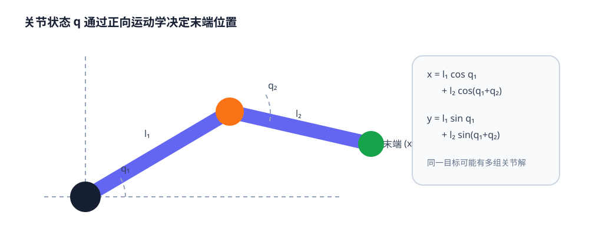
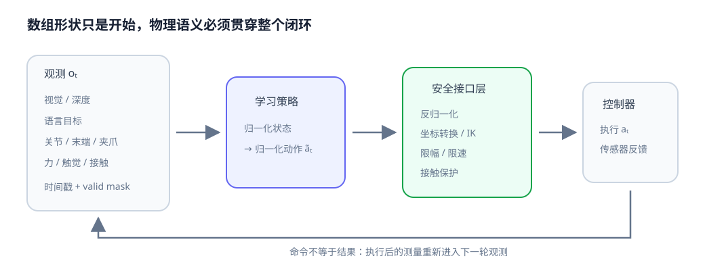
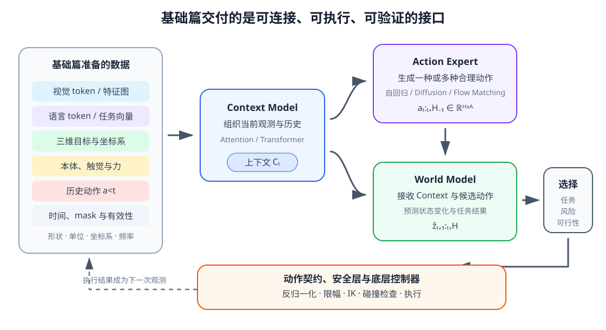

# 07 本体、触觉与动作：机器人怎样描述自身并执行指令

第 06 章已经把目标从图像坐标转换到机器人使用的三维空间，但“把红杯放到托盘上”仍无法直接执行。策略必须知道机械臂当前姿态、夹爪是否闭合、是否已经接触杯子；它还必须明确输出的七个数字究竟是关节角、末端位姿增量，还是力矩命令。

相机主要观察外部世界，本体感觉和触觉则告诉机器人“我的身体在哪里、正在承受什么”。本章把这些信号与动作统一成清晰的数据接口，并解释学习策略、运动学和底层控制器之间的边界。

学完本章后，你应当能够：

- 区分场景状态、本体状态、接触状态和动作命令；
- 解释关节位置、速度、力矩、末端位姿、力/力矩和触觉信号；
- 使用正向运动学和雅可比矩阵连接关节空间与笛卡尔空间；
- 比较绝对、增量、速度、力矩以及混合动作接口；
- 写清控制频率、延迟、限幅、归一化和反归一化约定；
- 设计形状、单位、坐标系和时间戳明确的 observation/action schema。

## 1. 机器人也需要感知自己的身体

### 本体状态不等于场景状态

视觉告诉机器人杯子在哪里，本体感觉（proprioception）告诉它机械臂自身在哪里。一个常见本体向量可写成

$$
s_t^{\mathrm{prop}}
=\left[q_t,\dot q_t,\tau_t,p_t^{\mathrm{ee}},r_t^{\mathrm{ee}},g_t\right],
$$

其中 $q_t\in\mathbb R^n$ 是 $n$ 个关节的位置，$\dot q_t$ 是关节速度，$\tau_t$ 是测得或估计的关节力矩，$p_t^{\mathrm{ee}}$ 和 $r_t^{\mathrm{ee}}$ 是末端位置与旋转表示，$g_t$ 是夹爪开合状态。

这些量不是越多越好。必须先问机器人在真实部署时能稳定测到什么。仿真器可能直接提供物体精确位姿、接触点和无噪声速度，真机却只能从编码器、相机或滤波器估计。训练时把不可获得的仿真内部状态塞给策略，会形成无法部署的特权信息。

| 信号 | 常见单位 | 主要来源 | 常见用途 |
|---|---|---|---|
| 关节位置 $q$ | rad 或 m | 编码器 | 姿态、限位、运动学 |
| 关节速度 $\dot q$ | rad/s 或 m/s | 编码器差分或估计器 | 动态状态、阻尼与安全 |
| 关节力矩 $\tau$ | N·m 或 N | 力矩传感器或电流估计 | 接触、负载和力控 |
| 末端位姿 $T_{\mathrm{ee}}$ | m + 旋转表示 | 正向运动学 | 笛卡尔动作与目标误差 |
| 夹爪状态 $g$ | m、rad 或归一化值 | 夹爪编码器 | 判断开合与物体宽度 |

状态向量中的每一维都应记录名称、单位、上下界和参考坐标系。一个长度为 21 的数组本身并不是可靠接口。

## 2. 触觉补充视觉看不到的接触

### 看见接触不等于测到接触

相机可以看到夹爪接近杯子，却难以判断接触力是否足够、物体是否开始滑动。常见接触相关信号包括：

- 六维力/力矩：$[f_x,f_y,f_z,m_x,m_y,m_z]$；
- 夹爪电流或估计力；
- 二值或概率接触标志；
- 阵列触觉图像 $[H_t,W_t,C_t]$；
- 由短时间变化推断的滑移信号。

力/力矩必须说明在哪个坐标系表达。传感器坐标中的 $f_z$ 可能沿腕部轴，基座坐标中的 $f_z$ 则通常指向世界上方。若机械臂旋转后仍把传感器原始轴当成基座轴，控制方向会出错。

接触也不是单帧阈值就能完全描述。碰撞脉冲、稳定夹持和缓慢滑移具有不同时间模式，因此本体与触觉通常需要保留历史。第 08 章会进一步讨论时间建模。

### 多模态信号互相补足

| 问题 | 视觉 | 本体 | 触觉/力 |
|---|---|---|---|
| 杯子在桌面哪里 | 强 | 无法直接提供 | 接触前通常没有 |
| 末端当前姿态 | 可估计但受遮挡 | 强 | 间接 |
| 是否刚接触物体 | 可能延迟或遮挡 | 间接 | 强 |
| 物体是否在夹爪中滑动 | 较难 | 夹爪宽度可提示 | 强 |
| 障碍物外观与类别 | 强 | 无 | 局部接触后才知道 |

这解释了为什么完整机器人状态不能只依赖相机。不同模态覆盖不同可观测范围，并各自带有噪声和延迟。

## 3. 关节空间怎样连接末端空间

### 正向运动学从关节角得到末端位姿

机械臂由关节和连杆组成。正向运动学（forward kinematics，FK）根据关节状态计算末端位姿：

$$
x_{\mathrm{ee}}=f_{\mathrm{FK}}(q).
$$

对于平面二连杆，连杆长度为 $l_1,l_2$，关节角为 $q_1,q_2$，末端位置是

$$
x=l_1\cos q_1+l_2\cos(q_1+q_2),
$$

$$
y=l_1\sin q_1+l_2\sin(q_1+q_2).
$$

它直观展示了“关节角改变一点，末端位置会怎样变化”。真实机械臂在三维空间中使用一串刚体变换，原理仍是沿运动链逐级组合。

<figure markdown="span">
  { width="1000" loading=lazy }
  <figcaption>图 07-1　二连杆的关节角决定末端位置；同一个末端目标可能对应多组关节构型，也可能超出可达范围。（本教程绘制）</figcaption>
</figure>

### 雅可比连接瞬时速度

关节速度与末端速度近似满足

$$
\dot x_{\mathrm{ee}}=J(q)\dot q,
$$

其中 $J(q)$ 是雅可比矩阵。它随当前姿态变化：同样的关节速度，在不同构型下会产生不同末端运动。接近奇异构型时，某些末端方向可能需要很大的关节速度，直接求逆会不稳定。

逆运动学（inverse kinematics，IK）则从目标末端位姿寻找关节解：

$$
q^*=f_{\mathrm{IK}}(x_{\mathrm{target}}).
$$

IK 可能有多个解、无解或靠近关节限位。学习策略若输出笛卡尔目标，仍需由 IK 或操作空间控制器转换并做安全检查；策略不会让运动学约束自动消失。

## 4. 动作空间决定策略到底控制什么

### 关节动作与笛卡尔动作

关节空间动作直接控制每个关节，例如目标位置 $q^{\mathrm{cmd}}$、速度 $\dot q^{\mathrm{cmd}}$ 或力矩 $\tau^{\mathrm{cmd}}$。它与硬件接口接近，但同一个任务在不同机器人上维度和含义不同。

笛卡尔动作控制末端。一个常见七维增量动作写成

$$
a_t=[\Delta x,\Delta y,\Delta z,
\Delta r_x,\Delta r_y,\Delta r_z,g_t].
$$

前三维是位置增量，中间三维是旋转增量，最后一维控制夹爪。这个式子仍不完整，必须同时说明：增量在哪个坐标系表达、旋转采用何种参数化、夹爪值是位置还是开合命令、每一步持续多久。

| 动作接口 | 策略输出 | 优点 | 主要风险 |
|---|---|---|---|
| 关节绝对位置 | $q^{\mathrm{target}}$ | 含义明确，底层易跟踪 | 跨本体困难，跳变需限速 |
| 关节速度 | $\dot q^{\mathrm{cmd}}$ | 连续响应 | 积分漂移，需严格频率和限位 |
| 末端绝对位姿 | $T^{\mathrm{target}}$ | 与任务几何直接对应 | 依赖 IK，可达性和多解问题 |
| 末端增量 | $\Delta x,\Delta r$ | 适合闭环修正，常用于示教 | 坐标系和步长必须明确 |
| 力矩/力 | $\tau$ 或 wrench | 可直接塑造接触行为 | 对延迟和安全要求最高 |
| 离散技能 | 抓取、打开、停止 | 高层规划简单 | 粒度较粗，依赖技能控制器 |

连续与离散动作还可以混合：末端位移是连续量，夹爪开合是二值量，技能选择是离散量。模型头、损失函数和执行器都必须认识这种结构，不能把所有维度无条件地当作同一种高斯回归。

## 5. 绝对、增量与坐标系约定

绝对动作直接指定目标，例如基座坐标中的末端位置 $p_{t+1}^{B}$。增量动作指定相对变化：

$$
p_{t+1}^{B}=p_t^{B}+\Delta p_t^{B}.
$$

若增量在末端局部坐标 $E$ 中表达，需要先旋转到基座坐标：

$$
p_{t+1}^{B}=p_t^{B}+{}^{B}R_E\Delta p_t^{E}.
$$

二者数值相同也可能产生完全不同方向。数据集、训练代码和机器人控制器必须共享同一约定。

旋转增量不能长期简单逐分量累加欧拉角。小角度时可以近似，较大旋转应使用旋转矩阵、单位四元数或 $SE(3)$ 上的组合，并明确左乘还是右乘。第 06 章的坐标变换规则在动作接口中仍然成立。

## 6. 时间、延迟和尺度也是接口的一部分

### 控制频率改变动作的物理含义

速度命令 $0.1\ \mathrm{m/s}$ 在 10 Hz 下持续一步约移动 1 cm，在 50 Hz 下只移动 2 mm。若动作表示为每步增量，那么更换控制频率却不缩放增量，会改变真实速度。

观测时间 $t_o$、推理完成时间 $t_p$ 和动作执行时间 $t_a$ 也不相同。总延迟可粗略写成

$$
\Delta t_{\mathrm{delay}}=t_a-t_o.
$$

机器人越快，旧观测与当前真实状态差异越大。记录时间戳、同步多传感器、限制速度并进行闭环重规划，比单纯追求模型吞吐数字更重要。

### 归一化必须能够恢复

不同状态和动作维度量纲差异很大。常用逐维标准化为

$$
\tilde x_i=\frac{x_i-\mu_i}{\sigma_i+\epsilon},
\qquad
x_i=\tilde x_i(\sigma_i+\epsilon)+\mu_i.
$$

动作也常按物理上下界缩放到 $[-1,1]$：

$$
\tilde a_i=2\frac{a_i-a_i^{\min}}{a_i^{\max}-a_i^{\min}}-1.
$$

模型输出后必须反归一化、限幅并再次检查硬件安全边界。训练统计量应只由训练集计算并随模型版本保存；把验证或测试数据用于统计会造成信息泄漏。

## 7. 建立统一 observation/action schema

一个可维护的接口不仅写形状，还应写出每个字段的语义：

| 字段 | 示例形状 | 必须配套记录 |
|---|---:|---|
| `proprio` | $[B,T,P]$ | 维度顺序、单位、关节名称、时间戳 |
| `wrench` | $[B,T,6]$ | 力/力矩单位、传感器坐标系、滤波方式 |
| `tactile` | $[B,T,C,H,W]$ | 传感器位置、标定、有效区域 |
| `action` | $[B,T,A]$ | 控制模式、坐标系、频率、上下界 |
| `valid_mask` | $[B,T]$ | 哪些时间步是真实数据而非 padding |

<figure markdown="span">
  { width="1040" loading=lazy }
  <figcaption>图 07-2　策略读取视觉、语言、本体和接触信号，输出规范化动作；安全层负责反归一化、限幅与控制器转换，反馈再进入下一轮观测。（本教程绘制）</figcaption>
</figure>

数据 schema 应包含版本号。若后来把动作从“基座坐标增量”改为“末端坐标速度”，即使数组仍是七维，也应视为不兼容版本。形状相同并不代表物理语义相同。

## 8. 学习策略与控制器各自负责什么

学习策略通常在较低频率产生目标或增量，底层控制器在更高频率跟踪它：

~~~mermaid
flowchart LR
    O["多模态观测"] --> P["学习策略 任务级决策"]
    P --> S["安全与接口层 反归一化 / 限幅 / IK"]
    S --> C["底层控制器 位置 / 速度 / 力矩跟踪"]
    C --> R["真实机器人"]
    R --> O
~~~

策略不应绕过关节限位、碰撞检查和急停机制。控制器也不负责理解“把红杯放到托盘上”的高层语义。清晰分层让错误可以定位：策略目标是否错误、坐标转换是否错误、控制跟踪是否失败，三者需要不同诊断。

后续生成式策略会一次输出未来 $H$ 步动作：

$$
a_{t:t+H-1}\in\mathbb R^{B\times H\times A}.
$$

这称为 action chunk。它能减少逐步推理开销并表达连贯运动，却会增加开环时间；执行时通常只采用前几步，然后根据新观测重新规划。第 11 章会专门讨论这一问题。

## 9. 可视化与配套实践

下面的动画展示关节变化怎样移动末端，以及检测到接触后动作幅度怎样收缩。它强调的是闭环接口，而不是某一种机械臂控制算法。

  
静态说明：关节角通过正向运动学决定末端位置；策略根据本体和接触信号产生动作，安全层进行尺度恢复和限幅，再交给控制器执行。

实践 07-01

### 二连杆正向运动学

用 NumPy 计算二连杆末端轨迹和雅可比，通过有限差分检查速度关系，并观察接近伸直构型时的变化。

预计时间：20～25 分钟

实践 07-02

### 观测与动作数据契约

构造带视觉引用、本体、力和动作的 batch，完成形状校验、标准化、反归一化、限幅与接触触发的安全修正。

预计时间：20～30 分钟

## 10. 常见误区与失败边界

### 把仿真内部状态当成真机观测

仿真提供的物体真值、精确速度和理想接触在真机上未必可得。训练输入应区分部署可用信号与只用于教师、奖励或评测的特权信息。

### 只写动作维度，不写物理语义

“动作是七维”远远不够。必须同时写单位、坐标系、绝对或增量、控制频率、旋转表示、夹爪含义及上下界。

### 归一化后忘记恢复与限幅

模型空间中的 $1.0$ 可能对应 2 cm、10 cm 或最大关节速度。执行前要使用训练时同一组统计量恢复物理量，再根据当前状态和硬件约束限幅。

### 混淆命令值与测量值

控制器收到目标关节角，不代表关节已经到达。观测应来自传感器反馈，并保留命令时间、测量时间和执行状态；否则世界模型会把“想做什么”误当成“已经发生什么”。

### 用单帧力阈值判断全部接触

噪声、重力补偿偏差和冲击都会导致瞬时峰值。接触判断通常需要标定、滤波、迟滞或短时间历史，并在不同工具和负载下重新验证。

## 11. 它在机器人世界模型中的位置

至此，机器人当前时刻的主要输入和动作接口已经出现：

$$
o_t=\left(I_t,d_t,s_t^{\mathrm{prop}},s_t^{\mathrm{touch}}\right),
\qquad
g=\left(Z^{\mathrm{lang}},z^g\right),
\qquad
a_t\in\mathbb R^A.
$$

这些数据不会原样拼接后就自动成为机器人智能。视觉、语言、三维目标、本体和触觉具有不同形状与时间特性，进阶篇首先要把它们编码并组织为任务相关的上下文：

$$
C_t=\operatorname{ContextModel}(o_{\leq t},a_{<t},g).
$$

Action Expert 再根据同一个 $C_t$ 生成动作或动作分块，World Model 则接收上下文和候选动作，预测动作执行后的状态变化：

$$
A_t\sim\operatorname{ActionExpert}(A\mid C_t),
\qquad
\hat z_{t+1:t+H}
=\operatorname{WorldModel}(C_t,A_t).
$$

在本教程的命名中，Context Model 与 Action Expert 共同组成 Action Model：前者负责把多模态历史整理成条件，后者负责在这个条件下产生动作分布。World Model 不直接替代二者，而是回答候选动作可能把系统带向什么未来。

三个组件对基础篇接口的要求并不相同，但必须共享同一套物理语义：

| 后续组件 | 读取的主要内容 | 产生的接口 | 本章留下的约束 |
|---|---|---|---|
| Context Model | 多模态观测、历史动作、时间与 mask | 任务相关上下文 $C_t$ | 区分模态、时间、缺失值和部署可用信号 |
| Action Expert | $C_t$ 与动作历史 | $[B,H,A]$ 动作分块或动作分布 | 动作空间、坐标系、单位、频率和归一化必须固定 |
| World Model | $C_t$、真实或候选动作 | 未来状态、观测或任务结果 | 必须区分动作命令与真实执行结果，并保持坐标语义一致 |

<figure markdown="span">
  { width="1120" loading=lazy }
  <figcaption>图 07-3　基础篇并未直接得到完整策略，而是准备了三个后续模型能够共享的数据契约。候选动作仍需经过未来评价、安全检查和控制器执行，执行结果再成为下一轮观测。（本教程绘制）</figcaption>
</figure>

如果 Action Expert 输出米制末端增量，而 World Model 的训练数据记录的是归一化关节速度，两者就无法直接连接；如果模型把控制器收到的命令当作机器人已经完成的运动，未来预测也会从错误状态继续展开。统一字段、单位、坐标系、频率、动作语义和执行反馈，是多模态融合、生成策略和未来预测能够组合起来的前提。

## 12. 本章小结

机器人需要视觉观察外部世界，也需要本体与触觉观察自身和接触。本体状态包括关节位置、速度、力矩、末端位姿和夹爪状态；触觉与力信号补充了视觉难以可靠判断的接触和滑移。正向运动学与雅可比把关节空间连接到末端空间，逆运动学和底层控制器则负责把高层目标变成可执行命令。

动作接口必须明确空间、坐标系、绝对或增量、单位、频率、延迟、归一化和安全边界。策略输出只是命令，不是已经发生的状态；执行结果必须通过传感器反馈进入下一轮闭环。

## 进入进阶篇

视觉、语言、三维目标、本体、触觉和动作现在都有了明确接口，但它们还没有自动组成一个能够长期决策的机器人模型。遮挡、运动趋势和任务阶段要求模型从历史中构建 Context；同一任务的多条合理轨迹要求 Action Expert 能够生成动作分布；机器人还需要 World Model 预测候选动作执行后的结果。

进阶篇将沿着三个接口继续展开：Context Model 使用 Attention 与 Transformer 组织当前观测和历史，Action Expert 使用自回归、Diffusion 或 Flow Matching 生成动作序列，World Model 则在动作条件下预测未来变化。

[进入进阶篇：机器人怎样生成动作并预见变化](../intermediate/index.md)
