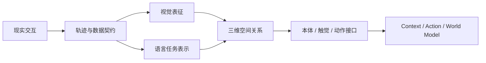

# 基础篇：机器人怎样准备可学习的观测与动作接口

核心问题：

> 现实交互、视觉、语言、空间关系、机器人自身状态和动作，怎样变成模型能够学习和组合的输入输出？

基础篇不急于搭建完整的动作生成器或世界模型。它先把数据语义、训练机制和各类模态接口说明清楚，使后续 Context Model、Action Model 与 World Model 建立在可验证的数据基础上。

## 本阶段要打通的能力

```text
现实交互如何成为训练数据
→ 像素和语言如何成为模型表征
→ 二维目标如何落到机器人三维空间
→ 本体、触觉和动作如何形成统一接口
```



## 单元一：从现实交互到学习问题

| 章节 | 要补上的缺口 | 状态 |
|---|---|---|
| [01 机器人眼中的世界](01-robot-view-of-the-world.md) | 现实交互如何变成观测、动作与轨迹 | 已完成 |
| [02 神经网络如何学习](02-how-neural-networks-learn.md) | 参数怎样从数据和损失中学习 | 已完成 |

## 单元二：从多模态观测到机器人模型接口

| 章节 | 要补上的缺口 | 状态 |
|---|---|---|
| [03 视觉编码：从像素到视觉特征](03-vision-encoding.md) | 编码器怎样把图像变成不同形状的视觉特征 | 已完成 |
| [04 视觉表征学习：编码器怎样学到有用特征](04-visual-representation-learning.md) | 监督、重建、对比和预测目标怎样塑造视觉表征 | 已完成 |
| [05 语言编码：从自然语言到任务表示](05-language-encoding.md) | 文字怎样成为任务条件并与视觉语义建立联系 | 已完成 |
| [06 三维感知与坐标变换：从相机像素到机器人目标](06-spatial-geometry.md) | 视觉结果怎样成为机器人坐标系中的三维目标 | 已完成 |
| [07 本体、触觉与动作：机器人怎样描述自身并执行指令](07-robot-state-and-action.md) | 身体状态、接触信号和动作怎样形成统一接口 | 已完成 |

## 学完基础篇应该能解释

- [x] 为什么机器人学习数据必须记录时间、单位、坐标系和动作语义；
- [x] 神经网络怎样通过损失、梯度和参数更新学习一个任务；
- [x] 图像怎样变成全局向量、空间特征图或视觉 token；
- [x] AE、VAE、MAE、对比学习和 JEPA 分别要求视觉表征保留什么；
- [x] 语言怎样变成带有 mask 的任务表示，图文对齐怎样建立相似度，以及任务描述为什么不等于成功条件；
- [x] 二维位置为什么需要深度、内参和外参才能成为机器人目标；
- [x] 本体、触觉和动作接口为什么必须明确单位、频率、尺度与控制语义；
- [x] 这些接口以后怎样连接 Context Model、Action Expert 与 World Model。

## 配套实践索引

每章的实践都从正文中的具体问题出发。建议先读完相应章节，再从章节末尾的实践卡片打开 Colab；课程页面和 Notebook 会分别保留在不同标签页中，便于边运行边对照。

| 章节 | 配套实践 | 主要观察内容 |
|---|---|---|
| [01 机器人眼中的世界](01-robot-view-of-the-world.md) | 观测与轨迹；张量形状 | 一段机器人交互怎样成为按时间对齐的数据，以及 batch、时间和特征维各自表示什么 |
| [02 神经网络如何学习](02-how-neural-networks-learn.md) | 前向计算与激活函数；训练与泛化 | 非线性网络怎样形成预测，损失下降和未见数据表现为什么必须同时检查 |
| [03 视觉编码](03-vision-encoding.md) | 卷积与特征图；目标位置预测 | 局部卷积怎样形成空间特征，视觉编码器怎样为下游任务保留位置信息 |
| [04 视觉表征学习](04-visual-representation-learning.md) | AE、VAE 与 MAE；对比与预测式学习 | 不同训练目标怎样让编码器保留不同信息，并可能产生不同失败现象 |
| [05 语言编码](05-language-encoding.md) | 分词、补齐与 mask；任务槽位；图文对齐 | 指令怎样变成有效序列，语言信息怎样被检验并与图像建立共同语义 |
| [06 三维感知与坐标变换](06-spatial-geometry.md) | RGB-D 反投影；坐标变换与标定误差 | 像素怎样成为三维点，误差怎样沿相机到机器人的变换链传递 |
| [07 本体、触觉与动作](07-robot-state-and-action.md) | 二连杆正向运动学；观测—动作数据契约 | 关节状态怎样对应末端位置，多模态观测和动作怎样组成明确可检查的模型接口 |

## 本阶段结束后留下的问题

基础篇准备了视觉表征、语言目标、三维关系、本体、触觉和动作接口，但还没有回答：

- 模型怎样从当前观测和历史中构建任务相关的 Context？
- Action Expert 怎样通过自回归、Diffusion 或 Flow Matching 生成动作序列？
- World Model 怎样预测候选动作执行后的未来？
- 模型怎样比较多个未来并持续闭环纠错？

这些问题交给 [进阶篇](../intermediate/index.md)。
