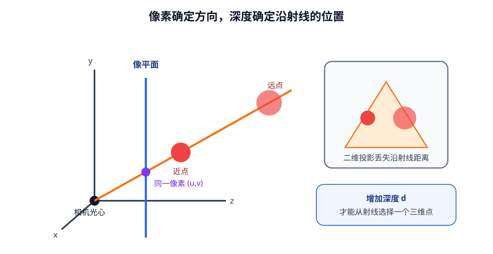
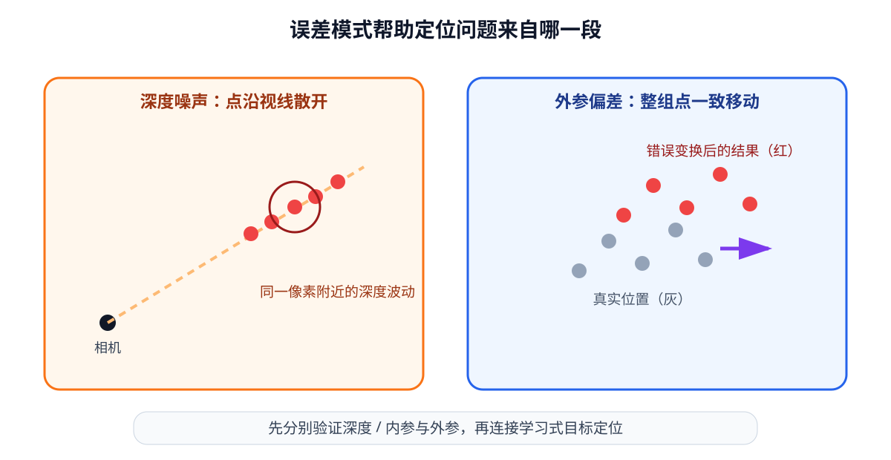

# 04 空间与几何

第 03 章让视觉编码器找到了红色杯子在图像中的位置。假设它预测杯子中心位于像素 $(u,v)=(420,260)$，机械臂仍然无法据此移动：同一个像素方向上可以放着一个近处的小杯子，也可以放着一个远处的大杯子；相机的“向右”也不一定对应机器人基座坐标系的“向右”。

本章补上从视觉到行动之间的几何桥梁。我们从针孔相机模型出发，解释三维点怎样投影到二维像素；随后利用深度把像素反投影回相机坐标系，再通过齐次变换得到机器人基座坐标。最后把单点推广到点云、物体姿态和抓取目标，并检查深度噪声与标定误差会怎样传到动作端。

几何模型不会自动识别哪个像素属于杯子，学习模型也不会自动知道相机安装在机器人哪里。实际系统需要两者配合：视觉模型提供目标区域或关键点，几何模块把这些观测变成具有坐标系和单位的三维量。

学完本章后，你应当能够：

- 说明像素坐标、相机坐标、机器人基座坐标和世界坐标的区别；
- 使用相机内参完成三维投影与 RGB-D 反投影；
- 读懂 $4\times4$ 齐次变换，正确组合、求逆并检查坐标系方向；
- 比较旋转矩阵、欧拉角、四元数和轴角的接口特点；
- 说明检测、分割、关键点和姿态估计分别向几何模块提供什么；
- 用误差实验判断深度噪声或外参误差是否会影响抓取。

本章主要接口如下。$B$ 是 batch 大小，$N$ 是有效三维点数：

| 数据 | 符号 | 常见形状 | 关键约定 |
|---|---|---:|---|
| RGB 图像 | $I_t$ | $[B,3,H,W]$ | 通道顺序、畸变状态 |
| 深度图 | $d_t$ | $[B,1,H,W]$ | $z$ 深度或射线距离、长度单位 |
| 相机内参 | $K$ | $[B,3,3]$ | 必须对应当前分辨率 |
| 点云 | $P_t$ | $[B,N,3+C]$ | 坐标系、单位、有效点掩码 |
| 位姿 | $T$ 或 $(p,q)$ | $[B,4,4]$ 或 $[B,7]$ | 变换方向、四元数顺序 |

## 1. 一个像素为什么不能决定三维位置

### 相机把一条射线压成一个点

设杯子中心在相机坐标系中的位置为

$$
{}^{C}p=
\begin{bmatrix}X_C&Y_C&Z_C\end{bmatrix}^{\mathsf T}.
$$

上标 $C$ 表示这个向量使用相机坐标系表达。采用常见约定时，相机 $x$ 轴向图像右方，$y$ 轴向图像下方，$z$ 轴沿光轴向前。不同设备可能采用其他约定，因此真实项目必须查看标定和驱动文档，不能仅凭常见习惯猜测。

在理想针孔相机中，三维点投影到归一化像平面：

$$
x_n=\frac{X_C}{Z_C},\qquad
y_n=\frac{Y_C}{Z_C}.
$$

相机内参再把它变成像素坐标：

$$
u=f_xx_n+c_x,\qquad
v=f_yy_n+c_y.
$$

$f_x,f_y$ 是以像素为单位的焦距，$(c_x,c_y)$ 是主点。写成矩阵形式就是

$$
\lambda
\begin{bmatrix}u\\v\\1\end{bmatrix}
=
K
\begin{bmatrix}X_C\\Y_C\\Z_C\end{bmatrix},
\qquad
K=
\begin{bmatrix}
f_x&0&c_x\\
0&f_y&c_y\\
0&0&1
\end{bmatrix},
$$

其中尺度 $\lambda=Z_C$。如果把 $(X_C,Y_C,Z_C)$ 同时乘以相同正数，$X_C/Z_C$ 和 $Y_C/Z_C$ 不变，投影仍落在同一个像素。因此一个像素只确定从相机光心出发的一条射线，不能单独决定点在射线上的距离。

<figure markdown="span">
  { width="1040" loading=lazy }
  <figcaption>图 04-1　近处点和远处点只要位于同一条成像射线上，就会落到同一个像素；深度提供了沿射线的位置。（本教程绘制）</figcaption>
</figure>

真实镜头还会产生径向和切向畸变，尤其在画面边缘更明显。相机标定通常同时估计内参与畸变参数。若深度已经与彩色图对齐、图像也已经去畸变，后续公式可直接使用；否则应先根据设备的数据契约完成校正。不能一边使用畸变后的像素，一边套用理想针孔公式而不计误差。

## 2. 深度让像素回到三维空间

### RGB-D 反投影

RGB-D 相机除彩色图像外，还为像素提供深度 $d(u,v)$。若该深度表示沿相机 $z$ 轴的距离，即 $Z_C=d$，则反投影公式为

$$
X_C=\frac{(u-c_x)d}{f_x},\qquad
Y_C=\frac{(v-c_y)d}{f_y},\qquad
Z_C=d.
$$

也可以写成

$$
{}^{C}p=dK^{-1}
\begin{bmatrix}u\\v\\1\end{bmatrix}.
$$

这一步把第 03 章得到的二维目标位置与深度测量结合起来，得到相机坐标系中的三维点。注意，有些传感器报告的是沿成像射线的欧氏距离，而不是 $Z_C$；两者代入同一公式会产生系统误差，必须以设备说明为准。

!!! example "反投影实现放在 Notebook 中"
    单像素反投影、整幅深度图向量化计算、无效深度过滤和点云绘制见 [实践 04-01](https://colab.research.google.com/github/qi-robotics/robot-world-model-tutorial/blob/main/colab/basics/04/04-01-rgbd-backprojection.ipynb)。

输出 $[0.133,0.027,0.8]$ 的单位是米，因为输入深度使用米。像素 $u,v$ 没有米制单位，内参焦距使用像素；公式把像素偏移除以像素焦距得到无量纲方向，再乘深度恢复长度。

### 从目标中心到整幅点云

如果对每个有效深度像素都执行反投影，就得到点云（point cloud）：

$$
P=\left\{{}^{C}p_i\right\}_{i=1}^{N},\qquad
P\in\mathbb R^{N\times(3+C)}.
$$

前三列是 $x,y,z$，其余 $C$ 列可以保存 RGB、类别、置信度或其他属性。点云不是“比图片更真实”的完整世界，它仍只包含传感器看见的表面；透明、反光、遮挡和量程限制都会造成缺失或异常值。

规则点云可以保留成 $[H,W,3]$ 的有组织形式，方便维持像素对应关系；删除无效点后常变成 $[N,3]$。进一步将空间划分为三维网格，可得到体素（voxel）表示。体素便于三维卷积和占据推理，但分辨率翻倍会使三维网格单元数约增加八倍，因此通常要在精度、范围和内存之间取舍。

## 3. 从相机坐标变换到机器人基座坐标

### 同一个点可以有多套数值

相机测得的杯子位置 ${}^{C}p$ 以相机为参考。机械臂控制器通常需要基座坐标系 $B$ 中的位置 ${}^{B}p$。两者描述的是同一个物理点，但原点和坐标轴不同。

刚体变换由旋转 $R\in\mathbb R^{3\times3}$ 和平移 $t\in\mathbb R^3$ 组成：

$$
{}^{B}p={}^{B}R_C\,{}^{C}p+{}^{B}t_C.
$$

记号 ${}^{B}R_C$ 表示“把用 $C$ 坐标表达的向量转成用 $B$ 坐标表达”。把点补成齐次坐标

$$
\tilde p=
\begin{bmatrix}x&y&z&1\end{bmatrix}^{\mathsf T},
$$

旋转和平移可以合成一个 $4\times4$ 齐次变换：

$$
{}^{B}T_C=
\begin{bmatrix}
{}^{B}R_C&{}^{B}t_C\\
0&0&0&1
\end{bmatrix},
\qquad
{}^{B}\tilde p={}^{B}T_C{}^{C}\tilde p.
$$

若一个世界坐标点 ${}^{W}\tilde p$ 先经外参变到相机坐标，再经内参投影，可以合并写成课程规划中的形式：

$$
\lambda
\begin{bmatrix}u\\v\\1\end{bmatrix}
=K\begin{bmatrix}{}^{C}R_W&{}^{C}t_W\end{bmatrix}
{}^{W}\tilde p.
$$

这不是另一套相机模型，只是把“世界到相机”和“相机到像素”两步写在同一个式子中。

<figure markdown="span">
  { width="1040" loading=lazy }
  <figcaption>图 04-2　相机和机器人基座使用不同原点与轴方向；外参 ${}^{B}T_C$ 把相机测量转换成控制器使用的坐标。（本教程绘制）</figcaption>
</figure>

外参（extrinsics）描述两个坐标系之间的固定或可计算关系。固定在环境中的相机通常通过手眼标定得到相机到基座的变换；装在末端的相机会随机械臂运动，此时还要结合当前关节状态和正向运动学更新变换。

### 变换链的上下标可以帮助检查方向

若还知道世界坐标系 $W$ 到相机坐标系 $C$ 的关系，以及基座坐标系 $B$ 到世界坐标系 $W$ 的关系，可以组合：

$$
{}^{B}T_C={}^{B}T_W{}^{W}T_C.
$$

相邻的 $W$ 在乘法中衔接，像单位换算一样帮助检查方向。若已知相反方向 ${}^{C}T_B$，则

$$
{}^{B}T_C=\left({}^{C}T_B\right)^{-1}.
$$

刚体变换的逆不能只把平移取负。正确形式是

$$
T^{-1}=
\begin{bmatrix}
R^{\mathsf T}&-R^{\mathsf T}t\\
0&1
\end{bmatrix}.
$$

这是常见错误来源：平移向量也必须先经过逆旋转，才能在新的坐标轴下表达。

### $SE(3)$ 表示三维刚体位姿

合法旋转矩阵满足

$$
R^{\mathsf T}R=I,\qquad \det(R)=1.
$$

由合法旋转和平移组成的三维刚体变换集合称为 $SE(3)$。初学时不必展开群论，只需理解两点：这些矩阵表示不改变物体形状和尺度的旋转平移；多个变换可以通过矩阵乘法组合，组合结果仍是刚体变换。

旋转有多种参数化方式：

| 表示 | 数量 | 优点 | 使用时要注意 |
|---|---:|---|---|
| 旋转矩阵 | 9 | 组合与变换直接 | 9 个数必须满足正交和行列式约束 |
| 欧拉角 | 3 | 便于人阅读 | 依赖旋转顺序，存在万向节锁 |
| 四元数 | 4 | 紧凑，适合平滑插值 | $q$ 与 $-q$ 表示同一旋转，需保持单位长度 |
| 轴角 | 3 或 4 | “绕某轴转多少”直观 | 接近零角和 $\pi$ 时需注意数值处理 |

欧拉角的三个数字不能脱离旋转顺序解释；四元数的字段顺序也可能是 $(w,x,y,z)$ 或 $(x,y,z,w)$。保存位姿数据时必须明确约定。不同表示之间转换不会增加信息，只是为优化、插值、存储或人类阅读选择不同坐标。

## 4. 学习式视觉与几何模块怎样连接

第 03 章的视觉编码器输出特征，但几何计算需要明确的像素、区域或位姿。不同视觉任务提供的接口不同：

| 视觉输出 | 示例形状 | 能提供什么 | 几何模块常怎样使用 |
|---|---:|---|---|
| 检测框 | $[N,4]$ | 物体大致区域 | 取框内深度中位数或继续精细定位 |
| 分割掩码 | $[H,W]$ | 每个像素是否属于目标 | 只反投影目标像素，形成物体点云 |
| 关键点 | $[K,2]$ | 杯沿、把手等二维位置 | 配合深度或多视角恢复三维关键点 |
| 6D 位姿 | $[N,7]$ 或 $[N,4,4]$ | 物体三维位置与旋转 | 直接生成抓取候选或关系特征 |
| 空间 token | $[N,D]$ | 各区域的学习特征 | 供后续 grounding、融合或隐式三维推理 |

检测框中心不一定等于物体三维中心。若框内同时含有前景杯子和后方桌面，直接读取中心像素深度可能碰到空洞或背景；分割掩码能更精确地筛选目标点，却仍要处理反光和遮挡。关键点适合结构明确的物体，6D 位姿则需要定义物体自身坐标系。

一种清晰的模块链路是：

~~~mermaid
flowchart LR
    RGB["RGB 图像"] --> SEG["检测 / 分割 / 关键点"]
    DEPTH["深度图"] --> BP["反投影"]
    SEG --> BP
    K["相机内参 K"] --> BP
    BP --> PC["相机坐标中的目标点云"]
    EXT["外参 B←C"] --> TF["坐标变换"]
    PC --> TF
    TF --> OBJ["基座坐标中的物体位置 / 姿态"]
~~~

这条链路把责任分开：学习模型回答哪些像素属于目标，内参和深度恢复相机坐标中的几何，外参连接机器人坐标，最后才形成控制输入。出现抓取偏差时，可以逐段检查，而不是把所有问题归因于“视觉不准”。

## 5. 从三维物体到可执行抓取目标

### 位置不等于完整抓取位姿

知道杯子中心 ${}^{B}p_{\mathrm{obj}}$ 后，可以计算它相对末端的位置：

$$
r_t^{\mathrm{object}}
={}^{B}p_{\mathrm{obj}}-{}^{B}p_{\mathrm{ee}}.
$$

这正是第 02 章结构化观测中暂时由数据集提供的量。现在它有了一条可追溯来源：视觉定位 → 深度反投影 → 坐标变换 → 相对位置。

但抓取通常还需要末端方向。完整目标位姿可写为 ${}^{B}T_G\in SE(3)$，其中 $G$ 是期望抓取坐标系。抓取生成模块需要考虑物体表面、夹爪宽度、接近方向、碰撞和摩擦，仅有中心点并不足以保证可抓。

### 可达不代表安全可执行

目标位于机械臂理论工作空间中，只说明可能存在某组关节角到达它。真实执行还需检查：

- 逆运动学是否能找到满足关节限位的解；
- 从当前位姿到目标位姿的路径是否碰撞；
- 末端方向是否适合接近与夹持；
- 深度和标定误差是否已预留安全余量；
- 目标是否会运动，观测与执行之间有多大延迟。

因此，几何模块的输出是规划和控制的输入，而不是可以跳过安全检查直接执行的命令。

## 6. 误差怎样从像素传到机械臂

### 深度误差会同时影响三个坐标

由反投影公式可得

$$
\frac{\partial X_C}{\partial d}=\frac{u-c_x}{f_x},\qquad
\frac{\partial Y_C}{\partial d}=\frac{v-c_y}{f_y},\qquad
\frac{\partial Z_C}{\partial d}=1.
$$

这说明深度误差首先直接进入 $Z_C$，也会按像素离主点的距离传播到 $X_C,Y_C$。画面边缘同样大小的深度误差，对横向坐标影响通常更大。

像素定位误差也会变成米制误差：

$$
\frac{\partial X_C}{\partial u}=\frac{d}{f_x},\qquad
\frac{\partial Y_C}{\partial v}=\frac{d}{f_y}.
$$

目标越远，同样一个像素偏差对应的实际横向偏差越大。这也是机器人视觉不能只报告像素准确率的原因；最终应在任务工作距离和基座坐标中检查误差。

### 外参误差会系统性地移动结果

如果相机相对基座的真实变换为 $T$，系统却使用有偏差的 $\hat T$，所有点都会被相似地旋转或平移。一个很小的角度误差，在远距离处也会形成明显位置偏差。深度噪声常随像素和表面变化，外参偏差则更像稳定的系统误差；观察误差模式有助于定位来源。

<figure markdown="span">
  { width="1040" loading=lazy }
  <figcaption>图 04-3　随机深度噪声使点沿视线散开，外参偏差会让整组点产生一致的平移或旋转。（本教程绘制）</figcaption>
</figure>

一个可靠的调试顺序是：先用已知尺寸的标定物验证深度和内参，再用基座坐标中的固定标记验证外参，最后才连接学习式目标检测。否则多个误差来源叠加后，很难判断是哪一段出了问题。

## 7. 从公式到可验证实验

配套实验把相机坐标点变换到基座坐标，并通过“变换后再逆变换”检查计算方向。齐次坐标最后一维为 1，表示它是一个位置点；方向向量的最后一维应为 0，因为纯平移不应改变方向。

!!! example "坐标变换实现放在 Notebook 中"
    齐次点变换、逆变换校验以及深度与标定误差实验见 [实践 04-02](https://colab.research.google.com/github/qi-robotics/robot-world-model-tutorial/blob/main/colab/basics/04/04-02-transforms-and-calibration-error.ipynb)。

实际工程还应检查输入矩阵形状、旋转合法性、时间戳、长度单位和坐标系名称。一个名为 `transform` 的匿名矩阵很容易被反向使用，建议变量名明确写出目标与来源，如 `transform_base_camera`。

## 8. 可视化与配套实践

下面的轻量动画依次强调像素射线、深度确定的三维点以及外参变换后的基座坐标。可以随时暂停；关闭 JavaScript 时仍会显示完整的静态说明。

  
静态说明：像素决定一条从相机光心出发的射线，深度在射线上确定三维点，外参再把该点旋转和平移到机器人基座坐标。

实践 04-01

### 从 RGB-D 图像生成目标点云

生成带深度的人工桌面场景，按公式反投影单个像素和整张深度图，并用颜色与三维散点图核对坐标轴方向。

预计时间：20～25 分钟

实践 04-02

### 坐标变换与误差敏感性

把杯子点云从相机坐标变换到基座坐标，验证逆变换，再分别加入深度噪声、平移误差和旋转误差，观察最终定位怎样变化。

预计时间：20～30 分钟

## 9. 常见误区与失败边界

### 忘记坐标轴和单位

点 $[0.3,0.1,0.8]$ 本身没有完整物理意义。必须同时知道它属于哪个坐标系、轴朝向如何、单位是米还是毫米、测量对应哪个时间戳。形状正确不会阻止单位错误。

### 混淆 ${}^{B}T_C$ 与 ${}^{C}T_B$

二者互为逆变换，不是同一个矩阵。应让变量名、文档和矩阵乘法的上下标共同说明方向，并使用已知点和逆变换做单元测试。

### 把齐次点和方向向量都补成 1

位置点最后一维为 1，所以会受到平移；方向向量最后一维为 0，只应旋转。表面法向量还需要使用与旋转一致的正确变换，不能像位置点一样加平移。

### 对欧拉角直接逐分量相加

三维旋转的组合依赖顺序，通常不等于三个角分别相加。执行组合应使用旋转矩阵或规范化四元数，并在接口边界明确欧拉角顺序。

### 相信单个深度像素

物体边缘、反光表面和遮挡处常有空洞或跳变。实际定位可在目标掩码内部选取稳健统计量、去除离群点，或对局部点云拟合表面，同时保留置信度。不能为了得到一个数字而隐藏测量不确定性。

### 把点云当作完整场景

点云只记录当前视角可测表面。杯子背面、盒内遮挡区域和透明物体可能缺失。多视角融合可以补充覆盖，但还需要准确位姿和时间同步；动态物体会使不同时刻的点无法直接叠加。

## 10. 它在机器人世界模型中的位置

本章建立了从视觉观测到机器人空间状态的一条显式路径：

$$
(I_t,d_t)
\longrightarrow (u,v,d)
\longrightarrow {}^{C}p
\longrightarrow {}^{B}p
\longrightarrow r_t^{\mathrm{object}}.
$$

显式几何具有可解释、可校验和容易施加物理约束的优势；学习式空间表示则能处理复杂外观、缺失深度和不易手写的语义。后续系统通常不会在两者中二选一，而会把几何量、视觉 token 和不确定性共同交给多模态模型。

世界模型预测未来时也必须保持坐标语义。若动作在基座坐标表示，物体状态却在相机坐标表示，又没有提供相机运动关系，模型会被迫从数据中猜测本应由坐标变换明确给出的规律。统一坐标系、单位和时间戳，是学习系统能够稳定建模变化的前提。

## 11. 本章小结

针孔相机把三维点投影到二维像素，同一条射线上的不同点可以产生相同像素，因此二维位置不能单独决定三维位置。深度和相机内参共同完成反投影，得到相机坐标中的三维点；对所有有效像素反投影，就形成带颜色或语义属性的点云。

机械臂通常在基座坐标中规划和控制，所以还要用外参把相机测量变换到基座坐标。齐次变换把旋转和平移统一到 $4\times4$ 矩阵中，$SE(3)$ 描述合法的三维刚体位姿。变换方向、旋转约定、单位和时间戳必须成为数据接口的一部分。

学习式检测、分割和关键点模块负责指出目标在图像中的证据，几何模块负责将证据还原为具有物理尺度的空间关系。深度噪声、像素误差与标定偏差会一路传播到抓取目标，因此最终应在机器人坐标和任务尺度上审查误差。

现在，机器人已经能够表达“红色区域对应的物体在基座前方某处”，但它仍不知道语言中的“红色杯子”指向哪个对象，也不知道“放进盒子”描述了怎样的目标关系。下一章将把文字从离散符号变成任务表示，并让语言开始选择视觉世界中的对象与目标。

## 下一章

[05 语言编码：从文字到任务表示](language-encoding.md)
