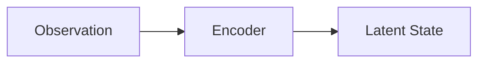

# 图示约定

图示的作用是降低模块边界的歧义，而不是装饰页面。

## 优先顺序

1. **Mermaid**：流程、模块图、闭环图。
2. **SVG / PNG**：需要精确几何或真实照片时。
3. **自定义可视化**：只有在静态图讲不清动态过程时才使用，见 [交互内容接口](interactive-content.md)。

## 视觉风格

课程图示优先采用教材式表达：清楚的坐标、节点、连线和短标签。使用有限的强调色区分真实/预测、输入/输出等确有含义的对象，不添加装饰性渐变、发光、立体效果、无意义图标或大面积卡片拼贴。读者首先看到的应当是变量关系，而不是绘图风格。

同一张图只解释一个主要问题。复杂过程应拆成按正文顺序编号的多张图，不把完整章节压进一张信息面板。

## Mermaid

在 Markdown 中直接写：



约定：

- 节点短句化，避免在节点里写公式或长括号。
- 同一章里的模块名与正文、代码变量一致。
- 先画数据流向，再画训练损失；不要把两者混在一张拥挤的图里。
- 深色主题下依赖 Material 内置 Mermaid 样式，不要把文字颜色写死成浅灰。

## 静态资源位置

| 类型 | 目录 | 说明 |
|---|---|---|
| 章节插图 | `docs/assets/images/<阶段>/<章节>/` | 按章节编号的照片、曲线和教学图 |
| 通用图示 | `docs/assets/diagrams/` | 被多个章节复用的系统结构图 |
| 视频 | `docs/assets/videos/` | 仅在确有必要时添加 |
| 小数据 | `docs/assets/data/` | 可视化用的小型 JSON，不要放大数据集 |

引用示例：

```markdown

```

## 文件命名

- 使用英文短横线：`latent-rollout.svg`
- 章节插图添加编号前缀：`02-03-common-activation-functions.svg`
- 不要用空格或中文文件名
- 一张图只服务一个问题，避免 `final_v3_new.svg`

每张外部图片都要在图注中标明来源和许可；教程自行绘制的图片标注“本教程绘制”。优先自行绘制抽象关系图，只有真实场景、硬件外观或论文结果无法替代时才引用外部图片。

## 无障碍

- 给图片写有信息量的 alt 文本
- 不要只靠颜色区分“好/坏”或“真实/预测”
- 关键路径在正文里仍要用文字说一遍，避免图挂了就读不懂
