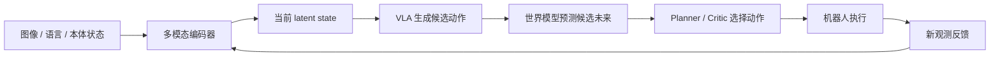

<div class="home-hero" markdown>

<p class="home-kicker">Robot World Model Tutorial</p>

# 从编码到行动

<p class="home-subtitle">机器人世界模型渐进式教程</p>

<p class="home-lead">
这是一套面向机器人学习的中文渐进式教程：从张量、编码和多模态表征出发，
逐步走到 Attention、生成模型、VLM、VLA、世界模型、规划控制，以及仿真与真机闭环。
基础篇七章正文与配套实践现已完成，进阶篇和高级篇将继续沿学习路线逐步完善。
</p>

<p class="home-cta" markdown>
[开始学习](basics/index.md){ .md-button .md-button--primary }
[学习路线](roadmap.md){ .md-button }
[查看 GitHub](https://github.com/qi-robotics/robot-world-model-tutorial){ .md-button }
</p>

</div>

## 世界模型闭环

机器人要在真实世界里完成语言任务，通常不是“看一眼立刻输出一个动作”就结束，而是一条可纠错的闭环：



<p class="figure-caption">图 1. 教程贯穿始终的能力闭环：编码当前世界，提出动作，预测后果，选择并执行，再根据新观测修正。</p>

<ol class="wm-pipeline" data-component="pipeline">
  <li>图像、语言、本体状态进入模型</li>
  <li>多模态编码器得到当前 latent state</li>
  <li>VLA 生成候选动作</li>
  <li>世界模型预测这些动作的后果</li>
  <li>Planner / Critic 选择下一步动作</li>
  <li>机器人执行，并获得新的观测</li>
  <li>新观测反馈回编码器，形成闭环纠错</li>
  <li>安全与恢复机制约束失败情况</li>
</ol>

## 三条学习入口

<div class="home-grid" markdown>

<div class="stage-card" markdown>

<p class="stage-label">Stage 01</p>

### [基础篇：观测与动作怎样成为模型接口](basics/index.md)

核心问题：现实交互、视觉、语言、空间关系、机器人状态和动作，怎样变成模型能够学习和组合的输入输出？

- 轨迹、数据契约与神经网络训练
- 视觉编码与视觉表征学习
- 语言、三维感知、坐标变换、本体、触觉与动作接口

[进入基础篇](basics/index.md)

</div>

<div class="stage-card" markdown>

<p class="stage-label">Stage 02</p>

### [进阶篇：机器人怎样生成动作并预见变化](intermediate/index.md)

核心问题：模型怎样构建 Context、生成动作序列，并预测动作可能造成的未来？

- Attention、Transformer 与 Context Model
- 自回归、Diffusion、Flow Matching 与 Action Expert
- World Model、候选未来与基于模型的控制

[进入进阶篇](intermediate/index.md)

</div>

<div class="stage-card" markdown>

<p class="stage-label">Stage 03</p>

### [高级篇：机器人如何为了目标行动](advanced/index.md)

核心问题：机器人如何理解语言任务、生成动作、预测后果并闭环执行？

- VLM、Grounding 与 VLA
- World Model、V-JEPA、VLA-JEPA
- 规划、泛化、sim-to-real 与安全

[进入高级篇](advanced/index.md)

</div>

</div>

## 实践项目

先把模块串成最小系统，再回到理论章节查漏补缺。

<div class="home-grid home-grid--two" markdown>

<div class="project-card" markdown>

<p class="project-label">Projects</p>

### [实践项目总览](projects/index.md)

五个递进项目：表征学习、多模态对齐、动作条件预测、Mini-VLA，以及最终的迷你世界模型系统。

[查看项目](projects/index.md)

</div>

<div class="project-card" markdown>

<p class="project-label">Code</p>

### [配套示例目录](https://github.com/qi-robotics/robot-world-model-tutorial/tree/main/examples)

`examples/` 保存可复用示例，`colab/` 保存可以直接运行的章节实验；教程网页专注讲清原理、公式与接口。

</div>

</div>

## 教程特色

<div class="home-grid" markdown>

<div class="feature-card" markdown>

<p class="feature-label">Narrative</p>

### 按能力演进，而不是按名词堆砌

从“现实如何变成数字”走到“机器人如何根据新观测纠错”。每一章都从上一章留下的问题开始。

</div>

<div class="feature-card" markdown>

<p class="feature-label">Interface</p>

### 统一的输入、输出与张量形状

章节模板要求写清符号、形状和模块边界，方便后续把正文、公式与配套 Notebook 对齐。

</div>

<div class="feature-card" markdown>

<p class="feature-label">Extensible</p>

### 为图示、公式和交互预留接口

支持 Markdown、数学公式、Mermaid 和轻量交互动画，让抽象过程更容易观察，同时保持页面简洁。

</div>

</div>

## 当前完成状态

<div class="meta-panel" markdown>

- 站点框架、导航、主题、搜索、公式与 Mermaid：**已完成**
- 本地预览、严格构建、GitHub Pages 工作流：**已完成**
- 基础篇第 01～07 章正文、图示与 15 份配套 Notebook：**已完成并验证**
- 进阶篇、高级篇正文与配套实践：**持续完善**
- 作者信息、引用与许可证文本：**待补充**

</div>

## Citation

教程仍在持续建设，以下引用块仅作占位，作者与年份请在发布前更新。

<div class="citation-block" markdown>

```bibtex
@misc{robot_world_model_tutorial,
  title        = {从编码到行动：机器人世界模型渐进式教程},
  author       = {{TODO}},
  year         = {2026},
  howpublished = {\url{https://qi-robotics.github.io/robot-world-model-tutorial/}},
  note         = {占位引用，发布前请补充作者与版本信息}
}
```

</div>

## License

<div class="license-note" markdown>

许可证尚未最终确定。在仓库根目录补充 `LICENSE` 之前，请不要默认本教程可以任意再分发。代码示例与文档正文可能需要分别声明许可证。

</div>

## 作者

<div class="author-placeholder" markdown>

作者、机构与联系方式待补充。

- 维护仓库：[qi-robotics/robot-world-model-tutorial](https://github.com/qi-robotics/robot-world-model-tutorial)
- 本地阅读请先看 [环境准备](setup.md)
- 参与写作请先看 [写作指南](contributing/writing-guide.md)

</div>
