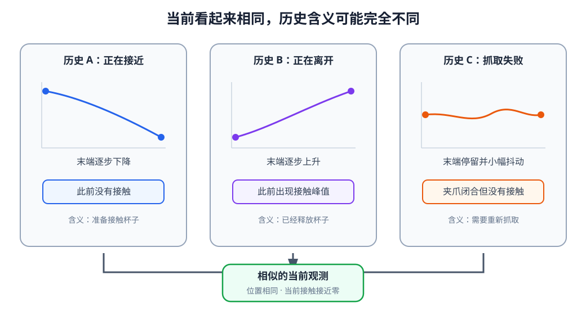
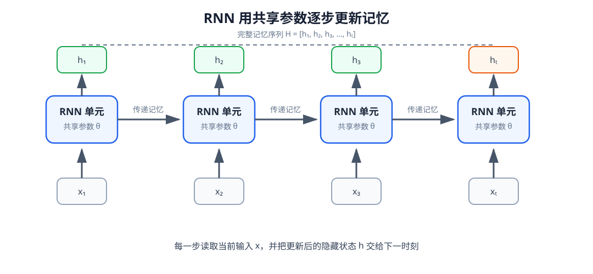
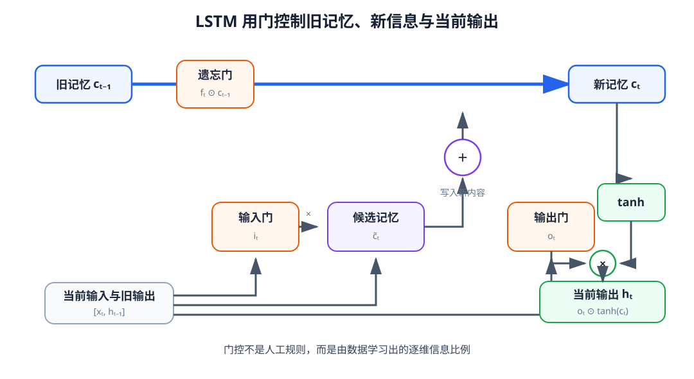
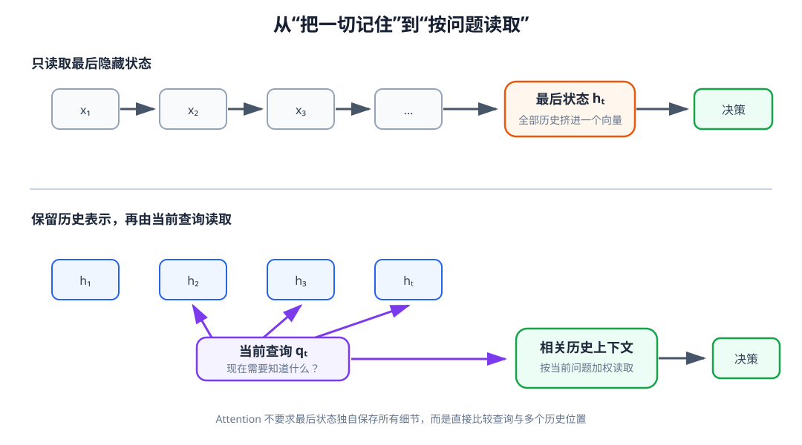

# 08 时间与记忆：RNN、LSTM 与 GRU 怎样理解历史

基础篇已经把视觉、语言、本体、触觉和动作整理成了含义明确的数据接口。对于一个静止场景，这些信息似乎足以描述机器人“现在看到了什么”；但只看当前时刻，机器人经常无法判断“事情正在怎样发展”。相同的末端位置可能出现在接近杯子和离开杯子的过程中，相同的夹爪开度可能表示尚未抓取，也可能表示物体已经滑落，相同的一帧图像也无法说明任务刚开始还是已经完成了抓取。

机器人需要的不只是当前观测，还需要一段能够保留运动趋势、接触变化和任务进程的记忆。本章从最基本的循环神经网络开始，依次理解 RNN、LSTM 和 GRU 怎样沿时间更新内部状态，以及为什么门控记忆仍不能完全解决长历史中的信息读取问题。

学完本章后，你应当能够：

- 说明单帧观测为什么无法描述运动趋势、短暂接触和任务阶段；
- 从机器人轨迹构造带有时间维度、有效位和因果关系的序列输入；
- 解释 RNN 隐藏状态怎样随时间更新，以及参数为什么能够跨时间共享；
- 从实际任务角度理解梯度消失、梯度爆炸和截断反向传播；
- 解释 LSTM 与 GRU 的门控结构分别在控制什么信息；
- 设计对照实验，判断模型是否真的利用了历史；
- 说明循环网络的信息瓶颈怎样引出下一章的 Attention。

## 1. 相同的当前观测可能来自不同历史

考虑机械臂正在把红色杯子放进盒子的任务。在某一时刻，相机看到夹爪位于杯子上方，本体状态给出当前关节角，力传感器的读数接近零。仅根据这一帧，至少存在几种不同解释：机械臂可能正在下降并准备接触杯子，可能刚刚松开杯子并向上离开，也可能因为抓取失败而停在原处。

<figure markdown="span">
  { width="1040" loading=lazy }
  <figcaption>图 08-1　当前时刻的位置和接触读数相同，不代表机器人处于相同任务阶段。运动方向、此前接触和夹爪变化只有放到时间序列中才能判断。（本教程绘制）</figcaption>
</figure>

历史提供了当前数值本身没有携带的信息。连续位置的变化可以给出速度方向，短暂出现后消失的力峰值可以提示刚刚发生过碰撞，夹爪宽度与触觉信号的共同变化可以提示物体是否已经进入夹爪。若任务存在遮挡，模型还可能需要记住物体在消失前的位置。

因此，动作决策更合理的形式不是只依赖当前观测

$$
a_t\sim\pi(a_t\mid o_t,g),
$$

而是依赖当前观测、此前观测和历史动作：

$$
a_t\sim\pi(a_t\mid o_{t-H:t},a_{t-H:t-1},g).
$$

这里的历史长度 $H$ 不是越长越好。过短的窗口可能覆盖不到关键事件，过长的窗口则会引入大量无关信息，并增加计算量和训练难度。怎样把一段可变长度历史变成当前决策可用的记忆，是本章要解决的核心问题。

## 2. 从机器人轨迹构造序列输入

### 时间顺序是数据的一部分

基础篇把一条交互轨迹写成

$$
\tau=(o_0,a_0,o_1,a_1,\ldots,a_{T-1},o_T).
$$

进入序列模型前，需要从每个时刻的观测中整理出结构化输入 $x_t$。为了先看清时间建模，本章可以暂时使用已经编码好的视觉特征、机器人本体、触觉和上一时刻动作：

$$
x_t=left[z_t^{\mathrm{vis}},s_t^{\mathrm{prop}},s_t^{\mathrm{touch}},a_{t-1},g\right].
$$

一段长度为 $T$ 的输入写成

$$
X=[x_1,x_2,\ldots,x_T]\in\mathbb R^{B\times T\times D},
$$

其中 $B$ 是批量大小，$T$ 是序列长度，$D$ 是每个时刻整理后的特征维度。这里的时间顺序不能随意交换。即使两段序列包含相同的位置数值，“先靠近再离开”与“先离开再靠近”也表示不同运动过程。

### 滑动窗口必须保持因果关系

训练样本通常从完整 episode 中按滑动窗口截取。例如，要根据最近 $H$ 步预测时刻 $t$ 的任务阶段，可以使用 $x_{t-H+1:t}$ 作为输入。窗口不能跨越 episode 边界，也不能误把 $t+1$ 之后的观测放入输入，否则模型会在训练时看到部署阶段不可能获得的未来信息。

历史动作尤其需要注意时间对应。$a_{t-1}$ 是机器人在得到 $o_{t-1}$ 后发出的命令，它造成的执行结果才可能出现在 $o_t$ 中。若记录存在控制延迟，命令时间、实际执行时间和传感器采样时间必须先对齐。序列模型能够利用时间关系，却无法自动修复错误的时间戳。

### 不同长度序列需要有效位掩码

同一个 batch 中的 episode 长度往往不同。较短序列可以补齐到共同长度，同时使用

$$
M\in\{0,1\}^{B\times T}
$$

标记真实时间步与补齐位置。损失、状态更新和后续注意力都不应把补齐值当成真实观测。若补齐位置参与训练，模型可能把“连续出现零向量”错误理解成某种任务阶段。

序列输入因此不只是一个三维张量，还应携带起止边界、时间戳、有效位和模态可用性。它们共同构成时间数据契约。

## 3. RNN：让内部状态沿时间传递

普通前馈网络对每个时刻独立计算，当前输出无法知道此前发生过什么。循环神经网络（Recurrent Neural Network，RNN）增加一个随时间传递的隐藏状态 $h_t$：

$$
h_t=\tanh(W_xx_t+W_hh_{t-1}+b_h),
$$

$$
\hat y_t=W_oh_t+b_o.
$$

$x_t$ 是当前输入，$h_{t-1}$ 是此前形成的内部记忆，$h_t$ 则综合了当前信息与过去信息。所有时间步共享 $W_x$、$W_h$ 和偏置参数，因此模型不需要为每个时刻训练一套不同网络。

<figure markdown="span">
  { width="1080" loading=lazy }
  <figcaption>图 08-2　同一个 RNN 单元在每个时间步重复使用。当前输入更新隐藏状态，隐藏状态继续传给下一时刻；模型既可以读取最后状态，也可以保留完整隐藏状态序列。（本教程绘制）</figcaption>
</figure>

“隐藏状态”容易与机器人的真实状态混淆。真实环境状态 $s_t$ 描述物体和机器人的物理情况，通常无法被完全观测；$h_t$ 则是模型根据已有输入形成的内部数值记忆。它可能编码运动方向、是否发生过接触或任务进度，也可能保存与任务无关的信息。隐藏状态具体保留什么，由训练数据、网络容量和学习目标共同决定。

### 最后状态与完整状态序列

如果任务只需要对整段序列做一次判断，可以读取最后一个有效隐藏状态：

$$
\hat y=g(h_T).
$$

例如，根据一段触觉变化判断本次抓取是否稳定。若每个时间步都需要产生预测，则可以读取全部状态：

$$
H=[h_1,h_2,\ldots,h_T]\in\mathbb R^{B\times T\times D_h}.
$$

这一区别会在下一章变得重要。只保留 $h_T$ 意味着全部历史必须压进一个向量；保留 $H$ 则让后续模块有机会直接访问不同时间位置。

## 4. RNN 怎样通过时间学习

循环网络训练时，某个较早时刻的输入可能要为很晚才出现的预测误差负责。为了计算这种影响，可以把循环结构沿时间展开，再从后向前传播梯度，这一过程称为通过时间的反向传播（Backpropagation Through Time，BPTT）。

假设模型需要在物体滑落时输出警告，而真正导致滑落的微弱接触变化发生在十几个时间步之前。训练信号必须穿过中间的多次状态更新，才能告诉模型“早先这次变化值得记住”。这条路径过长时会出现两个相反问题。

梯度消失表示较早时间步收到的更新信号越来越弱。模型能够学习最近几步的关系，却难以把很早的接触事件与当前结果联系起来。梯度爆炸则表示多个时间步上的变化被反复放大，导致参数更新异常、损失剧烈波动，甚至出现非有限数值。

实际训练常使用梯度裁剪限制过大的梯度，并使用截断反向传播控制一次展开的长度。截断能够降低内存和计算成本，但也限制了模型直接获得训练信号的时间跨度。它是一项工程取舍，而不是消除了长期依赖问题。

这里还需要区分“历史被输入模型”和“模型真正使用历史”。把 100 帧数据交给 RNN，不代表第 1 帧的信息仍能影响第 100 帧。是否保留了关键事件必须通过对照实验检验，而不能只根据输入长度判断。

## 5. LSTM：为长期记忆建立受控通道

长短期记忆网络（Long Short-Term Memory，LSTM）在隐藏状态之外增加 cell state $c_t$，并使用门控决定旧信息保留多少、新信息写入多少、当前时刻输出多少。给定当前输入 $x_t$ 和上一时刻隐藏状态 $h_{t-1}$，遗忘门、输入门与候选记忆可写成

$$
f_t=\sigma\!\left(W_f[x_t,h_{t-1}]+b_f\right),
$$

$$
i_t=\sigma\!\left(W_i[x_t,h_{t-1}]+b_i\right),
$$

$$
\tilde c_t=\tanh\!\left(W_c[x_t,h_{t-1}]+b_c\right).
$$

cell state 随后更新为

$$
c_t=f_t\odot c_{t-1}+i_t\odot\tilde c_t.
$$

输出门决定当前隐藏状态读取多少 cell state：

$$
o_t=\sigma\!\left(W_o[x_t,h_{t-1}]+b_o\right),
$$

$$
h_t=o_t\odot\tanh(c_t).
$$

其中 $\sigma$ 把门控值限制在 $0$ 到 $1$，$\odot$ 表示逐元素乘法。若遗忘门某一维接近 $1$，相应旧记忆更容易继续传递；若接近 $0$，相应内容会被削弱。输入门控制新的候选内容写入多少，输出门控制当前隐藏状态暴露多少内部记忆。

<figure markdown="span">
  { width="1080" loading=lazy }
  <figcaption>图 08-3　LSTM 使用 cell state 形成跨时间的记忆通道，并通过遗忘门、输入门和输出门控制旧信息、新信息与当前输出。（本教程绘制）</figcaption>
</figure>

在机器人任务中，可以把“记住短暂接触”“写入新的滑移迹象”和“向当前决策提供抓取状态”作为理解门控作用的直观例子，但不能把这种类比当作训练后的确定解释。网络中的某个门或某个维度未必严格对应人类命名的物理事件；要判断模型保留了什么，仍需通过读出任务和干预实验验证。

LSTM 的优势不在于它永远不会遗忘，而在于 cell state 提供了一条更容易保持和更新信息的路径。历史过长、监督不足或输入噪声很大时，LSTM 同样可能丢失关键事件。

## 6. GRU：用更紧凑的门控更新隐藏状态

门控循环单元（Gated Recurrent Unit，GRU）没有与隐藏状态分离的 cell state，而是通过更新门和重置门直接控制 $h_t$。一种常见写法是

$$
z_t=\sigma\!\left(W_zx_t+U_zh_{t-1}+b_z\right),
$$

$$
r_t=\sigma\!\left(W_rx_t+U_rh_{t-1}+b_r\right),
$$

$$
\tilde h_t=\tanh\!\left(W_hx_t+U_h(r_t\odot h_{t-1})+b_h\right),
$$

$$
h_t=(1-z_t)\odot h_{t-1}+z_t\odot\tilde h_t.
$$

更新门 $z_t$ 在旧状态与候选新状态之间进行插值，重置门 $r_t$ 控制生成候选状态时参考多少旧信息。不同资料可能交换更新公式中 $z_t$ 与 $1-z_t$ 的记号，但实际含义是一致的：模型学习在每个维度上保留旧内容还是接受新内容。

RNN、LSTM 与 GRU 不是简单的“旧、较好、最好”关系。它们的差异更适合从任务和计算条件理解。

| 模型 | 记忆结构 | 主要特点 | 常见限制 |
|---|---|---|---|
| RNN | 单一隐藏状态 | 结构简单，适合解释循环记忆和短期动态 | 长期依赖训练困难 |
| LSTM | hidden state 与 cell state | 门控路径完整，较容易保留长期信息 | 参数和中间状态较多 |
| GRU | 门控隐藏状态 | 结构紧凑，计算量通常低于 LSTM | 仍需顺序计算，仍可能遗忘 |

在数据规模较小、控制频率较高或部署算力有限的任务中，GRU 可能是合适起点；在需要更明确区分内部记忆与当前输出时，LSTM 的结构更便于分析。最终选择应由验证集和真实滚动表现决定，而不是只依据模型名称。

## 7. 变长序列、异步观测与缺失信号

真实机器人数据很少是整齐、等长而且完全同步的。相机可能是 30 Hz，控制器可能是 100 Hz，触觉阵列又可能使用另一种频率。若只是按数组下标拼接，模型会把并非同一时刻的信号当作同时发生。

常见处理方式是选定参考时间轴，把其他传感器按时间戳进行最近邻匹配、插值或聚合，并同时保留采样间隔 $\Delta t_t$。当间隔并不固定时，可把 $\Delta t_t$ 作为输入的一部分，使模型区分“数值没有变化”和“很长时间没有新测量”。

对于补齐位置，可以使用掩码阻止虚假状态更新。设 $\tilde h_t$ 是网络根据当前输入计算出的候选状态，$m_t$ 表示这一时间步是否有效，则可以写成

$$
h_t=m_t\tilde h_t+(1-m_t)h_{t-1}.
$$

当 $m_t=0$ 时，状态保持不变，而不是读取补齐值。模态缺失与时间补齐也应区分：某个时间步可能真实存在，但这一时刻没有新的触觉帧。第 10 章会把时间有效性与模态有效性一起放入多模态 Context Model。

循环网络不能替代数据同步。若动作命令与执行反馈错位，网络可能学到错误因果关系；若丢帧没有记录，网络会把异常大的状态变化误解成正常一步变化。时间戳和 mask 是序列模型输入的一部分，而不是训练前可以丢弃的辅助信息。

## 8. 怎样确认模型真的使用了记忆

训练损失下降只能说明模型拟合了训练目标，不能说明它使用了我们期望的历史线索。一个模型可能只凭当前图像背景猜测任务阶段，也可能利用 episode 长度、补齐模式等无关捷径。

检查时间记忆时，至少应进行下面几类对照。

第一，比较只输入当前时刻、输入短窗口和输入长窗口的表现。如果长窗口没有带来任何变化，需要判断任务是否真的依赖历史，或者模型是否没有学会使用历史。

第二，在不改变当前观测的前提下打乱历史顺序。若“靠近—接触—抬起”与“抬起—接触—靠近”得到相同预测，模型可能只统计了出现过哪些数值，没有理解先后关系。

第三，删除某种历史模态。例如保留当前触觉但删除此前触觉，观察滑移或抓取阶段判断是否明显下降。这比只看整体准确率更能说明特定模态的作用。

第四，按依赖距离分组评测。把关键事件放在当前时刻之前 5、20 或 50 步，观察性能怎样变化。这样可以区分“会使用最近变化”和“能够保留较远事件”。

第五，检查真实滚动过程。离线分类正确不代表闭环稳定：一次错误阶段判断可能导致提前闭合夹爪，随后输入分布便与示范数据不同。序列模型最终仍要在连续执行中评估。

## 配套实践

下面两份实践分别从循环计算本身和可训练模型两个层面验证本章内容。建议先完成 08-01，确认自己能够解释隐藏状态、顺序和 mask，再进入三种循环模型的训练对比。

<div class="home-grid home-grid--two" markdown>

<div class="project-card" markdown>

<p class="project-label">实践 08-01</p>

### 循环记忆怎样形成

用 NumPy 手工展开一个最小 RNN，观察当前输入相同而历史不同时隐藏状态怎样变化，并比较倒序输入、未遮挡补齐和正确 mask。

预计时间：20～25 分钟

<a class="md-button md-button--primary" href="https://colab.research.google.com/github/qi-robotics/robot-world-model-tutorial/blob/main/colab/intermediate/08/08-01-recurrent-memory.ipynb" target="_blank" rel="noopener noreferrer">在 Colab 中运行</a>

</div>

<div class="project-card" markdown>

<p class="project-label">实践 08-02</p>

### 比较 RNN、LSTM 与 GRU

训练三个具有相同隐藏维度的循环模型，比较延迟记忆学习、模型参数量、历史长度泛化和不同时刻的输入梯度。

预计时间：30～40 分钟

<a class="md-button md-button--primary" href="https://colab.research.google.com/github/qi-robotics/robot-world-model-tutorial/blob/main/colab/intermediate/08/08-02-rnn-lstm-gru.ipynb" target="_blank" rel="noopener noreferrer">在 Colab 中运行</a>

</div>

</div>

## 9. 循环记忆的信息瓶颈

RNN、LSTM 和 GRU 都按照固定方向逐步更新状态。如果只把最后隐藏状态交给后续模块，就要求一个有限维向量同时保存物体身份、目标位置、此前接触、运动趋势、语言条件和任务阶段。随着历史变长，早期细节不可避免地需要被压缩或覆盖。

<figure markdown="span">
  { width="1080" loading=lazy }
  <figcaption>图 08-4　只读取最后隐藏状态时，全部历史必须经过同一个信息瓶颈；保留隐藏状态序列后，后续模块可以根据当前问题直接读取相关时刻，这正是 Attention 的出发点。（本教程绘制）</figcaption>
</figure>

一个自然改进是保留完整隐藏状态序列

$$
H_t=[h_1,h_2,\ldots,h_t],
$$

然后根据当前问题选择相关位置。判断“杯子刚才是否发生过接触”时，应重点读取力信号变化附近的状态；判断“当前应移动到哪个目标”时，则可能需要读取语言与早期视觉信息。不同问题需要访问的历史位置并不相同。

循环模型只能按照预先学到的更新规则逐步压缩信息，却不能让当前查询直接与所有历史位置比较。下一章将引入 Query、Key 和 Value，使模型能够根据当前需求计算每个历史位置的重要程度。

## 10. 本章在完整系统中的位置

第 07 章准备了每个时刻的观测与动作接口，本章在这些接口之上增加时间记忆：

$$
h_t=\operatorname{RecurrentModel}(x_t,h_{t-1}),
$$

$$
H_t=[h_{t-H+1},\ldots,h_t].
$$

$h_t$ 可以作为当前时刻的紧凑记忆，$H_t$ 则保留一段可供后续读取的历史表示。它们还不是最终的多模态 Context，因为本章尚未解决视觉区域、语言 token、多个相机和不同历史时刻之间的动态对应关系。

在完整路径中，本章承担的是第一步：

```text
基础篇的逐时刻接口
        ↓
RNN / LSTM / GRU 形成时间记忆
        ↓
Attention / Transformer 选择并组织相关信息
        ↓
多模态 Context Model 形成 Cₜ
        ↓
Action Expert 生成动作
```

### 常见误区

“输入了多帧”不等于“模型记住了多帧”；历史作用必须通过窗口长度、顺序打乱和模态删除等实验验证。LSTM 与 GRU 能缓解长期依赖困难，但不会自动修正传感器错位、错误 mask 或数据泄漏。隐藏状态是模型内部表示，不应直接当作可解释的真实物理状态。更大的隐藏维度也不保证更好的记忆，它可能只是增加拟合无关细节的能力。

## 本章小结

机器人当前观测无法独立说明运动趋势、短暂接触和任务阶段，因此需要把一段历史纳入决策。RNN 通过共享的循环单元逐步更新隐藏状态，LSTM 使用 cell state 和三个门控制记忆，GRU 则用更紧凑的更新门和重置门完成类似的信息选择。序列长度、有效位、时间戳和动作对齐共同决定了这种记忆是否具有正确因果含义。

门控循环网络改善了长期信息传递，却仍需要把不断增长的历史压入有限状态，并按时间顺序完成计算。如果保留完整隐藏状态序列，下一步便可以不再要求最后一个状态独自记住一切，而是让模型根据当前问题直接读取相关时刻。

## 下一章

> 当历史很长、信息来源很多时，模型怎样知道当前应该读取哪一个时刻、哪一个视觉区域或哪一个语言 token？

第 09 章将从循环记忆的信息瓶颈出发，引入 Attention，并进一步把 Attention、残差连接、归一化和前馈网络组织成 Transformer。

[返回进阶篇概览](index.md)
