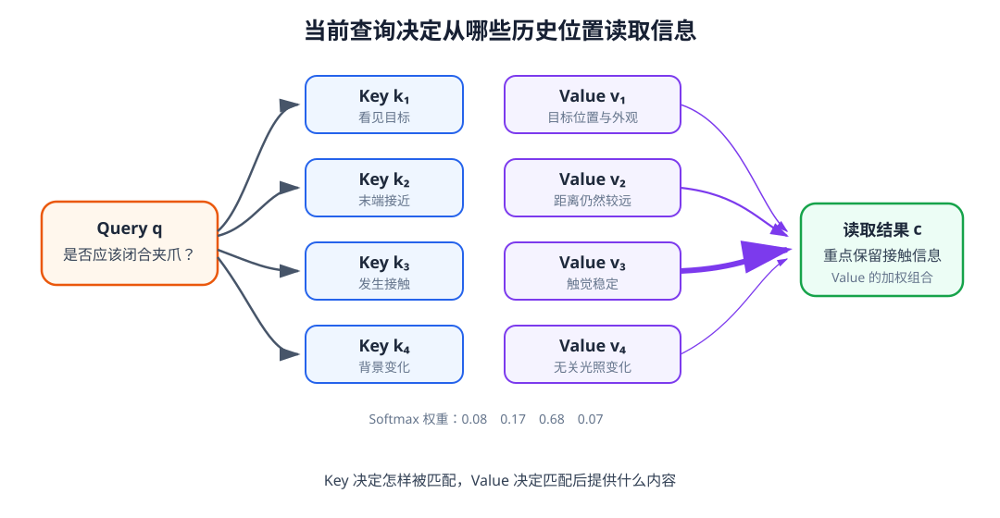
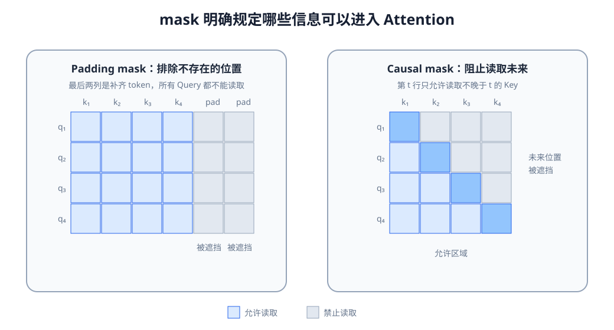
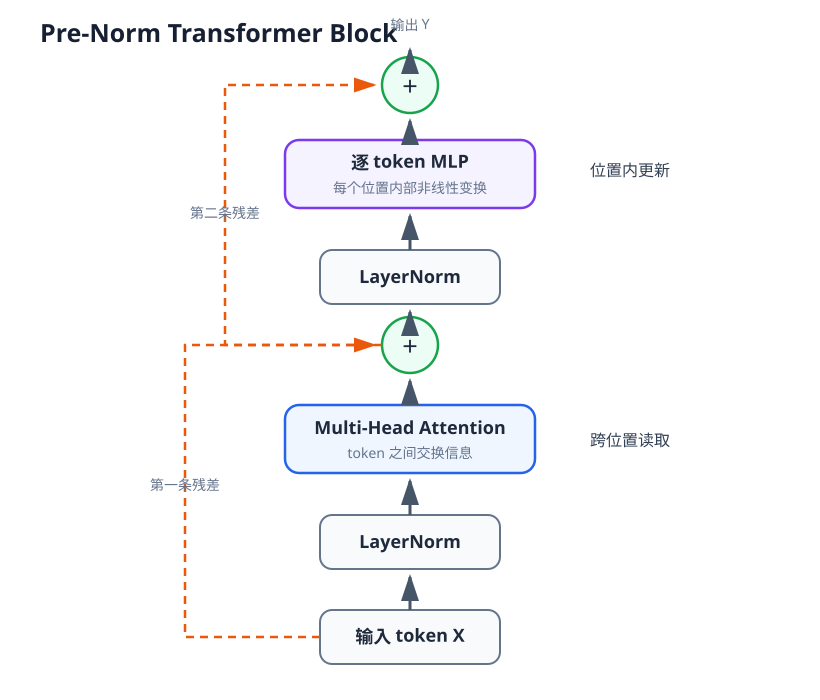

# 09 Attention 与 Transformer：怎样从历史中读取相关信息

第 08 章让机器人拥有了沿时间更新的记忆。RNN、LSTM 和 GRU 可以把运动趋势、接触变化和任务阶段写入隐藏状态，但最后隐藏状态必须承担越来越多的信息：它既要记住早先看见的目标，又要保存刚刚发生的接触，还要反映当前身体状态。历史越长、模态越多，这个固定长度的记忆瓶颈就越明显。

一种自然的做法是保留每个时间步的表示，并在当前需要作出判断时，直接从中读取相关位置。Attention 完成这种“按问题读取”的计算，Transformer 则把 Attention、前馈网络、残差连接和归一化组成能够反复更新整段序列的模型。本章不把 Transformer 当作语言模型专属结构，而是把它放回机器人的时间记忆和多模态信息读取问题中。

学完本章后，你应当能够：

- 用 Query、Key 和 Value 解释一次 Attention 读取；
- 写出缩放点积 Attention，并说明缩放与 Softmax 的作用；
- 区分 padding mask、causal mask 和模态有效性；
- 解释 Self-Attention、Cross-Attention 和 Multi-Head Attention 的接口；
- 说明为什么 Attention 仍然需要位置或时间信息；
- 读懂一个 Pre-Norm Transformer Block 的数据流；
- 区分 Transformer Encoder、因果 Decoder 和 Encoder–Decoder；
- 说明 Attention 权重为什么不能直接等同于因果解释；
- 把 Transformer 的输出连接到下一章的多模态 Context Model。

## 1. 从一个隐藏状态到一组可读取的记忆

第 08 章保留了循环模型在每个时刻产生的隐藏状态：

$$
H_t=[h_1,h_2,\ldots,h_t]\in\mathbb R^{B\times T\times D}.
$$

如果只把 $h_t$ 交给后续模型，全部历史都必须先经过逐步压缩。若保留 $H_t$，当前决策就可以直接比较多个历史位置。例如，判断“杯子是否已经稳定抓住”时，应重点读取接触峰值与夹爪闭合附近的时刻；判断“应该把杯子放到哪里”时，则可能需要读取更早的语言目标和视觉位置。

这种读取需要三个对象：当前在问什么、每个历史位置可以用什么信息匹配这个问题、匹配之后实际取回什么内容。它们分别对应 Query、Key 和 Value。

## 2. Query、Key 和 Value

设当前查询为 $q$，历史中第 $i$ 个位置的匹配标识为 $k_i$，实际内容为 $v_i$。模型先计算查询与所有 Key 的相似度，再把相似度转成权重，最后对 Value 加权求和：

$$
s_i=q^\top k_i,
$$

$$
\alpha_i=\frac{\exp(s_i)}{\sum_j\exp(s_j)},
$$

$$
c=\sum_i\alpha_i v_i.
$$

这里的 $c$ 是查询从历史中读出的上下文。Key 和 Value 可以来自同一个历史表示的不同线性投影：Key 负责“怎样被找到”，Value 负责“找到以后提供什么”。二者数值维度可以不同，但在常见实现中通常使用相同模型维度以便组合。

<figure markdown="span">
  { width="1080" loading=lazy }
  <figcaption>图 09-1　当前查询与各历史位置的 Key 计算相似度，Softmax 得到读取权重，再对相应 Value 加权。查询变化时，被读取的历史也会变化。（本教程绘制）</figcaption>
</figure>

在机器人任务中，Query 可以表示“当前是否应该闭合夹爪”，Key 可以编码每个历史时刻发生了什么，Value 则携带对应的视觉、本体或触觉内容。需要注意，这只是接口含义，不意味着模型会自动学成人类命名的规则；它仍需要通过训练目标学习哪些匹配有用。

## 3. 缩放点积 Attention

批量计算时，把多个 Query、Key 和 Value 分别写成矩阵 $Q$、$K$ 和 $V$：

$$
\operatorname{Attention}(Q,K,V)
=\operatorname{softmax}\left(\frac{QK^\top}{\sqrt{d_k}}+M\right)V.
$$

若

$$
Q\in\mathbb R^{B\times N_q\times d_k},\qquad
K\in\mathbb R^{B\times N_k\times d_k},\qquad
V\in\mathbb R^{B\times N_k\times d_v},
$$

则注意力权重形状是 $[B,N_q,N_k]$，输出形状是 $[B,N_q,d_v]$。每个 Query 都会得到一行对全部 Key 的权重。

点积会随 $d_k$ 增大而产生更大波动。如果直接送入 Softmax，权重容易过早接近 0 或 1，使梯度集中在少数位置。除以 $\sqrt{d_k}$ 可以让相似度尺度更稳定。Softmax 不是在判断某个位置“绝对正确”，而是在当前可读取位置之间分配相对权重。

矩阵 $M$ 用来排除不允许读取的位置。被遮挡位置通常加入很大的负数，使其经过 Softmax 后权重接近零。mask 因而会直接改变信息流，而不仅是改变图形显示。

## 4. 三种容易混淆的 mask

### Padding mask 排除不存在的 token

同一个 batch 中序列长度不同时，补齐位置不应提供 Key 和 Value。Padding mask 标记哪些位置是真实数据。若忘记它，模型可能把补齐模式当成任务线索，也可能把大量零向量纳入归一化。

### Causal mask 阻止读取未来

预测时刻 $t$ 的动作或状态时，只能读取不晚于 $t$ 的信息。Causal mask 在注意力矩阵上形成上三角遮挡：第 $t$ 个 Query 不能访问 $t+1$ 之后的 Key。训练数据即使完整保存了未来，也不能让未来 token 泄漏到当前预测。

### 模态有效性处理传感器缺失

真实时间步可能存在，但某个模态没有新数据。例如相机掉帧而本体状态正常。此时不能把整个时间步当作 padding，而要分别记录模态有效性。第 10 章会把时间 mask、模态 mask 和多相机有效位放进同一个 Context Model。

<figure markdown="span">
  { width="1040" loading=lazy }
  <figcaption>图 09-2　Padding mask 排除补齐位置；causal mask 让每个查询只能读取当前及过去。二者解决的问题不同，也可以同时使用。（本教程绘制）</figcaption>
</figure>

## 5. Self-Attention 与 Cross-Attention

Self-Attention 的 Query、Key 和 Value 来自同一组输入：

$$
Q=XW_Q,\qquad K=XW_K,\qquad V=XW_V.
$$

它让序列内部各位置交换信息。机器人历史中的触觉 token 可以读取此前的夹爪状态，某个视觉 patch 可以读取同一图像中其他区域，语言 token 也可以根据上下文更新含义。

Cross-Attention 的 Query 与 Key/Value 来自不同来源：

$$
Q=X_qW_Q,\qquad K=X_mW_K,\qquad V=X_mW_V.
$$

例如，语言 token 作为 Query 读取视觉 patch，动作查询 token 读取多模态历史，或者少量 latent query 从大量相机与时间 token 中压缩信息。Cross-Attention 不要求两个序列长度相同，因此非常适合建立模态之间的接口。

Self-Attention 和 Cross-Attention 不是互斥架构。一套 Context Model 可以先让每种模态内部更新，再用 Cross-Attention 建立对应；也可以把所有 token 放进同一序列直接做 Self-Attention。下一章将比较这些组织方式。

## 6. Multi-Head Attention 为什么需要多个头

单个注意力头只形成一套相似度和加权读取。Multi-Head Attention 把模型维度投影成多组较小的 Query、Key 和 Value，让不同头并行读取：

$$
\operatorname{head}_j=\operatorname{Attention}(QW_Q^{(j)},KW_K^{(j)},VW_V^{(j)}),
$$

$$
\operatorname{MHA}(Q,K,V)=\operatorname{Concat}(\operatorname{head}_1,\ldots,\operatorname{head}_H)W_O.
$$

在同一个机器人片段中，一个头可能更关注接触变化，另一个头可能更关注语言目标与视觉对象的对应，还有一个头可能跟踪动作与本体变化。但这种解释必须经过实验验证，不能只凭一张权重图给每个头命名。不同头也可能学习相似模式，甚至有些头对最终输出贡献很小。

多头并不会降低注意力矩阵的主要长度开销。对于长度为 $N$ 的 Self-Attention，权重矩阵规模仍随 $N^2$ 增长。多相机、高分辨率视觉 token 和长历史组合时，序列长度会很快成为内存与实时推理瓶颈。

## 7. Attention 本身不知道顺序和位置

若不加入位置信息，Self-Attention 对 token 排列具有置换等变性：把输入顺序打乱，输出也只是按同样方式重排。对于机器人历史，“先接触再抬起”和“先抬起再接触”包含相同 token，却代表不同过程，因此模型必须知道时间位置。

常见做法是在 token 表示上加入位置编码：

$$
\tilde x_t=x_t+p_t.
$$

$p_t$ 可以是固定正弦编码，也可以是可学习向量。图像 token 需要二维空间位置，历史需要时间位置，多相机输入还需要相机来源。位置编号也不等于真实时间：当采样间隔不固定时，还应提供时间戳或 $\Delta t$，否则相邻 token 可能分别间隔 10 ms 和 200 ms，模型却无法区分。

位置编码并不能自动保证因果性。一个带时间位置的 token 仍然可以通过全连接注意力读取未来，因果任务仍需 causal mask。

## 8. 从 Attention 到 Transformer Block

一次 Attention 只是按权重混合信息。完整 Transformer Block 还需要前馈网络、残差连接和归一化。常见 Pre-Norm 结构写成

$$
X'=X+\operatorname{MHA}(\operatorname{LN}(X)),
$$

$$
Y=X'+\operatorname{MLP}(\operatorname{LN}(X')).
$$

LayerNorm 稳定每个 token 的特征尺度；残差连接让新计算是在旧表示基础上补充信息，也为深层网络提供更直接的梯度路径；MLP 对每个 token 独立进行非线性特征变换。多个 Block 层叠后，信息可以反复在 token 之间传播，再在每个位置内部更新。

<figure markdown="span">
  { width="820" loading=lazy }
  <figcaption>图 09-3　Pre-Norm Transformer Block 由归一化、Multi-Head Attention、残差、逐 token MLP 和第二条残差组成。Attention 负责位置之间的信息交换，MLP 负责位置内部的非线性变换。（本教程绘制）</figcaption>
</figure>

Pre-Norm 与 Post-Norm 的差别在于 LayerNorm 放在子层之前还是残差相加之后。二者都能工作，但深层训练稳定性与初始化行为不同。本教程后续默认使用 Pre-Norm，并在出现其他结构时明确标注。

## 9. Encoder、因果 Decoder 与 Encoder–Decoder

Transformer Encoder 通常允许所有有效输入位置相互读取，适合把一段已经可用的观测和历史编码成上下文。因果 Transformer Decoder 使用 causal mask，每个位置只能读取自身和此前位置，适合自回归地预测下一个 token 或动作。

Encoder–Decoder 结构先用 Encoder 表示输入，再让 Decoder 通过 Cross-Attention 读取 Encoder 输出。语言翻译是典型例子；在机器人中，也可以让 Context Encoder 处理多模态历史，再让动作 Decoder 逐步生成动作。

“Encoder”不表示没有时间，“Decoder”也不必生成自然语言。决定模型含义的是输入、mask、训练目标和输出接口。第 11 章讨论自回归动作时会再次使用因果 Decoder。

## 10. Attention 权重能说明什么

注意力权重可以显示某个 Query 在当前层从哪些 Value 读取了较多信息，是很有用的调试工具。例如，padding 位置获得高权重通常说明 mask 有误，语言查询始终只看背景则提示视觉对应可能没有学好。

但权重不等于因果解释。后续层、残差路径和 MLP 都会继续改变表示；一个位置权重较高，不代表改变它一定最影响最终动作；多个 Value 也可能携带重复信息。更可靠的检查还应包括遮挡或删除输入、打乱历史、替换模态、比较输出变化和闭环任务评测。

## 11. 计算成本与机器人实时性

Self-Attention 的权重矩阵大小约为 $N\times N$。若同时使用多个相机、每帧大量视觉 patch 和几十步历史，token 数量相乘后会迅速增加。常见缓解方式包括降低视觉分辨率、空间池化、只保留关键帧、使用滑动时间窗口、缓存历史 Key/Value，或者用少量 latent query 压缩大量输入。

推理频率也要与控制频率区分。Transformer 可以低频更新任务上下文，底层控制器继续高频执行；也可以在视觉帧到达时异步更新缓存。模型结构必须服从实际时间预算，而不能只比较离线准确率。

## 配套实践

<div class="home-grid home-grid--two" markdown>

<div class="project-card" markdown>

<p class="project-label">实践 09-01</p>

### 手工计算 Attention 与 mask

用 NumPy 完成缩放点积 Attention，观察查询变化、Softmax 缩放、padding mask 和 causal mask 怎样改变读取结果。

预计时间：25～30 分钟

<a class="md-button md-button--primary" href="https://colab.research.google.com/github/qi-robotics/robot-world-model-tutorial/blob/main/colab/intermediate/09/09-01-attention-and-masks.ipynb" target="_blank" rel="noopener noreferrer">在 Colab 中运行</a>

</div>

<div class="project-card" markdown>

<p class="project-label">实践 09-02</p>

### Transformer 怎样识别事件顺序

训练小型 Transformer 判断两个机器人事件的先后顺序，并通过移除位置编码验证 Attention 为什么不能独自知道时间位置。

预计时间：30～40 分钟

<a class="md-button md-button--primary" href="https://colab.research.google.com/github/qi-robotics/robot-world-model-tutorial/blob/main/colab/intermediate/09/09-02-transformer-history.ipynb" target="_blank" rel="noopener noreferrer">在 Colab 中运行</a>

</div>

</div>

## 12. 本章在完整系统中的位置

第 08 章产生一组时间记忆 $H_t$，本章提供对这些记忆进行动态读取和反复更新的方法：

$$
\tilde H_t=\operatorname{Transformer}(H_t,M_t,P_t).
$$

其中 $M_t$ 描述可读取位置，$P_t$ 提供时间或空间位置。Transformer 输出仍然只是一组通用 token；它尚未规定视觉、语言、本体、触觉和动作历史怎样排列，也没有决定最后应输出单个 Context 向量还是一组 Context token。

```text
时间记忆 Hₜ
    ↓
Attention 按查询读取相关位置
    ↓
Transformer 反复交换和更新信息
    ↓
带上下文的 token 序列
    ↓
多模态 Context Model 规定模态组织与输出接口
```

## 本章小结

Attention 使用 Query 与 Key 的相似度决定从哪些 Value 读取信息，缩放稳定点积范围，Softmax 形成相对权重，mask 则明确禁止哪些信息进入计算。Self-Attention 在同一序列内部交换信息，Cross-Attention 连接不同来源，多头结构提供多组并行读取子空间。

Transformer 在 Attention 之外加入位置编码、前馈网络、残差和归一化，使整段序列能够经过多层更新。它解决了“怎样读取和组织 token”，却没有自动解决“机器人各种模态怎样成为 token、怎样对齐时间、怎样处理缺失输入以及怎样形成统一任务上下文”。

## 下一章

> 视觉 patch、语言 token、本体状态、触觉和历史动作具有不同形状、频率与物理含义，怎样把它们放进同一个 Transformer，并得到 Action Expert 可以直接使用的 Context？

第 10 章将把基础篇的各类接口接入本章的 Attention 与 Transformer，建立完整的多模态 Context Model。

[返回进阶篇概览](index.md)
