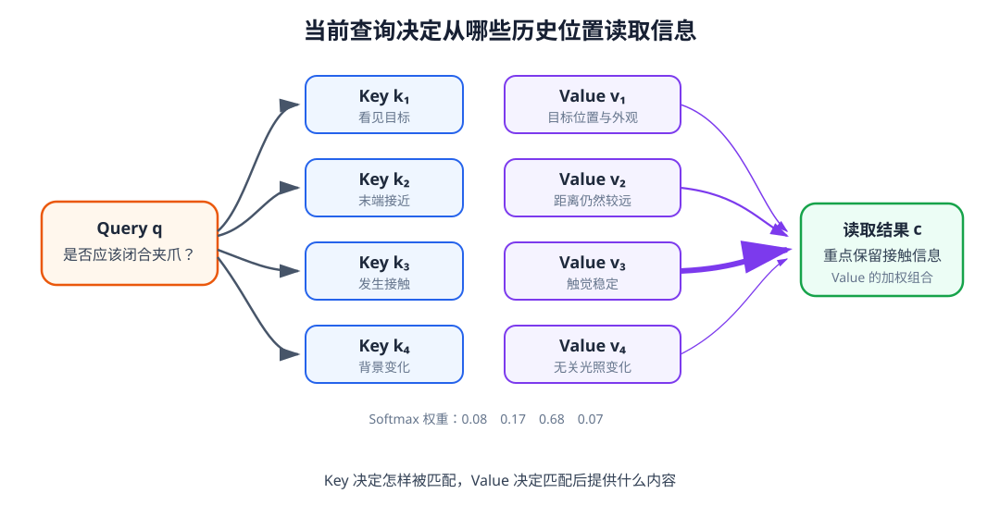
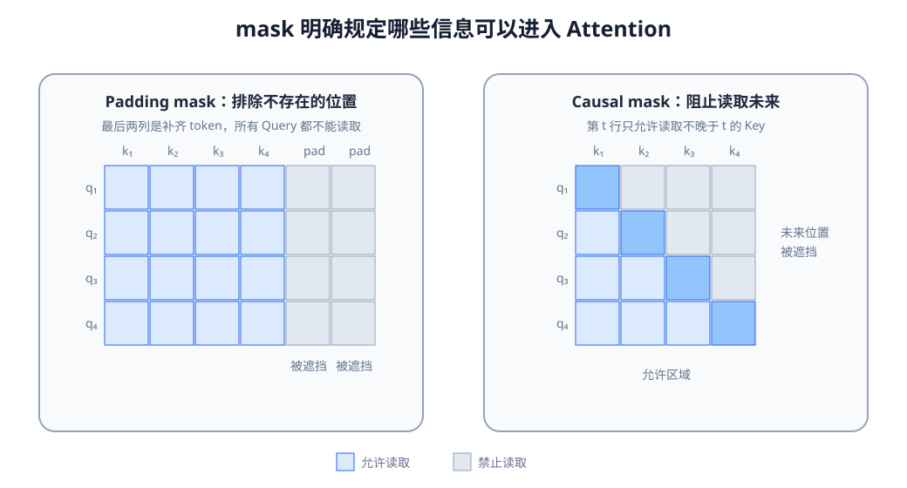
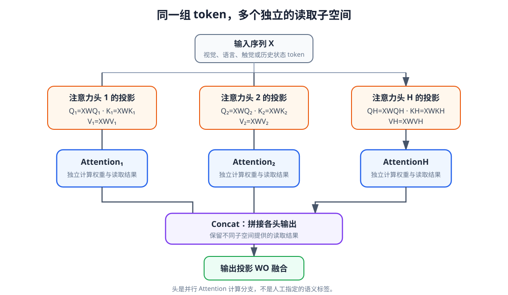
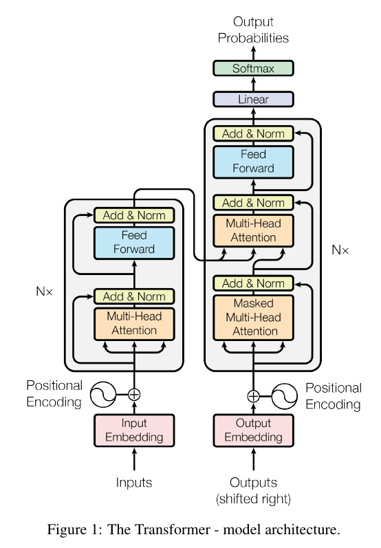
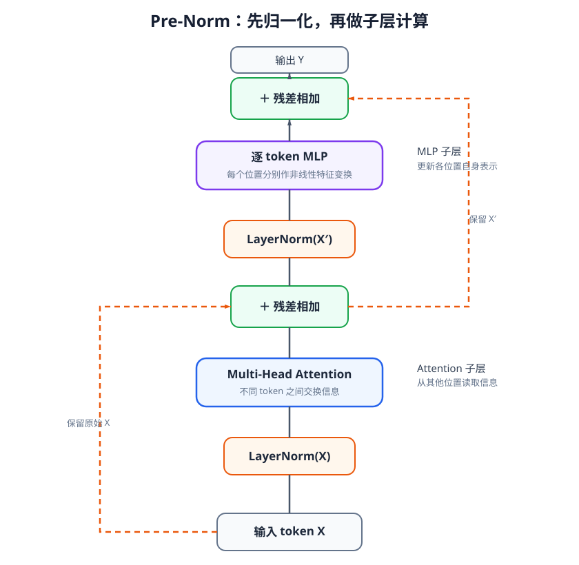

# 09 Attention 与 Transformer：怎样从历史中读取相关信息

第 08 章让机器人拥有了沿时间更新的记忆。RNN、LSTM 和 GRU 可以把运动趋势、接触变化和任务阶段写入隐藏状态，但最后隐藏状态必须承担越来越多的信息：它既要记住早先看见的目标，又要保存刚刚发生的接触，还要反映当前身体状态。历史越长、模态越多，这个固定长度的记忆瓶颈就越明显。

一种自然的做法是保留每个时间步的表示，并在当前需要作出判断时，直接从中读取相关位置。Attention 完成这种“按问题读取”的计算，Transformer 则把 Attention、前馈网络、残差连接和归一化组成能够反复更新整段序列的模型。本章不把 Transformer 当作语言模型专属结构，而是把它放回机器人的时间记忆和多模态信息读取问题中。

学完本章后，你应当能够：

- 用 Query、Key 和 Value 解释一次 Attention 读取；
- 写出缩放点积 Attention，并说明缩放与 Softmax 的作用；
- 区分 padding mask、causal mask 和模态有效性；
- 解释 Self-Attention、Cross-Attention 和 Multi-Head Attention 的接口；
- 说明为什么 Attention 仍然需要位置或时间信息；
- 读懂一个 Pre-Norm（前归一化）Transformer Block（模块）的数据流；
- 区分 Transformer Encoder、因果 Decoder 和 Encoder–Decoder；
- 说明 Attention 权重为什么不能直接等同于因果解释；
- 把 Transformer 的输出连接到下一章的多模态 Context Model。

## 1. 从一个隐藏状态到一组可读取的记忆

第 08 章保留了循环模型在每个时刻产生的隐藏状态：

$$
H_t=[h_1,h_2,\ldots,h_t]\in\mathbb R^{B\times T\times D}.
$$

如果只把 $h_t$ 交给后续模型，全部历史都必须先经过逐步压缩。若保留 $H_t$，当前决策就可以直接比较多个历史位置。例如，判断“杯子是否已经稳定抓住”时，应重点读取接触峰值与夹爪闭合附近的时刻；判断“应该把杯子放到哪里”时，则可能需要读取更早的语言目标和视觉位置。

这种读取需要三个对象：当前在问什么、每个历史位置可以用什么信息匹配这个问题、匹配之后实际取回什么内容。它们分别对应 Query、Key 和 Value。

## 2. Query、Key 和 Value

先把一个具体问题说清楚。假设机器人正在判断是否闭合夹爪。此时的 Query 不是“正确动作”这个监督标签，也不是原样输入的一句中文，而是模型当前用于发起读取的数值表示。它可以来自当前决策 token，也可以来自融合了当前视觉、本体和触觉信息的隐藏表示。换成 Self-Attention 时，每个历史 token 都会各自形成 Query；换成 Cross-Attention 时，Query 可以来自动作/任务侧，而 Key 和 Value 来自观测历史。

这些对象在计算时全是数字。语言指令会先被分成一个或多个 token ID，再通过 embedding 表查到向量；token ID 本身只是离散索引，embedding 表中的向量参数也会在训练中根据任务损失更新。“是否应该闭合夹爪”这句话通常不会天然等于一个 token 或一个固定向量。图像由视觉编码器变成 patch 特征，关节和触觉也会经归一化、线性投影或专用编码器变成向量。随后可加上模态、相机和时间位置表示，再把每个向量作为一个 token 表示。基础篇第 03—07 章介绍的视觉、语言、本体和触觉接口，正是这些数值表示的来源。

例如，令当前决策表示为 $x_q$，第 $i$ 个历史 token 为 $x_i$。模型分别用可学习的投影矩阵把它们变成 Query、Key 和 Value：

$$
q=x_qW_Q,\qquad k_i=x_iW_K,\qquad v_i=x_iW_V.
$$

$W_Q$、$W_K$、$W_V$ 是模型参数，不是人工编写的匹配表。训练开始时它们由初始化规则给出初值；模型根据预测与目标之间的损失，通过反向传播得到梯度，再由优化器逐步更新这些矩阵。训练数据通常不会直接告诉模型“这个头的 Key 应代表接触”，而是通过最终任务误差间接塑造有用的投影。换句话说，监督标签参与训练，但它不是 Query；Query/Key/Value 的具体匹配方式是模型从训练中学出的。

有了这些向量后，模型先计算 Query 与每个 Key 的相似度，再把分数变成相对读取权重，最后对对应 Value 加权求和：

$$
s_i=q^\top k_i,
$$

$$
\alpha_i=\frac{\exp(s_i)}{\sum_j\exp(s_j)},
$$

$$
c=\sum_i\alpha_i v_i.
$$

这里的 $c$ 是查询从历史中读出的上下文。Key 和 Value 可以来自同一个历史表示的不同线性投影：Key 负责“怎样被找到”，Value 负责“找到以后提供什么”。二者数值维度可以不同，但在常见实现中通常使用相同模型维度以便组合。

<figure markdown="span">
  { width="1080" loading=lazy }
  <figcaption>图 09-1　当前查询与各历史位置的 Key 计算相似度，Softmax 得到读取权重，再对相应 Value 加权。查询变化时，被读取的历史也会变化。（本教程绘制）</figcaption>
</figure>

这里的自然语言说法只是帮助理解任务意图。实际模型看到的是 $q$、$k_i$、$v_i$ 等向量及其运算，不会在计算图里读取“接触”这个汉字，也不保证某个向量维度就能被解释为“夹爪应该闭合”。

## 3. 缩放点积 Attention

批量计算时，把多个 Query、Key 和 Value 分别写成矩阵 $Q$、$K$ 和 $V$：

$$
\operatorname{Attention}(Q,K,V)
=\operatorname{softmax}\left(\frac{QK^\top}{\sqrt{d_k}}+M\right)V.
$$

若

$$
Q\in\mathbb R^{B\times N_q\times d_k},\qquad
K\in\mathbb R^{B\times N_k\times d_k},\qquad
V\in\mathbb R^{B\times N_k\times d_v},
$$

则注意力权重形状是 $[B,N_q,N_k]$，输出形状是 $[B,N_q,d_v]$。每个 Query 都会得到一行对全部 Key 的权重。

公式中的 $\alpha$ 就是注意力权重：它由当前输入的 Query-Key 分数经过 Softmax 即时计算得到，不是另存的一组可训练参数，也不是监督标签。权重会随输入、层和注意力头改变；第 10 节讨论的正是怎样把这些中间读取比例用于调试，以及它们不能证明什么。

点积会随 $d_k$ 增大而产生更大波动。如果直接送入 Softmax，权重容易过早接近 0 或 1，使梯度集中在少数位置。除以 $\sqrt{d_k}$ 可以让相似度尺度更稳定。Softmax 不是在判断某个位置“绝对正确”，而是在当前可读取位置之间分配相对权重。

矩阵 $M$ 用来排除不允许读取的位置。被遮挡位置通常加入很大的负数，使其经过 Softmax 后权重接近零。mask 因而会直接改变信息流，而不仅是改变图形显示。

## 4. 三种容易混淆的 mask

### Padding mask 排除不存在的 token

同一个 batch 中序列长度不同时，补齐位置不应提供 Key 和 Value。Padding mask 标记哪些位置是真实数据。若忘记它，模型可能把补齐模式当成任务线索，也可能把大量零向量纳入归一化。

### Causal mask 阻止读取未来

预测时刻 $t$ 的动作或状态时，只能读取不晚于 $t$ 的信息。Causal mask 在注意力矩阵上形成上三角遮挡：第 $t$ 个 Query 不能访问 $t+1$ 之后的 Key。训练数据即使完整保存了未来，也不能让未来 token 泄漏到当前预测。

### 模态有效性处理传感器缺失

真实时间步可能存在，但某个模态没有新数据。例如相机掉帧而本体状态正常。此时不能把整个时间步当作 padding，而要分别记录模态有效性。第 10 章会把时间 mask、模态 mask 和多相机有效位放进同一个 Context Model。

<figure markdown="span">
  { width="1040" loading=lazy }
  <figcaption>图 09-2　Padding mask 排除补齐位置；causal mask 让每个查询只能读取当前及过去。二者解决的问题不同，也可以同时使用。（本教程绘制）</figcaption>
</figure>

## 5. Self-Attention 与 Cross-Attention

Self-Attention 的 Query、Key 和 Value 来自同一组输入：

$$
Q=XW_Q,\qquad K=XW_K,\qquad V=XW_V.
$$

它让序列内部各位置交换信息。机器人历史中的触觉 token 可以读取此前的夹爪状态，某个视觉 patch 可以读取同一图像中其他区域，语言 token 也可以根据上下文更新含义。

Cross-Attention 的 Query 与 Key/Value 来自不同来源：

$$
Q=X_qW_Q,\qquad K=X_mW_K,\qquad V=X_mW_V.
$$

例如，语言 token 作为 Query 读取视觉 patch，动作查询 token 读取多模态历史，或者少量 latent query 从大量相机与时间 token 中压缩信息。Cross-Attention 不要求两个序列长度相同，因此非常适合建立模态之间的接口。

Self-Attention 和 Cross-Attention 不是互斥架构。一套 Context Model 可以先让每种模态内部更新，再用 Cross-Attention 建立对应；也可以把所有 token 放进同一序列直接做 Self-Attention。下一章将比较这些组织方式。

## 6. Multi-Head Attention 为什么需要多个头

“头”（head）不是一个机器人部件，也不是完整网络层，而是一条独立的注意力计算分支。单头先用自己的一组投影矩阵形成 $Q$、$K$、$V$，再计算一张权重表并输出一组读取结果；它只能在自己这一套投影空间中匹配和汇总信息。Multi-Head Attention 则把同一批输入分别送入多组彼此独立的投影，让多个分支并行完成读取：

$$
\operatorname{head}_j=\operatorname{Attention}(QW_Q^{(j)},KW_K^{(j)},VW_V^{(j)}),
$$

$$
\operatorname{MHA}(Q,K,V)=\operatorname{Concat}(\operatorname{head}_1,\ldots,\operatorname{head}_H)W_O.
$$

在同一个机器人片段中，一个头可能更关注接触变化，另一个头可能更关注语言目标与视觉对象的对应，还有一个头可能跟踪动作与本体变化。但这种解释必须经过实验验证，不能只凭一张权重图给每个头命名。不同头也可能学习相似模式，甚至有些头对最终输出贡献很小。

下面的图把“多个头”画成并行分支：每个分支都接收同一组 token，但拥有自己的 $W_Q^{(j)}$、$W_K^{(j)}$、$W_V^{(j)}$，因此可以产生不同的注意力权重和输出。各头的结果先拼接，再由 $W_O$ 投影回模型维度。分支编号只是结构编号，图中没有预先规定“头 1 必须看接触、头 2 必须看语言”；这些分工若存在，是训练形成的，必须用实验检查。

<figure markdown="span">
  { width="1080" loading=lazy }
  <figcaption>图 09-3　每个注意力头使用独立投影并各自完成一次读取，拼接后再映射回模型维度。（本教程绘制）</figcaption>
</figure>

多头并不会降低注意力矩阵的主要长度开销。对于长度为 $N$ 的 Self-Attention，权重矩阵规模仍随 $N^2$ 增长。多相机、高分辨率视觉 token 和长历史组合时，序列长度会很快成为内存与实时推理瓶颈。

## 7. Attention 本身不知道顺序和位置

若不加入位置信息，Self-Attention 对 token 排列具有置换等变性：把输入顺序打乱，输出也只是按同样方式重排。对于机器人历史，“先接触再抬起”和“先抬起再接触”包含相同 token，却代表不同过程，因此模型必须知道时间位置。

常见做法是在 token 表示上加入位置编码：

$$
\tilde x_t=x_t+p_t.
$$

$p_t$ 可以是固定正弦编码，也可以是可学习向量。图像 token 需要二维空间位置，历史需要时间位置，多相机输入还需要相机来源。位置编号也不等于真实时间：当采样间隔不固定时，还应提供时间戳或 $\Delta t$，否则相邻 token 可能分别间隔 10 ms 和 200 ms，模型却无法区分。

位置编码并不能自动保证因果性。一个带时间位置的 token 仍然可以通过全连接注意力读取未来，因果任务仍需 causal mask。

## 8. Transformer 怎样把 Attention 组成完整网络

先看原论文中的经典架构。图左是 Encoder（编码器）堆栈，图右是 Decoder（解码器）堆栈；两侧都重复 $N$ 个层。该图来自机器翻译的 Encoder–Decoder Transformer，不代表所有现代 Transformer 都必须同时有左右两部分。

<figure markdown="span">
  { width="640" loading=lazy }
  <figcaption>图 09-4　Transformer 原始 Encoder–Decoder 架构，转载自 Vaswani 等人（2017）《Attention Is All You Need》图 1；<a href="https://arxiv.org/abs/1706.03762" target="_blank" rel="noopener noreferrer">论文与原图来源</a>。</figcaption>
</figure>

读图时从底部沿箭头向上。左侧把输入 token 变成 Embedding（嵌入向量），与 Positional Encoding（位置编码）相加后进入 Encoder。每个 Encoder 层先做 Multi-Head Self-Attention，让输入序列各位置交换信息；再经过 Add & Norm（残差相加与归一化）；接着用 Feed Forward（前馈网络）逐位置变换特征，再做一次 Add & Norm。图中的 $N\times$ 表示重复堆叠多层，原论文实验采用 $N=6$。

右侧 Decoder 的底部输入是右移一位的目标序列（Outputs shifted right），并加入位置编码。它先经过 Masked Multi-Head Attention，因果 mask 阻止当前位置读取未来目标；然后通过第二个 Attention 子层读取左侧 Encoder 的输出：Decoder 当前表示作为 Query，Encoder 输出作为 Key 和 Value，这就是 Cross-Attention；随后再经过逐位置前馈网络。最上面的 Linear（线性层）和 Softmax 把每个位置映射为下一个目标 token 的概率。这个结构解释了为什么 Decoder 同时需要“读自己的过去”和“读输入序列”。

原图中的 Add & Norm 方框位于各个子层输出之后，画的是 Post-Norm（后归一化）次序。今天常用实现也可能采用 Pre-Norm（前归一化）；下方公式和图 09-5 展示的是 Pre-Norm，二者的主要区别是 LayerNorm（层归一化）位于子层计算之前还是残差相加之后，并不是箭头方向不同。

一次 Attention 只按权重混合信息。完整 Transformer Block 还需使用残差连接保留输入，并用前馈网络更新每个 token 自身的特征。以 Pre-Norm 为例，设输入为 $X\in\mathbb R^{B\times T\times d_{model}}$，其数据流可分为两步：

$$
X'=X+\operatorname{MHA}(\operatorname{LN}(X)),
$$

$$
Y=X'+\operatorname{MLP}(\operatorname{LN}(X')).
$$

第一步先对每个 token 做 LayerNorm，再用 Multi-Head Attention 让位置之间交换信息，最后把这项新信息加回原始 $X$ 得到 $X'$。第二步归一化 $X'$，送入逐 token 的 MLP，再加回 $X'$ 得到输出 $Y$。MLP 通常是“升维线性层—非线性激活（如 ReLU 或 GELU）—降维线性层”；它在每个位置分别计算，但所有位置共享同一组 MLP 参数。Attention 负责 token 之间的信息交换，MLP 负责每个 token 内部的非线性特征变换。

LayerNorm 使 token 的特征尺度更稳定；残差路径把子层输入直接送到加法节点，使每个子层可以学习“在已有表示上增加什么”，而不是每层都从头重写表示。图中的虚线是残差支路，实线是经过归一化和子层计算的支路；两个方形加法框接收两条输入，箭头都明确终止在框边。

<figure markdown="span">
  { width="840" loading=lazy }
  <figcaption>图 09-5　虚线分别把原始 $X$ 和中间结果 $X'$ 送到两个残差加法节点；与 Attention、MLP 子层的计算结果相加后，依次得到 $X'$ 和 $Y$。（本教程绘制）</figcaption>
</figure>

因此，Pre-Norm（前归一化）可以概括为“LayerNorm → 子层 → 与原输入相加”；Post-Norm（后归一化）则是“子层 → 与原输入相加 → LayerNorm”。原论文采用后者，许多较深的后续模型采用前者以改善优化稳定性。本教程后续默认采用 Pre-Norm，遇到 Post-Norm 会明确标注；两者不能仅凭图中都有 Add & Norm 就当成同一顺序。

## 9. Encoder、因果 Decoder 与 Encoder–Decoder

Transformer Encoder 通常允许所有有效输入位置相互读取，适合把一段已经可用的观测和历史编码成上下文。因果 Transformer Decoder 使用 causal mask，每个位置只能读取自身和此前位置，适合自回归地预测下一个 token 或动作。

Encoder–Decoder 结构先用 Encoder 表示输入，再让 Decoder 通过 Cross-Attention 读取 Encoder 输出。语言翻译是典型例子；在机器人中，也可以让 Context Encoder 处理多模态历史，再让动作 Decoder 逐步生成动作。

“Encoder”不表示没有时间，“Decoder”也不必生成自然语言。决定模型含义的是输入、mask、训练目标和输出接口。第 11 章讨论自回归动作时会再次使用因果 Decoder。

## 10. Attention 权重：读取过程的可观察量

第 3 节已经定义了权重 $\alpha_{ij}$：对第 $i$ 个 Query，它表示当前层在归一化后分给第 $j$ 个 Key/Value 位置的比例；所有可读取位置的权重之和为 1。权重是由当前 Query 与 Keys 动态算出的中间结果，不是独立训练参数。把这些数画成热图，就能观察信息读取大致流向哪里，因此它是调试工具，而不是额外的模型输出目标。

例如，若 padding 位置获得非零权重，通常说明 mask 没有正确作用；若任务 Query 长期只读取背景 token，则可能提示视觉对齐或训练目标存在问题。解释热图时要同时看 Query 属于哪个 token、Key/Value 对应哪一时刻/模态、当前 mask 允许读取哪些位置，以及展示的是哪一层、哪一个头。

但权重不等于因果解释。高权重只表示这次计算分配了较大读取比例，并不说明这个位置是最终动作的唯一依据，也不说明删除它必然造成最大变化。后续层、残差路径和 MLP 会继续处理表示，多个 Value 还可能提供重复信息。更可靠的检查是遮挡/删除输入、打乱历史、替换模态，再比较模型输出和闭环任务表现；也可以做权重干预，但应与输入干预区分。

## 11. 计算成本与机器人实时性

Self-Attention 的权重矩阵大小约为 $N\times N$。若同时使用多个相机、每帧大量视觉 patch 和几十步历史，token 数量相乘后会迅速增加。常见缓解方式包括降低视觉分辨率、空间池化、只保留关键帧、使用滑动时间窗口、缓存历史 Key/Value，或者用少量 latent query 压缩大量输入。

推理频率也要与控制频率区分。Transformer 可以低频更新任务上下文，底层控制器继续高频执行；也可以在视觉帧到达时异步更新缓存。模型结构必须服从实际时间预算，而不能只比较离线准确率。

## 配套实践

<div class="home-grid home-grid--two" markdown>

<div class="project-card" markdown>

<p class="project-label">实践 09-01</p>

### 手工计算 Attention 与 mask

用 NumPy 完成缩放点积 Attention，观察查询变化、Softmax 缩放、padding mask 和 causal mask 怎样改变读取结果。

预计时间：25～30 分钟

<a class="md-button md-button--primary" href="https://colab.research.google.com/github/qi-robotics/robot-world-model-tutorial/blob/main/colab/intermediate/09/09-01-attention-and-masks.ipynb" target="_blank" rel="noopener noreferrer">在 Colab 中运行</a>

</div>

<div class="project-card" markdown>

<p class="project-label">实践 09-02</p>

### Transformer 怎样识别事件顺序

训练小型 Transformer 判断两个机器人事件的先后顺序，并通过移除位置编码验证 Attention 为什么不能独自知道时间位置。

预计时间：30～40 分钟

<a class="md-button md-button--primary" href="https://colab.research.google.com/github/qi-robotics/robot-world-model-tutorial/blob/main/colab/intermediate/09/09-02-transformer-history.ipynb" target="_blank" rel="noopener noreferrer">在 Colab 中运行</a>

</div>

</div>

## 12. 本章在完整系统中的位置

第 08 章产生一组时间记忆 $H_t$，本章提供对这些记忆进行动态读取和反复更新的方法：

$$
\tilde H_t=\operatorname{Transformer}(H_t,M_t,P_t).
$$

其中 $M_t$ 描述可读取位置，$P_t$ 提供时间或空间位置。Transformer 输出仍然只是一组通用 token；它尚未规定视觉、语言、本体、触觉和动作历史怎样排列，也没有决定最后应输出单个 Context 向量还是一组 Context token。

```text
时间记忆 Hₜ
    ↓
Attention 按查询读取相关位置
    ↓
Transformer 反复交换和更新信息
    ↓
带上下文的 token 序列
    ↓
多模态 Context Model 规定模态组织与输出接口
```

## 本章小结

Attention 使用 Query 与 Key 的相似度决定从哪些 Value 读取信息，缩放稳定点积范围，Softmax 形成相对权重，mask 则明确禁止哪些信息进入计算。Self-Attention 在同一序列内部交换信息，Cross-Attention 连接不同来源，多头结构提供多组并行读取子空间。

Transformer 在 Attention 之外加入位置编码、前馈网络、残差和归一化，使整段序列能够经过多层更新。它解决了“怎样读取和组织 token”，却没有自动解决“机器人各种模态怎样成为 token、怎样对齐时间、怎样处理缺失输入以及怎样形成统一任务上下文”。

## 下一章

> 视觉 patch、语言 token、本体状态、触觉和历史动作具有不同形状、频率与物理含义，怎样把它们放进同一个 Transformer，并得到 Action Expert 可以直接使用的 Context？

第 10 章将把基础篇的各类接口接入本章的 Attention 与 Transformer，建立完整的多模态 Context Model。

[返回进阶篇概览](index.md)
