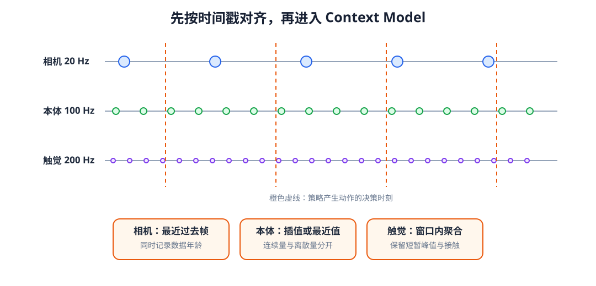
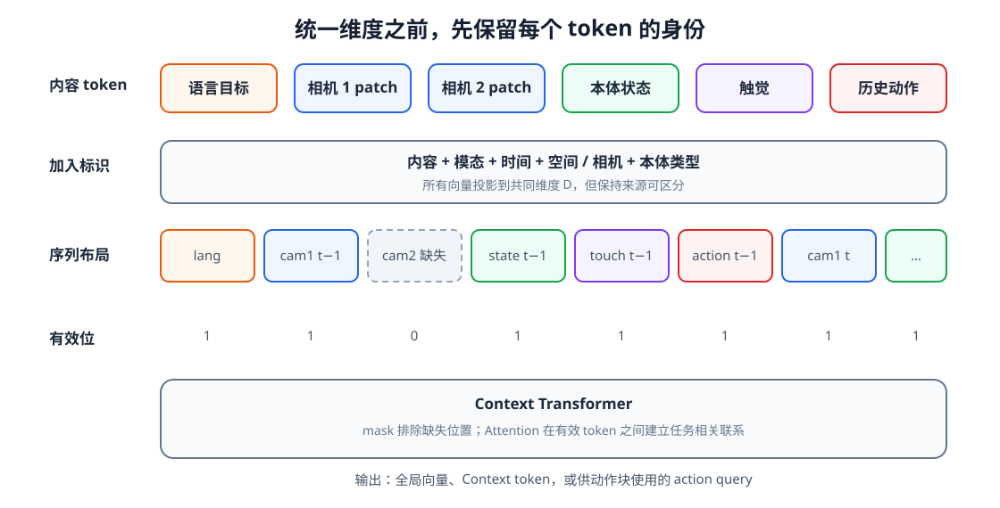
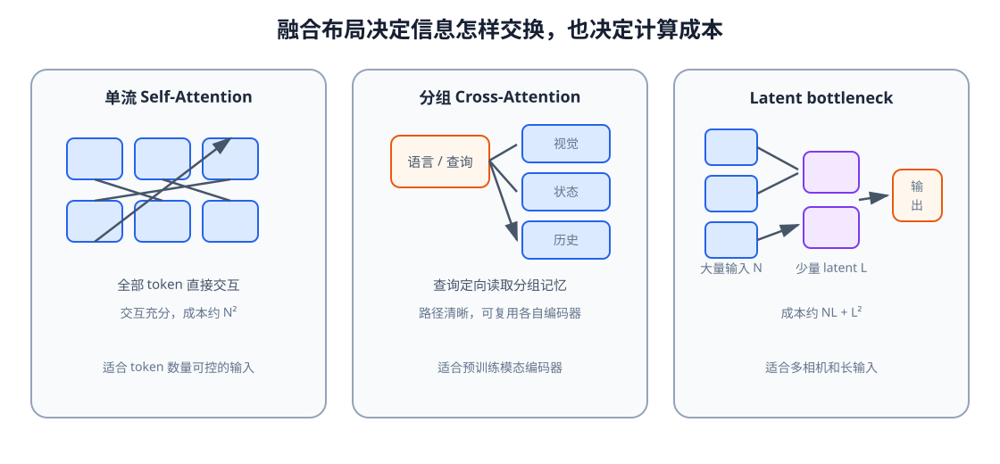

# 10 多模态 Context Model：怎样形成任务相关上下文

前两章已经解决了两个局部问题：循环网络能沿时间保存信息，Attention 与 Transformer 能根据当前查询读取一组 token。然而，真实机器人面对的并不是形状整齐、频率一致的一条序列。相机给出空间 token，语言给出离散词元，本体与触觉以更高频率更新，历史动作还比观测少一个时间位置。某个相机可能临时掉帧，语言目标可能整段轨迹保持不变，不同机器人甚至拥有不同数量的关节。

Context Model 的工作，是把这些异构输入整理成后续 Action Expert 可以稳定使用的条件表示。它不只是把向量拼接起来，而要明确每个 token 来自什么模态、什么时刻、哪台相机和哪种机器人，哪些位置有效，以及输出究竟保留了哪些任务信息。

学完本章后，你应当能够：

- 说明同步、编码、token 标识与融合分别解决什么问题；
- 为视觉、语言、本体、触觉和历史动作设计统一 token schema；
- 比较单流 Self-Attention、分组 Cross-Attention 与 latent bottleneck；
- 区分全局 Context、空间 Context 和 action query 输出；
- 正确处理 padding、掉帧、模态缺失和多相机有效位；
- 选择冻结、轻量适配或端到端微调策略；
- 用模态消融、时间打乱和目标交换检验 Context 是否学到了任务相关信息；
- 写清 Context Model 与下一单元 Action Expert 之间的数据契约。

## 1. Context 不是所有特征的简单拼接

基础篇得到的各类表示可以写成

$$
Z^{\mathrm{vis}},\quad Z^{\mathrm{lang}},\quad
Z^{\mathrm{prop}},\quad Z^{\mathrm{touch}},\quad A_{<t}.
$$

直接把它们展平拼接，虽然能形成固定长度向量，却会产生三个问题。第一，视觉 patch 和语言 token 的数量可能随输入变化，拼接接口难以保持稳定。第二，模型不知道相同数值来自关节角、触觉还是动作。第三，所有信息被一次性压缩，后续动作查询无法根据任务重新读取局部空间或历史位置。

更一般的 Context Model 写成

$$
C_t=F_\psi\!\left(o_{t-H:t},a_{t-H:t-1},g;M,P,S\right),
$$

其中 $M$ 表示有效性和可见范围，$P$ 表示时间与空间位置，$S$ 表示模态、相机和本体等来源标识。输出 $C_t$ 可以是一个全局向量，也可以是一组仍能被动作查询读取的 token。

## 2. 先在时间轴上对齐，再谈融合

假设相机以 20 Hz 更新，本体状态以 100 Hz 更新，触觉以 200 Hz 更新，而策略每 100 ms 产生一次动作。不能仅凭数组下标把第 5 个相机帧、第 5 个关节状态和第 5 个触觉读数视为同一时刻。数据管线应保留原始时间戳，并以策略决策时刻为基准选择最近值、插值或聚合时间窗。

<figure markdown="span">
  { width="1080" loading=lazy }
  <figcaption>图 10-1　不同传感器先依据真实时间戳对齐到策略决策时刻。最近值、插值和窗口统计具有不同物理含义，必须随数据一起记录。（本教程绘制）</figcaption>
</figure>

最近值适合保持型信号，但要记录数据年龄；线性插值适合连续本体量，却不适合离散接触事件；触觉峰值可在决策窗口内取最大值或统计量，以免短暂接触被降采样丢失。若输入使用固定长度历史，还要同时保存真实时间间隔 $\Delta t$，避免模型把不均匀采样误认为等间隔运动。

对齐也必须防止未来泄漏。为时刻 $t$ 生成 Context 时，只能使用时间戳不晚于 $t$ 的观测。离线数据中“选择最近帧”若同时向前和向后搜索，就可能悄悄读到未来相机帧。

## 3. 为每个 token 写清来源

不同模态经过各自编码器投影到共同维度 $D$ 后，可将一个 token 表示为

$$
x_i=z_i^{\mathrm{content}}
+e_i^{\mathrm{modality}}
+e_i^{\mathrm{time}}
+e_i^{\mathrm{camera}}
+e_i^{\mathrm{embodiment}}.
$$

内容向量描述“测到了什么”，其余 embedding 则回答“它从哪里来”。视觉 token 还要保留二维 patch 位置；语言 token 需要词序；本体和动作通常使用时间位置与字段类型。无相机或无多本体训练时，相应 embedding 可以省略，但接口仍应明确。

<figure markdown="span">
  { width="1120" loading=lazy }
  <figcaption>图 10-2　共同维度不等于共同含义。每个 token 由内容与来源标识共同组成，序列布局和有效位决定 Transformer 实际能读取哪些输入。（本教程绘制）</figcaption>
</figure>

模态 embedding 不能代替数值归一化。角度、速度、力和图像特征仍需各自规范化，缺失值也不能简单用零冒充真实测量。一个稳健的数据条目至少应包含 token、时间戳、模态类型、来源设备和有效位。

## 4. 三种常见融合布局

### 单流：把全部 token 放进同一序列

单流结构把语言、视觉、状态、触觉和历史动作放进一个序列，通过 Self-Attention 直接交换信息。它结构统一，模态交互充分，但注意力成本随总 token 数平方增长，高分辨率多相机输入尤其昂贵。

### 分组与 Cross-Attention：先各自编码，再定向读取

双流或分组结构先在各模态内部编码，再让语言、状态或动作查询通过 Cross-Attention 读取视觉与历史。它能保留成熟的预训练编码器，也能控制哪一组 token 主动查询另一组；代价是交互路径由架构预先规定。

### Latent bottleneck：用少量 latent 读取大量输入

当输入 token 很多时，可以用固定数量 $L$ 的 latent query 读取全部模态，再只在 $L$ 个 latent 之间反复计算。若 $L\ll N$，主要交互成本从 $N^2$ 降为约 $NL+L^2$，但过小的瓶颈也可能丢失精细空间信息。

<figure markdown="span">
  { width="1120" loading=lazy }
  <figcaption>图 10-3　单流允许全部 token 直接交互；分组 Cross-Attention 规定定向读取；latent bottleneck 用少量中间查询压缩大量输入。选择取决于信息需求和实时预算。（本教程绘制）</figcaption>
</figure>

这三种布局并无绝对优劣。若动作需要精确读取目标周围的视觉 patch，就不宜过早压成单个向量；若任务只需粗粒度阶段判断，较小的 latent 集合可能已经足够。

## 5. Context 输出必须服从下游接口

全局分类或成功判断常使用一个 `[CLS]` token 或池化向量。空间控制则更适合保留视觉 token，使动作模块能读取目标、障碍和夹爪附近区域。生成一段动作时，还可以设置多个 action query，每个查询对应未来动作块中的一个位置，并通过 Cross-Attention 读取 Context。

因此，$C_t$ 不应被默认理解为单个向量。本教程后续使用三种输出：

- 全局 Context $c_t\in\mathbb R^{B\times D}$，适合阶段、价值或成功预测；
- Context token $C_t\in\mathbb R^{B\times N_c\times D}$，保留可再次读取的局部信息；
- action query 输出 $Q_t^a\in\mathbb R^{B\times H\times D}$，为长度为 $H$ 的动作块准备逐位置条件。

选择输出接口时，要从 Action Expert 需要读取什么信息反推，而不是只看 Context Model 自身的离线损失。

## 6. 缺失模态不能伪装成正常输入

真实系统会遇到相机掉帧、深度无效、触觉未安装或语言目标为空。padding mask 只能表示不存在的 token；模态缺失还需要单独有效位或缺失标识。若把缺失图像全部置零，却不告诉模型这是缺失，它可能把黑图当成真实场景。

训练时可以随机丢弃某些模态，即 modality dropout，使模型不过度依赖单一输入。但这不是让模型在任意传感器组合下自动可靠：部署前仍需分别评测每种缺失模式，并为关键传感器失效设置停止或降级策略。

多相机系统还应区分“某台相机本次掉帧”和“该机器人根本没有这台相机”。前者是时间相关的有效性，后者属于 embodiment schema。二者若混在同一个零向量中，跨机器人训练时就难以解释。

## 7. 冻结编码器还是一起训练

预训练视觉和语言编码器可以全部冻结，只训练投影层、Context Transformer 与动作模块。这样训练稳定、显存较小，但编码器未必保留机器人操作需要的接触前兆和精细几何。端到端微调适应能力更强，却需要更多数据与计算，也可能破坏原有通用表示。

Adapter 和 LoRA 位于两者之间：保留大部分预训练参数，只增加或更新少量低秩、瓶颈模块。选择应依据数据规模、域差异和部署预算，并报告实际可训练参数，而不是只写“使用预训练模型”。当动作损失直接更新视觉编码器时，还要检查模型是否借助背景、相机编号等捷径完成训练集任务。

## 8. Context 长度、缓存与实时预算

多模态序列长度可粗略写成

$$
N=N_{\mathrm{lang}}+H\left(CN_{\mathrm{patch}}+N_{\mathrm{state}}+N_{\mathrm{touch}}+N_{\mathrm{action}}\right),
$$

其中 $H$ 是历史步数，$C$ 是相机数量。增加相机、分辨率或历史长度都会放大计算成本。实际系统常组合使用视觉池化、关键帧、滑动窗口、latent 压缩和历史 Key/Value 缓存。

缓存能避免每次决策重复编码完全相同的过去，但必须随滑动窗口、mask 和位置编号正确更新。若视觉编码器以 10 Hz 运行、动作控制以 50 Hz 运行，还应记录 Context 的数据年龄，并明确高频周期是在复用旧 Context，还是使用更快的本体分支增量更新。

## 9. 怎样验证 Context 真的与任务有关

只观察训练损失不足以判断多模态融合是否有效。至少应做以下对照：交换语言目标，检查动作相关输出是否改变；遮挡目标视觉区域，检查模型是否退化；打乱历史顺序，确认动态任务性能下降；移除触觉，观察接触阶段而非所有阶段的变化；将背景和目标位置解耦，排除背景捷径。

Attention 图可以帮助定位异常读取，但最终证据来自输入干预和闭环任务结果。一个有用的 Context 应同时保留目标语义、局部几何、机器人身体状态和必要的动态线索，又不依赖训练数据中的偶然相关性。

## 配套实践

实践 10-01

### 构造多模态 token、时间与 mask

把语言、双相机视觉、本体、触觉和历史动作整理成统一 token 表，观察掉帧与 padding 怎样改变可读取区域。

预计时间：25～30 分钟

实践 10-02

### 训练任务相关的多模态 Context

训练小型 Transformer 根据语言目标选择视觉或触觉证据，并用目标交换与模态消融检验它是否真正使用了条件信息。

预计时间：35～45 分钟

## 10. Context Model 与 Action Expert 的边界

到这里，单元一已经形成完整接口：

$$
C_t=\operatorname{ContextModel}(o_{t-H:t},a_{t-H:t-1},g).
$$

Context Model 负责把“现在、历史和目标”组织成条件，但不直接规定动作怎样生成。下一单元会在同一 $C_t$ 上比较单步回归、Action Chunk、自回归、Diffusion 与 Flow Matching。保持这条边界有助于判断改进究竟来自更好的上下文，还是来自更合适的动作分布。

## 本章小结

多模态 Context 的形成包含四个连续步骤：先按真实时间戳对齐传感器，再把各模态编码到共同维度，为 token 加入来源、时间和位置标识，最后通过单流、Cross-Attention 或 latent bottleneck 进行融合。输出可以是全局向量，也可以保留一组供动作查询继续读取的 token。

缺失模态、不同本体、上下文缓存和实时频率不是部署后的附加问题，而是 Context 接口的一部分。可靠评测还必须通过目标交换、时间打乱和模态消融确认模型使用了真正与任务有关的信息。

## 下一章

> Context 已经说明机器人处于什么情境、要完成什么目标；但示范数据中的动作应该表示成什么空间，一次预测一步还是一段，同一情境下存在多种合理动作时又该怎样学习？

第 11 章将从示范动作开始，建立第一个 Action Model，并把基础篇第 02 章的监督学习流程扩展到动作序列。

[返回进阶篇概览](index.md)
