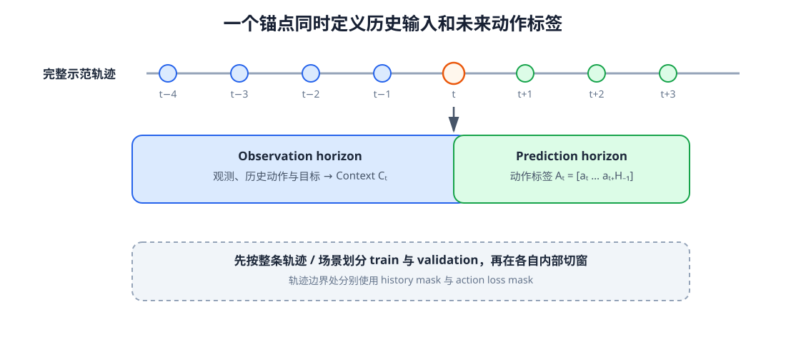
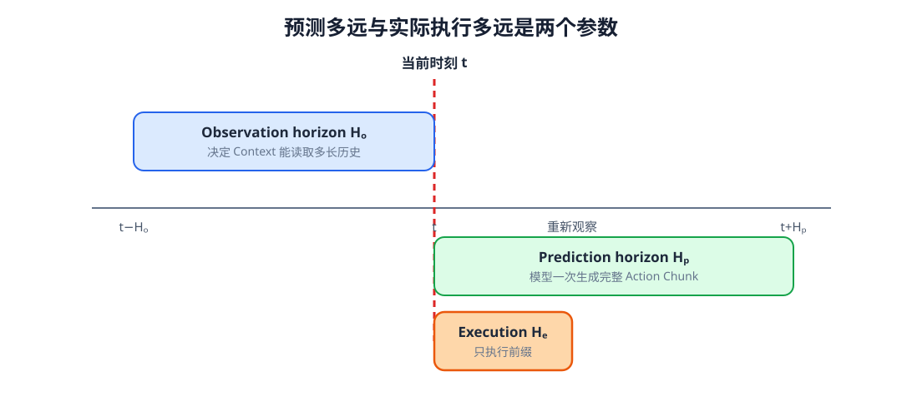
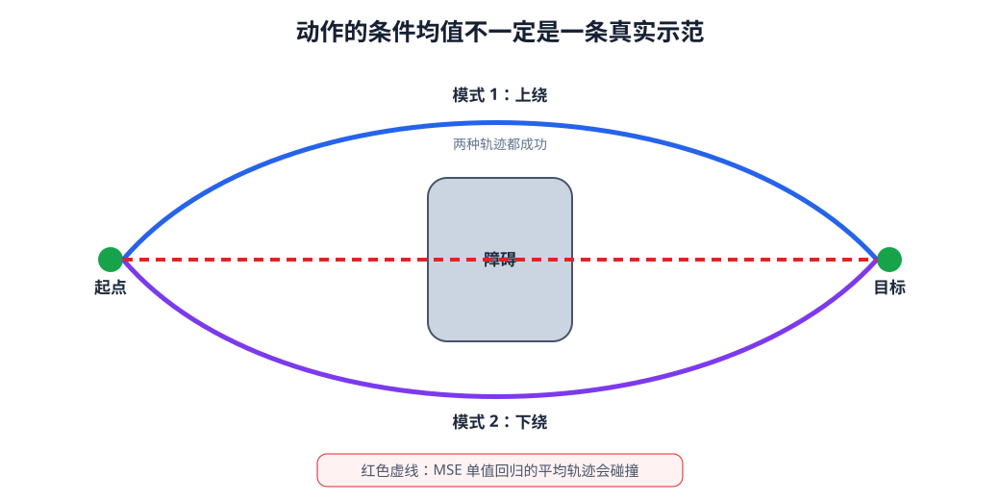

# 11 从示范学习到动作序列：第一个 Action Model

第 10 章已经把视觉、语言、本体、触觉和历史组织成任务相关 Context。现在要解决的是另一半接口：示范数据中的动作究竟是什么，模型应该一次预测一步还是一段，以及同一情境下存在多种合理动作时，训练目标会产生什么结果。

本章回到第 02 章的监督学习流程，但输入不再只是单个状态，输出也不再只是一个标量。训练样本来自连续轨迹，标签是一段带有控制空间、频率和时间范围的动作。只有先写清这份数据契约，后续的自回归、Diffusion 和 Flow Matching 才是在学习同一个问题。

学完本章后，你应当能够：

- 从带时间戳的示范轨迹构造因果训练样本；
- 区分关节、末端、速度、力矩以及绝对、增量动作；
- 区分 observation、prediction 与 execution horizon；
- 说明 Action Chunk 对连贯性、延迟和闭环纠错的影响；
- 理解重叠动作块、temporal ensemble 与 receding horizon；
- 解释均方误差为什么会平均多种合理动作；
- 读懂行为克隆与第一个序列 Action Model 的训练目标；
- 明确 Context Model、Action Expert 和底层控制器的边界。

## 1. 从一条示范轨迹切出训练样本

一条示范轨迹可以写成

$$
\tau=(o_0,a_0,o_1,a_1,\ldots,o_T),
$$

其中观测与动作必须经过时间同步。以时刻 $t$ 为锚点，Context Model 读取不晚于 $t$ 的历史，Action Expert 的标签则是从 $t$ 开始的未来动作块：

$$
C_t=\operatorname{ContextModel}(o_{t-H_o:t},a_{t-H_o:t-1},g),
$$

$$
A_t=[a_t,a_{t+1},\ldots,a_{t+H_p-1}].
$$

$H_o$ 是 observation horizon，$H_p$ 是 prediction horizon。相邻锚点会产生重叠训练样本，这不是重复错误，而是让模型在不同当前时刻学习同一运动的后续部分。划分训练集和验证集时必须先按完整轨迹、场景或物体划分，再切窗口；若先切窗口再随机划分，几乎相同的相邻片段会同时进入两侧，形成数据泄漏。

<figure markdown="span">
  { width="1100" loading=lazy }
  <figcaption>图 11-1　以当前时刻为锚点，左侧历史形成 Context，右侧动作形成监督标签。数据集划分应发生在切窗之前，避免相邻窗口跨越训练集与验证集。（本教程绘制）</figcaption>
</figure>

轨迹开头不足 $H_o$ 的历史需要 padding 和时间 mask，轨迹结尾不足 $H_p$ 的动作则要截断或使用 loss mask。不能把补齐动作也计入损失，否则模型会把“轨迹结束后的零动作”当成真实示范。

## 2. 动作空间决定模型正在学习什么

关节位置命令容易与底层位置控制器连接，但不同机器人自由度不同；关节速度更局部，长程累积会漂移；末端位姿直观且较易跨本体共享，却需要逆运动学和坐标系约定；力矩能表达接触动力学，但对频率、动力学模型和安全要求更高。

绝对动作直接给出目标值，例如 $q^{\mathrm{target}}_{t+1}$；增量动作给出相对当前状态的变化，例如

$$
\Delta q_t=q^{\mathrm{target}}_{t+1}-q_t.
$$

同一数值在两种语义下会产生完全不同的执行结果。动作数据契约必须写明控制空间、单位、坐标系、频率、上下界、绝对或增量语义，以及夹爪通道是连续宽度还是离散开合。

训练前通常按各动作维度的统计量归一化：

$$
\tilde a_{t,j}=\frac{a_{t,j}-\mu_j}{\sigma_j+\epsilon}.
$$

推理后必须使用训练集的同一组统计量还原，并再次经过物理限幅和安全检查。归一化不是动作约束，神经网络输出落在常见数据范围内也不保证满足速度、加速度、碰撞或工作空间限制。

## 3. 一次预测一步，还是预测一段

单步策略学习

$$
\hat a_t=f_\theta(C_t),
$$

每执行一步就重新观察，闭环性强；但高频逐步推理容易受到延迟影响，相邻输出也可能抖动。Action Chunk 一次产生 $H_p$ 步：

$$
\hat A_t=f_\theta(C_t)\in\mathbb R^{B\times H_p\times D_a}.
$$

它能在一个输出中表示接近、闭合和抬起的连续运动，也能降低大模型调用频率，但整段开环执行会错过中途扰动。于是还要区分 execution horizon $H_e$：模型预测 $H_p$ 步，机器人只执行前 $H_e$ 步便重新观察。

<figure markdown="span">
  { width="1080" loading=lazy }
  <figcaption>图 11-2　观察范围决定 Context 能看多远，预测范围决定动作块覆盖多远，执行范围决定多久重新规划。三者不必相等。（本教程绘制）</figcaption>
</figure>

当 $H_e=1$ 时接近逐步闭环；当 $H_e=H_p$ 时整块开环执行。实际选择取决于模型推理延迟、底层跟踪频率、环境变化速度和动作连贯性需求。

## 4. 重叠动作块怎样形成当前命令

每个决策时刻都会产生一个新动作块，因此同一个未来时刻可能被多个历史预测覆盖。最简单做法只使用最新块；temporal ensemble 则对指向同一执行时刻的多个预测加权：

$$
\bar a_s=\frac{\sum_{t\le s}w_{s-t}\hat a_{s\mid t}}
{\sum_{t\le s}w_{s-t}},
\qquad w_k=\exp(-\lambda k).
$$

较新的 Context 通常权重更大，较旧预测提供平滑参考。融合必须在相同动作语义和时间位置上进行；绝对位姿与增量位移不能直接平均，角度跨越 $\pi$ 边界时也不能使用普通算术平均。

temporal ensemble 能减小块边界抖动，却会引入滞后。遇到突发障碍或抓取滑移时，过强平滑可能让旧动作继续影响当前命令。它是执行接口的一部分，不是免费的性能提升。

## 5. 行为克隆：把示范当作监督标签

最直接的 Action Model 使用行为克隆。对于连续动作块，可最小化带有效位的回归损失：

$$
\mathcal L_{\mathrm{BC}}
=\frac{\sum_{b,h,j}m_{b,h,j}\,\ell(\hat a_{b,h,j},a_{b,h,j})}
{\sum_{b,h,j}m_{b,h,j}},
$$

其中 $m$ 排除补齐位置与不可用动作维度，$\ell$ 可以是 MSE、L1 或 Huber 损失。不同动作维度量纲不同，损失权重也应与归一化和控制重要性共同设计。

这正是第 02 章“输入—预测—损失—梯度—更新”的机器人序列版本：输入由 Context Model 产生，预测是一段动作，损失在有效时间与维度上比较示范，梯度同时更新 Action Expert 以及允许训练的 Context 模块。

## 6. 单值回归为什么会平均合理动作

同一个 Context 下可能存在多种成功方式：机械臂可以从障碍左侧或右侧绕行，也可以用不同抓取姿态拿起对称物体。若使用 MSE 训练确定性输出，最优解趋向条件均值：

$$
f_\theta(C)=\mathbb E[A\mid C].
$$

两个安全轨迹的平均不一定仍安全。上绕与下绕的均值可能穿过障碍，不同抓取姿态的平均可能成为无法执行的中间姿态。

<figure markdown="span">
  { width="1040" loading=lazy }
  <figcaption>图 11-3　示范分布包含上绕和下绕两种模式，单值 MSE 回归倾向输出中间均值。动作误差较小并不代表轨迹可执行或安全。（本教程绘制）</figcaption>
</figure>

可以使用混合分布、离散动作 token、自回归、条件 VAE、Diffusion 或 Flow Matching 表示多峰动作。本章实践先用简单混合密度说明“预测分布”与“预测均值”的差别；第 12 章再系统研究从噪声生成连续动作的两种方法。

## 7. 第一个序列 Action Model 的结构

一个最小 Action Model 可以由 Context Model 和动作头组成。若 $C_t$ 是单个向量，MLP 可以一次输出 $H_pD_a$ 个数；若 $C_t$ 是 token 集合，可以建立 $H_p$ 个 action query，通过 Cross-Attention 分别读取 Context，得到动作块每个位置的表示。

ACT 一类结构进一步使用条件 VAE：训练时编码真实动作块得到风格潜变量，解码器结合 Context、action query 与潜变量重建动作；推理时从先验采样或使用先验中心。潜变量可以承载示范者风格与轨迹模式，但 KL 权重过强会使潜变量被忽略，过弱又会造成训练分布与推理先验不匹配。

这里要保持模块边界：Context Model 解释当前情境，Action Expert 产生动作分布，底层控制器负责以更高频率跟踪命令与执行安全约束。三者都可能使用神经网络，但输入输出责任不同。

## 8. 离线误差与闭环成功之间的距离

行为克隆只在示范分布中的 Context 上训练。部署时一次小误差会把机器人带到示范未覆盖的状态，下一次输入更加陌生，误差可能继续累积。这就是协变量偏移。增加数据、收集失败恢复、使用闭环重规划或引入交互式数据聚合都能缓解，但不能由更低的训练损失自动解决。

动作模型至少应同时报告：未见轨迹上的归一化和物理单位误差、轨迹平滑度、动作越界率、推理延迟，以及闭环任务成功率。对于多峰任务，还要检查样本覆盖了多少有效模式、每个候选的可执行性和多次采样成本。

## 配套实践

实践 11-01

### 切分 Action Chunk 并滚动执行

从连续示范切出观察与动作窗口，比较单步、整块执行和 receding horizon，并观察 temporal ensemble 对块边界的影响。

预计时间：25～35 分钟

实践 11-02

### 比较动作均值与多峰动作分布

用上绕和下绕障碍的示范训练确定性回归与双分量混合模型，检查低 MSE 的平均轨迹为什么仍会失败。

预计时间：35～45 分钟

## 9. 本章形成的数据契约

第一个 Action Model 可以写成

$$
\hat A_t\sim p_\theta(A_t\mid C_t),
$$

其中 $C_t$ 的 token、mask 和时间范围来自第 10 章，$A_t$ 则必须明确控制空间、归一化统计、预测长度 $H_p$ 和有效位。执行器只取前 $H_e$ 步，随后重新构建 Context 并滚动预测。

这个统一接口允许后续只替换 Action Expert：确定性回归输出一个中心，自回归模型逐步分解联合分布，Diffusion 逐步去噪，Flow Matching 沿速度场积分。比较这些方法时，动作表示、训练数据和执行协议应尽量保持一致。

## 本章小结

示范学习不是简单地把动作数组交给网络。轨迹必须先按时间与任务划分，再切出因果历史和未来动作块；动作必须带有控制空间、单位、频率、绝对或增量语义。Action Chunk 改善长动作的连贯表达，却需要通过 execution horizon、滚动重规划和 temporal ensemble 平衡开环误差与抖动。

MSE 行为克隆能建立第一个可训练基线，但它倾向输出条件均值，面对多种合理动作时可能产生不存在于示范中的失败轨迹。下一章将不再只预测一个答案，而是学习怎样从简单噪声生成完整的连续动作分布。

## 下一章

> 如果同一个 Context 下存在多条合理动作轨迹，怎样从随机噪声出发，逐步得到其中一条连贯、可执行的 Action Chunk？

第 12 章将从统一的条件生成视角讲解 Diffusion 与 Flow Matching。

[返回进阶篇概览](index.md)
