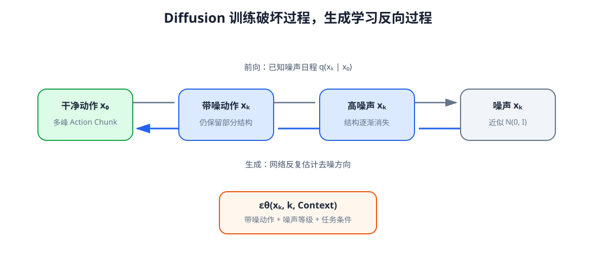
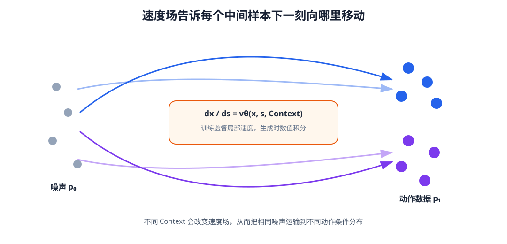
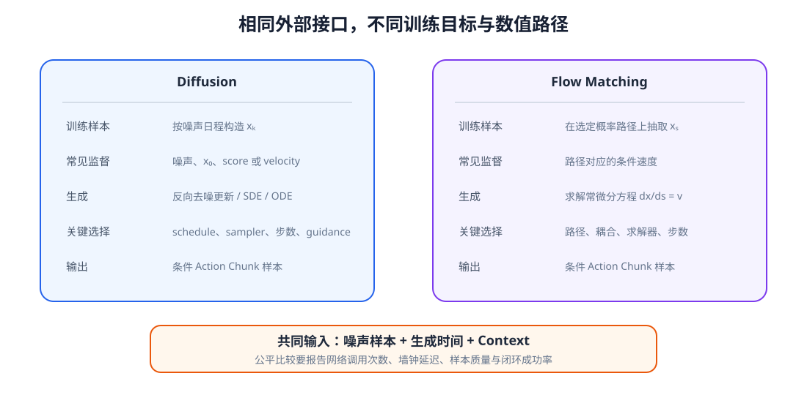

# 12 Diffusion 与 Flow Matching：学习连续、多峰的动作分布

第 11 章说明，确定性回归会把多种合理动作压成条件均值，混合密度虽然能够保留多个模式，却需要预先决定分量数量。对于高维 Action Chunk，更通用的做法是从一个容易采样的噪声分布出发，在 Context 条件下把噪声逐步变成动作。

Diffusion 与 Flow Matching 都在学习这种条件生成过程。Diffusion 通过“训练时加噪、生成时去噪”建立离散或连续的反向过程；Flow Matching 直接监督概率路径上的速度场，再通过常微分方程把噪声运输到数据。二者都没有改变动作的数据契约：生成对象仍是归一化后的完整 Action Chunk，Context 仍来自第 10 章。

学完本章后，你应当能够：

- 说明条件生成动作与确定性回归的区别；
- 写出 Diffusion 的前向加噪和噪声预测目标；
- 区分噪声、原始样本与 velocity 参数化；
- 解释采样器、采样步数与 classifier-free guidance 的作用；
- 写出 Flow Matching 的插值路径、目标速度与 ODE；
- 比较 Diffusion 与 Flow Matching 的训练监督和生成轨迹；
- 说明动作归一化、时间维结构、边界与 mask 怎样进入生成模型；
- 设计覆盖率、成功率、平滑度和推理延迟的联合评测。

## 1. 生成对象是一整段条件动作

将长度为 $H$、维度为 $D_a$ 的动作块展平或保留二维结构，记为

$$
x_0=A_t\in\mathbb R^{B\times H\times D_a}.
$$

下标 0 在本章表示“干净数据端”，不是机器人轨迹时刻。为避免与环境时间 $t$ 混淆，生成过程的噪声等级记为 $s\in[0,1]$ 或离散步 $k$。模型学习的条件分布是

$$
p_\theta(x_0\mid C_t).
$$

同一个 $C_t$ 配合不同随机噪声可以生成不同候选动作。随机性只有在训练数据确实包含多种模式、模型学到这些模式并且采样结果经过约束与评测时才有价值；简单地给确定性策略加噪声并不会自动产生合理多样性。

动作通常先按训练集统计量归一化到近似相同尺度。否则量纲较大的关节或平移维度会主导噪声损失。生成后再反归一化、裁剪物理边界，并交给第 13 章的滚动执行与安全过滤。

## 2. Diffusion：先定义怎样破坏数据

离散 Diffusion 选择一组噪声日程 $\beta_1,\ldots,\beta_K$，并定义 $\alpha_k=1-\beta_k$、$\bar\alpha_k=\prod_{i=1}^k\alpha_i$。任意噪声步都能直接由干净动作得到：

$$
x_k=\sqrt{\bar\alpha_k}\,x_0+sqrt{1-\bar\alpha_k}\,\epsilon,
\qquad \epsilon\sim\mathcal N(0,I).
$$

$k$ 较小时，动作结构大多保留；$k$ 接近 $K$ 时，$x_k$ 接近标准 Gaussian。前向过程只用于构造训练样本，不需要训练网络。

<figure markdown="span">
  { width="1100" loading=lazy }
  <figcaption>图 12-1　前向过程按已知日程把动作逐步变成噪声；生成时从噪声出发，模型在 Context 条件下反复估计去噪方向。两条箭头不是同一次数值计算的简单倒放。（本教程绘制）</figcaption>
</figure>

噪声日程决定不同 $k$ 下信号与噪声的比例。线性、cosine 等日程会改变训练样本难度和采样行为，不能只记录“使用 Diffusion”而省略日程与步数。

## 3. 网络在每个噪声等级预测什么

最常见目标让网络预测加入的噪声：

$$
\mathcal L_{\mathrm{diff}}
=\mathbb E_{x_0,k,\epsilon}
\left\|\epsilon-\epsilon_\theta(x_k,k,C_t)\right\|_2^2.
$$

网络必须同时接收带噪动作、噪声步 embedding 和 Context。若不知道 $k$，相同的数值偏差无法判断应被视为轻微扰动还是接近纯噪声。

也可以预测 $x_0$ 或特定 velocity。三种参数化可以互相换算，但在不同信噪比下的优化权重和数值稳定性不同。论文或实现中的“velocity”还可能指不同定义，必须以公式为准，不能只凭名称与 Flow Matching 的速度场画等号。

动作块的网络骨干可以是 MLP、时序卷积 U-Net 或 Transformer。MLP 适合低维短块；一维 U-Net 通过不同时间尺度卷积保持局部连续性；Transformer 便于让每个动作位置读取 Context token。无论结构如何，padding 位置都应从损失与 Attention 中排除。

## 4. 从噪声反复得到动作

生成时从 $x_K\sim\mathcal N(0,I)$ 开始，依据网络输出逐步计算 $x_{K-1},\ldots,x_0$。DDPM 采样通常在每步保留随机性；DDIM 等方法可以使用较少步骤和更确定的轨迹。采样步数减少会降低延迟，但误差也会在大步更新中积累，需要在任务上实测。

条件控制可使用 classifier-free guidance。训练时以一定概率移除 Context，使同一网络同时学习条件与无条件预测；采样时组合两者：

$$
\hat\epsilon=(1+w)\epsilon_\theta(x_k,k,C_t)
-w\epsilon_\theta(x_k,k,\varnothing).
$$

增大 $w$ 往往加强条件一致性，却可能降低多样性并把动作推离训练分布。机器人动作还要考虑约束，不能把图像生成中常用的 guidance 大小直接照搬。

## 5. Flow Matching：直接学习运输速度

Flow Matching 选取噪声样本 $x_0\sim p_0$ 和数据样本 $x_1\sim p_{\mathrm{data}}$，再定义一条概率路径。最简单的线性插值是

$$
x_s=(1-s)x_0+s x_1,
\qquad s\sim\mathcal U(0,1).
$$

这条路径对应的条件目标速度为

$$
u_s=x_1-x_0.
$$

网络学习

$$
\mathcal L_{\mathrm{FM}}
=\mathbb E\left\|v_\theta(x_s,s,C_t)-u_s\right\|_2^2.
$$

生成时解常微分方程

$$
\frac{dx}{ds}=v_\theta(x,s,C_t),\qquad x(0)\sim p_0,
$$

从 $s=0$ 积分到 $s=1$ 得到动作样本。

<figure markdown="span">
  { width="1080" loading=lazy }
  <figcaption>图 12-2　训练时在噪声与真实动作之间抽取中间点并监督速度；生成时只给起始噪声，通过学习到的场积分到数据分布。网络预测局部速度，不直接回归最终动作。（本教程绘制）</figcaption>
</figure>

线性插值容易实现，但噪声与数据的配对会影响运输路径。更好的耦合、不同概率路径和整流方法可能让轨迹更直、减少积分步数，却也增加训练与实现选择。

## 6. 两种方法相同在哪里，不同在哪里

二者都以简单噪声为起点，都在生成时间 $s$ 与 Context 条件下训练向量输出网络，也都需要数值求解器多次调用网络。核心差别在于训练监督：Diffusion 从已知加噪过程推导反向更新，常预测噪声、score、数据或特定 velocity；Flow Matching 为选定概率路径直接回归速度场，并通过 ODE 积分生成。

<figure markdown="span">
  { width="1100" loading=lazy }
  <figcaption>图 12-3　Diffusion 与 Flow Matching 共享“噪声、时间、Context、迭代生成”的外部接口，但训练目标和数值求解方式不同。实际速度取决于网络、求解器和允许误差。（本教程绘制）</figcaption>
</figure>

不能笼统地说 Flow Matching 必然只需一步，也不能把所有 Diffusion 都理解成固定的上百步 DDPM。高阶 ODE 求解器一次“步进”可能多次调用网络，蒸馏后的 Diffusion 也可能少步生成。公平比较应报告 function evaluations、墙钟延迟、硬件、batch 大小和任务质量。

## 7. 条件怎样进入动作生成网络

若 Context 是单个向量，可以通过拼接、FiLM 或调制归一化注入各层；若 Context 是 token 集合，动作位置可以通过 Cross-Attention 读取视觉、语言和历史。生成时间 embedding 与环境时间 embedding 必须区分：前者告诉网络当前噪声等级，后者说明动作或观测在机器人轨迹中的位置。

训练时随机丢弃 Context 可以支持 classifier-free guidance，也能测试无条件基线。但 Context dropout 与传感器 modality dropout 解决的问题不同：前者为条件/无条件预测建立同一网络，后者提高缺失传感器鲁棒性。两种概率应分别记录。

## 8. 动作边界、连续性与生成后的处理

连续生成网络输出通常位于无界实数空间。常见做法包括训练前按范围缩放、输出后裁剪、用 `tanh` 映射到界内，或在模型空间使用适合边界的变换。直接裁剪简单，但大量样本撞到边界会造成速度或加速度不连续。

Action Chunk 还要保持时间平滑。时序骨干可以学习局部连续性，训练损失也可加入速度或加速度正则；但过强平滑会抹去夹爪闭合、接触切换等必要突变。最终仍要在物理单位下检查位置、速度、加速度、碰撞和控制频率。

## 9. 怎样评价一个生成式 Action Expert

单个样本与单条示范的 MSE 不能评价多峰生成。应同时考察：多次采样是否覆盖示范模式；样本是否落在有效动作区域；条件改变时分布是否正确移动；动作是否平滑并满足边界；闭环任务成功率是否提高；达到该质量需要多少次网络调用和多少毫秒。

多样性也不是越大越好。大量互不相同但都碰撞的轨迹没有价值。后续 World Model 可以帮助评价候选后果，但在本单元内至少要用任务几何、约束和闭环执行区分“覆盖合理模式”与“无控制地增加方差”。

## 配套实践

实践 12-01

### 条件 Diffusion：从噪声恢复双峰动作

训练噪声预测网络，观察动作分布怎样被逐步破坏和恢复，并比较不同 Context 下的条件样本。

预计时间：40～50 分钟

实践 12-02

### 条件 Flow Matching：沿速度场运输样本

在同一动作分布上训练条件速度场，用 Euler 积分显示噪声粒子如何移动到两个任务条件的数据模式。

预计时间：40～50 分钟

## 10. 本章与 Action Model 的接口

Diffusion 和 Flow Matching 都可以实现

$$
A_t^{(k)}\sim\operatorname{ActionExpert}_\theta(A\mid C_t),
$$

但本章仍在隔离环境中关注生成分布。一个可部署 Action Model 还必须决定采样多少候选、用多少生成步、怎样反归一化和限幅、执行动作块的多少步、何时重新生成，以及推理延迟期间机器人继续执行什么。

## 本章小结

Diffusion 先定义已知前向加噪过程，再训练网络根据带噪动作、噪声等级和 Context 预测反向所需信息；Flow Matching 在选定概率路径上监督速度场，并通过 ODE 从噪声积分到动作。二者都能表示连续多峰分布，也都需要反复调用网络、正确注入条件并处理动作边界。

方法名称本身不能决定机器人效果。动作表示、Context 质量、训练覆盖、采样器、网络调用次数和闭环执行共同决定最终性能。下一章将把这些生成过程放回完整 Action Model 中，与 Context、动作约束和 receding horizon 接起来。

## 下一章

> 已经能够从 Context 生成多个 Action Chunk，怎样在真实控制循环中稳定、及时地选择和执行，并公平比较自回归、Diffusion 与 Flow Matching Action Expert？

第 13 章将建立统一生成式 Action Model 和滚动执行协议。

[返回进阶篇概览](index.md)
