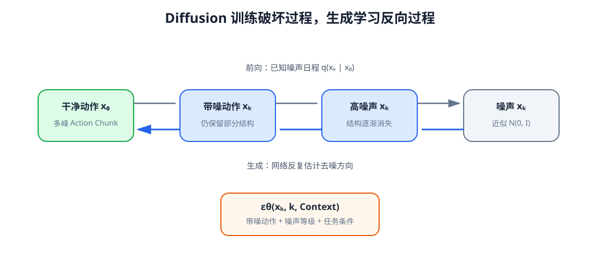
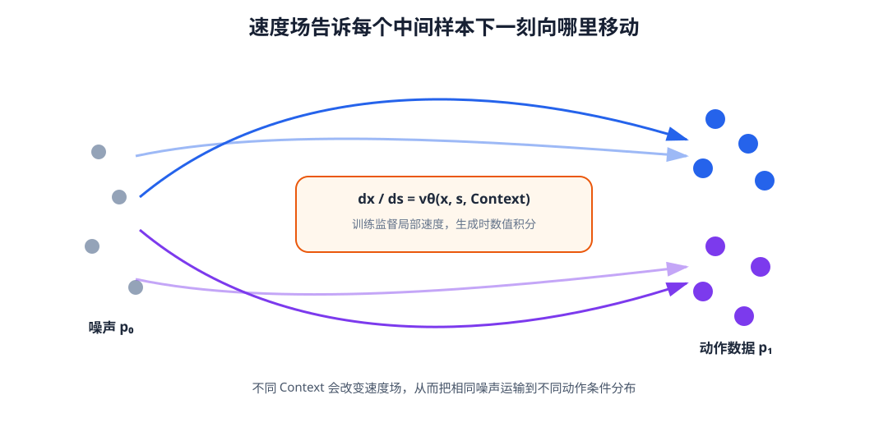
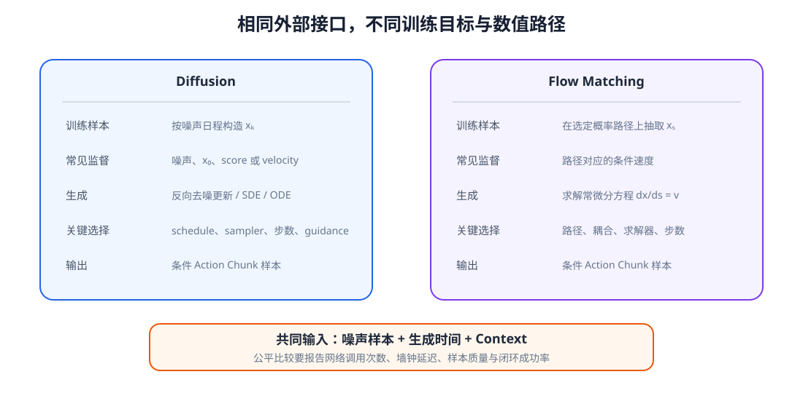

# 12 Diffusion 与 Flow Matching：学习连续、多峰的动作分布

第 11 章说明，确定性回归会把多种合理动作压成条件均值，混合密度虽然能够保留多个模式，却需要预先决定分量数量。对于高维 Action Chunk，更通用的做法是从一个容易采样的噪声分布出发，在 Context 条件下把噪声逐步变成动作。

Diffusion 与 Flow Matching 都在学习这种条件生成过程。Diffusion 通过“训练时加噪、生成时去噪”建立离散或连续的反向过程；Flow Matching 直接监督概率路径上的速度场，再通过常微分方程把噪声运输到数据。二者都没有改变动作的数据契约：生成对象仍是归一化后的完整 Action Chunk，Context 仍来自第 10 章。

学完本章后，你应当能够：

- 说明条件生成动作与确定性回归的区别；
- 写出 Diffusion 的前向加噪和噪声预测目标；
- 区分噪声、原始样本与 velocity 参数化；
- 解释采样器、采样步数与 classifier-free guidance 的作用；
- 写出 Flow Matching 的插值路径、目标速度与 ODE；
- 比较 Diffusion 与 Flow Matching 的训练监督和生成轨迹；
- 说明动作归一化、时间维结构、边界与 mask 怎样进入生成模型；
- 设计覆盖率、成功率、平滑度和推理延迟的联合评测。

## 1. 生成对象是一整段条件动作

将长度为 $H$、维度为 $D_a$ 的动作块展平或保留二维结构，记为

$$
x_0=A_t\in\mathbb R^{B\times H\times D_a}.
$$

下标 0 在本章表示“干净数据端”，不是机器人轨迹时刻。为避免与环境时间 $t$ 混淆，生成过程的噪声等级记为 $s\in[0,1]$ 或离散步 $k$。模型学习的条件分布是

$$
p_\theta(x_0\mid C_t).
$$

同一个 $C_t$ 配合不同随机噪声可以生成不同候选动作。随机性只有在训练数据确实包含多种模式、模型学到这些模式并且采样结果经过约束与评测时才有价值；简单地给确定性策略加噪声并不会自动产生合理多样性。

动作通常先按训练集统计量归一化到近似相同尺度。否则量纲较大的关节或平移维度会主导噪声损失。生成后再反归一化、裁剪物理边界，并交给第 13 章的滚动执行与安全过滤。

## 2. Diffusion：先定义怎样破坏数据

本章把一段干净的示范动作块记为 $x_0$。它不是环境中的第 0 个时刻，而是“还没有加噪的动作数据”。前向 Diffusion 会逐步破坏这段动作，使它最后接近一个容易采样的标准 Gaussian 分布。

离散过程一共设 $K$ 个噪声步。$k\in\{1,\ldots,K\}$ 是噪声步编号，表示当前加噪到第几步；$x_k$ 是加噪到第 $k$ 步后的动作。噪声日程为每一步指定一个方差 $\beta_k$，并令 $\alpha_k=1-\beta_k$。相邻两步的变化是：

$$
q(x_k\mid x_{k-1})=\mathcal N\!\left(\sqrt{\alpha_k}\,x_{k-1},\,\beta_k I\right),
\qquad
x_k=\sqrt{\alpha_k}\,x_{k-1}+\sqrt{\beta_k}\,\epsilon_k,
\quad \epsilon_k\sim\mathcal N(0,I).
$$

直观地说，每一步都保留一部分上一步的动作信号，再叠加一小份随机噪声。把前 $k$ 步合并，定义累计信号保留率 $\bar\alpha_k=\prod_{i=1}^k\alpha_i$，就能直接从干净动作计算第 $k$ 步的带噪动作：

$$
q(x_k\mid x_0)=\mathcal N\!\left(\sqrt{\bar\alpha_k}\,x_0,\,(1-\bar\alpha_k)I\right),
$$

也就是下面的采样公式：

$$
x_k=\sqrt{\bar\alpha_k}\,x_0+\sqrt{1-\bar\alpha_k}\,\epsilon,
\qquad \epsilon\sim\mathcal N(0,I).
$$

这里的 $\epsilon$ 是与动作块形状相同的一份标准 Gaussian 随机噪声，不是网络参数。训练时我们知道抽到的确切噪声值；网络之后要学习从带噪动作中估计它。这个闭式公式还意味着，训练时不必真的把动作从 $x_1$ 一步步算到 $x_k$，可以直接抽取任意噪声步来构造样本。相邻步的递推式用于说明过程怎样逐步发生，闭式式子用于方便地直接采样，两者描述的是同一过程。

当 $\bar\alpha_k$ 接近 1 时，$x_k$ 大体保留动作结构；当它按日程逐渐接近 0 时，动作信号变弱，$x_k$ 接近标准 Gaussian。前向加噪由预先选定的日程确定，本身不需要训练网络。

<figure markdown="span">
  { width="1100" loading=lazy }
  <figcaption>图 12-1　前向过程按已知日程把动作逐步变成噪声；生成时从噪声出发，模型在 Context 条件下反复估计去噪方向。两条箭头不是同一次数值计算的简单倒放。（本教程绘制）</figcaption>
</figure>

## 3. 训练：让网络学会估计加进去的噪声

先明确训练时网络要做什么：**训练过程通常不会把一个 $x_k$ 连续去噪到 $x_0$。它在随机抽到的一个噪声步上，学习估计构造这个 $x_k$ 时加入的噪声。**一次训练迭代可以按下面顺序理解。

**第 1 步：取一对示范数据。** 从数据集中取当前情境 $C_t$ 和对应的干净动作块 $x_0$。$x_0$ 用来构造训练输入，也是最终希望模型学会生成的目标动作。

**第 2 步：随机抽取噪声等级和噪声。** 抽一个噪声步 $k$，再抽一份标准 Gaussian 噪声 $\epsilon$。不同迭代会遇到不同的动作、噪声步和噪声样本。

**第 3 步：构造带噪动作。** 使用前向过程的闭式公式，将干净动作和抽到的噪声混合：

$$
x_k=\sqrt{\bar\alpha_k}\,x_0+\sqrt{1-\bar\alpha_k}\,\epsilon.
$$

**第 4 步：让网络估计噪声。** 把带噪动作 $x_k$、噪声步 $k$ 和情境 $C_t$ 输入去噪网络。$x_0$ 和真实噪声 $\epsilon$ 不作为网络的额外输入；$\epsilon$ 留作核对预测结果的已知答案。网络输出与动作块同形状的噪声估计 $\hat\epsilon_\theta(x_k,k,C_t)$。这个网络可以是用于短动作向量的小型多层感知机，也可以是处理整段动作的时序网络。下面固定采用一种适合 Action Chunk 的具体设计：**动作扩散 Transformer（Action DiT）**。

假设动作块有 16 步，每步包含 7 个连续数值，那么 $x_k$ 的形状就是 $16\times7$。首先用一个可训练的线性层，把每一步的 7 个数值映射成一个隐藏向量；这就得到 16 个动作 token。这里的 token 是连续数值的向量表示，不是把动作离散成词表编号。再加入两种不同的信息：动作位置告诉网络这个 token 对应未来第几步，噪声步嵌入告诉网络当前 $x_k$ 被加噪到什么程度。视觉、语言和本体状态已经由前面的 Context 模块编码成向量或 token，它们也要映射到该网络可读取的维度。

随后，Transformer 的注意力层更新这些动作 token，使某一步的预测能够参考动作块内其他位置以及情境。情境既可以作为另外一组 token 与动作共同参与注意力，也可以由动作 token 通过 Cross-Attention 读取；具体的信息流取决于模型的注意力掩码。多层计算后，每个动作位置仍对应一个隐藏向量 $h_j\in\mathbb R^d$。最后，对**每个位置**使用同一个可训练输出层：

$$
\hat\epsilon_{\theta,j}=W_{\mathrm{out}}h_j+b_{\mathrm{out}},
\qquad W_{\mathrm{out}}\in\mathbb R^{D_a\times d},
\qquad j=1,\ldots,H.
$$

例如 $D_a=7$ 时，一个隐藏向量经输出层变成 7 个数字，分别估计该动作位置 7 个分量中的噪声；16 个位置合起来就是 $16\times7$ 的 $\hat\epsilon_\theta$。注意力层负责汇集“当前动作、其他动作位置、情境和噪声等级”的信息，输出层把汇集后的表示映射为逐位置的数值预测。模型并不知道每次实际抽中的 $\epsilon$；输入投影、Transformer 和输出层的参数会在第 5 步的误差监督下共同更新。机器人策略 [Dita](https://openaccess.thecvf.com/content/ICCV2025/html/Hou_Dita_Scaling_Diffusion_Transformer_for_Generalist_Vision-Language-Action_Policy_ICCV_2025_paper.html) 就采用将带噪动作、噪声步和视觉语言特征送入 Transformer 来预测噪声的方案；本章的配套二维实验则用较小的多层感知机展示相同的输入、目标和损失，不要求运行完整 DiT。

**第 5 步：比较并更新网络。** 将网络预测的噪声与构造样本时实际加入的噪声比较，计算均方误差：

$$
\mathcal L_{\mathrm{diff}}
=\mathbb E_{x_0,k,\epsilon}
\left\lVert\epsilon-\hat\epsilon_\theta(x_k,k,C_t)\right\rVert_2^2.
$$

例如，某个动作分量上实际加入的噪声是 $-0.5$，网络估计为 $-0.4$，这个分量的误差平方就是 $(-0.5-(-0.4))^2=0.01$。完整动作块会对有效时间位置和动作维度上的误差求平均；padding 或无效维度应从损失中排除。接着根据损失计算梯度并更新网络参数 $\theta$。反复看到不同示范、噪声步和噪声后，网络逐渐学会根据带噪动作、噪声等级和任务情境估计其中的噪声。

因此，噪声预测训练中网络接收的是 $x_k$、$k$ 和 $C_t$，训练目标是抽样时已知的 $\epsilon$。前向加噪日程 $\beta_k$ 在常见 DDPM 中通常固定，梯度更新噪声预测网络；若 Context 模块也参与端到端训练，它的可训练参数同样可以接收梯度。有些实现改为预测干净动作 $x_0$ 或 velocity；那是更换网络预测的目标与对应损失，不是换成另一个前向加噪过程。

## 4. 生成：从噪声逐步反推出动作

训练时，网络是在随机噪声步上练习预测噪声；生成时，才把网络的预测串成多步反向过程。此时没有示范动作 $x_0$，也没有真实噪声标签可供比较，过程如下。

**第 1 步：从噪声开始。** 根据前向日程设计，从标准 Gaussian 采样一个初始动作块：

$$
x_K\sim\mathcal N(0,I).
$$

**第 2 步：估计当前噪声。** 从 $k=K$ 开始，把当前带噪动作 $x_k$、噪声步 $k$ 和任务情境 $C_t$ 输入已训练好的去噪网络，得到噪声估计 $\hat\epsilon_\theta(x_k,k,C_t)$。

**第 3 步：计算噪声更少的动作。** 采样器依据噪声估计和已知日程参数，计算前一个噪声步的样本。常见 DDPM 更新形式为：

$$
x_{k-1}
=\frac{1}{\sqrt{\alpha_k}}
\left(x_k-\frac{\beta_k}{\sqrt{1-\bar\alpha_k}}\,
\hat\epsilon_\theta(x_k,k,C_t)\right)
+\sigma_k z,
\qquad z\sim\mathcal N(0,I).
$$

其中 $\sigma_k z$ 表示该采样方式在反向过程中保留的随机性；在常见 DDPM 采样中，最后一步不再加入这项随机噪声。DDIM 等采样器采用不同更新方式。

**第 4 步：重复，直到得到动作。** 将刚算出的 $x_{k-1}$ 作为下一轮输入，继续估计噪声并更新，直至 $k=1$，最终得到干净动作块 $x_0$。生成结束后，还要把动作反归一化、检查物理范围，并交给控制和安全模块执行。

网络不是把每个 $x_k$“减去同一团噪声”就精确回到原样。它依据学到的噪声估计和概率转移公式，逐步构造合理的反向样本；反向生成不是把前向加噪逐项原样倒放。DDPM 可以逐步采样；DDIM 等方法可以用较少的采样步或更确定的轨迹。减少网络调用通常能降低延迟，但也可能影响动作质量，需要在实际任务上比较成功率、平滑度与推理时间。

## 5. Flow Matching：从噪声学习走向动作的速度

Diffusion 的训练目标是估计加进去的噪声。Flow Matching 改用另一个容易构造的监督：在“噪声变成示范动作”的过程中，当前位置应朝哪个方向、以多大幅度变化。这里的“速度”是**动作块在生成过程中的变化率**，不是机械臂末端或关节在物理时间中的运动速度。

为了与前文“$x_0$ 表示干净动作”保持一致，本节把标准 Gaussian 噪声记作 $z\sim\mathcal N(0,I)$，把与情境 $C_t$ 对应的一段归一化示范动作记作 $a$。二者都是 $H\times D_a$ 的数值数组。生成进度记作 $s\in[0,1]$：$s=0$ 是噪声端，$s=1$ 是动作端；它既不是机器人轨迹时刻 $t$，也不是 Diffusion 的离散噪声步 $k$。

### 从一对噪声与示范动作构造训练样本

先固定一种最容易理解的路径：从示范数据中取 $(C_t,a)$，再独立抽取 $z$，随机选一个进度 $s$，按直线在两个端点之间取中间状态：

$$
x_s=(1-s)z+sa,
\qquad s\sim\mathcal U(0,1).
$$

以“夹爪绕过杯子到达目标”为例，同一个情境 $C_t$ 下，示范动作可能从杯子左侧绕，也可能从右侧绕。为了先看清变化，暂时只取动作块中表示横向移动的一个数值：假设一次抽到噪声 $z=-0.2$，与左绕示范 $a=-1$ 配对；另一次抽到 $z=0.2$，与右绕示范 $a=1$ 配对。代入上式，两组数值在 $s=0$ 时是 $-0.2$ 和 $0.2$，在 $s=0.5$ 时变成 $-0.6$ 和 $0.6$，到 $s=1$ 时分别到达 $-1$ 和 $1$。这只是随机抽样得到的两组示意配对，并没有规定负噪声必须配左绕动作。

实际训练会反复抽取大量噪声和示范动作。想象在每个进度 $s$ 给所有中间结果拍一张快照：起初看到的是一群随机噪声点；随着 $s$ 增大，这群点逐渐移动，最后呈现左绕和右绕两类示范动作的位置分布。**每张快照中一群点如何分布，以及这种分布随 $s$ 怎样变化，就是这里所说的概率路径。**真实模型中的每个“点”都是一整段动作块；上面的单个数值只是帮助我们看清这个过程。

沿着这条**给定端点的直线**，进度每增加一单位，中间状态改变 $a-z$；因此这次配对的目标速度是

$$
v^*=\frac{d x_s}{ds}=a-z.
$$

用一个数值分量看得更直观：若噪声值为 $-1$、示范动作为 $+1$，在 $s=0.25$ 时，中间值为 $-0.5$，这条直线的目标速度为 $+2$。对完整 Action Chunk，上述计算同时作用于每一步、每个动作维度，目标速度与动作块形状相同。这个 $+2$ 表示沿生成进度轴前进时数值的变化率，不能读作机器人每秒运动 $2$ 个物理单位。

### 用中间状态监督速度网络

对每条示范，训练程序用已知的 $a$ 和 $z$ 计算中间动作 $x_s$，也就知道这条直线的目标速度 $a-z$。网络接收的是 $x_s$、进度 $s$ 和情境 $C_t$，要输出与动作块形状相同的速度。二者的差距形成训练损失：

$$
\mathcal L_{\mathrm{FM}}
=\mathbb E_{(C_t,a),z,s}
\left\lVert v_\theta(x_s,s,C_t)-(a-z)\right\rVert_2^2.
$$

每次更新都可以重新取示范动作、噪声和进度；下一批的 $s$ 不必比上一批大。训练时直接由一对端点算出当前位置和目标速度，无需让模型从 $s=0$ 逐步走到 $s=1$。单条训练线上的速度虽恒为 $a-z$，网络却没有拿到这两个端点作为额外输入，必须学会综合当前位置、进度和情境预测速度。如果多条线经过相近的位置，平方误差会让网络学习该处的平均条件速度。配套二维实验使用小型多层感知机；下面看机器人 VLA 如何用 Transformer 处理完整动作块。

### 生成时怎样用速度得到动作

要理解生成时调用的速度网络，先沿着 $\pi_{0.5}$ 的**动作专家训练**看一次数据流。这里讨论的是它学习连续动作的 Flow Matching 阶段；$\pi_{0.5}$ 还包含其他预训练任务。为了衔接本章，以下仍以 $s=0$ 表示噪声端、$s=1$ 表示动作端。

一条训练数据先提供图像、语言指令、机器人状态和对应的示范动作块 $a$。视觉语言模型将观测与指令等信息组织成情境 token，它们相当于这里的 $C_t$。训练程序再抽一份与 $a$ 同形状的 Gaussian 噪声 $z$ 和一个随机进度 $s$，直接算出 $x_s=(1-s)z+sa$ 与监督答案 $a-z$。实际 $\pi_{0.5}$ 实现对进度采用偏向某些噪声等级的随机采样，并非逐批从小到大遍历进度；本章前面的均匀采样只是最容易理解的教学形式。[论文](https://arxiv.org/abs/2504.16054)与[官方实现](https://github.com/Physical-Intelligence/openpi/blob/main/src/openpi/models/pi0.py)分别给出模型设计和训练计算。

进入网络时，这两类信息走不同入口。图像、语言和状态形成情境前缀；带噪动作块的每个未来动作位置先经过可训练的线性投影，变成一个动作 token。例如一个 $16\times7$ 的动作块会变成 16 个动作 token，而不是把 112 个数当作一句文本逐个生成。进度 $s$ 先被编码成向量，再经小型网络处理，用于调节动作专家 Transformer 各层的归一化；这种做法称为自适应均方根归一化（adaptive RMSNorm）。它让同一套 Transformer 参数在“几乎全是噪声”和“动作已经较清楚”时采取不同处理方式。小型网络只负责加工进度信息，**预测速度的主体仍是 Transformer**。

情境 token 与动作 token 使用各自的参数处理，并通过注意力交换信息。注意力规则允许动作位置读取情境，也允许动作块内的位置相互参考；情境前缀则不会读取这次送入的动作 token。经过多层计算，每个动作位置得到一个隐藏向量，再由输出线性层映射回该位置的动作维度，组成整块速度预测 $\hat v_\theta(x_s,s,C_t)$。上面的 $16\times7$ 例子就会输出 $16\times7$ 个速度数。将它与训练程序已知的 $a-z$ 逐项比较，并通过损失更新可训练参数，这就是一次完整的速度网络训练。示范动作 $a$ 和噪声 $z$ 用于制造训练题目与答案，不会作为两个独立输入直接送给动作专家。

生成时，示范动作 $a$ 已不可得。模型先从当前观测和任务目标构建情境前缀，并抽取**一次**初始噪声 $x(0)=z$；然后反复将当前动作块 $x(s)$、当前进度 $s$ 和同一情境交给训练好的 Transformer。每次输出的速度用来更新整块动作，最简单的 Euler 更新为

$$
x(s+\Delta s)\approx x(s)+\Delta s\,v_\theta(x(s),s,C_t).
$$

例如把 $[0,1]$ 分成 10 段，每轮将进度增加 $0.1$，同时把更新后的动作块送入下一轮。网络在生成期间不再更新参数，也不会重新抽取起始噪声；直到 $s=1$ 才得到候选动作块。它走的是学到的速度场，未必重走训练时某一对 $(z,a)$ 的直线。连续形式为

$$
\frac{dx}{ds}=v_\theta(x(s),s,C_t),
\qquad x(0)=z.
$$

对照源码时要留意时间方向：OpenPI 的实现把 $\tau=1$ 定为噪声端、$\tau=0$ 定为动作端，恰与本章 $s=1-\tau$ 的方向相反。因此源码用 $x_\tau=\tau z+(1-\tau)a$、目标速度 $z-a$，生成时从 $\tau=1$ 往 $0$ 积分；换成本章的 $s$，就是上面的 $x_s=(1-s)z+sa$、目标速度 $a-z$，两者描述同一过程。[OpenPI 的训练与采样实现](https://github.com/Physical-Intelligence/openpi/blob/main/src/openpi/models/pi0.py)

<figure markdown="span">
  { width="1080" loading=lazy }
  <figcaption>图 12-2　训练时在噪声与示范动作之间取中间点，监督模型预测朝向动作的变化速度；生成时从新抽取的噪声出发，反复沿预测速度更新动作。（本教程绘制）</figcaption>
</figure>

直线插值只是便于入门的一种路径。如何把噪声与数据配对、是否改变路径，都会影响学习到的场以及求解难度；更直的生成轨迹有时允许更少的数值步数，但不能只由训练直线或方法名称推断。步数太少会增大积分误差，步数太多会增加机器人等待动作的时间。与 Diffusion 一样，最终还要在物理单位下检查生成动作的边界、连续性和闭环任务表现。关于路径与速度监督的更一般推导，可参见 [Flow Matching 原论文](https://arxiv.org/abs/2210.02747)。

## 6. 两种方法相同在哪里，不同在哪里

二者都以简单噪声为起点，都在生成时间 $s$ 与 Context 条件下训练向量输出网络，也都需要数值求解器多次调用网络。核心差别在于训练监督：Diffusion 从已知加噪过程推导反向更新，常预测噪声、score、数据或特定 velocity；Flow Matching 为选定概率路径直接回归速度场，并通过 ODE 积分生成。

<figure markdown="span">
  { width="1100" loading=lazy }
  <figcaption>图 12-3　Diffusion 与 Flow Matching 共享“噪声、时间、Context、迭代生成”的外部接口，但训练目标和数值求解方式不同。实际速度取决于网络、求解器和允许误差。（本教程绘制）</figcaption>
</figure>

不能笼统地说 Flow Matching 必然只需一步，也不能把所有 Diffusion 都理解成固定的上百步 DDPM。高阶 ODE 求解器一次“步进”可能多次调用网络，蒸馏后的 Diffusion 也可能少步生成。公平比较应报告 function evaluations、墙钟延迟、硬件、batch 大小和任务质量。

## 7. 条件怎样进入动作生成网络

若 Context 是单个向量，可以通过拼接、FiLM 或调制归一化注入各层；若 Context 是 token 集合，动作位置可以通过 Cross-Attention 读取视觉、语言和历史。生成时间 embedding 与环境时间 embedding 必须区分：前者告诉网络当前噪声等级，后者说明动作或观测在机器人轨迹中的位置。

训练时随机丢弃 Context 可以支持 classifier-free guidance，也能测试无条件基线。但 Context dropout 与传感器 modality dropout 解决的问题不同：前者为条件/无条件预测建立同一网络，后者提高缺失传感器鲁棒性。两种概率应分别记录。

## 8. 动作边界、连续性与生成后的处理

生成模型输出的动作通常经过归一化。检查动作前，先用训练时相同的统计量把它恢复到实际单位，并弄清每个数字表示关节位置、关节速度，还是夹爪开合。下面只看一个关节的**位置目标**，说明为什么“数值没有越界”还不够。

假设关节角必须在 −1 到 1 弧度之间，控制器每 0.1 秒执行一步，允许的最大速度是每秒 0.5 弧度。当前角度为 0.16 弧度，模型给出的前三步目标依次是 0.20、0.24、1.10 弧度。第三步超过位置上限，把它直接裁剪成 1.00 弧度似乎解决了越界；但从 0.24 到 1.00 要在 0.1 秒内移动 0.76 弧度，相当于每秒 7.6 弧度，仍然远超速度上限。

这个例子给出一个直接的检查办法：每步最多能移动“最大速度 × 控制周期”，即 0.5 × 0.1 = 0.05 弧度。因此，从第二步的 0.24 出发，第三步的位置目标只能落在 0.19 到 0.29 弧度之间，还要同时满足机械臂的位置边界。若还要求限制加速度，就继续比较相邻两步的速度变化；检查通过后再检查整条手臂是否碰到桌面或障碍。无效动作可以拒绝并重新生成；若修改其中一步，后续各步也要重新检查。夹爪闭合是有意发生的状态切换，不能为了追求“平滑”把开合指令简单平均。上述检查针对位置目标；速度命令等其他动作定义要按自身单位和控制方式检查。

## 9. 怎样评价一个生成式 Action Expert

先看一个单条示范误差会误导人的例子：同一任务中，从杯子左侧或右侧绕行都能成功，分别用 −1 和 +1 表示。若测试集只记录了 +1，模型生成另一条可行的 −1，平方误差是 4；输出正中间的 0，平方误差反而只有 1，却可能直接撞上杯子。因此，单条示范的误差不能代替“动作是否可行”的判断。

评价多种可能动作时，要对**同一个情境多次采样**。例如生成 20 段动作，其中 8 段有效地左绕、8 段有效地右绕、4 段越界或碰撞：它覆盖了两种可行绕法，但只有 16/20，即 80% 的候选有效。再把障碍放到右侧，右绕就不再可行；如果模型仍频繁生成右绕，说明它没有根据新观测调整动作。记录无效比例时，最好同时看动作修正前和修正后，以免裁剪掩盖原始生成问题。

最后把候选动作放回闭环任务中验证。按完整轨迹或场景划分测试集，比较模型时保持观测、动作单位、执行步数和候选选择规则相同。记录“成功次数/总次数”及碰撞、超时等失败原因，例如 30 次中成功 24 次就是 80%。还要测从取得观测到选出动作的**完整耗时**，并与重新规划的时间间隔比较；平均耗时很短，但偶尔来不及给出下一段动作，机器人同样无法稳定执行。这三项结果分别说明候选动作是否有效、闭环任务能否完成，以及模型是否跟得上控制节奏。

## 配套实践

实践 12-01

### 条件 Diffusion：从噪声恢复双峰动作

训练噪声预测网络，观察动作分布怎样被逐步破坏和恢复，并比较不同 Context 下的条件样本。

预计时间：40～50 分钟

实践 12-02

### 条件 Flow Matching：沿速度场运输样本

在同一动作分布上训练条件速度场，用 Euler 积分显示噪声粒子如何移动到两个任务条件的数据模式。

预计时间：40～50 分钟

## 10. 本章与 Action Model 的接口

Diffusion 和 Flow Matching 都可以实现

$$
A_t^{(k)}\sim\operatorname{ActionExpert}_\theta(A\mid C_t),
$$

但本章仍在隔离环境中关注生成分布。一个可部署 Action Model 还必须决定采样多少候选、用多少生成步、怎样反归一化和限幅、执行动作块的多少步、何时重新生成，以及推理延迟期间机器人继续执行什么。

## 本章小结

Diffusion 先定义已知前向加噪过程，再训练网络根据带噪动作、噪声等级和 Context 预测反向所需信息；Flow Matching 在选定概率路径上监督速度场，并通过 ODE 从噪声积分到动作。二者都能表示连续多峰分布，也都需要反复调用网络、正确注入条件并处理动作边界。

方法名称本身不能决定机器人效果。动作表示、Context 质量、训练覆盖、采样器、网络调用次数和闭环执行共同决定最终性能。下一章将把这些生成过程放回完整 Action Model 中，与 Context、动作约束和 receding horizon 接起来。

## 下一章

> 已经能够从 Context 生成多个 Action Chunk，怎样在真实控制循环中稳定、及时地选择和执行，并公平比较自回归、Diffusion 与 Flow Matching Action Expert？

第 13 章将建立统一生成式 Action Model 和滚动执行协议。

[返回进阶篇概览](index.md)
