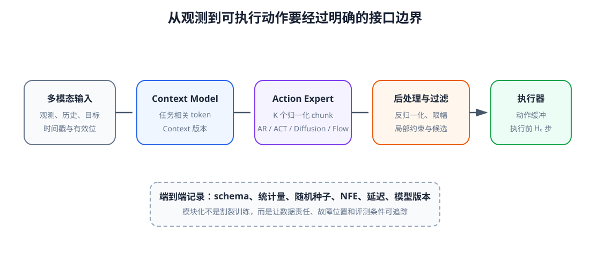
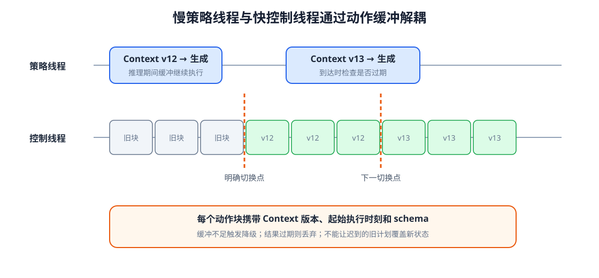
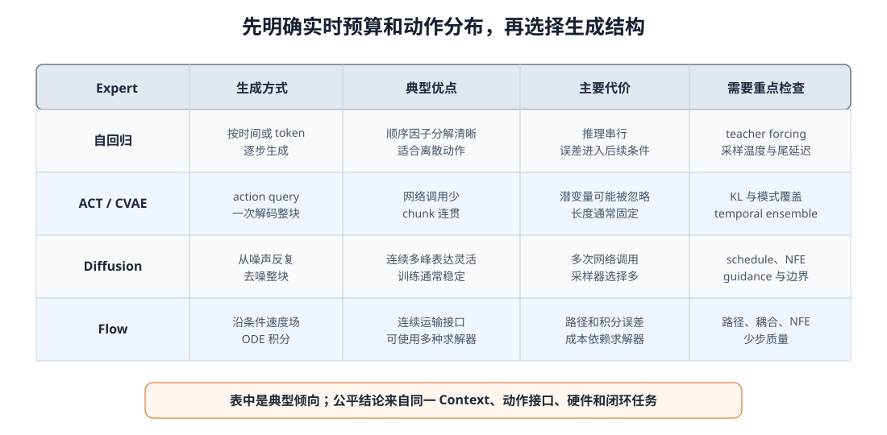

# 13 生成式 Action Model：从候选动作到滚动执行

第 11 章建立了动作数据契约和 Action Chunk，第 12 章学习了从噪声生成多峰动作的方法。但一个能够画出合理样本的生成器还不是可执行策略。真实控制循环需要在确定的截止时间前读取 Context、产生候选、恢复物理单位、检查约束、把动作写入缓冲区，并在执行一小段后根据新观测重新规划。

本章把 Context Model 与 Action Expert 组成统一 Action Model。重点不再推导某一种生成算法，而是规定三类方法怎样接入同一接口、怎样处理推理延迟和动作连续性，以及怎样在不借助 World Model 的情况下完成第一层候选过滤。下一单元再让机器人预测候选动作的长期后果。

学完本章后，你应当能够：

- 区分 Context Model、Action Expert、后处理器和底层控制器；
- 用统一接口描述自回归、ACT/CVAE、Diffusion 与 Flow Action Expert；
- 设计训练和推理一致的归一化、mask 与动作 schema；
- 说明候选数量、生成步数、预测范围和执行范围的计算代价；
- 实现 receding horizon 的动作缓冲和版本管理；
- 分析同步推理、异步推理、延迟与 Context 陈旧问题；
- 区分局部约束过滤与基于未来预测的候选评价；
- 建立成功率、连续性、实时性、多样性和安全性的联合评测。

## 1. 完整 Action Model 包含哪些模块

本教程将 Action Model 定义为从机器人输入到可执行动作候选的完整链条：

$$
C_t=\operatorname{ContextModel}_\psi(o_{t-H:t},a_{t-H:t-1},g),
$$

$$
\tilde A_t^{(k)}\sim\operatorname{ActionExpert}_\theta(\tilde A\mid C_t),
$$

$$
A_t^{(k)}=\operatorname{Postprocess}(\tilde A_t^{(k)},S_a),
$$

其中 $S_a$ 包含动作均值、尺度、单位、边界和控制语义。波浪号表示归一化模型空间，$k$ 表示候选编号。Postprocess 负责反归一化、坐标与语义恢复、限幅和局部连续性检查，底层控制器再跟踪最终选中的动作前缀。

<figure markdown="span">
  { width="1100" loading=lazy }
  <figcaption>图 13-1　Context Model 组织任务条件，Action Expert 产生归一化候选，后处理器恢复物理语义并过滤明显无效动作，执行器只消费选中动作块的前缀。（本教程绘制）</figcaption>
</figure>

模块边界便于定位失败：目标理解错误通常属于 Context；动作分布缺少某个模式属于 Expert；单位、坐标系或限幅错误属于后处理；跟踪偏差和紧急停止则属于控制与安全层。

## 2. 三类 Action Expert 怎样接入统一接口

自回归 Expert 把动作块联合分布分解为

$$
p(A_t\mid C_t)=\prod_{h=0}^{H_p-1}
p(a_{t+h}\mid a_{t:t+h-1},C_t).
$$

训练时各位置可并行使用真实前缀，推理时却必须逐步生成；连续动作可直接回归分布参数，也可以先量化成 action token。它具有明确顺序，但早期采样误差会进入后续条件。

ACT/CVAE Expert 使用 action query 一次解码整块动作，并用潜变量表达示范风格或模式。它生成调用次数少，适合固定长度 chunk；效果取决于潜变量是否真正被使用，以及推理先验是否与训练 posterior 对齐。

Diffusion 和 Flow Expert 都从噪声初始化整块动作并迭代更新。它们适合连续高维多峰分布，但一次决策要多次调用 backbone。无论内部算法如何，外部都应返回相同内容：候选张量、有效位、生成成本和可选置信信息。

## 3. 统一接口不仅是一种张量形状

最小生成接口可约定输入与输出：

$$
C_t:[B,N_c,D],\qquad
A_t:[B,K,H_p,D_a],\qquad
M_a:[B,H_p,D_a].
$$

$K$ 是候选数量，$M_a$ 标记有效时间和动作维度。但实际接口还应携带：Context 的时间戳和版本、动作 schema 版本、归一化统计版本、随机种子、网络调用次数、生成耗时以及模型检查点标识。若这些元数据缺失，离线复现与真机故障定位都会变得困难。

不同 Expert 不必强行输出不存在的“概率”。连续生成模型的似然往往昂贵或不可直接比较，自回归 token 概率也不等于物理成功概率。统一接口应保留可用分数的来源，而不是把所有方法包装成虚假的同一置信度。

## 4. 生成后的第一层处理

候选回到物理单位后，先执行不需要预测未来的局部检查：关节与工作空间边界、单步速度和加速度、NaN/Inf、夹爪取值、动作 mask 和简单自碰近似。失败候选可被拒绝、裁剪或投影到可行集合，但三种处理会产生不同轨迹，必须记录。

局部过滤不能判断“绕左还是绕右最终更好”，也不能知道当前动作会不会把杯子碰倒。它只能排除立即可见的格式和约束问题。需要根据候选后果排序时，就进入第 14～16 章的 World Model 与规划。

生成 $K$ 个候选的成本也并非总是线性增长。神经网络可在 batch 维并行，但显存和尾延迟会增加；多次序列解码或不同随机种子仍要消耗计算。候选数应与真正能被过滤或评价的能力匹配。

## 5. Receding horizon 的执行循环

一次完整循环可以概括为：读取截至时刻 $t$ 的观测；构建带版本的 Context；生成一个或多个长度 $H_p$ 的动作块；后处理并选择；把前 $H_e$ 步写入动作缓冲；执行期间继续采集传感器；到重规划条件后重新开始。

<figure markdown="span">
  { width="1120" loading=lazy }
  <figcaption>图 13-2　策略推理与高频控制处在不同时间尺度。动作缓冲保证推理期间仍有命令可执行，新动作块到达后只在明确边界切换，并携带生成它的 Context 版本。（本教程绘制）</figcaption>
</figure>

如果新动作块在执行到一半时到达，不能直接覆盖当前数组索引。系统要明确从下一控制周期、下一个 chunk 边界还是经过短过渡后切换。新旧块若基于不同坐标参考或不同归一化版本，更不能进行 temporal ensemble。

## 6. 推理延迟怎样改变动作含义

若在时刻 $t$ 读取观测，模型耗时 $L$ 后才输出，那么动作真正开始执行时环境已经到达 $t+L$。动态任务中，基于旧 Context 的第一步可能已经过时。只报告平均推理时间不够，还要报告高分位尾延迟和截止时间错过率。

同步模式在推理时暂停策略更新，结构简单但可能让控制命令断档。异步模式让控制线程继续消费旧缓冲，推理线程并行生成新块；它提高连续性，却需要处理 Context 版本、缓冲余量和过期结果。若一个结果到达时其观测已过旧，应丢弃而不是为了节省计算强行执行。

warm start 可以把上一次动作块剩余部分作为新一轮 Diffusion/Flow 的初始化或条件，减少跳变并可能降低步数。但 warm start 也会保留旧计划的偏差，遇到突发事件时应允许重新从噪声或安全策略开始。

## 7. 块边界、抖动与必要突变

动作连续性可以从三处改善：训练数据中的时间滤波和统一频率，Action Expert 内的时序结构与平滑正则，以及执行端的 temporal ensemble、插值或低通处理。任何平滑都必须在物理语义一致的空间中进行。

平滑不是目标本身。接触建立、夹爪闭合和紧急制动都可能需要快速变化。合理指标应分别观察自由空间运动与接触阶段的速度、加速度和 jerk，并检查平滑是否降低任务成功或延长反应时间。

## 8. 怎样选择 Action Expert

<figure markdown="span">
  { width="1100" loading=lazy }
  <figcaption>图 13-3　不同 Action Expert 的主要权衡。表中是结构层面的典型倾向，不是固定排名；最终选择要在相同动作接口与硬件上实测。（本教程绘制）</figcaption>
</figure>

任务若动作模式少、实时预算严格，确定性或 ACT 类 chunk 模型可能已足够；动作天然离散且顺序结构强时，自回归接口容易表达；连续动作多峰且数据充足时，Diffusion 或 Flow 能提供更灵活的分布。部署选择不能只看离线论文结果，还要考虑最坏延迟、候选批量、控制频率和安全降级。

## 9. 一套可比较的评测协议

比较不同 Expert 时，应固定 Context Model、动作 schema、训练划分、prediction/execution horizon 和底层控制器。质量指标至少包括闭环成功率、动作越界率、碰撞或约束触发率、动作速度与 jerk、多次采样的有效模式覆盖，以及受扰后的恢复率。

计算指标应包括参数量、峰值显存、网络调用次数、平均与 P95/P99 推理延迟、截止时间错过率。生成模型若用更长计算换来更多候选，还应把候选筛选时间计入端到端延迟。

离线 action error 仍可作为调试信号，但不应单独排名生成式策略。一个样本可能与某条示范逐点距离较远，却属于另一条成功模式；反之，平均轨迹可能 MSE 较低却不可执行。

## 配套实践

实践 13-01

### 建立统一 Action Expert 接口

让三种 toy Expert 返回同形状候选和元数据，在相同绕障任务上比较模式覆盖、平滑度、约束通过率和网络调用次数。

预计时间：30～40 分钟

实践 13-02

### 动作缓冲、延迟与异步滚动执行

模拟高频控制线程和较慢策略线程，比较阻塞推理、动作缓冲与过期结果丢弃在扰动任务中的影响。

预计时间：30～40 分钟

## 10. 单元二的出口

至此，机器人已经能够从多模态历史形成 Context，并由 Action Expert 生成一个或多个连续动作块，再通过约束、缓冲和 receding horizon 执行。完整接口为

$$
\{A_t^{(1)},\ldots,A_t^{(K)}\}
\sim\operatorname{ActionModel}(o_{\le t},a_{<t},g).
$$

但当多个候选都通过局部约束时，当前系统仍不知道哪一个会让目标更接近、哪一个会导致未来碰撞。仅凭动作模型自身的生成概率也不能回答后果问题。

## 本章小结

生成式 Action Model 不只是一个去噪网络或速度场。它由 Context、Action Expert、动作 schema、后处理、候选过滤、缓冲和底层执行共同组成。统一接口使自回归、ACT/CVAE、Diffusion 与 Flow 能在相同任务条件下比较，也把延迟、版本和安全边界变成可检查的数据。

Receding horizon 让长 Action Chunk 与闭环纠错兼容，异步缓冲让慢模型与高频控制共存，但过期 Context 和旧计划惯性仍需处理。下一单元将新增 World Model，让系统不仅能提出候选，还能预测“执行这个候选以后会怎样”。

## 下一章

> 两条动作都满足当前关节和速度约束时，机器人怎样在真正执行之前预测它们会把物体、夹爪和任务状态带到哪里？

第 14 章将建立动作条件 World Model。

[返回进阶篇概览](index.md)
