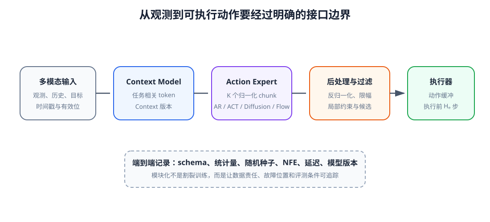
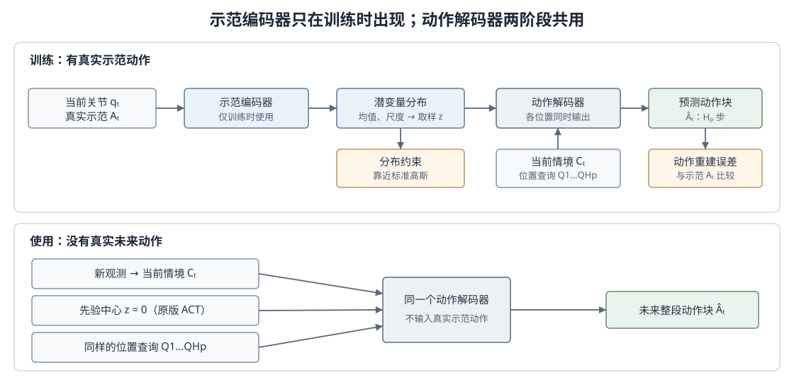
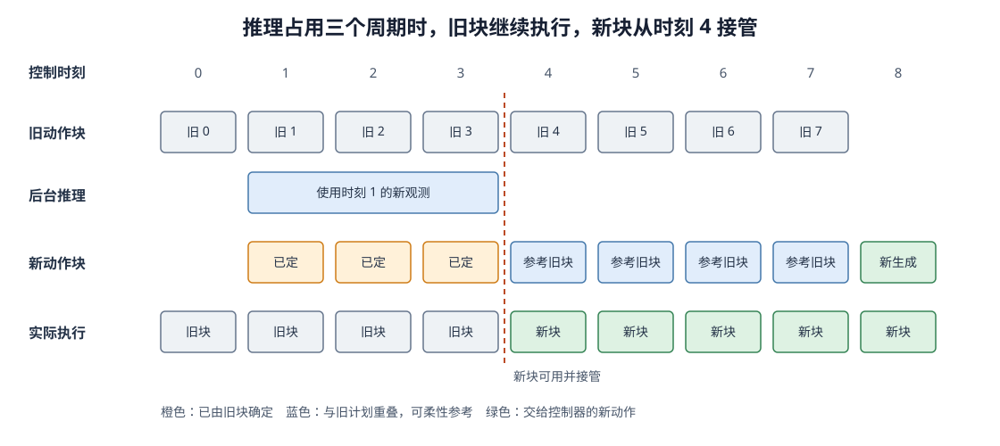

# 13 生成式 Action Model：从候选动作到滚动执行

第 11 章建立了动作数据契约和 Action Chunk，第 12 章学习了从噪声生成多峰动作的方法。但一个能够画出合理样本的生成器还不是可执行策略。真实控制循环需要在确定的截止时间前读取 Context、产生候选、恢复物理单位、检查约束、把动作写入缓冲区，并在执行一小段后根据新观测重新规划。

本章把 Context Model、动作专家、动作检查与执行环节连成一条数据流。先看不同专家怎样交出同一种动作块，再看动作块如何进入闭环控制。推理需要时间：机器人不应每次等待新动作块都暂停运动，这就引出实时动作块衔接方法 RTC。高级篇再学习预测候选动作的后果。

学完本章后，你应当能够：

- 区分 Context Model、Action Expert、后处理器和底层控制器；
- 解释自回归、ACT 与扩散或流模型怎样生成动作块；
- 读懂统一接口中每个维度、有效位和动作语义的作用；
- 说明预测一段、执行一小段、重新观察的滚动控制过程；
- 用具体时间线解释实时动作块衔接（RTC）如何处理推理延迟；
- 区分局部约束过滤与基于未来预测的候选评价；
- 从动作有效性、闭环成功和决策耗时三个方面比较方法。

## 1. 完整 Action Model 包含哪些模块

本教程将 Action Model 定义为从机器人输入到可执行动作候选的完整链条：

$$
C_t=\operatorname{ContextModel}_\psi(o_{t-H:t},a_{t-H:t-1},g),
$$

$$
\tilde A_t^{(k)}\sim\operatorname{ActionExpert}_\theta(\tilde A\mid C_t),
$$

$$
A_t^{(k)}=\operatorname{Postprocess}(\tilde A_t^{(k)},S_a),
$$

式中的 $o_{t-H:t}$ 是截至当前的观测历史，$a_{t-H:t-1}$ 是此前动作，$g$ 是任务目标，$H$ 是历史长度；$\psi$ 与 $\theta$ 分别是 Context Model 和动作专家的可训练参数。$S_a$ 包含动作均值、尺度、单位、边界和控制语义。波浪号表示归一化模型空间，$k$ 表示候选编号。后处理器（Postprocess）负责反归一化、坐标与语义恢复、限幅和局部连续性检查，底层控制器再跟踪最终选中的动作前缀。

<figure markdown="span">
  { width="1100" loading=lazy }
  <figcaption>图 13-1　Context Model 组织任务条件，Action Expert 产生归一化候选，后处理器恢复物理语义并过滤明显无效动作，执行器只消费选中动作块的前缀。（本教程绘制）</figcaption>
</figure>

模块边界便于定位失败：目标理解错误通常属于 Context；动作分布缺少某个模式属于 Expert；单位、坐标系或限幅错误属于后处理；跟踪偏差和紧急停止则属于控制与安全层。

## 2. 三类动作专家怎样生成同一种动作块

第 11 章已经规定，当前情境 $C_t$ 对应的目标是未来 $H_p$ 步动作 $A_t=[a_t,\ldots,a_{t+H_p-1}]$。三类专家接收同一个情境，学习的都是这段动作，只是内部生成顺序不同。为便于比较，下面沿用“绕过杯子”的例子：同一个观测下，左绕和右绕都可能是合理示范。

### 自回归：已生成的动作成为下一步的条件

自回归专家将整段动作的条件分布写成

$$
p(A_t\mid C_t)=\prod_{h=0}^{H_p-1}
p(a_{t+h}\mid a_{t:t+h-1},C_t).
$$

式中的 $h$ 是动作块内的位置，$a_{t:t+h-1}$ 是在该位置之前的动作。生成第一步时只有 $C_t$；生成第二步时，模型再看自己刚生成的第一步，依次走到块末。训练时可以把示范中的真实前缀交给模型，使各位置同时计算损失；实际使用时没有真实未来动作，只能依次使用自己的预测。因此，若第一步错误地选择向左，后续动作可能继续沿这个错误前缀展开。连续动作可以直接预测每一步的数值分布，也可以先把动作编码为离散动作 token；两者最终都必须还原为第 11 章规定的物理动作语义。

### ACT：两条数据流怎样生成整段动作

ACT（Action Chunking with Transformers，使用 Transformer 的动作块模型）与自回归专家的区别是：它不先生成第一步、再把第一步喂回来生成第二步，而是为未来每个位置准备一个查询，让解码器一次给出整段动作。第 11 章已经说明：如果同一情境下左绕、右绕都成功，直接用单一输出回归示范，容易预测出朝杯子中间去的动作。原论文用条件变分自编码器（CVAE）训练解码器，让它除了看当前情境，还能依据一个潜变量 $z$ 区分示范中的变化。CVAE 在这里有两个部件：**只在训练时使用的示范编码器**，以及**训练和实际使用时共用的动作解码器**。先分清这两条数据流，潜变量的作用才不会显得神秘。[ACT 原论文](https://arxiv.org/abs/2304.13705)

<figure markdown="span">
  { width="1120" loading=lazy }
  <figcaption>图 13-2　上半部：示范动作进入训练专用编码器，得到潜变量，再与当前情境和动作位置查询一起交给解码器；预测动作与示范比较，同时约束潜变量分布。下半部：使用时没有示范动作，编码器退出，只把当前情境、预先约定的潜变量和位置查询交给同一个解码器。（根据 ACT 论文绘制）</figcaption>
</figure>

先读图的上半部。一个训练样本包含当前观测和接下来的一段真实示范动作 $A_t$。原版 ACT 的示范编码器读取**当前关节状态 $q_t$ 与真实动作块 $A_t$**，并不读取图像；图像会走解码器一侧。编码器给出潜变量 $z$ 的一个分布，而不是直接给出动作。可以把它理解为：看过这段示范以后，模型为“这段动作采用了什么变化方式”分配一组内部数值。训练时从这个分布取一次 $z$。若同一观测下既有左绕也有右绕示范，不同的 $z$ 有机会帮助解码器区分这两类动作；但 $z$ 的某一维并不天然等于“左”或“右”，训练也不能保证两类一定分开。

具体地，先只看动作块中的一个横向数值：两段四步示范可能分别是 $(-0.1,-0.2,-0.3,-0.4)$ 和 $(0.1,0.2,0.3,0.4)$。编码器看到的是整段数值，并没有被告知“左绕”“右绕”两个类别；它为每段示范计算潜变量分布的均值与尺度，再从对应分布取 $z$。均值表示这些内部数值通常落在何处，尺度表示它们允许多大变化。随后解码器在几乎相同的当前情境下，能够尝试依据不同 $z$ 重建两段不同动作。这里的数字只演示一维，真实 ACT 的输入是一整段多维关节动作。

图中训练与使用共用的解码器接收三个部分。第一部分是当前图像和机器人状态形成的情境 $C_t$；原版 ACT 先把图像编码为视觉特征，再与关节状态组织起来。第二部分是刚取出的 $z$。第三部分是 $H_p$ 个**动作位置查询** $Q_1,\ldots,Q_{H_p}$：$Q_1$ 要求输出动作块第 1 步，$Q_2$ 要求输出第 2 步，依此类推。原论文用固定的位置编码作为这些查询。查询是向量形式的位置标记，既不是未来动作数值，也不是示范标签。Transformer 解码器让每个查询读取视觉、关节状态和 $z$ 的信息，再用输出层把每个查询的结果变为一步动作：

$$
\hat A_t=\operatorname{Decoder}_{\theta}(C_t,z,Q_1,\ldots,Q_{H_p}).
$$

例如预测四步、每步七个关节或夹爪数值时，四个查询各得到七个输出，合起来是一个 $4\times7$ 的动作块。四步在同一次解码中产生；第 2 步的查询不需要先取得第 1 步已生成的动作。这正是它与上方自回归模型的区别。

训练还要回答：怎样让预测的四步靠近示范，又怎样保证**没有示范动作时**也能给出合适的 $z$？ACT 同时使用两项约束。第一项比较预测动作块 $\hat A_t$ 与真实动作块 $A_t$，使解码器学会重建示范；原论文的实现使用逐项绝对误差。第二项让示范编码器给出的潜变量分布接近预先选定的标准高斯分布 $\mathcal N(0,I)$。后者不是要求每条示范都对应 $z=0$，而是让使用阶段可以从一个已知分布取得 $z$，不必再看到未来示范。若第二项过强，解码器可能忽略 $z$；若约束太弱，使用阶段取到的 $z$ 又可能与训练时的分布不匹配。

再读图的下半部。机器人实际运行时只有新观测，**没有真实未来动作块 $A_t$**，因此训练专用编码器退出。原版 ACT 固定采用标准高斯先验的中心 $z=0$；当前图像和关节状态照常形成 $C_t$，同样的动作位置查询交给同一个解码器，输出未来整段动作。也可以在别的实现中从先验随机取不同 $z$ 来尝试多条候选，但这不是原版 ACT 默认的使用方式，更不保证候选一定分别左绕和右绕。

### 扩散与流模型：从噪声反复更新整块动作

第 12 章的 Diffusion（扩散）与 Flow Matching（流匹配）也接收 $C_t$，但先抽取一整块随机噪声，再让网络多次修改这整块数值。扩散模型的网络估计噪声，流模型的网络估计沿生成路径的变化速度；每轮更新后，整块动作的位置都可能变化。给同一情境换一份初始噪声，可以得到另一条候选绕行轨迹。相比 ACT 一次解码，反复调用网络通常占用更多决策时间；生成步数越少是否仍有足够质量，需要在任务中验证。

到此可以看出统一接口的关键：自回归是逐位置完成，ACT 是一次解码，扩散与流模型是多轮修改；**外部执行器不应依赖这些内部步骤，而应接收同样含义的一段动作。**

## 3. 把三类输出整理为同一接口

统一接口首先约定“调用方给什么”：当前情境 $C_t$、要生成的候选数 $K$、预测步数 $H_p$，以及动作定义。动作定义说明每一步有几个数、各数对应哪个关节或夹爪、是位置还是速度命令、采用什么单位和控制频率。第 11 章称这份约定为动作数据契约。如果这些内容不同，形状相同的两个数组也不能互换：数值 $0.2$ 可能是关节角、角速度或夹爪开度。

假设一次同时处理 $B=1$ 个当前情境，Context Model 输出 $N_c=128$ 个情境 token，每个 token 有 $D=256$ 个特征。于是 $C_t$ 的形状为 $[1,128,256]$；$B$ 是一次处理的情境数，$N_c$ 是每个情境的 token 数，$D$ 是每个 token 的特征维数。若某个 Context Model 输出的是单个向量，它也能接入：可把它看作只有一个情境 token，或者由专家的入口层转换，没必要为统一接口强制使用 128 个 token。

现在要求每个情境生成 $K=2$ 条候选，每条预测 $H_p=8$ 个控制周期，每步有 $D_a=7$ 个动作数值。无论内部采用哪种专家，交出的**归一化动作候选**都整理为

$$
\tilde A_t\in\mathbb R^{B\times K\times H_p\times D_a}
=\mathbb R^{1\times2\times8\times7}.
$$

第一个维度区分同时处理的情境，第二个区分同一情境下的两条候选，第三个是未来第几步，第四个是该步的七个动作分量。还需要一个同形状的有效位 $M_t$：真实动作位置取 1，末尾补齐的时间位置或当前机器人不存在的动作分量取 0。后处理器只恢复和检查有效位置，不把补齐的零当作“让机械臂回到零位”。若任务总是固定八步、七维且没有补齐，有效位全为 1。有效位只说明这个数组位置有没有动作数据，不表示这条动作已经通过关节或碰撞检查。

这两条候选从何而来，也由专家自己决定：自回归模型可分别采样两次动作序列；ACT 可以取两份不同的潜变量 $z$；扩散或流模型可取两份不同的初始噪声。若 ACT 固定使用同一个潜变量中心，同一情境通常只有一条结果，就设 $K=1$，不必复制成两条假候选。接口统一的是输出的排列和动作含义，不是强制所有方法产生相同的多样性。

接口还要告诉下游这份动作**依据哪次观测、打算从哪个控制时刻开始执行**。观测时间与目标起始时间帮助执行器判断动作是否过期；动作定义及归一化统计的标识帮助它找到正确的反归一化方式。例如训练使用“七维关节位置规范 A1”及其均值、尺度，部署时就必须读取同一套 A1；这里的标识用于核对动作解释方式，并不是额外的模型输入。调试时可以另外记录随机种子、模型标识和生成耗时，但它们不是控制器解释动作数值的先决条件。

最后，接口不要把不同模型给出的数混称为“成功概率”。自回归动作 token 的概率、ACT 的潜变量分布、扩散或流模型的训练误差含义不同，不能直接拿来比较哪条轨迹更安全。没有经过校准的成功预测器时，先把候选当作**待检查动作**，而不是已经排好名次的动作。

## 4. 候选动作怎样进入执行器

第 3 节交出的还是归一化数组，不能直接发送给机械臂。后处理器先按与训练时相同的统计量恢复每个动作分量，再按动作定义解释其单位和控制方式。例如第七个数若表示夹爪开度，就不能当作第七个关节角；动作有效位为 0 的位置也不能执行。恢复到物理单位后，检查数值是否有限、关节是否越界、相邻位置命令是否超过允许速度，以及当前整臂姿态是否触碰已知障碍。第 12 章已经用具体数值说明：只把越界角度裁剪回边界，不一定能满足相邻时刻的速度约束。

假设两条候选分别从杯子左侧和右侧绕过。右侧轨迹若立即越过关节边界，可在这一层被拒绝；左侧轨迹若通过检查，执行器才有可选的动作。倘若两条都合法，局部检查仍不知道哪条更接近目标，也不知道接触杯子后会发生什么。此时可以先按固定规则选一条并在真实环境闭环验证；要在执行前比较两条的未来后果，则需要后续章节的 World Model。因此，候选数 $K$ 不是越大越好：若系统只检查单条动作、没有办法筛选多条，先设 $K=1$ 更清楚；增加候选时，也必须把生成和筛选所花的时间计入决策时间。

## 5. 预测一段、执行一小段：滚动控制

第 11 章区分了预测长度 $H_p$ 与执行长度 $H_e$。例如 $H_p=8$、$H_e=3$ 时，模型根据当前观测生成未来八步，但控制器只执行前三步；然后读取新观测，再生成新的八步。如此重复，机器人既能借助整段预测保持动作连贯，也能在每执行一小段后修正方向。这就是**滚动时域控制**（receding horizon）：未来计划随着机器人向前运动而不断重新计算，不是把八步预测一次执行到底。

控制器通常以固定周期取出下一条命令，模型却需要较长时间生成动作块。因此两者之间需要动作缓冲：缓冲里存着已经检查通过、安排好执行时刻的命令。只要缓冲还有动作，控制器就能按时工作；若必须等一块执行完才开始生成下一块，模型推理期间就会出现空档。让模型在后台生成下一块虽然能填补空档，却带来新的问题：它拿到的是稍早的观测，而且新旧两块可能在接管处给出不同方向。下面用 RTC 处理这一处衔接。

## 6. RTC：让新动作块接上正在执行的旧动作

RTC 是 Real-Time Chunking，可译为**实时动作块衔接**。它针对扩散或流模型的动作块生成：机器人执行旧块时，在后台根据新观测生成下一块；生成时不把旧块完全丢掉，而是利用已确定要执行的旧动作约束新块的开头。这是应用于生成阶段的衔接方法，不是把两段最终动作简单拼接，也不是训练一个新的速度网络。[RTC 原论文](https://arxiv.org/abs/2506.07339)

假设控制周期为 $0.1$ 秒，旧动作块安排了控制时刻 $0$ 到 $7$ 的动作。在时刻 $1$ 取得新观测，并启动下一块的生成；这次推理占用三个控制周期。等新块在时刻 $4$ 可用时，时刻 $1、2、3$ 已经由旧块的动作负责。因此，新块虽然以时刻 $1$ 为起点，它的前三个位置却不能再当作“尚未执行的未来”交给控制器。生成阶段应让这三个位置与旧块在相同绝对时刻的动作对齐，从第四个位置、即绝对时刻 $4$ 起，才可能由新块接管。

<figure markdown="span">
  { width="1120" loading=lazy }
  <figcaption>图 13-3　观测发生在时刻 1，新块在时刻 4 生成完毕；控制器在等待期间继续执行旧块。新块对应时刻 1～3 的位置已由旧块确定，时刻 4 才开始接管。（本教程绘制）</figcaption>
</figure>

读图时，先沿横轴看同一个**绝对控制时刻**，再从上往下看四行。第一行是旧块原本覆盖的时刻；第二行的蓝条是用时刻 1 的观测生成新块所花的三个周期；第三行是与时刻 1 对齐的新块，其中橙色前三格对应旧块已经承担的动作，后面的格子才有生成空间；第四行是实际发送给机器人的命令：时刻 0～3 来自旧块，时刻 4 起来自新块。虚线是接管点，不是另一次观测。这样看图，两个问题就分开了：**缓冲解决等待期间有没有命令，RTC 解决新块怎样接住正在发生的动作。**

RTC 把“已确定的动作前缀”看作生成新动作块时的已知部分。对流模型而言，仍然从一整块噪声出发、反复查询第 12 章学到的速度网络；但每轮更新还会加入引导，使新块的前几个位置尽量符合旧块在相同时刻的动作，随后再生成与此前缀连贯的剩余部分。这类似于在一张图中保留已知区域、补全其余区域，所以论文称为“补全”。除前三个已确定的位置外，时刻 4～7 虽尚未执行，却与旧计划重叠：RTC 可对越靠近接管点的动作给予越强的旧计划参考，对更远的位置逐渐放松约束，让新观测有机会改变后续路线。这里的“参考”不是逐项平均两条轨迹；如果旧计划左绕而新观测提示左侧出现障碍、新计划准备右绕，简单平均可能把机械臂引向杯子。

这种方法不能消除所有延迟。若新块晚到，超过旧块的有效长度，控制器就不应执行空缓冲或强行采用过期动作，而要转入事先设计的安全保持或停止策略。新块到达时也仍需经过第 4 节的物理约束检查。RTC 原论文研究的是**使用时**对已有扩散或流策略施加生成引导；它曾以 $\pi_{0.5}$ 为基础策略验证效果，但这不等于原版 $\pi_{0.5}$ 在训练时就使用了 RTC。第 11 章提到的“时间集成”则是对同一执行时刻的多次预测做加权平均，目的也包括减小接缝，但它不保证平均后仍是一条有效动作。

## 7. 怎样在同一任务上比较这些方法

现在可以沿本章数据流建立比较顺序。首先固定第 3 节的动作定义、Context 输入、训练与测试场景、预测八步与实际执行几步，以及第 4 节的后处理规则。否则某个模型看似更好，可能只是因为它获得了不同观测或用了更宽松的动作边界。然后分别看三个问题：**能否生成有效动作、闭环能否完成任务、能否按时交出动作。**

“有效动作”先在相同观测下多次生成候选，统计每条是否越界、碰撞，以及是否覆盖左绕和右绕等已知可行方式。它比只算与单条示范的数值误差更适合多种合理动作的任务。假设示范只记录了右绕 $+1$，生成另一条同样成功的左绕 $-1$ 会得到较大误差；输出两者中间的 $0$ 误差可能更小，却可能撞上杯子。离线误差仍能发现单位错误或数值异常，但不能代替轨迹有效性判断。

“闭环完成任务”要让机器人实际重复执行：记录成功次数和总次数，以及失败是碰撞、抓取失败还是超时。例如 30 次中成功 24 次，应报告“24/30”，而不只写一个 80%。还要在初始位置或障碍变化后复测，因为固定场景成功不代表新观测确实进入了动作决策。

“按时交出动作”要从取得观测开始计时，直到候选生成、物理检查与选择全部完成，而不是只量一次神经网络调用。若控制周期是 $0.1$ 秒，缓冲只剩三步，就只有约 $0.3$ 秒的时间准备下一块。可以把 100 次决策耗时从小到大排序，查看第 95 个附近的数：这就是 95 百分位耗时，表示大约 95% 的决策不比它更慢；剩下较慢的决策仍可能让缓冲耗尽。因此还要直接统计“超过可用时间的次数/总次数”。自回归的逐步生成、ACT 的一次解码、扩散与流模型的迭代次数，都会以不同方式影响这个结果。只有把有效性、闭环成功与按时完成放在一起，才能判断哪类专家适合当前机器人。

## 配套实践

实践 13-01

### 建立统一动作专家接口

让四种简化动作专家返回同形状候选，在相同绕障任务上比较模式覆盖、动作连续性、约束通过率和网络调用次数。

预计时间：30～40 分钟

实践 13-02

### 动作缓冲、延迟与异步滚动执行

模拟控制器与较慢的策略推理，观察动作缓冲怎样填补等待、过期结果为何不能直接执行。本练习建立 RTC 所需的时间线概念，不实现 RTC 的生成引导。

预计时间：30～40 分钟

## 8. 单元二的出口

至此，机器人已经能够从多模态历史形成 Context，让不同专家按统一动作契约交出候选，再通过物理约束、动作缓冲和滚动控制执行。对扩散或流模型，还可以用 RTC 使新块生成时参考已经确定的旧动作。完整接口为

$$
\{A_t^{(1)},\ldots,A_t^{(K)}\}
\sim\operatorname{ActionModel}(o_{\le t},a_{<t},g).
$$

但当多个候选都通过局部约束时，当前系统仍不知道哪一个会让目标更接近、哪一个会导致未来碰撞。仅凭动作模型自身的生成概率也不能回答后果问题。

## 本章小结

三类动作专家的内部生成过程不同，但可以交出同样形状、同样物理语义的动作块。统一接口让后处理器与控制器不必随生成方法重写；动作能否执行，仍须检查单位、约束和预定执行时刻。

滚动控制让机器人只执行预测块的一部分便重新观察。RTC 进一步处理慢速生成造成的新旧块衔接问题，但不替代安全检查，也不告诉系统哪条候选在未来更好。高级篇将引入 World Model，让机器人能在执行前预测候选动作的后果。

## 进入高级篇

> 两条动作都满足当前关节和速度约束时，机器人怎样在真正执行之前预测它们会把物体、夹爪和任务状态带到哪里？

进阶篇到此结束。这个问题将作为[高级篇](../advanced/index.md)的起点，进一步连接世界模型与动作选择。

[返回进阶篇概览](index.md)
