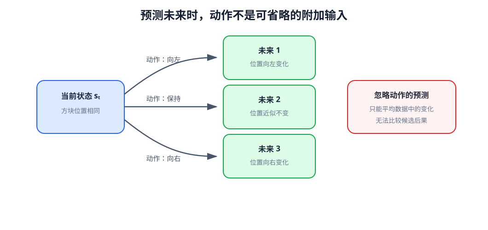
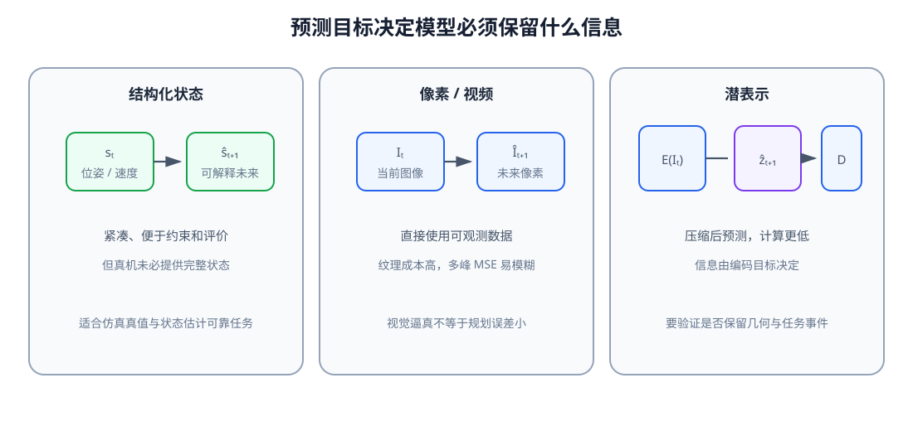
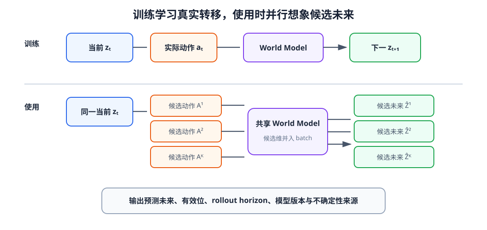

# 14 动作条件 World Model：做了这个动作以后会怎样

前一单元得到的 Action Model 能根据 Context 提出一个或多个动作块，却只回答“在类似示范中，人通常怎样行动”。当两条候选都满足局部关节与速度约束时，系统仍不知道哪条会推动目标、哪条会碰到障碍。World Model 增加另一种能力：给定当前状态和候选动作，预测接下来会发生什么。

策略与 World Model 的方向不同。策略由情境推向动作，World Model 由当前情境和动作推向未来。两者可以共享编码器，但训练标签、输出含义和评测方式不能混为一谈。

学完本章后，你应当能够：

- 区分策略、forward dynamics 与 inverse dynamics；
- 说明动作为什么是未来预测不可缺少的条件；
- 在状态、像素和潜表示之间选择预测目标；
- 比较绝对状态与残差预测；
- 正确构造 $(s_t,a_t,s_{t+1})$ 监督样本；
- 解释接触、多结果未来和训练分布外动作带来的困难；
- 区分视觉逼真度与规划可用性；
- 把单步 World Model 接到候选动作评价接口。

## 1. 策略与动力学回答相反方向的问题

策略学习

$$
a_t\sim\pi_\theta(a_t\mid C_t),
$$

forward dynamics 学习

$$
\hat s_{t+1}=f_\phi(s_t,a_t).
$$

inverse dynamics 则根据相邻状态反推动作：

$$
\hat a_t=g_\omega(s_t,s_{t+1}).
$$

inverse model 可帮助表征学习或动作标注，但不能代替 forward model：知道“怎样到达某个已给出的未来”不等于能够预测任意候选动作的后果。

<figure markdown="span">
  { width="1060" loading=lazy }
  <figcaption>图 14-1　当前状态相同，向左、向右和保持动作对应不同下一状态。忽略动作的模型只能平均训练数据中出现的变化，不能用于比较候选后果。（本教程绘制）</figcaption>
</figure>

## 2. 训练样本的动作必须与状态转移对齐

World Model 的基本监督单元是三元组 $(s_t,a_t,s_{t+1})$。这里的 $a_t$ 必须是从 $s_t$ 作用到 $s_{t+1}$ 的实际执行动作，而不是策略原始输出、动作块中错误的索引或被底层控制器裁剪前的命令。

真实系统中还要区分 command 与 executed action。若低层跟踪存在延迟和饱和，World Model 使用 command 作为条件却以真实下一状态为标签，会把执行器误差混入环境动力学。更稳妥的日志同时记录策略命令、控制器目标、实际关节变化和时间戳。

离线数据切分仍应按轨迹或场景进行。相邻转移高度相关，随机拆分单步样本会产生与第 11 章相同的数据泄漏。

## 3. 预测绝对状态还是状态变化

绝对预测直接输出 $\hat s_{t+1}$。残差预测输出

$$
\widehat{\Delta s_t}=f_\phi(s_t,a_t),
\qquad \hat s_{t+1}=s_t+\widehat{\Delta s_t}.
$$

当控制周期短、相邻状态接近时，残差目标通常尺度更小，也显式保留“没有动作时状态大致不变”的偏置。但角度、四元数和离散接触不能不加处理地相减；预测空间必须尊重变量几何与语义。

状态维度也要归一化。位置、速度和接触标志的损失数值不可直接相加，否则量纲较大的分量会主导训练。对规划关键但数值稀疏的碰撞或抓取成功，可以使用单独分类头和权重。

## 4. 状态、像素还是潜表示

结构化状态易于解释和计算，例如物体位姿、关节状态与接触关系；问题是真机通常没有完整物体真值。像素预测可以直接使用相机观测，却要同时生成任务无关的纹理、光照与背景，计算成本高，多峰未来在像素 MSE 下还会被平均成模糊图像。

潜空间路线先编码观测，再预测表示变化：

$$
z_t=E_\psi(I_t),\qquad
\hat z_{t+1}=f_\phi(z_t,a_t),
$$

必要时再解码

$$
\hat I_{t+1}=D_\psi(\hat z_{t+1}).
$$

<figure markdown="span">
  { width="1100" loading=lazy }
  <figcaption>图 14-2　状态路线紧凑但依赖可用状态；像素路线信息完整却昂贵；潜空间路线折中计算与任务信息，但其可用性取决于编码目标。（本教程绘制）</figcaption>
</figure>

潜表示不是天然更适合规划。若编码器只保留物体类别却丢失位置，latent dynamics 即使误差很小也无法评价抓取；若表示保留大量背景变化，模型仍会浪费容量。World Model 的训练目标必须与后续评价需要的信息一致。

## 5. 确定性未来与多结果未来

确定性 MSE dynamics 学到的是条件均值。当相同状态与动作因未观测摩擦、接触细节或外部干扰产生不同结果时，平均未来可能不符合任何真实轨迹。可以让模型输出均值与方差、混合分布、离散事件概率，或使用生成模型预测多个未来。

随机性还要区分两类来源：aleatoric uncertainty 表示环境本身或未观测因素造成的多结果；epistemic uncertainty 表示数据不足导致模型不知道。单个 Gaussian 方差容易实现，却无法表示相距很远的多个模式，也不能自动区分两类不确定性。

接触动力学尤其困难。物体在尚未接触时几乎不动，一旦跨过接触边界，微小位置误差会改变受力和运动方向。数据必须覆盖接触前后与失败情形，损失也要避免大量静止帧淹没少量关键变化。

## 6. 单步训练与多步使用之间的差距

单步 teacher forcing 训练时总是输入真实 $s_t$，部署 rollout 时却把自己的预测重新作为输入：

$$
\hat s_{t+h+1}=f_\phi(\hat s_{t+h},a_{t+h}).
$$

小偏差会改变下一步输入，随后继续累积。多步损失、scheduled sampling 或直接预测较长 horizon 可以缓解，但会增加优化难度，且不能消除训练数据之外的 model bias。第 15 章将系统讨论长程误差与不确定性。

## 7. 动作分布之外的外推风险

World Model 只在数据覆盖的状态—动作区域受到监督。规划器若专门搜索模型过于乐观的区域，可能找到真实系统中失败、模型中却高分的动作。这不是普通测试误差，而是模型被优化过程主动利用。

应分别评测示范动作附近、轻微扰动动作和明显分布外动作；可使用 ensemble 分歧、密度或距离指标标记陌生区域，并限制规划器不要远离数据支持。最终安全仍需真实约束与控制层保证。

## 8. 视觉逼真不等于规划可用

视频预测看起来清晰，可能仍把目标位姿偏移几个像素；模糊图像也可能保留足够的目标中心用于粗规划。World Model 的评价必须与用途对应：像素指标衡量外观，关键点或物体位姿误差衡量几何，接触和成功分类衡量任务事件，rollout 后的动作排序一致性才直接关系候选选择。

对象中心、slot 或 scene graph 表示能把物体与关系显式分开，但需要可靠分解。端到端 latent 更灵活，却更难解释。没有一种表示在所有任务中最好。

## 9. World Model 的最小接口

<figure markdown="span">
  { width="1100" loading=lazy }
  <figcaption>图 14-3　训练时使用对齐的当前表示、实际动作和下一表示；使用时把同一当前表示与多条候选动作配对，得到候选未来及可选不确定性。（本教程绘制）</figcaption>
</figure>

最小批量接口可以写成

$$
Z_t:[B,D],\quad A_t:[B,K,H,D_a]
\longrightarrow
\hat Z_{t+1:t+H}:[B,K,H,D].
$$

候选维 $K$ 可以并入 batch 并行计算。输出还应携带预测有效位、模型版本、rollout horizon 和不确定性来源。若模型只预测一步，接口要明确由调用方循环 rollout，而不是悄悄把同一步预测复制到未来。

## 配套实践

实践 14-01

### 训练动作条件动力学模型

在二维受控系统中比较“只看状态”与“状态加动作”的下一状态预测，并检查残差模型在未见动作上的 rollout。

预计时间：35～45 分钟

实践 14-02

### 比较像素、状态与潜空间预测

用移动光点图像建立 PCA latent dynamics，比较像素变化、结构化位置与潜表示在重建和动作条件 rollout 中保留的信息。

预计时间：30～40 分钟

## 10. 本章在系统中的位置

Action Model 产生候选 $A_t^{(k)}$，World Model 预测每个候选未来：

$$
\hat Z_{t+1:t+H}^{(k)}
\sim p_\phi(Z\mid C_t,A_t^{(k)}).
$$

本章建立的是动作条件单步或短程预测。它让“动作会改变未来”进入模型，却还没有解决长历史 belief、随机潜状态、误差随 rollout 扩大以及何时停止相信预测。

## 本章小结

World Model 与策略的区别在于条件和输出方向。可靠 dynamics 数据必须让实际执行动作与状态转移严格对齐，并明确预测目标是绝对状态、残差、像素还是潜表示。动作条件不可省略，确定性均值也不足以覆盖接触与未观测因素造成的多结果未来。

单步误差低不保证长程 rollout 可靠，训练分布内准确也不保证规划器搜索出的动作可信。下一章将把历史压入 belief，引入潜状态与不确定性，并直接观察误差怎样随想象长度累积。

## 下一章

> World Model 每一步都只有小误差时，为什么滚动几十步后仍可能完全偏离真实未来？机器人又怎样知道一段想象何时已经不可信？

第 15 章将讨论潜状态、RSSM 式 belief、长程想象和不确定性。

[返回进阶篇概览](index.md)
