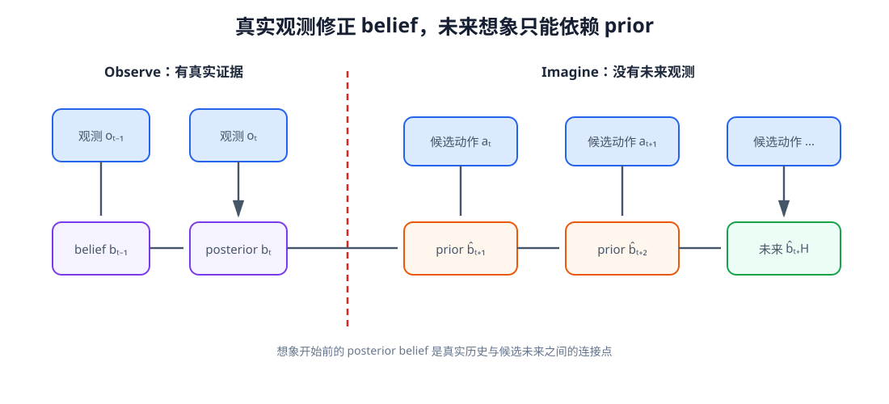
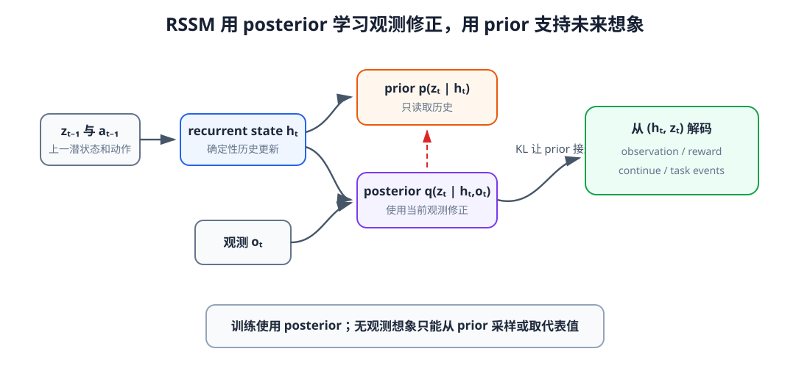
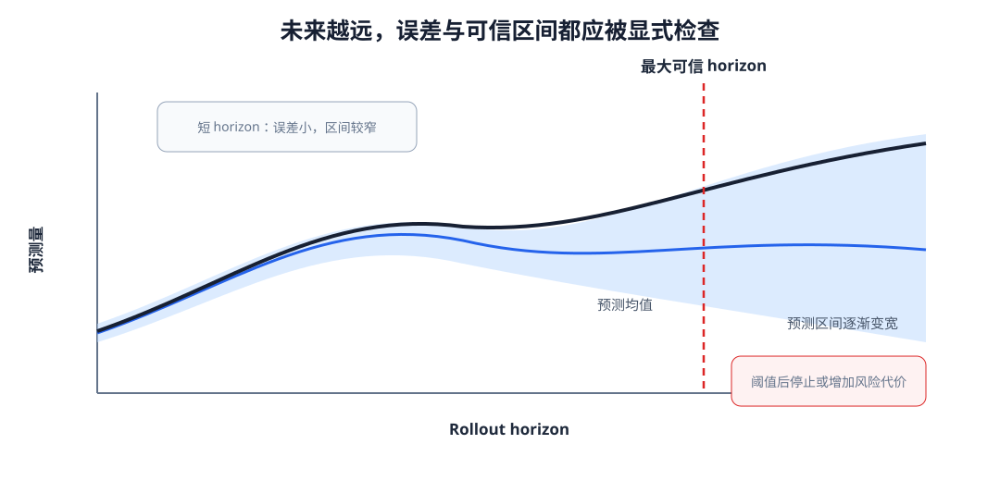

# 15 长程想象：潜状态、不确定性与误差累积

第 14 章的 World Model 从当前表示和动作预测下一表示，但真实机器人常有不可直接观测的因素：单帧位置不能给出速度，被遮挡物体仍可能继续运动，接触状态也可能只从一段触觉历史中推断。模型需要把过去观测压入 belief，并在没有新观测时沿候选动作向未来展开。

长程想象同时带来两个问题。第一，模型自己的预测会成为下一步输入，误差逐步积累；第二，未来越远、动作越陌生，模型越不应给出过度确定的答案。本章用 RSSM 式 prior/posterior 接口组织 belief，再区分环境随机性与模型未知，建立“预测什么”和“什么时候停止相信”两条线。

学完本章后，你应当能够：

- 说明 belief 为什么不能由单帧观测完全替代；
- 解释 RSSM 中确定性记忆、随机潜状态、prior 与 posterior；
- 区分观测更新和 imagined rollout；
- 说明重建、reward、continue 与 KL 各自约束什么；
- 比较生成式重建与 JEPA 式表示预测；
- 解释单步 teacher forcing 与 free-running rollout 的差距；
- 区分 aleatoric 与 epistemic uncertainty；
- 使用 ensemble、覆盖率与 horizon 曲线检查长期可信度。

## 1. 当前观测不等于完整状态

若相机只给出物体当前位置，相同图像可能对应向左运动、静止或向右运动。触觉为零也可能表示尚未接触或刚刚滑落。对部分可观测系统，更合理的输入是历史条件 belief：

$$
b_t=F(o_{\le t},a_{<t}).
$$

belief 不是环境真实状态，而是模型根据已见信息维护的内部推断。RNN、LSTM、GRU 或 Transformer 历史都可以构造 belief；潜状态世界模型进一步把“历史确定记忆”和“当前未确定因素”分开表示。

<figure markdown="span">
  { width="1100" loading=lazy }
  <figcaption>图 15-1　有真实观测时，posterior 用新证据修正 belief；规划未来时没有真实观测，只能沿 prior 和候选动作继续想象。两种路径共享转移，却具有不同信息来源。（本教程绘制）</figcaption>
</figure>

## 2. RSSM 怎样组织确定性记忆与随机状态

Recurrent State-Space Model 常使用确定性 recurrent state $h_t$ 和随机潜状态 $z_t$：

$$
h_t=f_\phi(h_{t-1},z_{t-1},a_{t-1}).
$$

在得到当前观测前，prior 根据历史给出

$$
p_\phi(z_t\mid h_t).
$$

看到观测 $o_t$ 后，posterior 再给出

$$
q_\phi(z_t\mid h_t,o_t).
$$

$h_t$ 保存可沿时间确定更新的信息，$z_t$ 表达当前观测和随机因素中无法由历史唯一决定的部分。它们是建模分工，不应简单解释为“长期记忆”和“短期记忆”。

<figure markdown="span">
  { width="1100" loading=lazy }
  <figcaption>图 15-2　动作和上一潜状态先更新 recurrent state；prior 只读历史，posterior 额外读取当前观测。训练让 prior 接近 posterior，使无观测想象仍能产生合理潜状态。（本教程绘制）</figcaption>
</figure>

在观测阶段使用 posterior 更新 $z_t$；进入想象阶段后没有未来 $o_t$，只能从 prior 采样或取其代表值。这正是模型训练与规划使用之间必须对齐的接口。

## 3. World Model 的多项训练目标

典型潜状态 World Model 从 $(h_t,z_t)$ 解码观测、reward 和 episode continue：

$$
\mathcal L_{\mathrm{WM}}
=\mathcal L_{\mathrm{obs}}
+\lambda_r\mathcal L_{\mathrm{reward}}
+\lambda_c\mathcal L_{\mathrm{continue}}
+\beta D_{\mathrm{KL}}\!\left(q(z_t\mid h_t,o_t)\|p(z_t\mid h_t)\right).
$$

观测目标迫使 latent 保留可解释环境信息；reward 目标保留与任务价值相关的线索；continue 预测轨迹是否终止；KL 让只看历史的 prior 能接近看过真实观测的 posterior。KL 太强可能让 posterior 忽略观测，太弱则让 prior 无法在想象阶段跟上 posterior。

free nats、KL balancing 等技巧用于控制这项权衡，但不能替代任务诊断。应分别检查重建、reward、终止、posterior correction 和 prior rollout，而不是只看总 loss。

## 4. Dreamer 式 imagination 在哪里发生

Dreamer 一类方法先用真实轨迹训练潜状态 World Model，再从 posterior belief 出发，在 latent 中用策略动作和 prior 展开大量 imagined trajectories。Actor 与 value 模型在这些潜轨迹上优化，减少真实环境交互。

这里的“想象”不是生成一段供人观看的视频，而是产生足以预测 reward、continue 和 value 的 latent 序列。若 latent 不能保留碰撞、抓取稳定性或任务进展，想象再长也没有规划价值。高级篇会进一步讨论完整 Dreamer 训练，本章只建立它依赖的接口。

## 5. JEPA 式预测不要求还原每个像素

生成式 World Model 通常解码观测；JEPA 式方法则让 predictor 根据 context 表示和动作，预测 target encoder 给出的未来表示。它可以忽略难以预测、与任务无关的像素细节，但必须防止所有输入映射到相同表示的坍缩。

target encoder 的停止梯度、EMA 更新、结构设计和额外正则都可参与防坍缩。表示预测误差较低仍不够，还应通过位置、接触、reward 等 probe 或下游控制验证 latent 是否保留控制相关信息。这里的 probe 是一种评测头，不是要求读者把不透明术语当作结论。

## 6. 为什么单步很准，长程仍会漂移

teacher forcing 训练时，模型每一步接收真实 latent；free-running rollout 使用自己的预测：

$$
\hat z_{t+h+1}=f_\phi(\hat z_{t+h},a_{t+h}).
$$

局部误差会改变后续输入，非线性和接触边界再把差异放大。即使每步误差近似相同，rollout 总误差也不必线性增长，可能收敛、累积或突然发散。

多步训练可最小化

$$
\mathcal L_H=\sum_{h=1}^{H}w_h\,d(\hat z_{t+h},z_{t+h}),
$$

使模型直接看到自己的中间预测。scheduled sampling 和 consistency loss 也可缩小训练—使用差距，但训练 horizon 之外仍需实测。

## 7. 两类不确定性

aleatoric uncertainty 来自环境随机性或观测中未包含的因素，例如物体摩擦和接触细节；增加相同分布数据后它仍可能存在。epistemic uncertainty 来自模型和数据覆盖不足，通常在陌生状态或动作处增大，并可随相关数据增加而下降。

概率模型输出的方差可能混合两者。ensemble 使用不同初始化和数据重采样训练多个模型，成员均值内的预测方差可表示单模型 aleatoric，成员均值之间的分歧常被用作 epistemic 近似：

$$
\operatorname{Var}(Y)
=\mathbb E_m[\operatorname{Var}(Y\mid m)]
+\operatorname{Var}_m(\mathbb E[Y\mid m]).
$$

这只是估计方法，不保证自动校准。成员若结构和数据完全相同，可能在分布外区域共同犯错并保持低分歧。

<figure markdown="span">
  { width="1080" loading=lazy }
  <figcaption>图 15-3　随着 rollout horizon 增长，预测误差和置信带通常扩大。模型应把不确定性传给规划器，由风险代价或最大可信 horizon 处理，而不是只输出一条确定曲线。（本教程绘制）</figcaption>
</figure>

## 8. 校准：置信区间是否真的可信

若模型声称 90% 预测区间，长期统计中应有约 90% 的真实结果落入区间。覆盖率过低表示过度自信，过高则可能区间过宽、缺乏决策价值。校准应按 rollout horizon、任务阶段和分布内外分别统计。

负对数似然、CRPS、coverage 与 interval width 互相补充。只把方差调大可以提高覆盖率，却会降低区分候选的能力；所以覆盖率必须与区间宽度一起报告。

## 9. 什么时候停止相信 imagined rollout

可以设置最大 horizon，也可以在 ensemble 分歧、预测方差、OOD 距离或累计模型误差超过阈值时提前终止。更保守的规划器会惩罚高不确定候选：

$$
J_{\mathrm{risk}}=\mathbb E[J]+\lambda\,\operatorname{Uncertainty}(J).
$$

$\lambda$ 体现风险偏好，不确定性本身则必须与真实误差相关。若模型在失败区域过度自信，再大的风险系数也无法提供保护。

## 配套实践

实践 15-01

### 从部分观测形成 belief 并长程想象

在只观测位置、隐藏速度的系统中比较单帧模型与 GRU belief，先用真实历史更新记忆，再在无观测阶段滚动未来。

预计时间：40～50 分钟

实践 15-02

### 用 ensemble 检查误差与可信区间

训练多个动力学模型，比较分布内与分布外动作的成员分歧，并按 rollout horizon 检查误差、覆盖率和区间宽度。

预计时间：40～50 分钟

## 10. 本章形成的想象接口

从真实历史得到 posterior belief $b_t$ 后，World Model 对每条候选动作产生未来样本或分布：

$$
\{\hat Z_{t+1:t+H}^{(k,m)}\}_{m=1}^{M}
\sim p_\phi(Z\mid b_t,A_t^{(k)}).
$$

$k$ 区分动作候选，$m$ 区分随机未来或 ensemble 成员。接口还要返回 reward、continue、任务事件及不确定性，使规划器能比较期望进展与风险。

## 本章小结

belief 把不可由单帧确定的速度、遮挡和接触历史压入内部状态。RSSM 用 recurrent state 传递历史，用 prior 支持无观测想象，用 posterior 根据真实观测修正潜状态；重建、reward、continue 与 KL 共同决定 latent 保留的信息。

长程 rollout 把单步 model bias 反复反馈给模型，因此必须随 horizon 检查误差。概率输出和 ensemble 可以估计不确定性，但只有经过覆盖率、区间宽度和分布外测试后才可用于风险决策。下一章将为这些候选未来定义目标和代价，并用 CEM 与 MPC 完成滚动选择。

## 下一章

> World Model 已经给出多条候选未来及其不确定性，怎样把任务进展、安全和效率写成可比较的代价，并在有限计算预算内选择下一段动作？

第 16 章将连接目标评价、CEM 和 MPC，完成进阶篇闭环。

[返回进阶篇概览](index.md)
