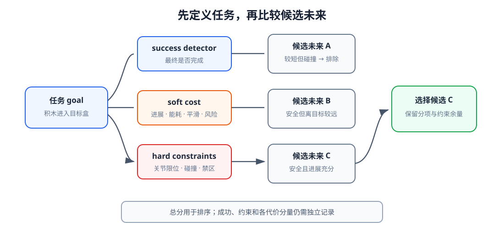
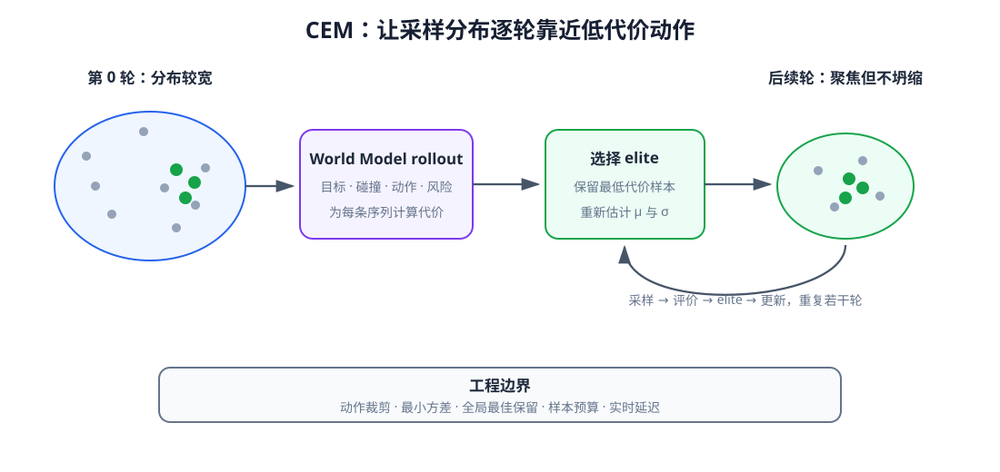
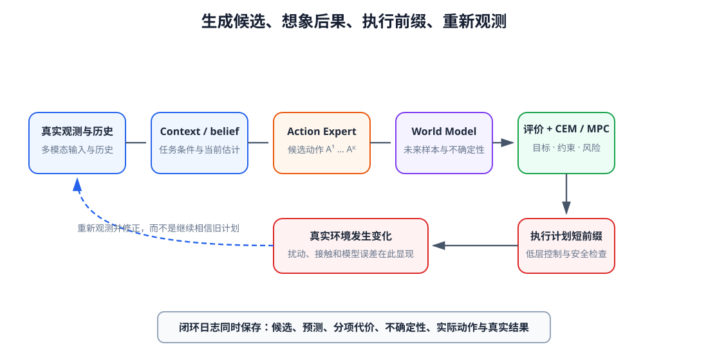

# 16 从候选未来到动作选择：目标评价、CEM 与 MPC

第 13 章的 Action Model 可以提出多条动作序列，第 14～15 章的 World Model 可以预测这些动作造成的未来以及预测的不确定性。系统现在仍缺一个决定性环节：怎样判断哪条未来更接近任务目标，并把想象中的选择变成真实机器人的下一步动作。

规划不是让 World Model 直接给出“最佳动作”。它先明确目标、成功条件、代价和安全边界，再在有限计算预算内搜索动作序列。模型预测控制（Model Predictive Control，MPC）只执行当前计划的一小段，随后读取新观测并重新规划，因此把想象与真实反馈连接成闭环。

学完本章后，你应当能够：

- 区分 goal、success detector、reward、cost 与硬约束；
- 把任务进展、碰撞、时间、能耗和平滑性组织成候选未来的评价；
- 说明稀疏信号、稠密 shaping 和 reward hacking 的关系；
- 理解 return、value、Q-value 与有限 horizon 规划的连接；
- 解释 random shooting 与 CEM 的采样、精英筛选和分布更新；
- 说明 MPC 为什么只执行计划前缀并持续重规划；
- 将 Action Model proposal、World Model、不确定性和规划器接入同一闭环；
- 使用成功率、安全违规、真实代价和计算延迟评价规划系统。

## 1. 目标、成功、reward 与 cost 不是同一个量

goal 描述希望世界最终满足的条件，例如“把红色积木放入左侧盒子”。success detector 判断条件是否已经成立，它可以读取物体位姿、视觉关系或人工标注。reward 是每一步得到的较大为好信号，cost 则是较小为好的代价。二者可以互相取负，但在工程接口中应固定一种符号约定。

一个成功条件通常不足以直接排序所有中间未来。两条轨迹都尚未成功时，仍需要比较目标距离、碰撞风险、动作幅度和耗时；但这些辅助项不能偷偷改写任务。若机器人只追求“末端靠近物体”，它可能推倒物体而不是稳定抓取。

<figure markdown="span">
  { width="1100" loading=lazy }
  <figcaption>图 16-1　goal 定义期望结果，success detector 检查是否完成，cost 用于比较尚未结束的候选未来，硬约束则先排除不可执行轨迹。评价器必须报告各项分量，不能只返回一个无法诊断的总分。（本教程绘制）</figcaption>
</figure>

## 2. 怎样给一条候选未来计分

设 World Model 从当前 belief $b_t$ 出发，对动作序列 $A=a_{t:t+H-1}$ 预测未来状态 $hat s_{t+1:t+H}$。常见有限 horizon 代价为

$$
J(A)=
\sum_{h=0}^{H-1}\gamma^h c(\hat s_{t+h},a_{t+h})
+\gamma^H c_T(\hat s_{t+H}).
$$

阶段代价 $c$ 约束沿途行为，终端代价 $c_T$ 衡量 horizon 末端是否接近目标，折扣因子 $\gamma$ 控制远期项的权重。机器人任务中的一个可诊断分解是

$$
c=w_g c_{\mathrm{goal}}+w_c c_{\mathrm{collision}}
+w_e c_{\mathrm{energy}}+w_s c_{\mathrm{smooth}}+w_u c_{\mathrm{uncertainty}}.
$$

各项应先归一到可比较尺度，再选择权重。权重并非“重要性百分比”：一项的数值范围扩大十倍，相同权重会让其实际影响也扩大。调试时应分别记录各分量、约束余量和最终成功状态。

## 3. 稀疏信号、稠密 shaping 与奖励捷径

只在成功时给 reward 的定义最贴近任务，但短 horizon 内大量候选都会得到相同分数。目标距离、抓取高度或阶段进展等稠密信号可以帮助搜索，却可能产生捷径：反复接近再离开也许累计更多“接近奖励”，遮挡相机也许欺骗视觉成功分类器。

设计评价时可遵循三层顺序：先写可独立测试的成功和失败条件；再加入确实有助于完成任务的进展量；最后加入效率与平滑项。对每一项都应构造反例，检查模型能否在不完成任务的情况下获得高分。学习得到的 reward 或语言—图像相似度同样需要这种测试。

硬安全边界不宜只依赖一个有限权重。关节限位、自碰撞和工作空间禁区应在动作发送前再次检查；规划代价负责让搜索远离危险，独立安全层负责拒绝越界命令。

## 4. value 为什么会出现在有限 horizon 末端

无限期折扣回报写作

$$
G_t=\sum_{k=0}^{\infty}\gamma^k r_{t+k}.
$$

$V^\pi(s)$ 表示从状态 $s$ 开始继续遵循策略 $\pi$ 的期望回报，$Q^\pi(s,a)$ 则先执行 $a$ 再遵循该策略。它们满足 Bellman 递推关系：

$$
Q^\pi(s,a)=r(s,a)+\gamma\,\mathbb E_{s'}[V^\pi(s')].
$$

规划 horizon 不可能无限长，可在末端加入 $V(\hat s_{t+H})$ 近似 horizon 之后的价值。这能减少“只顾眼前”的行为，但 value 自身也是模型，可能在陌生状态过度乐观。进阶篇只要求理解接口；完整 actor–critic、离线强化学习和价值学习留到后续课程。

## 5. 从 random shooting 到 CEM

random shooting 从一个固定分布采样许多动作序列，经 World Model rollout 后直接选择代价最低者。它易于并行，却把大量预算花在明显较差的区域。Cross-Entropy Method（CEM）把采样分布也纳入迭代：

1. 为每个 horizon 位置初始化动作均值和方差；
2. 采样一批动作序列，并裁剪到动作边界；
3. 用 World Model 预测未来，再计算每条序列的总代价；
4. 选择代价最低的一小组 elite；
5. 用 elite 的均值和方差更新采样分布；
6. 重复若干轮，输出最佳动作序列。

<figure markdown="span">
  { width="1100" loading=lazy }
  <figcaption>图 16-2　CEM 不对离散的碰撞判断求梯度，而是反复采样、评价和拟合 elite。分布逐轮收窄表示搜索正在聚焦，但收窄过快也可能错过另一条可行路线。（本教程绘制）</figcaption>
</figure>

CEM 不要求评价函数可微，适合碰撞、接触和逻辑事件；代价是需要大量并行 rollout。elite 比例、样本数、迭代数、最小方差和动作边界共同决定搜索质量与延迟。实践中还应保留全局最佳候选，避免最后一轮随机波动把结果变差。

## 6. MPC 为什么不把整段计划一次执行完

开环执行默认初始观测、World Model 和执行器都完全准确。真实机器人会受视觉误差、物体滑动、控制延迟和外部扰动影响，因此计划越长，实际状态越容易偏离预测。

MPC 在时刻 $t$ 优化长度为 $H$ 的序列，只执行第一个动作或很短的前缀；到 $t+1$ 重新读取观测、更新 belief，再求解新的序列。它没有消除 model bias，却把误差暴露给下一次观测修正。上一轮计划向前平移后可作为 warm start，减少重新搜索成本。

执行前缀长度形成反馈频率与计算效率之间的权衡。前缀太长接近开环，前缀太短则可能让规划延迟占满控制周期。Action Chunk 的执行长度、World Model horizon 和低层控制频率必须分别记录。

## 7. Action Model proposal 与 planner refinement

从宽高斯分布开始搜索会浪费预算。第 13 章的 Action Expert 已经能根据 Context 提出较合理的动作块，可用它初始化 CEM 均值、提供多个模式，或与少量宽分布样本混合。规划器随后用 World Model 和当前目标细化这些 proposal。

这种组合分工明确：Action Model 利用示范先验快速提出“像机器人动作”的候选，World Model 预测候选后果，评价器表达当前目标与风险，CEM 在局部预算内重新排序和修正。若 Action Model 没覆盖必要模式，仍需保留探索样本，否则 refinement 只能在错误模式附近优化。

## 8. 风险感知规划与模型利用

第 15 章已经让 World Model 返回未来样本或不确定性。风险敏感代价可以写成

$$
J_{\mathrm{risk}}(A)=\mathbb E[J(A)]
+\lambda_u\,U(A),
$$

其中 $U$ 可以是 ensemble 分歧、碰撞概率、尾部代价或预测区间宽度。风险项会让机器人偏向数据覆盖充分、结果稳定的路线，但也可能过于保守。应报告安全、成功、路径长度和时间，而不是只宣布“风险更低”。

规划器会主动寻找 World Model 的漏洞：某条模型内高分轨迹可能利用视觉伪影、错误动力学或过度乐观的 value。这称为 model exploitation。缓解方式包括真实数据覆盖、短 horizon、ensemble pessimism、动作先验、约束检查和频繁重规划；任何单项都不能构成安全保证。

## 9. 在 state、pixel 与 latent 中规划

结构化 state 的目标距离和碰撞关系容易解释，却依赖可靠状态估计；pixel 目标最接近原始观测，但像素误差会惩罚光照和纹理等无关变化；latent 计算高效，也能表达语义，却必须验证距离和 reward 是否对应真实任务进展。

无论使用哪种表示，规划接口至少应返回：候选动作、预测未来、各代价分量、成功概率、约束余量、不确定性、模型版本和计算耗时。若只能看到总代价，就很难判断一次失败来自目标定义、World Model、搜索预算还是执行器。

## 10. 规划、模仿与强化学习的边界

行为克隆从示范中直接学习策略，推理快，却可能在偏离示范分布后不断累积错误；基于模型规划在每个时刻搜索动作，能显式利用目标和约束，却依赖 World Model 并消耗在线计算。在线强化学习通过真实交互改善策略，数据代价和安全风险较高；离线强化学习只使用固定数据，更要警惕对数据外动作的价值高估。

这些路线并不互斥。Action Expert 可以由行为克隆或生成式训练获得，再为规划器提供 proposal；World Model 可以由离线轨迹学习；value 可以补充有限 horizon 末端；真实 MPC 日志又可成为下一轮训练数据。选择组合前，应先明确哪些模块从示范学习、哪些依赖 reward、哪些会在线搜索，以及每一步怎样接受真实结果检验。

## 11. 怎样评价一个规划闭环

规划器的离线指标包括候选最优代价、搜索收敛、每秒 rollout 数和延迟；真实闭环还要报告任务成功率、碰撞或约束违规率、最终目标误差、动作平滑、完成时间和恢复次数。模型内回报只能用于调试，不能代替真实环境结果。

比较 random shooting、CEM 或不同风险权重时，应固定 World Model、初始状态分布和总计算预算，并用多个随机种子报告分布。还要单独测试模型误差、观测噪声、执行延迟和目标变化，因为 MPC 的价值正体现在这些偏差出现后的重新决策。

## 配套实践

实践 16-01

### 用 CEM 优化二维动作序列

在二维点机器人任务中建立目标、碰撞、动作和平滑代价，观察候选轨迹如何经多轮 elite 更新绕开障碍并聚焦到目标。

预计时间：35～45 分钟

实践 16-02

### 比较开环、MPC 与风险感知 MPC

让真实系统在陌生区域出现扰动，比较一次性执行、逐步重规划和不确定性惩罚对目标误差、碰撞率与完成步数的影响。

预计时间：40～50 分钟

## 12. 进阶篇形成的完整闭环

<figure markdown="span">
  { width="1100" loading=lazy }
  <figcaption>图 16-3　真实观测先更新 Context 和 belief；Action Expert 提出候选动作，World Model 想象未来，评价器与 CEM/MPC 选择计划前缀。执行后重新观测，闭环再次开始。（本教程绘制）</figcaption>
</figure>

到这里，进阶篇的接口可以写成

$$
C_t=\operatorname{ContextModel}(o_{\le t},a_{<t},g),
$$

$$
A_t^{(k)}\sim\operatorname{ActionExpert}(A\mid C_t),
\qquad
\hat Z_{t+1:t+H}^{(k,m)}\sim p_\phi(Z\mid b_t,A_t^{(k)}),
$$

$$
k^*=\arg\min_k J_{\mathrm{risk}}(\hat Z^{(k)},A^{(k)}),
\qquad
\text{execute}(A_t^{(k^*)}[0:L]).
$$

$L$ 是实际执行的短前缀。下一轮观测会更新 $C_{t+L}$ 和 $b_{t+L}$，因此系统不是一条从感知到动作的单向流水线，而是由真实反馈不断校正的 World–Action 闭环。

## 本章小结

目标决定希望发生什么，success detector 检查是否完成，reward 或 cost 为尚未结束的未来提供排序，硬约束负责不可越过的边界。CEM 用采样和 elite 更新在不可微代价下搜索动作序列，MPC 则只执行短前缀并用新观测持续修正计划。

风险惩罚可以让规划考虑 World Model 的未知区域，却不能替代真实约束和系统验证。一个可用的机器人闭环必须同时记录任务进展、安全、模型不确定性、搜索预算和真实执行结果。至此，进阶篇已经完成从多模态 Context、生成式 Action Model、动作条件 World Model，到候选评价与滚动控制的完整连接。

## 进入高级篇

> 当一个小型闭环已经能够构建上下文、生成动作、想象未来并重新规划，怎样把它扩展到开放词汇任务、大规模预训练、跨机器人迁移和真实系统安全？

高级篇将在这些接口之上讨论 VLM、VLA、通用 World Model、数据引擎与真实机器人部署。

[返回进阶篇概览](index.md)
