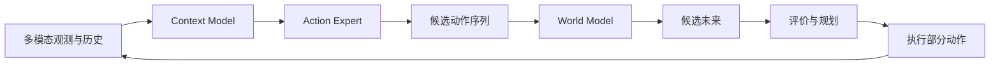

# 进阶篇：机器人怎样生成动作并预见变化

基础篇已经建立视觉、语言、三维目标、本体、触觉和动作的数据接口。进阶篇不再分别处理这些输入，而是研究三个彼此连接的问题：模型怎样从当前观测和历史中形成任务上下文，怎样生成一种或多种合理动作，以及怎样预测这些动作可能造成的未来。

进阶篇最终形成下面的闭环：

在本教程中，Context Model 与 Action Expert 共同组成 Action Model。Context Model 回答“机器人现在处于什么情境”，Action Expert 回答“在这种情境下可以怎样行动”，World Model 回答“这样行动以后可能发生什么”。规划模块再根据任务目标、代价和不确定性选择动作。

## 单元一：从当前观测到任务上下文

| 章节 | 要解决的问题 | 状态 |
|---|---|---|
| [08 时间与记忆：RNN、LSTM 与 GRU 怎样理解历史](08-time-and-memory.md) | 单帧观测不足时，模型怎样保存运动趋势、接触变化和任务阶段 | 正文、图示与 Notebook 已完成 |
| [09 Attention 与 Transformer：怎样从历史中读取相关信息](09-attention-and-transformer.md) | 模型怎样根据当前问题直接读取相关时刻和 token | 正文、图示与 Notebook 已完成 |
| [10 多模态 Context Model：怎样形成任务相关上下文](10-multimodal-context-model.md) | 视觉、语言、本体、触觉和动作历史怎样组成统一 Context | 正文、图示与 Notebook 已完成 |

单元一的产物是

$$
C_t=\operatorname{ContextModel}(o_{\leq t},a_{<t},g).
$$

它不是动作，也不是未来预测，而是后续模型共同使用的任务相关上下文。

## 单元二：从示范动作到生成式 Action Model

| 章节 | 要解决的问题 | 状态 |
|---|---|---|
| [11 从示范学习到动作序列：第一个 Action Model](11-demonstrations-to-action-sequences.md) | 怎样由示范数据学习单步动作、动作块和多种合理轨迹 | 正文、图示与 Notebook 已完成 |
| [12 Diffusion 与 Flow Matching：学习连续、多峰的动作分布](12-diffusion-and-flow-matching.md) | 怎样从简单随机分布生成高维连续动作 | 正文、图示与 Notebook 已完成 |
| [13 生成式 Action Model：从候选动作到滚动执行](13-generative-action-model.md) | 怎样把 Context、Action Expert 和机器人执行接口连接起来 | 正文、图示与 Notebook 已完成 |

这一单元最终建立

$$
A_t^{(k)}\sim\operatorname{ActionExpert}(A\mid C_t),
$$

使机器人能够提出一条或多条候选动作序列。

## 单元三：从候选动作到候选未来

| 章节 | 要解决的问题 | 状态 |
|---|---|---|
| [14 动作条件 World Model：做了这个动作以后会怎样](14-action-conditioned-world-model.md) | 怎样预测动作导致的状态、观测或潜表示变化 | 正文、图示与 Notebook 已完成 |
| [15 长程想象：潜状态、不确定性与误差累积](15-long-horizon-imagination-and-uncertainty.md) | 怎样进行多步 rollout，并判断预测何时不再可信 | 正文、图示与 Notebook 已完成 |
| [16 从候选未来到动作选择：目标评价、CEM 与 MPC](16-objective-cem-and-mpc.md) | 怎样评价多个未来，只执行部分动作并重新规划 | 正文、图示与 Notebook 已完成 |

进阶篇结束时，模型应能生成候选动作、预测候选未来，并在一个小型任务中根据目标和风险进行滚动选择。大型 VLM、通用 VLA、跨本体训练和真实机器人系统部署留到高级篇。

## 当前学习入口

从 [第 08 章：时间与记忆](08-time-and-memory.md) 开始，按编号阅读至 [第 16 章：目标评价、CEM 与 MPC](16-objective-cem-and-mpc.md)。前六章依次建立历史记忆、多模态 Context、生成式 Action Model 和候选未来，第 16 章再把目标、风险与真实反馈连接成滚动控制闭环。
