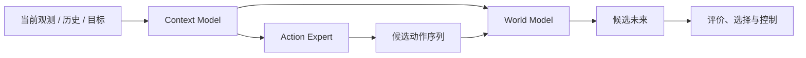

# 进阶篇：机器人怎样生成动作并预见变化

核心问题：

> 模型怎样从观测和历史中构建 Context，生成动作序列，并预测这些动作可能造成的未来？

基础篇已经准备了视觉表征、语言目标、三维空间关系、本体、触觉和动作接口。进阶篇开始把这些接口连接成三个核心模块：Context Model 组织当前观测与历史，Action Expert 生成动作序列，World Model 预测候选动作的后果。

## 本阶段要打通的能力

```text
多模态接口如何组成 Context
→ Action Expert 如何生成多种动作序列
→ World Model 如何预测动作后果
→ 模型如何比较候选未来
```



## 章节地图

| 章节 | 要补上的缺口 | 状态 |
|---|---|---|
| [时间序列建模](temporal-modeling.md) | 如何显式地对时间依赖建模 | 占位 |
| [Attention](attention.md) | 如何根据当前问题读取相关信息 | 占位 |
| [Transformer](transformer.md) | 如何把注意力组成可扩展的 Context Model | 占位 |
| [多模态融合](multimodal-fusion.md) | 视觉、语言、本体、触觉和历史如何组成 Context | 占位 |
| [动作表示](../advanced/action-representation.md) | 单步动作、动作 token 和 Action Chunk 怎样定义 | 占位 |
| [自回归生成](autoregressive-models.md) | Action Expert 如何逐步生成动作 | 占位 |
| [Diffusion](diffusion.md) | 如何从噪声生成多峰连续动作 | 占位 |
| Flow Matching | 如何通过连续速度场生成动作 | 页面待建立 |
| [视频预测](video-prediction.md) | 如何预测视觉层面的未来 | 占位 |
| [潜空间动力学](latent-dynamics.md) | World Model 如何在 latent 空间预测动作后果 | 占位 |
| [基于模型的控制](model-based-control.md) | 如何比较候选未来并选择动作 | 占位 |

## 学完进阶篇应该能解释

- [ ] Context Model 为什么必须同时处理当前观测、历史动作和任务目标；
- [ ] Attention 与 Transformer 怎样从长序列中读取任务相关信息；
- [ ] 自回归、Diffusion 和 Flow Matching 怎样形成不同类型的 Action Expert；
- [ ] Action Model 与 World Model 分别回答“应该怎样做”和“这样做会发生什么”；
- [ ] 为什么 World Model 常在 latent 空间进行多步 rollout；
- [ ] 候选动作、候选未来和模型预测控制怎样连接起来。

## 本阶段结束后留下的问题

进阶篇结束时，模型开始能够写出：

$$
C_t=\operatorname{ContextModel}(o_{\leq t},a_{<t},g),
\qquad A_t\sim\pi_\theta(A\mid C_t)
$$

$$
\hat Z_{t+1:t+H}\sim p_\phi(Z\mid C_t,A_t)
$$

但它还没有解决大规模视觉语言预训练、跨任务与跨本体泛化、真实机器人部署和安全恢复等系统问题。这些问题交给 [高级篇](../advanced/index.md)。
