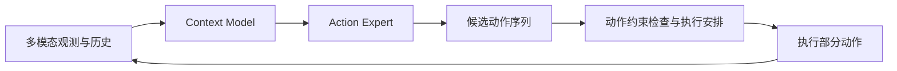

# 进阶篇：机器人怎样构建上下文并生成动作

基础篇已经建立视觉、语言、三维目标、本体、触觉和动作的数据接口。进阶篇通过两个单元研究：模型怎样从当前观测和历史中形成任务上下文，以及怎样利用这一上下文生成动作，并与机器人执行环节连接起来。

进阶篇最终形成下面的闭环：

```mermaid
flowchart LR
    O["多模态观测与历史"] --> C["Context Model"]
    C --> A["Action Expert"]
    A --> P["候选动作序列"]
    P --> S["动作约束检查与执行安排"]
    S --> E["执行部分动作"]
    E --> O
```

在本教程中，Context Model 与 Action Expert 共同组成 Action Model。Context Model 回答“机器人现在处于什么情境”，Action Expert 回答“在这种情境下可以怎样行动”。执行环节检查动作的物理语义与约束，只执行动作块的一部分，再根据新观测更新动作。这里还没有用世界模型预测候选动作的后果。

## 单元一：从当前观测到任务上下文

| 章节 | 要解决的问题 | 状态 |
|---|---|---|
| [08 时间与记忆：RNN、LSTM 与 GRU 怎样理解历史](08-time-and-memory.md) | 单帧观测不足时，模型怎样保存运动趋势、接触变化和任务阶段 | 正文、图示与 Notebook 已完成 |
| [09 Attention 与 Transformer：怎样从历史中读取相关信息](09-attention-and-transformer.md) | 模型怎样根据当前问题直接读取相关时刻和 token | 正文、图示与 Notebook 已完成 |
| [10 多模态 Context Model：怎样形成任务相关上下文](10-multimodal-context-model.md) | 视觉、语言、本体、触觉和动作历史怎样组成统一 Context | 正文、图示与 Notebook 已完成 |

单元一的产物是

$$
C_t=\operatorname{ContextModel}(o_{\leq t},a_{<t},g).
$$

它不是动作，也不是未来预测，而是后续模型共同使用的任务相关上下文。

## 单元二：从示范动作到生成式 Action Model

| 章节 | 要解决的问题 | 状态 |
|---|---|---|
| [11 从示范学习到动作序列：第一个 Action Model](11-demonstrations-to-action-sequences.md) | 怎样由示范数据学习单步动作、动作块和多种合理轨迹 | 正文、图示与 Notebook 已完成 |
| [12 Diffusion 与 Flow Matching：学习连续、多峰的动作分布](12-diffusion-and-flow-matching.md) | 怎样从简单随机分布生成高维连续动作 | 正文、图示与 Notebook 已完成 |
| [13 生成式 Action Model：从候选动作到滚动执行](13-generative-action-model.md) | 怎样把 Context、Action Expert 和机器人执行接口连接起来 | 正文、图示与 Notebook 已完成 |

这一单元最终建立

$$
A_t^{(k)}\sim\operatorname{ActionExpert}(A\mid C_t),
$$

使机器人能够提出一条或多条候选动作序列。

进阶篇在第 13 章结束。此时学生应能说明从多模态历史、Context、候选动作到滚动执行的完整数据流，并理解生成延迟与新旧动作块衔接的问题。但“能够生成并执行动作”还不等于“知道动作会带来什么后果”。这一问题留给高级篇，不在进阶篇另设世界模型单元。

## 当前学习入口

从 [第 08 章：时间与记忆](08-time-and-memory.md) 开始，按编号阅读至 [第 13 章：生成式 Action Model](13-generative-action-model.md)。两个单元共六章，配有 12 份 Notebook。第 13 章末尾保留“怎样在执行前预见动作后果”的问题，作为进入高级篇的起点。
