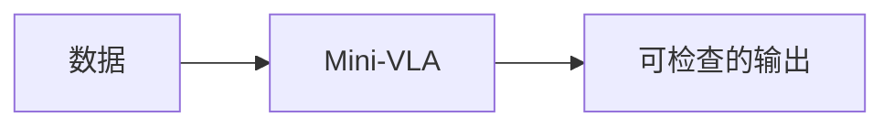

# Mini-VLA

## 本章解决什么问题

做一个最小视觉-语言-动作模型：输入图像和指令，输出短动作序列。

## 学习目标

完成本项目后，读者应该能够：

- [ ] 固定指令在训练场景中能给出形状正确的动作
- [ ] 明确动作是回归、token 还是扩散
- [ ] 至少讨论一种开环失败

## 前置知识

- [视觉语言动作模型](../advanced/vla.md)
- [动作表示](../advanced/action-representation.md)
- [Visual Grounding](../advanced/visual-grounding.md)

## 从上一章遗留的问题开始

<!-- TODO：说明为什么必须把前面的模块接到一个可运行的最小系统里。 -->

理论章节把接口讲清楚之后，如果没有一次端到端拼接，读者仍然不知道数据在自己的代码里如何流动。

## 项目范围

- 对应代码：`examples/07-mini-vla/`
- 不在范围内：完整 SOTA 复现、未经验证的大规模训练结论

## 输入、输出与张量形状

| 名称 | 符号 | 示例形状 | 含义 |
|---|---|---:|---|
| TODO | TODO | TODO | TODO |

## 模块结构

## 配套实践

!!! example "项目实现位置"
    网页只说明项目目标、接口与验收条件。可执行代码将在对应 Colab Notebook 或 `examples/` 项目目录中提供。

## 可视化与实验

  
实验可视化占位。请同时填写附录中的实验记录模板。

## 常见误区

- TODO：把项目做成论文复现清单，而不是能力验证
- TODO：只报告一次成功运行，不记录失败层

## 它在机器人世界模型中的位置

本项目用于验证教程闭环中的一段接口，而不是替换高级篇正文。

## 本章小结

<!-- TODO -->

## 下一章

完成最小成功标准后，带着失败案例回到相关理论章节，或进入下一个项目。
