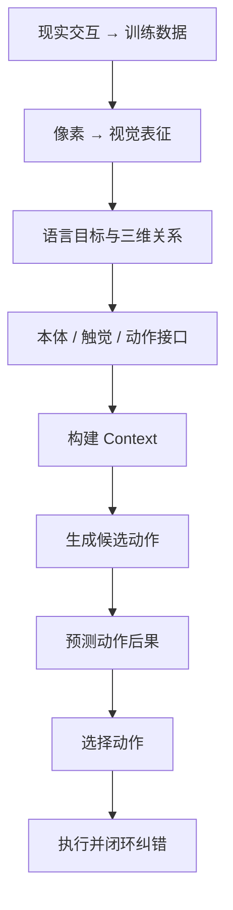

# 学习路线

本教程不是一份知识点清单，而是一条能力演进路径：先学会把世界写成模型能处理的表示，再学会预测变化，最后学会为了语言目标选择动作并闭环纠错。

## 能力演进

<ol class="capability-chain">
  <li>1现实交互如何成为训练数据</li>
  <li>2神经网络如何从数据学习</li>
  <li>3像素如何成为视觉表征</li>
  <li>4语言和几何如何明确任务目标</li>
  <li>5身体状态与动作如何形成接口</li>
  <li>6模型如何从历史构建 Context</li>
  <li>7Action Expert 如何生成动作序列</li>
  <li>8World Model 如何预测动作后果</li>
  <li>9Planner / Policy 如何选择动作</li>
  <li>10机器人如何根据新观测闭环纠错</li>
</ol>

## 三个阶段

### 基础篇：观测与动作怎样成为模型接口

核心问题：

> 现实交互、视觉、语言、空间关系、机器人状态和动作，怎样变成模型能够学习和组合的输入输出？

建议顺序：

1. [机器人眼中的世界](basics/01-robot-view-of-the-world.md)
2. [神经网络如何学习](basics/02-how-neural-networks-learn.md)
3. [视觉编码：从像素到视觉特征](basics/03-vision-encoding.md)
4. [视觉表征学习：编码器怎样学到有用特征](basics/04-visual-representation-learning.md)
5. [语言编码：从自然语言到任务表示](basics/05-language-encoding.md)
6. [三维感知与坐标变换：从相机像素到机器人目标](basics/06-spatial-geometry.md)
7. [本体、触觉与动作](basics/07-robot-state-and-action.md)

对应能力：把现实交互整理成训练数据，把视觉和语言转化为表征，再建立空间、本体、触觉与动作的统一接口。

### 进阶篇：机器人怎样生成动作并预见变化

核心问题：

> 模型怎样从观测和历史中构建 Context，生成动作序列，并预测这些动作可能造成的未来？

建议顺序：

1. [08 时间与记忆：RNN、LSTM 与 GRU 怎样理解历史](intermediate/08-time-and-memory.md)
2. [09 Attention 与 Transformer：怎样从历史中读取相关信息](intermediate/09-attention-and-transformer.md)
3. [10 多模态 Context Model：怎样形成任务相关上下文](intermediate/10-multimodal-context-model.md)
4. [11 从示范学习到动作序列：第一个 Action Model](intermediate/11-demonstrations-to-action-sequences.md)
5. [12 Diffusion 与 Flow Matching：学习连续、多峰的动作分布](intermediate/12-diffusion-and-flow-matching.md)
6. [13 生成式 Action Model：从候选动作到滚动执行](intermediate/13-generative-action-model.md)
7. [14 动作条件 World Model：做了这个动作以后会怎样](intermediate/14-action-conditioned-world-model.md)
8. [15 长程想象：潜状态、不确定性与误差累积](intermediate/15-long-horizon-imagination-and-uncertainty.md)
9. [16 从候选未来到动作选择：目标评价、CEM 与 MPC](intermediate/16-objective-cem-and-mpc.md)

对应能力：构建 Context，生成候选动作，预测动作后果，并开始利用候选未来进行控制。

### 高级篇：机器人如何为了目标行动

核心问题：

> 机器人如何理解语言任务、生成动作、预测后果并闭环执行？

建议顺序：

1. [视觉语言模型](advanced/vlm.md)
2. [Visual Grounding](advanced/visual-grounding.md)
3. [视觉语言动作模型](advanced/vla.md)
4. [动作表示](advanced/action-representation.md)
5. [世界模型](advanced/world-model.md)
6. [RSSM 与 Dreamer](advanced/rssm-and-dreamer.md)
7. [V-JEPA](advanced/v-jepa.md)
8. [VLA-JEPA](advanced/vla-jepa.md)
9. [规划与策略](advanced/planning-and-policy.md)
10. [泛化](advanced/generalization.md)
11. [Sim-to-Real](advanced/sim-to-real.md)
12. [安全与失败恢复](advanced/safety-and-recovery.md)

对应能力：语言定义目标，生成动作，预测后果，选择动作，闭环纠错。

## 实践如何插入

理论章节负责把问题讲清楚；[实践项目](projects/index.md) 负责把模块接起来。

| 项目 | 建议在何时开始 | 主要回看章节 |
|---|---|---|
| [表征学习小项目](projects/representation-learning.md) | 完成第 04 章后 | 视觉表征学习 |
| [多模态对齐小项目](projects/multimodal-alignment.md) | 完成第 05 章与后续多模态融合后 | 语言编码、融合、VLM |
| [动作条件预测](projects/action-conditioned-prediction.md) | 完成潜空间动力学后 | 视频预测、latent dynamics |
| [Mini-VLA](projects/mini-vla.md) | 完成 VLA 与动作表示后 | VLM、VLA、动作表示 |
| [迷你世界模型系统](projects/final-world-model-system.md) | 完成规划与安全章节后 | 世界模型、VLA-JEPA、规划 |

## 阅读建议

- 如果只想先建立全局图景：先读本页和三篇阶段总览，再进入 [世界模型](advanced/world-model.md)。
- 如果从零开始：按基础篇顺序读，遇到公式可并行查阅 [数学基础](appendices/math-foundations.md) 与 [PyTorch 基础](appendices/pytorch-foundations.md)。
- 如果已经熟悉 Transformer：仍建议从第 10 章的多模态 Context Model 切入，并回看第 04 章中的表征坍缩问题；该页面完成前可先进入 [VLM](advanced/vlm.md)。
- 每一章末尾的“下一章”不是目录跳转，而是留下一个旧方法无法回答的问题。

## 当前进度

- 基础篇结构：已调整为两个单元、七个章节
- 已完成正文：第 01～07 章；15 份基础篇配套 Notebook 均已实现，并完成页面入口、图文说明与运行检查
- 进阶篇：第 08～16 章正文、图示与 18 份配套 Notebook 已完成，并已形成 Context—Action Model—World Model—MPC 的完整闭环
- 项目代码：基础篇轻量实践已建立，进阶篇项目待后续实现
