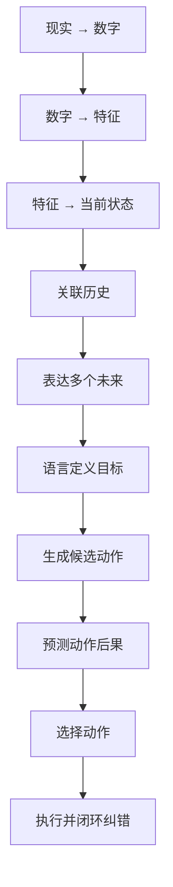

# 学习路线

本教程不是一份知识点清单，而是一条能力演进路径：先学会把世界写成模型能处理的表示，再学会预测变化，最后学会为了语言目标选择动作并闭环纠错。

## 能力演进

<ol class="capability-chain">
  <li>1现实世界如何变成数字</li>
  <li>2数字如何变成特征</li>
  <li>3特征如何表示当前状态</li>
  <li>4模型如何关联历史信息</li>
  <li>5模型如何表达多个未来</li>
  <li>6语言如何定义任务目标</li>
  <li>7模型如何生成机器人动作</li>
  <li>8世界模型如何预测动作后果</li>
  <li>9Planner / Policy 如何选择动作</li>
  <li>10机器人如何根据新观测闭环纠错</li>
</ol>

## 三个阶段

### 基础篇：世界如何被表示

核心问题：

> 图像、语言、机器人状态和动作，怎样变成模型内部可学习的表示？

建议顺序：

1. [机器人眼中的世界是什么](basics/01-robot-view-of-the-world.md)
2. [神经网络怎样学会一个任务](basics/02-how-neural-networks-learn.md)
3. [视觉编码：从像素到视觉特征](basics/vision-encoding.md)
4. [空间与几何：从二维图像到三维关系](basics/spatial-geometry.md)
5. [语言编码](basics/language-encoding.md)
6. [机器人状态与动作](basics/robot-state-and-action.md)
7. [自编码器](basics/autoencoder.md)
8. [变分自编码器](basics/vae.md)
9. [对比学习](basics/contrastive-learning.md)
10. [CLIP](basics/clip.md)
11. [MAE 与 JEPA](basics/mae-and-jepa.md)

对应能力：现实变成数字，数字变成特征，特征表示当前状态。

### 进阶篇：世界如何变化

核心问题：

> 模型如何理解上下文、时间和动作，并预测未来可能发生什么？

建议顺序：

1. [Attention](intermediate/attention.md)
2. [Transformer](intermediate/transformer.md)
3. [多模态融合](intermediate/multimodal-fusion.md)
4. [时间序列建模](intermediate/temporal-modeling.md)
5. [自回归生成](intermediate/autoregressive-models.md)
6. [Diffusion](intermediate/diffusion.md)
7. [视频预测](intermediate/video-prediction.md)
8. [潜空间动力学](intermediate/latent-dynamics.md)
9. [基于模型的控制](intermediate/model-based-control.md)

对应能力：关联历史，表达多个未来，开始把预测用于控制。

### 高级篇：机器人如何为了目标行动

核心问题：

> 机器人如何理解语言任务、生成动作、预测后果并闭环执行？

建议顺序：

1. [视觉语言模型](advanced/vlm.md)
2. [Visual Grounding](advanced/visual-grounding.md)
3. [视觉语言动作模型](advanced/vla.md)
4. [动作表示](advanced/action-representation.md)
5. [世界模型](advanced/world-model.md)
6. [RSSM 与 Dreamer](advanced/rssm-and-dreamer.md)
7. [V-JEPA](advanced/v-jepa.md)
8. [VLA-JEPA](advanced/vla-jepa.md)
9. [规划与策略](advanced/planning-and-policy.md)
10. [泛化](advanced/generalization.md)
11. [Sim-to-Real](advanced/sim-to-real.md)
12. [安全与失败恢复](advanced/safety-and-recovery.md)

对应能力：语言定义目标，生成动作，预测后果，选择动作，闭环纠错。

## 实践如何插入

理论章节负责把问题讲清楚；[实践项目](projects/index.md) 负责把模块接起来。

| 项目 | 建议在何时开始 | 主要回看章节 |
|---|---|---|
| [表征学习小项目](projects/representation-learning.md) | 完成基础篇 AE / VAE / 对比学习后 | 基础篇后半 |
| [多模态对齐小项目](projects/multimodal-alignment.md) | 完成 CLIP 与多模态融合后 | CLIP、融合、VLM |
| [动作条件预测](projects/action-conditioned-prediction.md) | 完成潜空间动力学后 | 视频预测、latent dynamics |
| [Mini-VLA](projects/mini-vla.md) | 完成 VLA 与动作表示后 | VLM、VLA、动作表示 |
| [迷你世界模型系统](projects/final-world-model-system.md) | 完成规划与安全章节后 | 世界模型、VLA-JEPA、规划 |

## 阅读建议

- 如果只想先建立全局图景：先读本页和三篇阶段总览，再进入 [世界模型](advanced/world-model.md)。
- 如果从零开始：按基础篇顺序读，遇到公式可并行查阅 [数学基础](appendices/math-foundations.md) 与 [PyTorch 基础](appendices/pytorch-foundations.md)。
- 如果已经熟悉 Transformer：可从 [多模态融合](intermediate/multimodal-fusion.md) 或 [VLM](advanced/vlm.md) 切入，但仍建议回看表征学习中的 collapse 问题。
- 每一章末尾的“下一章”不是目录跳转，而是留下一个旧方法无法回答的问题。

## 当前进度

- 路线图结构：已冻结为网站导航
- 已完成正文：第 01～06 章
- 后续章节：按课程规划逐章填写与验证
- 项目代码：目录已建立，实现待补充
