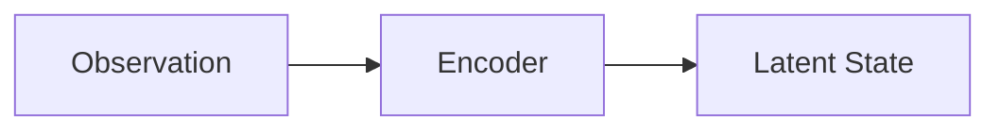

# 环境准备

本页说明两套彼此独立的本地环境：`.venv` 用于预览文档网站，`.venv-colab` 用于运行章节 Notebook。分开环境可以避免 PyTorch 等实验依赖拖慢网站构建。

## 预览文档网站

需要 Python 3.10 或更高版本。

=== "Linux / macOS"

    ```bash
    python3 -m venv .venv
    source .venv/bin/activate
    pip install -r requirements.txt
    mkdocs serve
    ```

=== "Windows"

    ```bat
    python -m venv .venv
    .venv\Scripts\activate
    pip install -r requirements.txt
    mkdocs serve
    ```

=== "Make"

    ```bash
    make setup
    make serve
    ```

浏览器打开 [http://127.0.0.1:8000](http://127.0.0.1:8000)。之后编辑任意 `docs/**/*.md` 并保存，页面应自动刷新。

## 严格构建

发布前或提交 PR 前，请使用严格模式，让损坏的内部链接成为错误：

```bash
mkdocs build --strict
```

等价命令：

```bash
make check
./scripts/check.sh
```

## 数学公式是否工作

若配置正确，下面两式应渲染为公式而不是原始 LaTeX：

$$
z_t = E(o_t)
$$

$$
p(z_{t+1}\mid z_t,a_t)
$$

行内例子：当前状态写作 \(z_t = E(o_t)\)。

!!! note "本地预览时的公式脚本"
    公式依赖浏览器加载 MathJax。若首次打开时公式未渲染，请确认网络可以访问 jsDelivr，或稍后刷新页面。

## Mermaid 是否工作

若配置正确，下面应显示为流程图：



## 建议的仓库工作流

1. 在 `docs/` 中直接写 Markdown。
2. 用 `mkdocs serve` 看预览。
3. 用 `mkdocs build --strict` 做检查。
4. 推送到 `main` 后，GitHub Actions 会构建并尝试部署 GitHub Pages。

GitHub 网页端需要将 Pages 来源设为 GitHub Actions：

```text
Settings → Pages → Build and deployment → Source → GitHub Actions
```

部署成功后，项目站点地址为：

```text
https://qi-robotics.github.io/robot-world-model-tutorial/
```

## 在本地运行章节 Notebook

章节正文只讲原理、公式和图表，可执行代码统一放在 `colab/`。Linux 和 macOS 可在仓库根目录运行：

```bash
python3 -m venv .venv-colab
env -u PYTHONPATH -u LD_LIBRARY_PATH -u LD_PRELOAD \
  .venv-colab/bin/python -m pip install --upgrade pip
env -u PYTHONPATH -u LD_LIBRARY_PATH -u LD_PRELOAD \
  .venv-colab/bin/python -m pip install -r colab/requirements.txt
./scripts/colab.sh
```

`colab/requirements.txt` 包含 CPU 版 PyTorch，不要求 CUDA。Windows、VS Code 和已有环境的更新方法见 [Colab 本地运行说明](https://github.com/qi-robotics/robot-world-model-tutorial/blob/main/colab/README.md)。

训练、仿真和真机相关的大型专用依赖仍不要写入网站的根目录 `requirements.txt`。文档站点只保留 MkDocs 依赖，章节通用实验依赖放在 `colab/requirements.txt`，更大型系统实验再放到：

- [`examples/`](https://github.com/qi-robotics/robot-world-model-tutorial/tree/main/examples)
- [`colab/`](https://github.com/qi-robotics/robot-world-model-tutorial/tree/main/colab)

并在对应章节的“配套实践”中链接过去。

## 常见问题

!!! warning "不要提交生成结果"
    `site/` 是构建产物，不要提交。`.venv/` 是本地环境，也不要提交。

!!! tip "找不到 mkdocs"
    确认已经激活虚拟环境，并且 `pip install -r requirements.txt` 成功。也可以直接运行 `.venv/bin/mkdocs serve`。

!!! note "构建时可能看到 Material 的 MkDocs 2.0 提示"
    Material for MkDocs 9.7.x 会在构建时打印一段关于未来 MkDocs 2.0 不兼容的说明。这不是本仓库的链接错误，`mkdocs build --strict` 仍应成功退出。本项目固定使用 MkDocs 1.6.1，不要升级到 MkDocs 2。
