# 《从感知到行动：机器人世界动作模型的渐进式构建》

## 课程预览

这套课程可以简单理解为：**我们不是先把 Transformer、Diffusion、Flow Matching、VLA、World Model 这些模型一个个讲完，再考虑它们怎么放到机器人里，而是从“一个机器人到底要怎样一步步变得会看、会理解、会行动、会预判后果”这个问题出发来安排内容。** 全部内容一共分成五个部分、24 个章节。第一部分是第1—7章，先把机器人最基本的问题讲清楚，包括什么是观测、状态、动作和轨迹，神经网络怎样学习，图像、语言和机器人自身状态怎样变成可以计算的表示，再逐步引出时间信息、Attention 和 Transformer，最终让机器人能够把当前看到的、听到的以及过去发生的信息整理成一个统一的“当前状态理解”。第二部分是第8—15章，开始解决“机器人接下来该怎么动”，从动作空间、单步动作和 Action Chunk 讲起，再讨论为什么同一个任务可能有多种合理动作，由此引出生成式动作模型，并重点学习 Diffusion、Diffusion Policy 和 Flow Matching，最后把这些方法放回 VLA 的整体结构中理解。第三部分是第16—19章，进一步解决“如果机器人执行这个动作，接下来会发生什么”，从最基本的动作条件动力学开始，逐渐讲到像素预测、latent prediction、RSSM、JEPA、多步 rollout 和不确定性，建立完整的 World Model。第四部分是第20—21章，回答“既然已经能预测未来，那怎样知道哪个未来更好”，因此引入 Reward、Value、Goal Evaluation、MPC、CEM 和 imagination，让机器人能够比较不同动作可能带来的结果。最后第五部分是第22—24章，把前面的 Context Model、Action Model、World Model 和决策规划真正组合起来，形成完整的 World-Action Model，并进一步讨论怎样把这样的模型放到真实机器人上运行。整套课程始终遵循一条很直观的路线：**先看懂当前世界，再学会产生动作，再学会预测动作后果，最后根据预测结果不断做出和修正决策。**

> **副标题：从神经网络、Attention 与 Transformer，到 Diffusion Policy、Flow Matching、World Model 与闭环机器人控制**

---

# 一、课程的最终目标

这套课程不以“记住多少模型名字”为目标，也不按照“CNN → Transformer → Diffusion → VLA → World Model”的模型历史顺序展开。

整套课程围绕一个持续演进的机器人问题：

> **机器人怎样从当前观测中建立内部世界，生成合理动作，预测动作后果，并最终在闭环中选择和修正自己的行为？**

最终希望学习者能够独立解释并实现下面四个核心建模问题：

$$
c_t = E(o_{\le t}, g)
$$

$$
A_t \sim p_\theta(A \mid c_t)
$$

$$
Z_{t+1:t+H} \sim p_\phi(Z \mid c_t, A_t)
$$

$$
A^* = \arg\max_A U\left(p_\phi(Z \mid c_t,A)\right)
$$

其中：

- \(o_{\le t}\)：机器人当前以及历史观测；
- \(g\)：任务目标，例如语言指令；
- \(c_t\)：机器人当前的 context / latent state；
- \(A_t=a_{t:t+H}\)：未来一段动作；
- \(Z_{t+1:t+H}\)：未来世界状态；
- \(U(\cdot)\)：目标、奖励、价值或成功概率评价。

整套课程最终形成一个完整闭环：

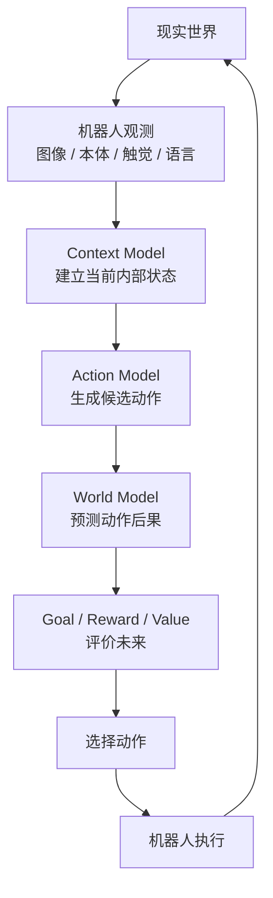

因此，整套课程不是在学习彼此孤立的模型，而是在逐步搭建：

> **Context Model → Action Model → World Model → Decision → World-Action Model**

---

# 二、贯穿全文的机器人任务

建议从头到尾使用同一个机器人操作任务：

> **桌面上有多个物体，用户说：“把红色杯子放进盒子里。”**

机器人需要依次解决：

1. 摄像头里的像素是什么？
2. 哪个物体是“红色杯子”？
3. 当前机械臂在哪里？
4. 过去几帧发生了什么？
5. 下一步动作应该是什么？
6. 应该一次预测一步还是一段动作？
7. 如果存在多种抓取轨迹，应该怎样表达？
8. 如果执行这段动作，世界会发生什么？
9. 哪个未来最接近任务目标？
10. 执行后发现预测错误，怎样重新规划？

整套课程的能力演进如下：

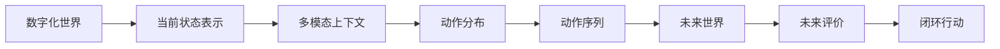

---

# 三、课程整体结构

整套课程分为五篇。

| 篇章 | 核心问题 | 最终获得的能力 |
|---|---|---|
| 第一篇 | 当前世界是什么？ | 构造机器人 Context |
| 第二篇 | 机器人可以怎样行动？ | 构造 Action Model |
| 第三篇 | 行动之后会发生什么？ | 构造 World Model |
| 第四篇 | 怎样利用未来做决策？ | 利用 imagination 选择动作 |
| 第五篇 | 怎样形成统一闭环？ | 构造 World-Action Model |

整体知识关系：

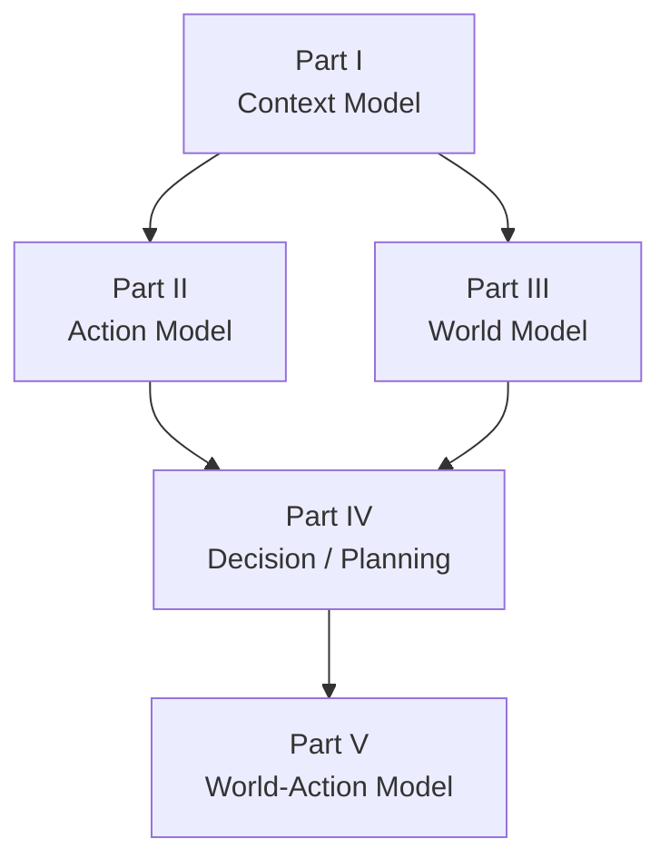

---

# 四、第一篇：构造机器人当前世界

这一篇只回答一个问题：

> **机器人怎样把复杂的传感器、语言、历史信息，变成一个可以用于决策的内部状态 \(c_t\)？**

最终目标：

$$
c_t = E(I_{\le t}, q_{\le t}, f_{\le t}, a_{<t}, g)
$$

---

## 第1章：机器人任务、状态、动作与轨迹

### 本章核心问题

在讨论神经网络之前，先回答：

> 机器人学习问题到底由哪些基本变量组成？

### 需要建立的概念

- observation；
- state；
- action；
- goal / instruction；
- trajectory；
- policy；
- dynamics；
- reward；
- episode。

定义：

$$
o_t=(I_t,q_t,f_t,\ldots)
$$

动作：

$$
a_t=(\Delta x,\Delta y,\Delta z,\Delta R,g_t)
$$

轨迹：

$$
\tau=(o_0,a_0,o_1,a_1,\ldots,o_T)
$$

### 必须区分

**Observation**

机器人真正看到的数据。

**State**

理想情况下完整描述世界的信息。

**Action**

机器人对世界施加的控制量。

**Policy**

$$
\pi(a_t|o_{\le t},g)
$$

回答：

> “应该做什么？”

**Dynamics**

$$
p(o_{t+1}|o_{\le t},a_t)
$$

回答：

> “这样做以后会发生什么？”

### 数据流

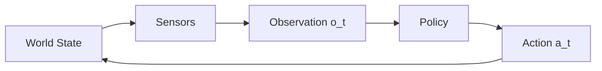

### 本章输出

学生能够看懂机器人数据集中的一条 trajectory，并能区分：

> policy 与 world model 解决的是两个不同问题。

### 下一章矛盾

> 已经知道输入和输出是什么，但模型怎样从示范数据中学会这种映射？

---

## 第2章：神经网络作为可学习函数

### 本章核心问题

> 为什么一个函数能够通过数据逐渐学会机器人动作？

从最简单的：

$$
y=Wx+b
$$

开始。

逐步引入：

- scalar / vector / matrix / tensor；
- linear layer；
- activation；
- forward；
- loss；
- gradient；
- backpropagation；
- gradient descent；
- optimizer；
- batch；
- epoch；
- learning rate；
- train / validation / test。

### 统一训练循环

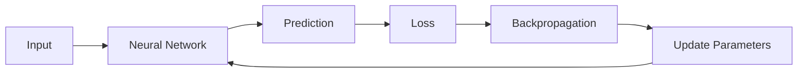

### 推荐实验

输入：

$$
(q_t,x_{goal})
$$

预测：

$$
a_t=(\Delta x,\Delta y)
$$

让一个二维机械臂朝目标移动。

### 数学要求

只在此时补充：

- 向量；
- 矩阵乘法；
- 导数；
- 链式法则。

### 下一章矛盾

> 如果我们拥有专家示范，是否可以直接让网络模仿专家动作？

---

## 第3章：Behavior Cloning——第一个机器人策略

### 本章核心问题

> 怎样从机器人示范数据直接学会动作？

数据：

$$
\mathcal D=\{(s_t,a_t)\}_{t=1}^{N}
$$

策略：

$$
\hat a_t=\pi_\theta(s_t)
$$

损失：

$$
\mathcal L=
\|\hat a_t-a_t\|_2^2
$$

### 数据流程

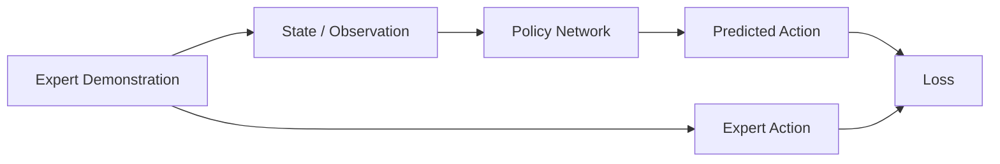

### 重点讲清楚

- supervised learning 与 imitation learning 的关系；
- behavior cloning；
- demonstration dataset；
- train / inference；
- distribution shift；
- compounding error。

### 本章小项目

实现：

```text
object position + robot position
            ↓
           MLP
            ↓
      robot delta action
```

### 下一章矛盾

> 真实机器人输入不是干净坐标，而是 RGB、深度、关节状态、力觉等复杂观测。

---

## 第4章：从传感器到 Representation

### 本章核心问题

> 如何把不同类型的机器人观测变成神经网络可以处理的表示？

### 机器人常见输入

- RGB；
- depth；
- point cloud；
- joint position；
- joint velocity；
- end-effector pose；
- force / torque；
- tactile；
- language instruction。

### 视觉表示

从：

$$
I_t \in \mathbb R^{H\times W\times 3}
$$

到：

$$
z_t^v=E_v(I_t)
$$

介绍：

- convolution；
- local receptive field；
- feature map；
- pooling；
- spatial feature。

这一阶段 CNN 是主要例子。

### 本体状态表示

$$
z_t^p=E_p(q_t,\dot q_t)
$$

### 语言的最小表示

```text
Language
   ↓
Tokenizer
   ↓
Token ID
   ↓
Embedding
```

得到：

$$
z^l=E_l(g)
$$

### 多模态状态

最简单地：

$$
z_t=[z_t^v;z_t^p;z^l]
$$

### 本章输出

学生理解：

> encoder 的作用是把原始输入变成下游任务可使用的 representation。

### 下一章矛盾

> 单张图像往往无法判断运动趋势、接触状态和被遮挡物体的位置。

---

## 第5章：时间、记忆与部分可观测性

### 本章核心问题

> 当前一帧观测足够描述世界吗？

通常：

$$
o_t \neq s_t
$$

因此机器人需要历史：

$$
h_t=(o_{t-k:t},a_{t-k:t-1})
$$

并构造：

$$
c_t=f(h_t)
$$

### 需要讲清楚

- state vs observation；
- Markov property；
- POMDP；
- history；
- memory；
- belief state；
- temporal context。

### 为什么历史重要

单张图像无法知道：

- 物体的运动方向；
- 机械臂刚接触还是正在离开；
- 被遮挡物体之前在哪里；
- 当前动作属于抓取的哪个阶段。

### 简单时序模型

介绍：

- RNN；
- LSTM；

但不需要深入所有变体。

### 流程

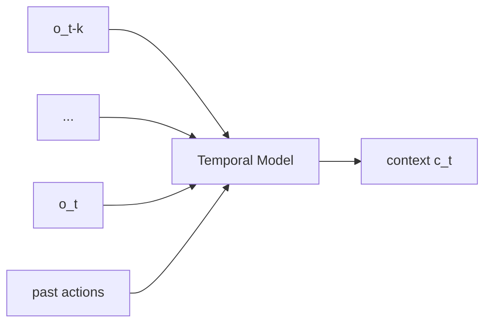

### 下一章矛盾

> 当历史、视觉区域、语言 token、机器人状态同时存在时，模型怎样判断哪些信息更相关？

---

## 第6章：Attention——从大量信息中读取相关内容

### 本章核心问题

> 当输入包含大量 token 时，机器人怎样动态选择与当前任务相关的信息？

先用任务：

> “把红色杯子放进盒子里。”

视觉里同时存在：

- 红杯子；
- 蓝杯子；
- 盒子；
- 机械臂；
- 桌子。

语言 token “红色杯子”应该重点读取哪些视觉特征？

### Attention 的直觉

- Query：我正在寻找什么？
- Key：每个信息是什么？
- Value：真正需要读取的内容是什么？

公式：

$$
Attention(Q,K,V)
=
softmax\left(
\frac{QK^\top}{\sqrt d}
\right)V
$$

### 逐步讲

- dot-product similarity；
- softmax；
- Self-Attention；
- Cross-Attention；
- Multi-Head Attention。

### 机器人中的 Attention

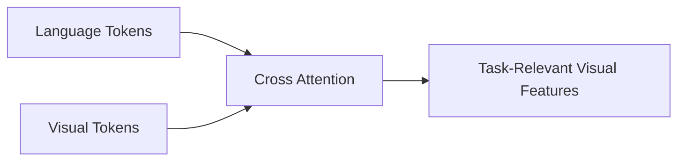

### 小实验

可视化语言 token “red cup” 对视觉 patch 的 attention 权重。

### 下一章矛盾

> Attention 是一次信息读取操作，但怎样把它组织成一个可以反复处理序列和多模态 token 的完整网络？

---

## 第7章：Transformer——构造统一 Context Model

### 本章核心问题

> 怎样让图像、语言、机器人状态和历史信息在统一架构中交互？

Transformer Block：

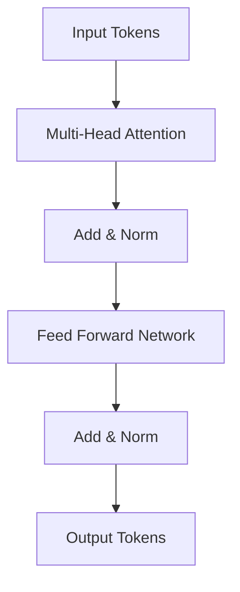

### 核心内容

- token；
- embedding；
- positional encoding；
- multi-head attention；
- FFN；
- residual connection；
- normalization；
- encoder；
- decoder；
- causal mask。

### 在这里正式解释 ViT

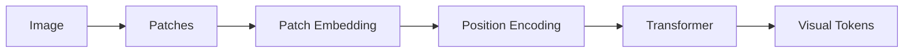

### 多模态 Context Model

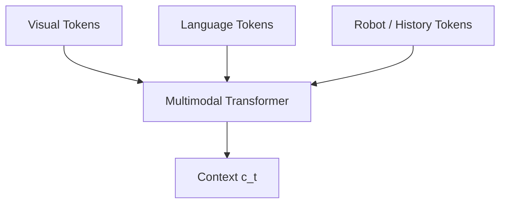

最终：

$$
c_t=
E_\theta(I_{\le t},q_{\le t},a_{<t},g)
$$

### 第一篇总结

到这里，机器人已经能够：

> 把多模态、历史信息压缩成一个与当前任务相关的内部上下文。

但它还不会回答：

> **“接下来应该怎样行动？”**

---

# 五、第二篇：构造 Action Model

这一篇只解决：

$$
p(A|c_t)
$$

其中：

$$
A=a_{t:t+H}
$$

目标不是先学习某个具体机器人模型，而是理解：

> **动作建模本身是什么问题。**

---

## 第8章：机器人动作空间与控制接口

### 本章核心问题

> 神经网络最后输出的“动作”到底是什么？

### 常见动作空间

#### Joint Position

$$
a_t=q_{target}
$$

#### Joint Delta

$$
a_t=\Delta q_t
$$

#### Cartesian Pose

$$
a_t=(x,y,z,R)
$$

#### Cartesian Delta

$$
a_t=(\Delta x,\Delta y,\Delta z,\Delta R)
$$

另外包括：

- velocity；
- torque；
- gripper；
- discrete action；
- continuous action。

### 关键工程概念

- control frequency；
- action normalization；
- coordinate frame；
- robot embodiment；
- absolute vs relative control。

### 下一章矛盾

> 一次只预测一个动作是否足以产生平滑、连贯的机器人行为？

---

## 第9章：从单步动作到 Action Chunk

### 本章核心问题

从：

$$
p(a_t|c_t)
$$

升级为：

$$
p(a_{t:t+H}|c_t)
$$

### 为什么需要 Action Chunk

- 提升时间一致性；
- 降低逐步预测抖动；
- 减少推理频率要求；
- 表达短期运动计划。

### 三个 horizon

- observation horizon；
- prediction horizon；
- execution horizon。

### 执行方式

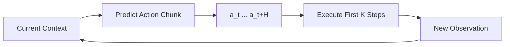

### ACT 作为案例

介绍：

- action chunk；
- temporal aggregation；
- sequence prediction。

但强调：

> ACT 是 Action Chunking 的一种实现，而 Action Chunking 是更一般的问题。

### 下一章矛盾

> 同一个任务可能存在多条正确动作轨迹，单一回归目标是否足够？

---

## 第10章：从确定动作到动作分布

### 本章核心问题

假设机械臂需要绕过障碍物：

- 可以从左边绕；
- 也可以从右边绕。

两者都正确。

因此真实问题不是：

$$
A=f(c)
$$

而是：

$$
A\sim p(A|c)
$$

### MSE 的问题

如果数据里有两种模式：

$$
A_1,\quad A_2
$$

简单回归可能得到：

$$
\hat A \approx \frac{A_1+A_2}{2}
$$

而平均轨迹可能恰好是失败轨迹。

### 关键概念

- uncertainty；
- multimodality；
- conditional distribution；
- sampling；
- deterministic policy；
- stochastic policy。

### 下一章矛盾

> 怎样表示并采样一个复杂的条件动作分布？

---

## 第11章：Conditional Generative Policy

### 本章核心问题

统一定义：

$$
p_\theta(A|c)
$$

目标：

> 在给定机器人当前 context 的条件下，生成一段合理动作。

### 三条主要路线

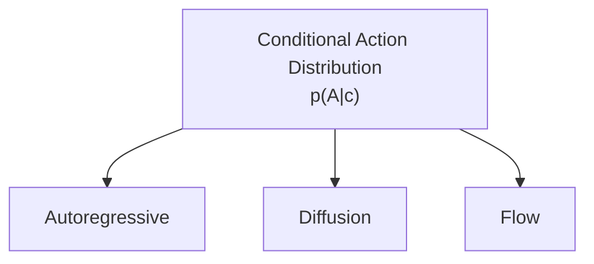

### Autoregressive

$$
p(A|c)
=
\prod_i p(a_i|a_{<i},c)
$$

优点：

- 与 Transformer 天然结合；
- 适合离散 token。

问题：

- sequential sampling；
- error accumulation。

### Diffusion

从噪声逐步恢复动作。

### Flow

学习从简单分布到动作分布的连续向量场。

### 本章输出

学生形成统一认识：

> Autoregressive、Diffusion、Flow 都是在解决条件生成问题。

### 下一章矛盾

> Diffusion 到底怎样通过“噪声 → 动作”实现复杂分布建模？

---

## 第12章：Diffusion——从噪声到动作分布

### 本章核心问题

> 怎样把复杂动作分布转换成一个逐步去噪问题？

真实动作：

$$
A^0 \sim p_{data}(A|c)
$$

逐步加噪：

$$
A^0 \rightarrow A^1 \rightarrow \cdots \rightarrow A^T
$$

最终：

$$
A^T\sim \mathcal N(0,I)
$$

### Forward Process

概念上：

$$
q(A^t|A^{t-1})
$$

不断加入 Gaussian noise。

### Reverse Process

学习：

$$
p_\theta(A^{t-1}|A^t,c)
$$

常见训练目标：

$$
\epsilon_\theta(A^t,t,c)
$$

### 数据流

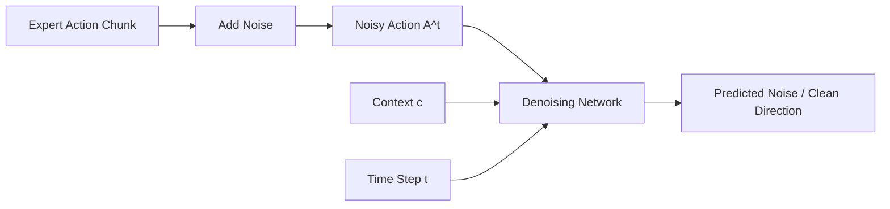

### 核心概念

- Gaussian noise；
- timestep；
- noise schedule；
- denoising；
- conditioning；
- sampling。

### 下一章矛盾

> Diffusion 本身是生成方法，怎样把它真正放进机器人控制回路？

---

## 第13章：Diffusion Policy

### 本章核心问题

> 怎样使用条件扩散直接生成机器人 Action Chunk？

建立：

$$
A^T \sim \mathcal N(0,I)
$$

条件：

$$
c_t=E(o_{\le t},g)
$$

反复去噪：

$$
A^T
\rightarrow
A^{T-1}
\rightarrow
\cdots
\rightarrow
A^0
$$

最终执行：

$$
A^0=a_{t:t+H}
$$

### 完整结构

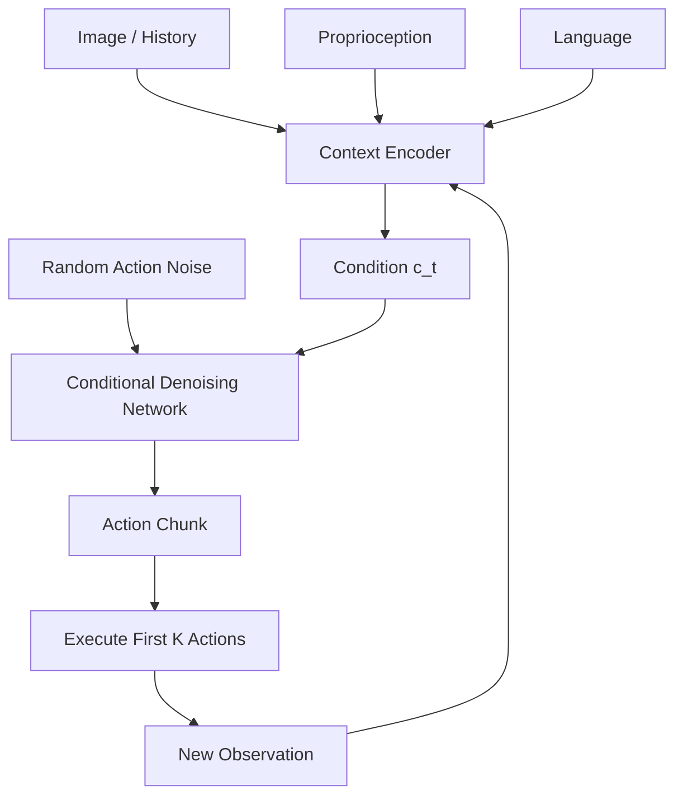

### 重点

- observation encoder；
- action horizon；
- conditional denoising；
- receding horizon execution；
- multimodal action distribution。

### 本章项目

实现一个简化二维轨迹 Diffusion Policy。

### 下一章矛盾

> 如果目标只是从一个简单分布变成动作分布，是否一定需要“不断去噪”？

---

## 第14章：Flow Matching——学习动作分布的流动方向

### 本章核心问题

从简单分布：

$$
A_0\sim p_0
$$

到数据分布：

$$
A_1\sim p_{data}
$$

构造中间路径：

$$
A_t,\quad t\in[0,1]
$$

模型学习 velocity field：

$$
v_\theta(A_t,t,c)
$$

并通过 ODE：

$$
\frac{dA_t}{dt}
=
v_\theta(A_t,t,c)
$$

将样本从简单分布运输到动作分布。

### Flow Matching 直觉

不是问：

> “当前噪声中有多少噪声？”

而是问：

> “当前样本此刻应该朝什么方向移动？”

### 概念图

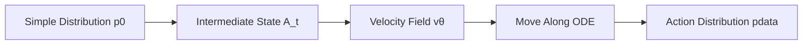

### 需要补充的数学

Just-in-Time Mathematics：

- vector field；
- ordinary differential equation；
- numerical integration；
- probability path。

### 与 Diffusion 的统一认识

二者都在解决：

$$
p(A|c)
$$

但是构造生成路径和训练目标不同。

### 下一章矛盾

> MLP、Autoregressive、ACT、Diffusion、Flow 到底分别处在机器人系统的什么位置？

---

## 第15章：Action Model 与 VLA 的统一视角

### 本章核心问题

> 怎样把之前所有动作生成技术放回一个统一机器人系统？

一个 VLA 系统可以抽象为：

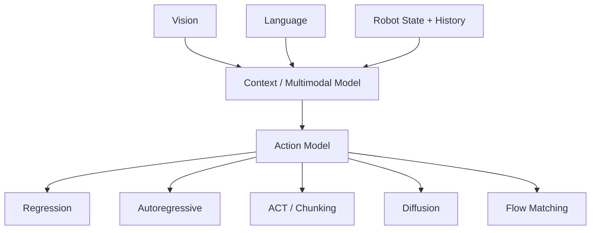

因此：

> **VLA 是一个系统级范式，而 Diffusion Policy、Flow Matching Policy、Autoregressive Policy 是 Action Model 的不同实现。**

### 统一公式

$$
c_t=E_\theta(o_{\le t},g)
$$

$$
A_t\sim p_\phi(A|c_t)
$$

### 第二篇总结

到这里机器人已经会：

> 根据视觉、语言、本体与历史，生成一段合理动作。

但仍然不知道：

> **“执行这段动作以后，世界会变成什么样？”**

---

# 六、第三篇：构造 World Model

这一篇回答：

$$
p(Z_{future}|c_t,A)
$$

---

## 第16章：Action-Conditioned Dynamics

### 本章核心问题

> 世界的变化为什么必须显式依赖机器人的动作？

最小动力学模型：

$$
z_{t+1}=F(z_t,a_t)
$$

或概率形式：

$$
p(z_{t+1}|z_t,a_t)
$$

### 数据流程

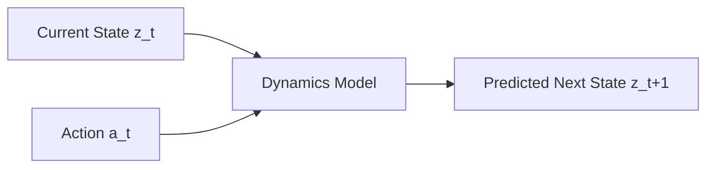

### 讲解内容

- dynamics；
- deterministic dynamics；
- stochastic dynamics；
- action conditioning；
- one-step prediction；
- transition model。

### 最小实验

二维物体：

$$
(x_t,y_t,a_t)
\rightarrow
(x_{t+1},y_{t+1})
$$

### 下一章矛盾

> 真实机器人世界包含大量像素，直接预测下一帧是否是最好的选择？

---

## 第17章：从 Pixel Prediction 到 Latent Prediction

### 本章核心问题

第一种思路：

$$
(I_t,a_t)
\rightarrow
\hat I_{t+1}
$$

但像素预测存在：

- 维度高；
- 大量无关细节；
- 对颜色、纹理非常敏感；
- 任务真正需要的语义/几何可能被淹没。

于是先编码：

$$
z_t=E(I_t,q_t,\ldots)
$$

再预测：

$$
(z_t,a_t)
\rightarrow
\hat z_{t+1}
$$

### 两种路线

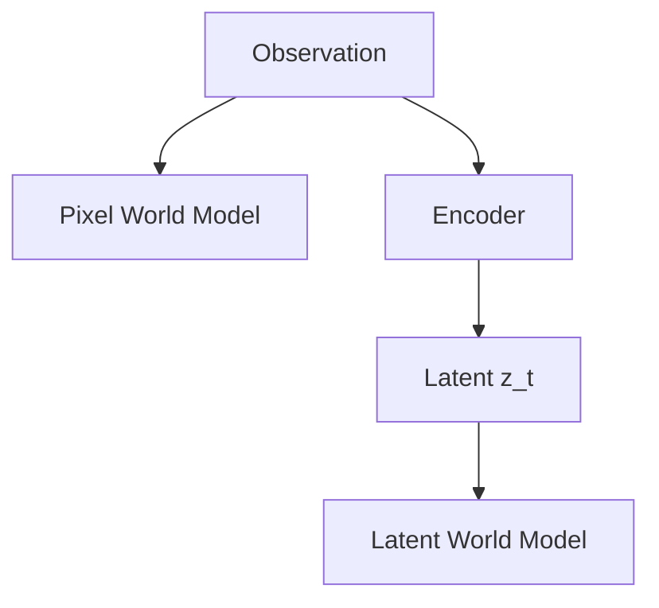

### 关键问题

> 一个“好的世界状态 representation”到底应该保留哪些未来可预测、任务相关的信息？

### 下一章矛盾

> 世界模型究竟应该预测像素、隐变量还是更抽象的 representation？

---

## 第18章：RSSM、JEPA 与不同世界模型范式

### 本章核心问题

按照“预测什么”分类，而不是按照论文名字分类。

### 路线 A：Observation Prediction

$$
p(o_{t+1}|o_{\le t},a_t)
$$

例如：

- video prediction；
- future frame prediction。

### 路线 B：Latent State Prediction

$$
p(z_{t+1}|z_t,a_t)
$$

这里可以介绍：

- state-space model；
- RSSM；
- deterministic hidden state；
- stochastic latent state。

### 路线 C：Predictive Representation

不一定重建完整输入，而预测目标 representation：

$$
\hat z_{future}=F(z_{context},a)
$$

这里介绍：

- JEPA；
- V-JEPA；
- action-conditioned predictive representation。

### 世界模型地图

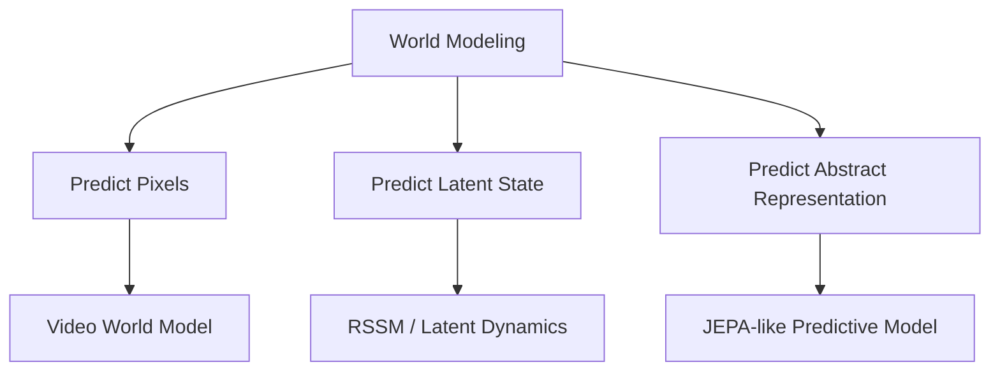

### 下一章矛盾

> 即使一步预测很准确，连续预测很多步以后还可靠吗？

---

## 第19章：Multi-step Rollout 与不确定性

### 本章核心问题

世界模型真正用于决策时必须能够：

$$
z_t
\rightarrow
\hat z_{t+1}
\rightarrow
\hat z_{t+2}
\rightarrow
\cdots
\rightarrow
\hat z_{t+H}
$$

### 问题

- compounding error；
- exposure bias；
- latent drift；
- stochastic future；
- model uncertainty。

### 两类不确定性

- aleatoric uncertainty；
- epistemic uncertainty。

### Rollout

```mermaid
flowchart LR
    A["z_t"] --> B["World Model + a_t"]
    B --> C["z_t+1"]
    C --> D["World Model + a_t+1"]
    D --> E["z_t+2"]
    E --> F["..."]
    F --> G["z_t+H"]
```

### 第三篇总结

现在机器人不仅会生成动作，而且会回答：

> “如果执行这段动作，我认为未来会发生什么。”

但还有一个问题：

> **不同未来之间怎样判断谁更好？**

---

# 七、第四篇：从预测未来到选择动作

---

## 第20章：Reward、Value 与 Goal Evaluation

### 本章核心问题

World Model 回答：

> “会发生什么？”

但 Decision Module 还必须回答：

> “这个未来好不好？”

### 最直接方式：Goal Distance

$$
U(z)
=
-D(z,z_{goal})
$$

### Reward

$$
r_t=R(z_t,a_t)
$$

### Value

$$
V(z_t)
=
\mathbb E
\left[
\sum_{k=0}^{\infty}\gamma^k r_{t+k}
\right]
$$

### 机器人中常见评价

- success probability；
- collision probability；
- contact quality；
- distance to target；
- task completion；
- safety constraint。

### 结构

```mermaid
flowchart LR
    A["Predicted Future"] --> B["Evaluator"]
    B --> C["Reward"]
    B --> D["Value"]
    B --> E["Success Probability"]
    B --> F["Collision Risk"]
```

### 下一章矛盾

> 如果我们已经可以评价未来，怎样真正搜索出更好的动作？

---

## 第21章：Imagination、MPC 与 CEM

### 本章核心问题

生成多个候选动作：

$$
A^{(1)},A^{(2)},...,A^{(N)}
$$

世界模型分别预测：

$$
Z^{(i)}
\sim
p_\phi(Z|c_t,A^{(i)})
$$

计算：

$$
U(Z^{(i)})
$$

选择：

$$
A^*
=
\arg\max_i U(Z^{(i)})
$$

### 基本决策流程

```mermaid
flowchart TD
    A["Current Context"] --> B["Generate Candidate Actions"]
    B --> C["World Model Rollout"]
    C --> D["Evaluate Futures"]
    D --> E["Choose Best Candidate"]
    E --> F["Execute First Action(s)"]
    F --> G["New Observation"]
    G --> A
```

### 讲解内容

- random shooting；
- CEM；
- MPC；
- receding horizon；
- imagined rollout；
- planning horizon。

### MPC 的关键思想

> 不一次执行完整计划，而只执行前一小段，然后重新观察和规划。

### 第四篇总结

至此已经形成：

> **Propose → Imagine → Evaluate → Act**

---

# 八、第五篇：World-Action Model

这一篇不再学习孤立算法，而是把之前所有模块组合成完整机器人系统。

---

## 第22章：Action Model + World Model

### 本章核心问题

Action Model：

$$
A
\sim
p_\theta(A|c_t)
$$

回答：

> **我可以怎么做？**

World Model：

$$
Z
\sim
p_\phi(Z|c_t,A)
$$

回答：

> **这么做会发生什么？**

两者组合：

```mermaid
flowchart TD
    A["Context c_t"] --> B["Action Model"]
    B --> C["Candidate Action Chunks"]
    C --> D["World Model"]
    D --> E["Imagined Futures"]
    E --> F["Evaluator"]
    F --> G["Selected Action"]
```

### 关键理解

Action Model 和 World Model 不是竞争关系。

它们承担完全不同角色：

- Action Model 提供候选行为；
- World Model 提供未来预测；
- Evaluator 提供目标判断。

### 下一章矛盾

> 这三个模块一定要完全分开吗？

---

## 第23章：Joint World-Action Architecture

### 本章核心问题

世界建模和动作建模可以怎样结合？

### 结构一：独立模块

```text
Context
  ↓
Action Model
  ↓
Candidate Actions
  ↓
World Model
  ↓
Evaluator
```

优点：

- 模块清楚；
- 易于分析；
- 易于替换。

---

### 结构二：共享 Backbone

```mermaid
flowchart TD
    A["Multimodal Input"] --> B["Shared Transformer / Encoder"]
    B --> C["Action Head"]
    B --> D["Future Prediction Head"]
```

训练目标：

$$
\mathcal L
=
\mathcal L_{action}
+
\lambda\mathcal L_{future}
$$

世界预测作为 representation regularization / auxiliary objective。

---

### 结构三：统一序列建模

把：

- observation token；
- action token；
- future token；

统一到同一个序列模型中。

```mermaid
flowchart LR
    A["Observation Tokens"] --> B["Unified Sequence Model"]
    C["Action Tokens"] --> B
    D["Future Tokens"] --> B
    B --> E["Action / Future Predictions"]
```

### 核心研究问题

- shared representation；
- joint training；
- action-conditioned prediction；
- tokenized action；
- continuous action generation；
- future prediction objective；
- multimodal sequence modeling。

### 本章输出

学生理解：

> World-Action Model 不一定是某一个固定网络，而是一类同时建模行动与世界变化的系统结构。

---

## 第24章：Closed-loop Real Robot System

### 本章核心问题

模型在离线数据集里有效，不代表能够稳定控制真实机器人。

### 真机系统中必须处理

- camera calibration；
- robot calibration；
- coordinate transformation；
- visual-action synchronization；
- control frequency；
- inference latency；
- action chunk length；
- replanning frequency；
- actuator limits；
- collision constraints；
- contact uncertainty；
- sensor noise；
- sim2real；
- embodiment adaptation；
- failure detection；
- recovery；
- data collection；
- online data flywheel。

### 最终闭环

```mermaid
flowchart TD
    A["Camera / Proprioception / Language"] --> B["Context Model"]
    B --> C["Action Model"]
    C --> D["Candidate Action Chunks"]
    D --> E["World Model"]
    E --> F["Evaluator / Planner"]
    F --> G["Safety Filter"]
    G --> H["Robot Controller"]
    H --> I["Physical World"]
    I --> A
```

### 最终能力

学生应能够独立解释：

1. 机器人如何把现实世界转成 tensor；
2. 如何从多模态历史构造 context；
3. Attention 与 Transformer 如何组织信息；
4. Action Chunk 为什么重要；
5. 为什么动作预测需要从 deterministic regression 升级为 conditional distribution；
6. Diffusion Policy 如何生成动作；
7. Flow Matching 为什么是另一种连续生成方式；
8. World Model 如何预测 action-conditioned future；
9. latent world model、RSSM、JEPA 分别解决什么；
10. 怎样使用 reward / value / goal 判断未来；
11. MPC 和 CEM 如何利用世界模型规划；
12. Action Model 与 World Model 怎样组合成完整闭环系统。

---

# 九、整套课程的总知识地图

```mermaid
flowchart TD
    A["Robot Data"] --> B["Representation"]
    B --> C["Temporal Context"]
    C --> D["Attention"]
    D --> E["Transformer Context Model"]

    E --> F["Action Representation"]
    F --> G["Action Chunk"]
    G --> H["Conditional Action Distribution"]

    H --> I["Autoregressive"]
    H --> J["Diffusion Policy"]
    H --> K["Flow Matching Policy"]

    E --> L["Action-Conditioned Dynamics"]
    L --> M["Latent World Model"]
    M --> N["RSSM / JEPA / Video Prediction"]

    I --> O["Candidate Actions"]
    J --> O
    K --> O

    N --> P["Future Rollout"]
    O --> P

    P --> Q["Reward / Value / Goal"]
    Q --> R["MPC / CEM / Planning"]
    R --> S["World-Action Model"]
    S --> T["Real Robot Closed Loop"]
```

---

# 十、推荐的课程项目体系

整套课程最好不是 24 个互相无关的小实验，而是同一个机器人项目持续演进。

```text
RobotCourse/
├── 01_robot_data
├── 02_neural_network
├── 03_behavior_cloning
├── 04_representation
├── 05_temporal_context
├── 06_attention
├── 07_transformer_context
├── 08_action_space
├── 09_action_chunk
├── 10_multimodal_action
├── 11_generative_policy
├── 12_diffusion
├── 13_diffusion_policy
├── 14_flow_matching
├── 15_vla_system
├── 16_dynamics
├── 17_latent_world_model
├── 18_world_model_variants
├── 19_rollout_uncertainty
├── 20_goal_evaluation
├── 21_mpc_cem
├── 22_action_plus_world
├── 23_joint_world_action
└── 24_real_robot
```

模型能力持续升级：

```mermaid
flowchart TD
    A["V0<br/>State → MLP → Action"] --> B["V1<br/>Image → Encoder → Action"]
    B --> C["V2<br/>History → Context → Action"]
    C --> D["V3<br/>Transformer Multimodal Policy"]
    D --> E["V4<br/>Action Chunk Policy"]
    E --> F["V5<br/>Diffusion / Flow Policy"]
    F --> G["V6<br/>Action-Conditioned World Model"]
    G --> H["V7<br/>Policy + Imagination + Planning"]
    H --> I["V8<br/>World-Action Closed Loop"]
```

---

# 十一、每章统一采用的教学结构

为了防止课程变成知识点堆砌，每一章强制遵循下面的结构。

## 1. 当前系统缺少什么？

例如：

> MSE Behavior Cloning 为什么会产生平均动作？

## 2. 先尝试最简单的方案

例如：

> 直接输出一个连续动作。

## 3. 展示这个方案为什么失败

例如：

> 同一个任务存在两条正确轨迹，平均值反而不合理。

## 4. 引出新的建模对象

例如：

$$
A\sim p(A|c)
$$

## 5. 再引出相应技术

例如：

> Diffusion / Flow Matching。

## 6. 把 tensor 形状、输入和输出讲清楚

不仅写模型名字，而要明确：

```text
B × T_obs × D_obs
        ↓
Context Encoder
        ↓
B × D_context
        ↓
Action Generator
        ↓
B × T_action × D_action
```

## 7. 使用最小实验验证

例如：

> 在二维多峰轨迹数据上比较 MSE Policy 和 Diffusion Policy。

## 8. 留下下一章必须解决的矛盾

例如：

> 已经可以生成合理动作，但模型不知道这段动作是否真的会成功。

由此自然进入：

> World Model。

---

# 十二、数学知识采用 Just-in-Time 方式出现

不要单独安排十几小时“数学预科”。

数学在真正需要时出现。

| 技术位置 | 此时学习的数学 |
|---|---|
| Tensor / MLP | 向量、矩阵 |
| Backpropagation | 导数、链式法则 |
| Attention | 点积、softmax、矩阵乘法 |
| Probability Policy | 条件概率、分布 |
| Diffusion | Gaussian、随机变量 |
| Flow Matching | vector field、ODE |
| World Model | Markov、conditional dynamics |
| Value | expectation、discounted return |
| MPC / CEM | optimization、sampling |

原则：

> **数学不是课程前置障碍，而是解决当前机器人问题所需要的工具。**

---

# 十三、课程中应明确区分三个知识层级

## 第一层：问题

例如：

$$
p(A|c)
$$

是 Action Modeling。

$$
p(Z_{future}|c,A)
$$

是 World Modeling。

---

## 第二层：技术机制

例如：

- CNN；
- Attention；
- Transformer；
- Autoregressive；
- Diffusion；
- Flow Matching；
- RSSM；
- JEPA。

---

## 第三层：系统范式

例如：

- VLM；
- VLA；
- World Model；
- World-Action Model。

课程中必须避免把不同层级的术语排成同一条线，例如：

```text
Transformer → VLA → Diffusion → World Model
```

因为它们不是同一级概念。

更合理的是：

```mermaid
flowchart TD
    A["VLA System"] --> B["Context Model"]
    A --> C["Action Model"]

    B --> D["CNN / ViT"]
    B --> E["Attention / Transformer"]

    C --> F["Regression"]
    C --> G["Autoregressive"]
    C --> H["ACT"]
    C --> I["Diffusion"]
    C --> J["Flow Matching"]
```

同样：

```mermaid
flowchart TD
    A["World Model"] --> B["Pixel Prediction"]
    A --> C["Latent Dynamics"]
    A --> D["Predictive Representation"]

    C --> E["RSSM"]
    D --> F["JEPA-like Model"]
```

---

# 十四、课程最终项目

最终实现一个简化 World-Action Robot：

```mermaid
flowchart TD
    A["RGB / Language / Proprioception"] --> B["Transformer Context Model"]
    B --> C["Current Context c_t"]

    C --> D["Diffusion / Flow Action Model"]
    D --> E["Candidate Action Chunks"]

    E --> F["Action-Conditioned World Model"]
    C --> F

    F --> G["Imagined Future Latents"]
    G --> H["Goal / Value / Success Predictor"]

    H --> I["Select Action"]
    I --> J["Robot / Simulator"]
    J --> A
```

学习者最终需要完成：

1. 多模态数据编码；
2. Transformer context 建模；
3. continuous action representation；
4. action chunk generation；
5. Diffusion Policy 或 Flow Matching Policy；
6. action-conditioned latent dynamics；
7. multi-step imagination；
8. future evaluation；
9. receding-horizon planning；
10. closed-loop execution。

---

# 十五、最终教学目标

课程结束后，学习者不是简单地“听说过”：

- Transformer；
- Diffusion；
- Flow Matching；
- VLA；
- World Model；
- JEPA。

而应该能够从机器人问题出发重新推导出：

> 为什么需要这些技术。

最终能够独立解释：

```text
现实世界
   ↓
Observation
   ↓
Representation
   ↓
Context
   ↓
Action Distribution
   ↓
Candidate Action
   ↓
Future Prediction
   ↓
Evaluation
   ↓
Decision
   ↓
Execution
   ↓
New Observation
```

整套教程真正的终点不是某个模型，而是建立下面这一完整认知：

> **机器人智能可以被理解为一个持续闭环：感知当前世界，形成内部状态，生成可能行动，预测行动后果，根据目标选择行为，然后通过新的现实反馈不断修正自己的内部模型和策略。**
